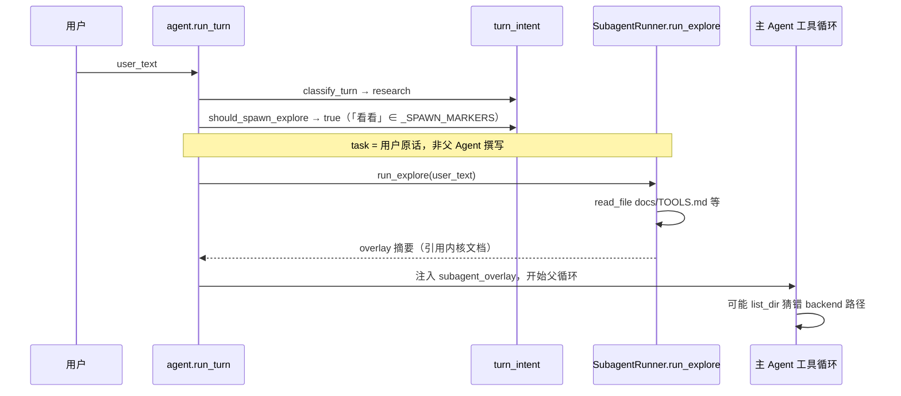

# 主 Agent 编排模型（薄父 · 子代理按需）

> 版本 **0.4.0** · 2026-08-06 · **状态：设计已签 · Phase 48 partial · Phase 50 scope doc**  
> 触发：huiyi 联调——用户说「文档和代码可能脱节了，你看看」→ 内核 **自动 explore** 读了 `docs/TOOLS.md`（my-agent 内核）而非 `workspace/huiyi`；用户明确：**主 Agent 负责写码和下命令，不该由内核替它猜要查什么**；子代理预算不足时 **主 Agent 补读合法**（见 [SUBAGENT-BUDGET.md](./SUBAGENT-BUDGET.md)）。  
> 关联：[EXPLORE-SCOPE-RAILS.md](./EXPLORE-SCOPE-RAILS.md)（Phase 50 · **作用域分轨**） · [SUBAGENT-BUDGET.md](./SUBAGENT-BUDGET.md)（Phase 49 · **子代理轮次**） · [DELIVERABLE-REVIEW.md](./DELIVERABLE-REVIEW.md) · [ORCHESTRATION.md](./ORCHESTRATION.md) §4/§8 · [PLAN-SUBAGENT.md](./PLAN-SUBAGENT.md) · [bugs/2026-08-06-explore-auto-spawn-wrong-scope.md](./bugs/2026-08-06-explore-auto-spawn-wrong-scope.md) · Phase 48 T-4800～4804

---

## 0. 一句话

**主 Agent = 薄指挥**：理解用户意图 → **显式下命令**（`deliverable_review` / `plan_partner` / `explore` / `run_evolved`）→ **合成一条**用户可见回复。  
**项目模式**：禁内核自动 explore（P1）；**普通对话 / grow**：**保留**内核 auto explore（与 Cursor 差异化，见 [EXPLORE-SCOPE-RAILS.md](./EXPLORE-SCOPE-RAILS.md) S3/S4）。  
**对账类优先委派子代理**；overlay 不足时主 Agent **可补读**（[SUBAGENT-BUDGET.md](./SUBAGENT-BUDGET.md) B3）。

---

## 1. 已决（P 系列）

| ID | 决议 |
|----|------|
| **P0** | **项目轨编排权**：`project_id` + `active_shell=project` 时，读什么 / review / explore 由 **主 Agent 显式 builtin** 决定；**不由**内核 `should_spawn_explore` 抢先 |
| **P1** | **项目模式**：**禁止内核自动 explore**（BUG-027）；口语「看看 / 查 / 还缺什么」进主回合，由主 Agent 选 `deliverable_review` 或父写 task 的 `explore` |
| **P2** | **`explore` 与 `deliverable_review` 对称**（项目轨）：均为父调 builtin；`task` 由主 Agent 撰写 |
| **P3** | **普通对话 / grow**：**保留**内核 auto explore（口语 + execute/research）；grow 造工具读 `evolve/tools` 范例 |
| **P4** | **子代理 scope 写在 task 里**（项目轨）；普通轨默认 scope = agent 内核（[EXPLORE-SCOPE-RAILS.md](./EXPLORE-SCOPE-RAILS.md) S0/S1） |
| **P5** | **`MY_AGENT_AUTO_EXPLORE=0`** 全局 kill-switch；**不**以此默认关闭普通对话 auto explore |

### 1.1 明确否决的方案

| 方案 | 为何否决 |
|------|----------|
| explore 绑 `project_root` + prompt 禁读 `docs/` | 内核替主 Agent 决定读什么；与 P0/P4 冲突 |
| 主 Agent **不经子代理**直接连读十几个文件做对账 | 应优先 `deliverable_review` / `explore`；补读仅作子代理交卷不足时的降级 |
| 项目模式：用户说「看看」→ 内核 auto explore 读 agent 根 | **BUG-027**；仅项目轨缺陷（普通对话读 docs 见 EXPLORE-SCOPE-RAILS S1） |

---

## 2. 现状：一回合里发生了什么（huiyi 实证）

### 2.1 用户输入

```text
文档和代码可能脱节了，你看看
```

绑定：`project_id=huiyi`，`active_shell=project`，`delivery_profile=solo`。

### 2.2 内核实际执行顺序（`agent.py` `run_turn`）



### 2.3 逐步代码路径

| 步 | 文件 | 行为 |
|----|------|------|
| 1 | `turn_intent.classify_turn` | `research_hits`≥1（「看看」）→ intent=`research` |
| 2 | `turn_intent.should_spawn_explore` | intent∈{execute,research} 且「看看」∈`_SPAWN_MARKERS` → **true** |
| 3 | `agent.run_turn` L1782–1796 | `runner.run_explore(user_text, …)` — **task 即用户原话** |
| 4 | `subagent.run_explore` L984–990 | `ToolExecutor.create(session_dir=None)` — **无** `project_id` / `project_root` |
| 5 | `read_file.resolve_read_path` L88–97 | **先** `resolve_under_agent`；`docs/TOOLS.md` 在 agent 根存在 → 命中，**不会**落到 `workspace/huiyi` |
| 6 | 父循环 | `session.subagent_overlay` 含 explore 摘要；主 Agent 可能据此少读项目或猜目录 |

### 2.4 与 `deliverable_review` 的关键差异（Phase 47 已落地）

| 维度 | 自动 `run_explore`（现状） | `deliverable_review`（目标对照） |
|------|---------------------------|--------------------------------|
| 谁触发 | 内核 `should_spawn_explore` | 父 Agent `tool_calls` → `executor._run_deliverable_review` |
| task 来源 | `user_text` 原话 | 父 Agent 参数 `arguments.task` |
| 项目绑定 | **无** | `executor.session.project_id` + `project_root`（`subagent.py` L1370–1375） |
| 注入 plan 切片 | 无 | `_build_review_plan_slice` |
| overlay 键 | `[子代理摘要 · explore]` | `[子代理摘要 · deliverable_review]` + `agent.py` L1183 写 `review_verdict` |
| 用户可见 | `turn.start` intent_label 可能为「先只读探索」 | 过程卡 `review-subagent` |

**结论**：Phase 47 已为 review 建好「父调 + 项目语义」通道；explore 仍走旧 ORCHESTRATION §4 内核预 spawn，二者不对称。

### 2.5 关联缺陷（已修 / 未修）

| 现象 | 状态 | 说明 |
|------|------|------|
| 「项目现在能跑…」被当 CLI | **已修** | `project_cli.parse_project_command`：未知动词 + 口语 → `None` 交主聊 |
| explore 读 TOOLS.md | **open BUG-027** | 本文 + Phase 48 |
| 主 Agent 猜 `backend/src/...` | prompt 债 | 应先 `list_dir workspace/huiyi` 或 `deliverable_review` |

---

## 3. `should_spawn_explore` 决策树（现状）

```text
should_spawn_explore(user_text)
├─ explicit=True（CLI「探索 …」）→ true
├─ MY_AGENT_AUTO_EXPLORE=0 → false
├─ classify_turn ∉ {execute, research} → false
└─ 任一成立 → true
   ├─ text 含 _SPAWN_MARKERS（含「看看」「查」「读」「探索」…）
   └─ lower 含 _PATH_MARKERS（evolve/ docs/ workspace/ agent-core/）
```

**huiyi 句命中**：`classify_turn`→`research` + 「看看」∈`_SPAWN_MARKERS` → spawn。

**不会 spawn 的反例**（`turn_intent._demo`）：

- `1+1 等于几` → qa  
- `帮我规划一下架构` → plan（无 marker 或 intent 不对）  
- `Where is T-206 documented?` → qa（英文问句无 spawn marker）

**会 spawn 的反例**：

- `按 run_demo 模式造 bar 工具` → execute +「造」  
- `读 evolve/tools/coding/run_demo/tool.toml` → research +「读」+ path marker

### 3.1 环境变量

| 变量 | 默认 | 效果 |
|------|------|------|
| `MY_AGENT_AUTO_EXPLORE` | `1` | `0`/`false`/`no` 时 `should_spawn_explore` 恒 false |
| `SUBAGENT_EXPLORE_MAX` | `8` | explore 子代理 tool 轮上限 |

---

## 4. 目标架构

```text
用户
  → 主 Agent（薄）
       ├─ write_text / run_evolved / report_progress（执行）
       ├─ plan_partner({ task })                    ← 改三件套，侧栏采纳
       ├─ deliverable_review({ task, scope, facts }) ← 交付/脱节/还缺什么
       ├─ explore({ task })                         ← 仅父调；task 含路径（Phase 48）
       └─ 对用户：一条合成回复（不口述侧栏按钮名）
```

### 4.1 口语路由（主 Agent prompt · 软约束）

| 用户意图近似 | 主 Agent 应选 | 示例 task |
|--------------|---------------|-----------|
| 还缺什么 / 能交付吗 / 文档和代码脱节 | `deliverable_review` | `验收 huiyi：TASKS Phase 9 与 MAP 是否一致，代码是否覆盖` |
| 改 TASKS/MAP/PROJECT | `plan_partner` | `把 Phase 9 标为进行中并补 MAP 矩阵行` |
| 深调研某目录（父已知路径） | `explore`（父调） | `只读 workspace/huiyi/src，列出路由与 TASKS Phase 9 对应关系` |
| 单点核对 | ≤2 次 `read_file` 后决定 | `read_file workspace/huiyi/TASKS.md` |

### 4.2 项目模式 vs 造工具模式

| 模式 | 自动 explore | 父调 explore | 父调 review |
|------|--------------|--------------|-------------|
| `project` + 已绑 id | **禁止**（T-4801） | 允许 | 允许 |
| grow / 造工具 / scaffold | 允许（P3） | 允许 | 一般不绑项目 |

---

## 5. Phase 48 实现规格

### 5.1 T-4801 — 禁项目模式自动 explore

**落点**：`agent-core/agent.py` `run_turn`，在 L1761 附近：

```python
# 伪代码 — 目标行为
elif spawn_explore_flag is None:
    if _project_explore_autospawn_disabled(self.session):
        spawn_explore_flag = False
    else:
        spawn_explore_flag = should_spawn_explore(user_text)
```

`_project_explore_autospawn_disabled` 建议条件（与 P1 一致）：

```python
def _project_explore_autospawn_disabled(session: Session) -> bool:
    pid = (getattr(session.meta, "project_id", None) or "").strip()
    shell = (getattr(session.meta, "active_shell", None) or "").strip()
    return bool(pid) and shell == "project"
```

**注意**：`MY_AGENT_AUTO_EXPLORE=0` 仍保留为全局覆盖；项目模式禁 spawn **不**替代全局 kill-switch。

**回归**：扩展 `turn_intent._demo` 或新 `tests/test_parent_orchestration.py`：

```python
# IT-4801
assert not should_spawn_explore_for_session(
    "文档脱节你看看", project_id="huiyi", active_shell="project"
)
```

### 5.2 T-4802 — `explore` 父调 builtin

**现状**：explore 仅通过 `run_turn` 预 spawn 或 CLI `main.py` `探索`；**无** `_BUILTIN_PARAMETERS["explore"]`。

**目标**：对齐 `deliverable_review`：

| 层 | 文件 | 变更 |
|----|------|------|
| Schema | `agent.py` `_BUILTIN_PARAMETERS` | 新增 `explore`: `{ task: string, required }` |
| Executor | `tools/executor.py` | `_run_explore`：校验 task、调 `SubagentRunner.run_explore(task=…)` |
| Overlay | `agent.py` 工具循环 | explore 成功后 `format_subagent_overlay` 写入 `subagent_overlay` |
| 注册 | `build_llm_tools` | project 模式下父 Agent 可见 `explore` |
| 禁双跑 | `run_turn` | 父调 explore 后本回合不再自动 spawn |

**不做的**：`run_explore` 内 **不** 静默绑 `project_root`（P4）；task 由父 Agent 写 scope。

**建议 schema**：

```json
{
  "type": "object",
  "properties": {
    "task": {
      "type": "string",
      "description": "Read-only investigation scope, e.g. 只读 workspace/huiyi，对比 TASKS 与 src 路由"
    }
  },
  "required": ["task"],
  "additionalProperties": false
}
```

### 5.3 T-4803 — Prompt 口语→review

**落点**（择要）：

- `evolve/prompts/project-delivery-solo.md`（或 registry 等价条目）
- `evolve/prompts/project-delivery-ritual.md`

**须写入的纪律**（示例条文）：

1. 用户说「脱节 / 验收 / 还缺什么 / 能交付吗」→ **优先** `deliverable_review`，**不要**在父循环连读三件套。  
2. **禁止**假设 `backend/src/main/java/...`；先 `list_dir workspace/{id}` 或让 review/explore 子代理读。  
3. `explore` 仅当父 Agent 已能写出 **带路径** 的 task 时调用；task 必须含 `workspace/{project_id}` 或项目内相对路径。  
4. 子代理摘要进 `subagent_overlay` 后，父 Agent **综合**回答，不向用户口述「点采纳」。

**验收 IT-4803**：prompt 快照测试（对齐 T-4710 / IT-473 模式）断言含上述关键词条。

### 5.4 T-4804 — 手工 S-480

| 步 | 操作 | 预期 |
|----|------|------|
| 1 | 绑定 huiyi · solo · 主聊发送「文档和代码可能脱节了，你看看」 | `turn.start` **无**「先只读探索」或 explore 过程卡 |
| 2 | 查看 messages / evolve_log | **无** explore `subagent_run`；或有 `deliverable_review` |
| 3 | 读盘日志 | **不**出现 `read_file docs/TOOLS.md`（除非父 Agent 显式误调） |
| 4 | 主聊回复 | 引用 `workspace/huiyi` 内路径或 review verdict |

---

## 6. 只读路径解析（为何 explore 爱读内核）

`tools/builtin/read_file.py` `resolve_read_path`：

```python
agent_path = paths.resolve_under_agent(stripped, must_exist=False)
if agent_path.exists():
    return agent_path          # ← docs/TOOLS.md 在此返回
# … 之后才 try workspace
workspace_path = paths.resolve_under_workspace(stripped, must_exist=False)
```

explore 子代理 **无** `project_root` 约束时，LLM 写 `read_file path=docs/TOOLS.md` 完全合法且优先命中 agent 根。

**修复方向不是改 resolve 顺序**，而是：**不要让未 scoped 的 explore 在项目模式自动跑**（P1），并让父写的 task 限定范围（P4）。

---

## 7. overlay 与父循环

自动 explore 完成后（`agent.py` L1798）：

```python
self.session.subagent_overlay = "\n\n".join(overlay_parts) if overlay_parts else None
```

`loader.py` 将 overlay 注入下一条 system / 回合上下文；父 Agent 看到 `[子代理摘要 · explore]` 块。

**问题**：摘要若基于错误文件，父 Agent **信任摘要** → 少读或猜路径。

**deliverable_review 额外**（`agent.py` L1183）：工具成功后更新 `session.meta` / `project.state` 的 `review_verdict` 等——explore 无对等结构化产出。

---

## 8. 测试矩阵（Phase 48）

| ID | 类型 | 断言 |
|----|------|------|
| IT-4801 | 单元 | project 模式 + 「你看看」→ 不 spawn |
| IT-4801b | 单元 | grow 模式 + 「按 run_demo 造工具」→ 仍可 spawn（P3） |
| IT-4802 | 集成 | 父调 `explore({task})` → overlay 含 explore；`run_turn` 不双跑 |
| IT-4803 | 快照 | project-delivery prompt 含 review 路由条文 |
| IT-4804 | 回归 | `MY_AGENT_AUTO_EXPLORE=0` 仍禁一切自动 spawn |
| S-480 | 手工 | huiyi 脱节句 · 见 §5.4 |

---

## 9. 非目标

- 取消 explore 子代理（grow/造工具仍需要）
- 子代理独立用户气泡
- 主 Agent 禁止一切 `read_file`（允许少量定点读）
- 修改 `resolve_read_path` 全局优先 workspace（会破坏 agent-core 文档读取）

---

## 10. 修订记录

| 版本 | 日期 | 说明 |
|------|------|------|
| 0.1.0 | 2026-08-06 | 初稿 |
| 0.2.0 | 2026-08-06 | 补：huiyi 时序 · 代码路径表 · explore vs review 对比 · should_spawn 决策树 · T-4801～4804 伪代码 · read_file 解析 · 测试矩阵 |
| **0.3.0** | 2026-08-06 | 与 Phase 49 对齐：薄父允许父补读 · 否决表软化 · 链 SUBAGENT-BUDGET |
| **0.4.0** | 2026-08-06 | Phase 50：P0～P5 分轨 · 保留普通对话 auto explore · 链 EXPLORE-SCOPE-RAILS |
