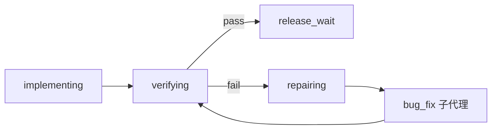

# bug-fix 子代理（BUG-FIX-AGENT）

> 版本 **0.1.0** · 2026-09-02 · **状态：设计已签 · M0～M3 待编码**  
> **Phase 59** · 跟踪 [TASKS.md](./TASKS.md) T-5960 · UI-5961～5965  
> 关联：[RUNAWAY-FLOW-STATE-MACHINE.md](./RUNAWAY-FLOW-STATE-MACHINE.md) · [RUNAWAY-EXPERIENCE.md](./RUNAWAY-EXPERIENCE.md) §13–§14 · [PLAN-SUBAGENT.md](./PLAN-SUBAGENT.md) · [DELIVERABLE-REVIEW.md](./DELIVERABLE-REVIEW.md) · [CHECKER-SUBAGENT.md](./CHECKER-SUBAGENT.md) · [PROJECT-VERIFY.md](./PROJECT-VERIFY.md) · [ORCHESTRATION.md](./ORCHESTRATION.md)

---

## 0. 一句话

**`bug-fix`** 是狂奔 **repairing** 与实现尾段的**专用验收修复轨**：对照 TASKS / VERIFY / PROJECT / DESIGN 契约，跑命令、补证据、修阻塞项，**不新增规划任务、不调 `plan_partner`**。对标 Claude Code 的 dedicated bug-fix lane；在本仓库里由 Harness 在 `repairing` 检查点**自动 spawn**，主 Agent 在 **implementing 狂奔**下默认**最小化 plan**。

---

## 1. 动机（S-6011 / Round 8 实证）

| 现象 | 根因 | bug-fix 对策 |
|------|------|----------------|
| 25/25 仍卡 **`repairing`** | hard verify 缺 `PROJECT.md` 验收命令 | 矩阵扫描 + 直接 patch PROJECT/VERIFY |
| **`plan_partner` 80+× gateway fail** | repairing 只靠 plan 改计划域 | repairing **禁 plan**；改走 `bug_fix` |
| 队列空 ≠ 已验收 | TASKS 勾选与 VERIFY 脱节 | **T↔V 矩阵 linter** 阻断进 `verifying` |
| 实现漂移（写了非 active 模块） | 无契约对照 | 对照 DESIGN + active `T-*` 范围提示 |
| R7f nudge 仍靠主 Agent 自觉 | 无专责修复上下文 | 子代理窄工具集 + 固定修复剧本 |

**结论**：狂奔需要**双轨**——

1. **实现轨**（主 Agent）：写代码、`run_command`、补 VERIFY；**plan_partner 可选且限频**（已有 UI-6029）。
2. **bug-fix 轨**（`bug_fix` 子代理）：只在验证失败 / 矩阵红灯 / `repairing` 时由 Harness 拉起。

---

## 2. 与现有子代理分工

| 角色 | 时机 | 写盘 | 调 plan | 跑命令 |
|------|------|------|---------|--------|
| **explore** | 调研、读码 | 否 | 否 | 否 |
| **plan_partner** | 改计划域四件套 | 提案→采纳 | 是 | 否 |
| **deliverable_review** | 里程碑审查（advisory） | 否 | 否 | **否**（父先跑） |
| **checker** | evolve 工具验收 | 否 | 否 | 否（读 demo 事实） |
| **`bug_fix`** | **验证失败 / repairing** | **是**（PROJECT/VERIFY/代码修复） | **否** | **是**（验收与测试命令） |

### 2.1 与 DELIVERABLE-REVIEW「四角色封顶」

[DELIVERABLE-REVIEW.md](./DELIVERABLE-REVIEW.md) §1.1 原列「第五、第六子代理」为非目标。Phase 59 **收窄例外**：

- **`bug_fix` 仅 Harness 内 spawn**（`repairing` / 矩阵红灯 / hard verify 失败）；**不对用户暴露独立气泡或侧栏 CTA**。
- **不替代** `deliverable_review` 的里程碑审查语义；review 仍 advisory，bug-fix 负责**可执行修复**。
- 用户手动通道（非狂奔）可后续加 `项目 修复验收`；M0～M2 以狂奔为主。

---

## 3. 已决（BF 系列）

| ID | 决议 |
|----|------|
| **BF0** | 子代理种类 **`bug_fix`**（工具面名 **`bug_fix`**，文档/UI 简称 **bug-fix**） |
| **BF1** | **触发权在 Harness**，非主 Agent 随意乱调；主 Agent 在 `repairing` 收到「已委派 bug-fix」摘要 |
| **BF2** | **禁止**：`plan_partner`、新增 `T-*`、改 MAP 里程碑、改 TASKS 开放队列结构 |
| **BF3** | **允许写**：`PROJECT.md`（验收段）、`VERIFY.md`、为通过验证所需的**项目代码/配置**、`run_command` / `run_project_tests` / `run_quality` |
| **BF4** | 输入上下文 = 失败指纹 + hard verify / deliverable 摘要 + TASKS/VERIFY/DESIGN/PROJECT 切片 + 最近命令 stdout/stderr（经 `facts`） |
| **BF5** | 输出 = `summary`（≤2000 字）+ `fixes_applied[]`（路径 + 动作）+ `verify_rerun`（命令 + exit）+ `matrix_status`（pass/fail） |
| **BF6** | 修复预算：与狂奔共用 **最多 3 次**验证失败指纹循环（[RUNAWAY-FLOW-STATE-MACHINE.md](./RUNAWAY-FLOW-STATE-MACHINE.md) §3.2）；耗尽 → `paused` |
| **BF7** | **M0** 先上无 LLM **矩阵 linter**；红灯则**不得** `verifying → release_wait` |
| **BF8** | **implementing 狂奔**默认 `MY_AGENT_RUNAWAY_PLAN_PARTNER_MAX=0`（可 env 覆盖）；VERIFY→TASKS sync 由 Harness 负责 |
| **BF9** | `repairing` 下 **禁止 `plan_partner`**（含 gateway nudge 之后）；仅 `bug_fix` 或主 Agent `write_text` 窄修复 |

---

## 4. 架构

### 4.1 状态机（狂奔）

```text
implementing
  →（开放正式 T-* 清空 + 矩阵预检）
verifying
  → hard verify + deliverable_review（可选）
  → 失败且预算内
repairing
  → Harness spawn bug_fix（非 plan_partner）
  → 重跑验证
verifying
  → 通过
release_wait
```



### 4.2 双轨数据流

```text
主 Agent（实现轨）
  write_text / patch_file / run_command
  append VERIFY
  Harness: sync TASKS checkoff · advance · cap plan

Harness（闸门）
  lint_verify_matrix()  ──red──►  stay verifying / spawn bug_fix
  hard_verification()
  checkpoint: repairing

bug_fix（修复轨）
  read TASKS / VERIFY / PROJECT / DESIGN
  patch 验收命令 · 补 V-* · 修代码
  run_command / run_project_tests
  → SubagentResult → Harness 重跑 verify
```

---

## 5. T↔V 矩阵 linter（M0）

**目标**：在 LLM 修复前，用确定性规则回答「能不能声称已验收」。

### 5.1 规则（v0）

| 规则 ID | 检查 | 严重度 |
|---------|------|--------|
| **MX-1** | 每个**行首开放** `T-\d+` 须在 VERIFY 有对口 `V-*` 或本回合 advance 证据 | error |
| **MX-2** | 每个 `V-*` 须绑定 `T-*` 或 PROJECT 验收项 | error |
| **MX-3** | `PROJECT.md` 须可解析 ``命令：`…``（`parse_acceptance_spec` 非空） | error |
| **MX-4** | TASKS `done` 数与 VERIFY pass 数差超过阈值 | warn |
| **MX-5** | DESIGN 声明的模块路径在磁盘缺失（可选 · M1） | warn |

### 5.2 API（规划）

```python
# agent-core/runaway_verify_matrix.py（新模块 · UI-5961）
def lint_verify_matrix(project_root: Path) -> MatrixLintResult:
    """errors 非空 → checkpoint 不得进入 release_wait。"""
```

**调用点**：

- `_advance_runaway_checkpoint` 进入 `verifying` 前
- `_run_runaway_hard_verification` 前后
- `bug_fix` spawn 前（注入 `facts`）

---

## 6. bug_fix 子代理（M2）

### 6.1 实现落点

| 组件 | 路径 |
|------|------|
| Runner | `subagent.py` · `SubagentRunner.run_bug_fix` |
| 编排 | `agent-core/bug_fix_agent.py`（或 `runaway_bug_fix.py`） |
| Builtin 工具 | `tools/builtin/bug_fix.py` → `run(arguments)` |
| Prompt | `evolve/prompts/bug_fix.system.md`（[PROMPT-REGISTRY.md](./PROMPT-REGISTRY.md) 登记） |

### 6.2 工具 allowlist

| 工具 | 用途 |
|------|------|
| `read_file` · `list_dir` · `grep` | 读契约与代码 |
| `write_text` · `patch_file` | 修 PROJECT/VERIFY/代码 |
| `run_command` | 验收命令、测试 |
| `run_project_tests` · `run_quality` | 结构化验证 |
| **禁止** | `plan_partner` · `write` 计划域 MAP/TASKS 结构变更（勾选用 Harness API） |

### 6.3 预算

- 子代理轮次：默认 **8**（`SUBAGENT_BUG_FIX_MAX`），继承 [SUBAGENT-BUDGET.md](./SUBAGENT-BUDGET.md)
- 父 turn wall：仍受 `TURN_WALL_SEC` 约束

---

## 7. Harness 集成（M3）

| 检查点 | 行为 |
|--------|------|
| `implementing` + runaway | 默认 **不注入** plan_partner 提示；`MY_AGENT_RUNAWAY_PLAN_PARTNER_MAX` 默认改为 **0**（狂奔 env profile） |
| `verifying` 失败 | `_transition_runaway_checkpoint("repairing")` → **spawn `bug_fix`** |
| `repairing` | 主 Agent system 追加：「已启用 bug-fix 轨；勿调 plan_partner」 |
| `bug_fix` 成功 | 自动 `_run_runaway_hard_verification`；通过则 `verifying` 保持并尝试 `release_wait` |
| R7f 兼容 | `ensure_project_acceptance_section` 保留；bug-fix 负责**语义正确**的验收命令，不只 append 占位 |

**废止路径**：`repairing` + 连续 plan gateway fail → nudge 主 Agent 手改（UI-6038）→ **降级为 bug_fix 未就绪时的临时措施**；M3 完成后 UI-6038 nudge 仅作 fallback。

---

## 8. 非目标（M0～M2）

| 非目标 | 理由 |
|--------|------|
| Desktop 独立「bug-fix」按钮 | 先 Harness 自动轨 |
| 替代 `run_project_tests` | 测试仍走 L1 工具 |
| 自动新增 TASKS | 范围变更须人或 plan（非狂奔） |
| 云 CI / PR | 本地-only |

---

## 9. 里程碑与验收

| Milestone | Task | 完成标志 |
|-----------|------|----------|
| **M0** | T-5960（本文）+ UI-5961 | `lint_verify_matrix` + IT-5961 |
| **M1** | UI-5962 | 无 LLM blocker 扫描（MX-3/命令存在性）+ IT-5962 |
| **M2** | UI-5963 | `bug_fix` 子代理 + tool + prompt + IT-5963 |
| **M3** | UI-5964 · UI-5965 | repairing→bug_fix；implementing plan 默认关闭 + IT-5964 |
| **手工** | S-5951 | `workspace/test` 从 repairing 推到 **verifying** 稳态（0 plan 风暴） |

### 9.1 回归 ID

| ID | 类型 | 内容 |
|----|------|------|
| IT-5961 | 自动 | 开放 `T-*` 无 VERIFY → matrix error；阻断 release |
| IT-5962 | 自动 | 缺 PROJECT 验收命令 → MX-3 error |
| IT-5963 | 自动 | mock 验证失败 → spawn bug_fix → PROJECT 补丁 + 重跑命令 |
| IT-5964 | 自动 | `repairing` 下 `plan_partner` 硬拒或 no-op |
| S-5951 | 手工 | S-6011 后继：Round 8/9 类 repairing 场景通过 |

---

## 13. verification 阶段工具门（UI-5966）

### 13.1 问题（Round 10b 暴露）

`project_workflow_stage=verification` 且 `project_plan_status=confirmed` 时，主 Agent 调用 `run_command` 被 `project_mode_block_reason` 误判为「尚未进入 implementation，不能修改业务代码」。

Harness 硬验收（`run_harness_verification`）走内核路径不受影响；**主 Agent / 子代理经 executor 的 `run_command` 会被拦**，导致 verifying 后续无法复跑验收脚本。

### 13.2 已决

| ID | 决议 |
|----|------|
| **VG-1** | `verification` / `release` 阶段允许 `_VERIFY_STAGE_EXEC_TOOLS`：`run_command` · `run_tests` · `run_python` · `run_project_tests` · `run_quality` 等 |
| **VG-2** | 仍禁止 `verification` 阶段向**非制品**路径 `write_text` / `patch_file`（业务代码） |
| **VG-3** | `repairing` + bug-fix 写 PROJECT/VERIFY 走子代理 allowlist，不扩大主 Agent 写码面 |

### 13.3 实现

- `agent-core/project_mode.py` · `_VERIFY_STAGE_EXEC_TOOLS` · `project_mode_block_reason` 早退
- 测试：`test_verification_stage_allows_run_command` · `test_verification_stage_still_blocks_business_write`

---

## 14. Harness 真源与 checkpoint 对齐（UI-5967）

### 14.1 问题（Round 10b 后）

磁盘上 `PROJECT.md` / 矩阵 / 硬验收已绿，但会话 meta 仍停在 `repairing`（陈旧 `deliverable_review` 摘要），会误触发 bug-fix 并消耗 repair 预算。

### 14.2 已决

| ID | 决议 |
|----|------|
| **RC-1** | `lint_verify_matrix` + `_rerun_runaway_harness_verification` 双绿 → 强制 `checkpoint=verifying`，清空陈旧 `last_error` |
| **RC-2** | 在 turn 开始（`_maybe_run_runaway_repair_lane_at_turn_start`）与 `deliverable_review` 失败路径先尝试 RC-1，**不增** `repair_count` |
| **RC-3** | `deliverable_review` 仍为 advisory；不得单独把已绿 Harness 打回 `repairing` |

### 14.3 实现

- `agent-core/agent.py` · `_promote_runaway_to_verifying_if_harness_green`
- 测试：`test_stale_review_fail_promotes_to_verifying_when_harness_green` · `test_turn_start_reconciles_repairing_without_bug_fix`

---

## 15. review 去权与 verifying 出口（UI-5968）

### 15.1 问题

`deliverable_review` 误报可单独把 checkpoint 打入 `repairing` 并消耗 repair 预算；正式队列已空 + Harness 已绿时 segment 续跑仍空转。

### 15.2 已决

| ID | 决议 |
|----|------|
| **FC-1** | `deliverable_review` **仅 advisory**：写 `last_verification` / blockers，**不得**单独 `repairing` / 增 `repair_count` |
| **FC-2** | checkpoint 变更只跟 Harness：`_sync_runaway_harness_truth`（矩阵 + 硬验收）；review fail 后仅委托 `_run_runaway_hard_verification` |
| **FC-3** | 正式 `T-*` 队列清空 + Harness 绿 → **`release_wait`**（非仅 verifying） |
| **FC-4** | `_continue_runaway_after_natural_stop` 在 verification + 队列空 + 硬验收绿时 **return False**（停 segment） |

### 15.3 实现

- `agent-core/agent.py` · `_sync_runaway_harness_truth` · `_record_runaway_review_result` · `_continue_runaway_after_natural_stop`

---

## 16. verification 出口工具面对齐（UI-5969）

### 16.1 问题（Round 12）

Harness 已 `release_wait`，主 Agent 仍可见 `plan_partner` 工具，且 system overlay 仍写「计划域用 plan_partner」，Flash 误调网关。

### 16.2 已决

| ID | 决议 |
|----|------|
| **TG-1** | `verifying` / `release_wait` + verification 阶段：**硬拒** `plan_partner`（与 `repairing` 同级） |
| **TG-2** | `release_wait` 或 `acceptance_passed`：**从 LLM 工具面移除** `plan_partner` · `deliverable_review` |
| **TG-3** | `format_project_overlay` 注入 `harness_truth` + `tool_gate`；体验脚本队列空提示同步 |

### 16.3 实现

- `exec_reliability.py` · `runaway_verification_tool_suppressed`
- `build_llm_tools` · `executor._run_plan_partner` · `executor._run_deliverable_review`
- `project_mode.format_project_overlay` · `tools/runaway_experience.py`

---

## 17. verification 出口短接 turn（UI-5970）

### 17.1 问题

`release_wait` 且 `acceptance_passed` 时仍进入主 Agent tool loop，长会话历史（陈旧「缺验收段」叙事）会诱发多余 LLM 调用或误调工具。

### 17.2 已决

| ID | 决议 |
|----|------|
| **SC-1** | `release_wait` + `acceptance_passed` + verification 阶段：**跳过 LLM**（0 tool rounds） |
| **SC-2** | Turn 开始前先 `_sync_runaway_harness_truth`，`verifying`+队列空可当场升为 `release_wait` 后短接 |
| **SC-3** | `qa` / `recall` / `requirements` **不短接**（真用户提问）；`狂奔模式：` / `[Harness]` 自动化句仍短接 |

### 17.3 实现

- `exec_reliability.runaway_verification_exit_short_circuit`
- `agent._maybe_finish_runaway_verification_exit_turn` · `finish_reason=runaway_verification_exit`

---

## 10. 环境变量（规划）

| 变量 | 默认 | 说明 |
|------|------|------|
| `MY_AGENT_RUNAWAY_PLAN_PARTNER_MAX` | **0**（M3 后狂奔 profile） | implementing 禁 plan |
| `MY_AGENT_RUNAWAY_BUG_FIX_ENABLED` | `1` | 关闭则回退 R7f nudge 路径 |
| `SUBAGENT_BUG_FIX_MAX` | `8` | 子代理轮次上限 |
| `MY_AGENT_VERIFY_MATRIX_STRICT` | `1` | MX warn 是否升级为 error |

---

## 11. 文档变更记录

| 版本 | 日期 | 说明 |
|------|------|------|
| 0.1.0 | 2026-09-02 | 初稿；产品名 **bug-fix**；Phase 59 DOC-04 准入 |
| 0.1.1 | 2026-09-02 | M0～M3 首版编码；见 §12 文件映射 |
| 0.1.2 | 2026-09-02 | §13 verification 阶段 `run_command` 门（UI-5966） |
| 0.1.3 | 2026-09-02 | §14 Harness 真源 checkpoint 对齐（UI-5967） |
| 0.1.4 | 2026-09-02 | §15 review 去权 + verifying 出口（UI-5968） |

---

## 12. 实现文件映射（M0～M3）

| 组件 | 路径 | Task |
|------|------|------|
| 矩阵 linter | `agent-core/runaway_verify_matrix.py` | UI-5961 · UI-5962 |
| bug_fix runner | `agent-core/subagent.py` · `run_bug_fix` | UI-5963 |
| Prompt | `evolve/subagents/bug_fix.md` | UI-5963 |
| Harness spawn | `agent-core/agent.py` · `_spawn_runaway_bug_fix` | UI-5964 |
| repairing 禁 plan | `agent-core/tools/executor.py` · `_run_plan_partner` | UI-5964 |
| implementing plan cap=0 | `agent-core/exec_reliability.py` · `runaway_plan_partner_max_per_turn` | UI-5965 |
| 验收命令门 | `agent-core/project_mode.py` · `_VERIFY_STAGE_EXEC_TOOLS` | UI-5966 |
| checkpoint 对齐 | `agent-core/agent.py` · `_promote_runaway_to_verifying_if_harness_green` | UI-5967 |
| 流程约束 | `agent-core/agent.py` · `_sync_runaway_harness_truth` | UI-5968 |

**未暴露给主 Agent LLM**：`bug_fix` 仅 Harness 内 `SubagentRunner.run_bug_fix` 调用（无新 builtin 工具面）。
