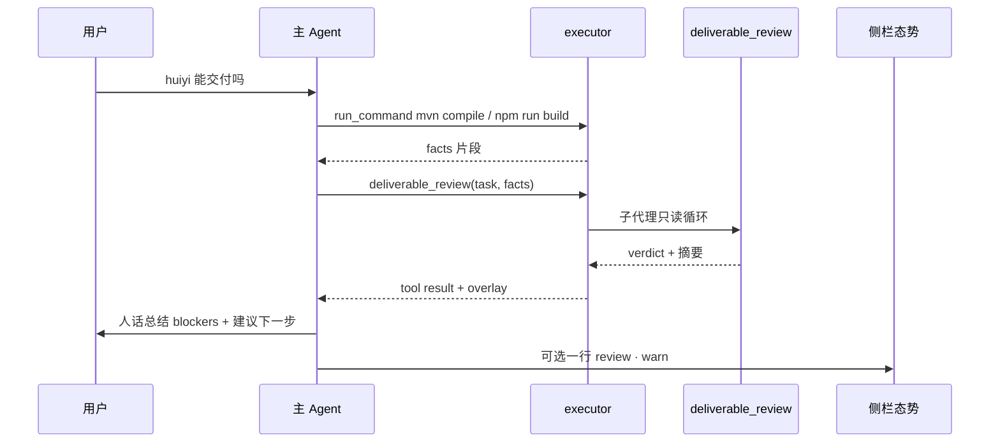
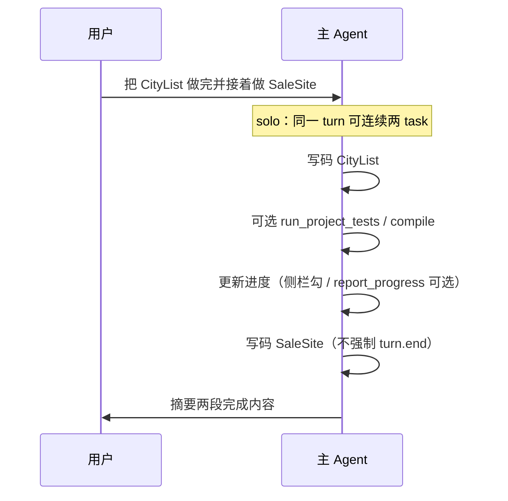

# 交付审查子代理 + 主 Agent 编排（Phase 47）

> 版本 **0.3.0** · 2026-08-06 · **状态：代码已落地（未 commit）** · S-470/S-471 手工 todo · **里程碑提醒 done（T-4714～4718）**  
> 触发：huiyi 联调——三件套 + 一停 + Progress Gate 叠成「和 Agent 博弈」；用户希望 **审查子代理 + 主 Agent 统一编排**，且 **系统提示词必须与内核行为一致、可审计、可版本化**。  
> **产品栈与本地交付哲学**（四层模型 · 非云 PR · 里程碑提醒）：[LOCAL-DELIVERY-MODEL.md](./LOCAL-DELIVERY-MODEL.md)  
> 关联：[PLAN-SUBAGENT.md](./PLAN-SUBAGENT.md) · [ORCHESTRATION.md](./ORCHESTRATION.md) · [AGENT-PARENT-ORCHESTRATION.md](./AGENT-PARENT-ORCHESTRATION.md)（Phase 48 · 薄父 · 禁 project 自动 explore） · [SUBAGENT-BUDGET.md](./SUBAGENT-BUDGET.md)（Phase 49 · 子代理预算） · [CHECKER-SUBAGENT.md](./CHECKER-SUBAGENT.md) · [PROGRESS-GATE.md](./PROGRESS-GATE.md) · [TASK-STOP.md](./TASK-STOP.md) · [PLAN-ARCH.md](./PLAN-ARCH.md) · [AGENT-HARNESS.md](./AGENT-HARNESS.md) §2.1 · [PROJECT-MODE.md](./PROJECT-MODE.md) · [PROMPT-REGISTRY.md](./PROMPT-REGISTRY.md)（T-4700 新建）

---

## 0. 一句话

**用户只对一个主 Agent 说话**；主 Agent 按需幕后调用 **explore / plan_partner / deliverable_review / checker**；**项目是否「够格」看 源-L0–源-L1（代码 + 测试）**，三件套降为 **源-L4 可选视图**。  
本 Phase **强制**做 **提示词/registry 清账**——过期 prompt 与内核硬门叠加，是 huiyi「每步都要继续、手改 TASKS 算外部入侵」的主因。

---

## 1. 已决摘要

| ID | 决议 |
|----|------|
| **R0** | 新增子代理 **`deliverable_review`**；与 `checker` **严格分工**（§4.0） |
| **R1** | **主 Agent 唯一 spawn 权**；子代理不对用户开独立气泡（继承 Phase 39 B0） |
| **R2** | 审查默认 **advisory**；**禁止**新增侧栏「验收」类 CTA 按钮 |
| **R3** | 会话级 **`project_delivery_profile`**：`solo`（**默认**）\| `ritual`（旧纪律完整保留） |
| **R4** | `solo` 软化一停、Gate 勾选对、Plan 外部修改误报；**不删** ritual 代码路径 |
| **R5** | 真源分层 源-L0–源-L4（§6.2）；review 盯 源-L0–源-L1 + 文档漂移 |
| **R6** | 可执行规则 **B/C 层**；F/E 只写 spawn 指针；**禁止**四处重复矛盾长文（§6） |
| **R7** | Ship 前 **PROMPT-AUDIT**（§6.6）；`docs/PROMPT-REGISTRY.md` 为注入真源表 |
| **R8** | `solo` 下 **语义化继续**：用户下一条**实质指令** ≡ 「继续」，不必单发 magic word |
| **R9** | review 子代理 **不自行** `run_command`；重命令由 **父 Agent 先跑**，结果经 `facts` 注入 |

| **R10** | **里程碑 suggestion**（Phase 开放队列清空 → 侧栏 suggestion）；**不**自动 spawn（[LOCAL-DELIVERY-MODEL.md](./LOCAL-DELIVERY-MODEL.md) §5；M1 判据 §5.3） |

### 1.1 非目标

| 非目标 | 理由 |
|--------|------|
| 侧栏「验收」按钮 | 用户反感按钮化 |
| review 写盘 / 勾 TASKS | 与 plan / 进度工具争权 |
| 废除三件套文件 | 给人读；不当运行时 API |
| 第五、第六子代理 | 四角色封顶：explore · plan · review · checker |
| 每 task 自动 review | 太慢；**里程碑只提醒不 spawn**（[LOCAL-DELIVERY-MODEL.md](./LOCAL-DELIVERY-MODEL.md) §6） |
| 云沙箱 / 自动开 PR | 本地-only 非目标（LOCAL-DELIVERY-MODEL §1.2） |
| 用 review 替代 `run_project_tests` | 测试仍须 L1 工具；review **解读**结果 |

---

## 2. 动机与问题画像

### 2.1 用户可感知症状（huiyi 实证）

| 症状 | 用户原话近似 | 技术根因 |
|------|--------------|----------|
| 做完还要「继续」 | 「每次完成后都要我说继续才能勾选」 | `TASK-STOP` S1 + `project.md` §一停门 + `TASK_PAUSED_MARKER` |
| 与进度工具博弈 | 「report_progress 被拒还要改文案」 | `progress_gate` `unknown` + 口语标题 + prompt 重复说教 |
| 手改计划被告 | 「外部修改 TASKS」 | `plan_agent._last_tasks_snapshot` 不区分主人/Agent |
| 勾满不能交付 | init.sql 坏、路由错仍 Phase 全勾 | 完成定义 = Markdown 勾选，非 L1 |
| 文档互相打脸 | TASKS Phase9 待实现 vs MAP 已完成 | 三件套当协议，无对账子代理 |
| 满屏按钮/采纳 | 「什么都按钮化」 | 计划域 + Gate + 采纳叠 UI（Phase 40 已收口一部分；本 Phase 不再加） |
| 自动 explore 读错目录 | 「文档和代码脱节了，你看看」 | 内核 `should_spawn_explore` → 读 `docs/TOOLS.md`；见 [BUG-027](./bugs/2026-08-06-explore-auto-spawn-wrong-scope.md) · Phase 48 |
| 同文件多 patch 采纳失败 | 侧栏 MAP(1) 成功、(2) base_hash mismatch | 多提案共享 hash；见 [BUG-026](./bugs/2026-08-06-plan-patch-adopt-base-hash-queue.md) · Phase 48 |

### 2.2 设计层根因

```text
                    ┌─────────────────────────────────┐
                    │  产品意图：单人顺畅交付项目      │
                    └─────────────────────────────────┘
                                    │
          ┌─────────────────────────┼─────────────────────────┐
          ▼                         ▼                         ▼
   三件套=运行时 API          prompt 教旧流程            缺交付审查视角
   (勾选/一停/Gate)         (project.md 全文)         (checker 太窄)
```

Phase 47 同时修 **行为（profile）**、**能力（review）**、**表述（prompt registry）** 三条线；只做其中一条，博弈感不会消失。

---

## 3. 子代理编制与分工

### 3.1 四角色对照（扩展版）

| 子代理 | `SubagentKind` | 工具面 | 默认预算 | 触发 | 产出 | 写盘 |
|--------|----------------|--------|----------|------|------|------|
| **explore** | `explore` | 只读 + web | 8 轮 → **16**（[SUBAGENT-BUDGET](./SUBAGENT-BUDGET.md)） | **父调** `explore` / CLI `探索`；**项目模式禁内核预 spawn**（Phase 48） | 摘要 + 已读路径 | 否 |
| **plan** | `plan` | PlanAgent 工具集 | 1 轮查跑 → **4**（Phase 49） | `plan_partner`、改计划域 | 摘要 + patch 提案 + notices | **仅经采纳** |
| **deliverable_review** | `review` | 只读 | **6** → **16** 轮 | `deliverable_review`、口语验收 | verdict JSON + 摘要 | 否 |
| **checker** | `checker` | 只读 | 5 → **10** 轮 | `write_evolve` 后、测败分析 | CHECKER_VERDICT | 否 |

**硬边界**：

- `checker` **不**做全项目 MAP/TASKS 对账 → 归 **review**
- `review` **不**分析单条 `run_project_tests` failure 栈（除非作为 facts 一部分）→ 细分析可复用 `checker` `project_test_fail` kind
- `plan` **不**判定「项目能否交付」→ 归 **review**
- **父 Agent** 仍是唯一写码、跑 `run_command`、调 `report_progress`（若 profile 允许）的角色

### 3.2 主 Agent = 指挥，不是调度台

```text
用户一句
  → 主 Agent（理解意图）
       → 自己读/写/跑（默认）
       → 或 spawn 一个子代理（专事专办）
       → 收摘要，合成 **一条** 用户可见回复
```

**禁止**：

- 子代理结果直接进主聊多条气泡
- 要求用户「去和审查 Agent 说」
- 无用户意图的链式 `explore → plan → review` 自动流水线（除非用户明确「全面体检」）

---

## 4. `deliverable_review` 子代理（详细规格）

### 4.0 与 checker 的分工图

```text
write_evolve 成功
    → checker (scaffold)     … 工具目录/demo 合规

run_project_tests 失败
    → checker (project_test_fail) … 单条 failure 深度解读（可选）
    → 或父 Agent 修完后再 review

用户「huiyi 能交付吗」
    → 父：verify_build + run_project_tests（可选）
    → deliverable_review (full) … 全项目清单 D1–D7
```

### 4.1 Builtin schema（LLM function）

**名称**：`deliverable_review`（Builtin 编排；executor 派发，对齐 `plan_partner`）

```json
{
  "name": "deliverable_review",
  "description": "Spawn read-only deliverable review subagent for bound project. Parent should run build/tests first when possible; pass results in facts.",
  "parameters": {
    "type": "object",
    "properties": {
      "task": {
        "type": "string",
        "description": "User intent or focus, e.g. 验收 huiyi / Phase 7 是否完成"
      },
      "scope": {
        "type": "string",
        "enum": ["full", "phase", "files"],
        "default": "full"
      },
      "phase_hint": {
        "type": "string",
        "description": "When scope=phase, e.g. Phase 7"
      },
      "paths": {
        "type": "array",
        "items": { "type": "string" },
        "description": "When scope=files, relative to project_root"
      },
      "facts": {
        "type": "object",
        "description": "Parent-supplied L1 results; subagent must not re-run heavy commands",
        "properties": {
          "backend_compile": { "type": "string", "enum": ["ok", "fail", "skip", "not_run"] },
          "frontend_build": { "type": "string", "enum": ["ok", "fail", "skip", "not_run"] },
          "run_project_tests": { "type": "object" },
          "verify_build": { "type": "object" },
          "extra": { "type": "object" }
        }
      }
    },
    "required": ["task"]
  }
}
```

**校验**：

- 须绑定 `project_id` / `project_root`（同 `plan_partner`）
- 每 turn 最多 **1** 次（`DELIVERABLE_REVIEW_MAX_PER_TURN=1`，env 可配）
- `scope=files` 时 `paths` 非空；路径须在 `project_root` 下

### 4.2 子代理内部循环

对齐 `SubagentRunner.run_checker` / `run_explore` 模式：

| 项 | 值 |
|----|-----|
| `max_tool_rounds` | **6**（`REVIEW_SUBAGENT_MAX_ROUNDS`） |
| 工具 | `read_file` `list_dir` `glob_file_search` `grep` |
| 模型 | `resolve_model_id_for_role("deliverable_review")`；默认跟 session flash |
| 上下文 | `task` + `facts` JSON + 计划域切片（**仅** PROJECT 验收段 + TASKS 开放队列标题行，≤4k） |
| 取消 | 继承父 turn `cancel_event` |
| 持久化 | 子 messages **不写** `messages.jsonl`；`evolve_log` 记 `subagent_run` |

### 4.3 默认检查清单（D1–D12）

实现期 `review_deliverable.md` 引用本表；子代理按 scope 裁剪。

| ID | 检查项 | 方法 | 严重度 | solo 阻断？ |
|----|--------|------|--------|-------------|
| D1 | 后端可编译 | `facts.backend_compile` 或读 `target/` 痕迹 | P0 | advisory |
| D2 | 前端可构建 | `facts.frontend_build` | P0 | advisory |
| D3 | 项目测试 | `facts.run_project_tests` | P0 | advisory |
| D4 | `database/init.sql` 语法 | 读文件：无 INSERT 混入 CREATE、无重复表 | P0 | advisory |
| D5 | PROJECT 验收命令可解析 | `parse_acceptance_spec` 同类逻辑 | P1 | 否 |
| D6 | TASKS vs MAP 阶段一致性 | 抽样 Phase 标题与 MAP § | P1 | 否 |
| D7 | PROJECT 验收 `[ ]` vs 代码现实 | 读 PROJECT + L1 facts | P1 | 否 |
| D8 | 前端路由 vs API path | 读 `router/index.js` + `*Controller.java` 抽样 | P1 | 否 |
| D9 | 根目录 `_*.py` / `add_*.py` 补丁脚本 | `list_dir` project root | P2 | 否 |
| D10 | 测试覆盖存在性 | 无 `@Test` / 无 `tests/` 则 warn | P2 | 否 |
| D11 | 假 UI 数据（硬编码通知等） | 读 `Layout.vue` 等 | P2 | 否 |
| D12 | `ENV.md` 与脚本一致 | `verify_build.py` 等是否用 ENV 路径 | P2 | 否 |

**solo 原则**：review 结论 **不自动** `finish_reason=task_paused`、不挡下一 task；仅主聊文字建议。

**ritual 可选增强**（`RITUAL_REVIEW_BLOCKS_PROGRESS=1`）：`verdict=fail` 且 D1–D4 任一项 fail 时，侧栏一行 warn（仍无按钮）。

### 4.4 输出 schema（机器 + 人）

```json
{
  "verdict": "pass",
  "blockers": [
    "database/init.sql: INSERT 混入 sys_user CREATE（行 15–16）",
    "GlobalSearchController 返回 /doctor，路由为 /doctors"
  ],
  "warnings": [
    "PROJECT.md 验收 3 条仍未勾选",
    "TASKS Phase 9 标待实现，MAP 标已完成",
    "Layout.vue 通知为硬编码假数据"
  ],
  "drift": [
    { "kind": "tasks_map", "detail": "Phase 9 状态不一致" },
    { "kind": "project_acceptance", "detail": "验收标准未勾但 L1 部分通过" }
  ],
  "suggested_next": [
    "修复 init.sql 后 mysql < init.sql 冒烟",
    "修正 GlobalSearch path 或 router",
    "可选：plan_partner 同步 TASKS/MAP 文案"
  ],
  "evidence_paths": [
    "workspace/huiyi/database/init.sql",
    "workspace/huiyi/backend/.../GlobalSearchController.java"
  ],
  "checklist": {
    "D1": "ok", "D2": "ok", "D3": "skip", "D4": "fail"
  }
}
```

**末行协议**（与 checker 对齐）：

```text
REVIEW_VERDICT: pass|warn|fail
```

父 Agent overlay（`format_subagent_overlay` 扩展）：

```text
[子代理摘要 · deliverable_review]
verdict: warn · blockers: 2 · warnings: 3
…摘要正文…
父循环：根据 review 建议行动；勿要求用户点击侧栏验收按钮。
```

### 4.5 `evolve/subagents/review_deliverable.md`（提纲）

实现时按此提纲写全文（≤120 行）：

1. 身份：只读交付审查；**禁止**写文件、禁止声称已修复  
2. 输入：`facts` 优先于自己推断；无 facts 时明确写「未验证编译」  
3. 检查表：D1–D12 简表  
4. huiyi 类项目：Spring + Vue 必看 `init.sql`、`router`、`application.yml`  
5. 三件套：发现矛盾记入 `drift`，**建议** plan 同步，不自己改 TASKS  
6. 输出：先中文摘要，末行 `REVIEW_VERDICT`  
7. `prompt_id: review-deliverable · version: 1.0.0`

### 4.6 代码落点清单

| 文件 | 改动要点 |
|------|----------|
| `agent-core/subagent.py` | `SubagentKind` 增 `review`；`run_deliverable_review()`；`REVIEW_TOOL_NAMES`；`deliverable_review_max_per_turn()` |
| `agent-core/tools/builtin/deliverable_review.py` | 新建；`run()` 返回 stub（executor 真跑） |
| `agent-core/tools/executor.py` | `_run_deliverable_review`；emit `review.subagent.start/done`；cap 计数 `session.deliverable_review_calls` |
| `agent-core/agent.py` | `build_llm_tools` 注册；project 绑定会话可见 |
| `agent-core/llm_routing.py` | `deliverable_review` role |
| `agent-core/loader.py` | overlay 纪律：`subagent: review` 时勿重复全仓 read |
| `agent-core/tools/logging.py` | `log_subagent_run` kind=`review` |
| `evolve/tool-catalog/INDEX.md` | 一行 |
| `evolve/tool-catalog/buckets/project.md` | spawn 说明（E 层） |
| `desktop/.../chat-state.ts` | 过程卡文案「交付审查 · 进行中」 |
| `desktop/.../project-panel.ts` | 可选 `review_verdict` 一行态势（无按钮） |

---

## 5. 主 Agent 编排（路由表 + 时序）

### 5.1 口语路由（无按钮）

主 Agent **自行判断**是否 spawn；内核 **不做**关键词拦截（与 Phase 39 废止 plan-intent 同哲学）。  
下列为用户意图 → **建议**动作的参考表（写进 `project-delivery-solo.md`，**不**写进 core 长文）：

| 用户说法示例 | 主 Agent 应 | 不应 |
|--------------|-------------|------|
| 「huiyi 还缺什么」 | 先 `run_command`/`verify_build`（若快）→ `deliverable_review` | 自己 grep 全仓 50 文件 |
| 「验收一下」 | 同上 | 让用户点侧栏 |
| 「继续」/`solo` 下一条具体指令 | 取下一开放 task **或**执行用户新指令 | 强制复述「请说继续」 |
| 「规划 Phase 10」 | `plan_partner` | 直写 TASKS |
| 「看看 backend 结构」 | `explore` 或少量 read | spawn review |
| 「这个测试为什么挂」 | 读 failure；可选 `checker` project_test_fail | spawn 全量 review |
| 「项目纪律改回严格」 | 确认后 `项目 纪律 ritual`（meta） | 静默改 profile |

### 5.2 标准时序：口语验收



### 5.3 标准时序：编码中（solo 默认）



### 5.4 spawn 上限与环境变量

| 变量 | 默认 | 含义 |
|------|------|------|
| `DELIVERABLE_REVIEW_MAX_PER_TURN` | 1 | 每用户消息 review 次数 |
| `REVIEW_SUBAGENT_MAX_ROUNDS` | 6 | 子代理工具轮 |
| `REVIEW_SUBAGENT_SUMMARY_MAX_CHARS` | 3500 | 摘要截断 |
| `PLAN_PARTNER_MAX_PER_TURN` | 2 | 已有；并列 |

> **废止（LDM-5 · v0.3）**：原 `SOLO_AUTO_REVIEW_ON_PHASE`（Phase 勾满自动 spawn review）**从未实现**，已从产品面删除；由 [LOCAL-DELIVERY-MODEL.md](./LOCAL-DELIVERY-MODEL.md) §5 **里程碑 suggestion** 取代。禁止在新 prompt 中引用。

---

## 6. `project_delivery_profile`（solo / ritual）

### 6.1 存储与切换

**已决**：`session.meta.project_delivery_profile: "solo" | "ritual"`（字符串枚举）

| 入口 | 行为 |
|------|------|
| 新建项目绑定会话 | **solo** |
| `项目 纪律 strict` / `项目 纪律 ritual` | 设为 ritual |
| `项目 纪律 solo` / `项目 纪律 宽松` | 设为 solo |
| `data/state.json` 不存全局默认 | 跟会话走，避免壳串线 |

**不采用** PROJECT.md frontmatter 为唯一真源（避免计划域文件与 profile 鸡生蛋）；可在 `plan_partner` 提案中改 profile 并采纳。

### 6.2 真源分层（源-L0～源-L4）

> **命名**：本节 **源-L*** = 交付物真源层；产品栈层 **栈-A～栈-D** 见 [LOCAL-DELIVERY-MODEL.md](./LOCAL-DELIVERY-MODEL.md) §1–§2。**勿混读**：**栈-C**（人把关）≠ **源-L3**（主聊摘要/verdict）。

```text
源-L0  源码 · 配置 · database/init.sql · 迁移
源-L1  verify_build · run_project_tests · test_api.py · ENV 验收命令
源-L2  git log / diff
源-L3  主聊摘要 · deliverable_review verdict · explore 摘要
源-L4  PROJECT.md · MAP.md · TASKS.md · TASKS.archive.md
```

| 问题 | solo 听谁的 | ritual 听谁的 |
|------|-------------|---------------|
| 能不能交付？ | L1 + review | L1 + review + L4 勾选 |
| 下一项干啥？ | 用户话 + L4 开放队列（参考） | L4 第一条 `- [ ]` + 一停 |
| 任务算做完了吗？ | L1 过 **或** 用户口头 **或** 侧栏勾 | `report_progress` 成功 + Gate |
| MAP 和 TASKS 不一致？ | review 警告；**不挡写码** | plan 对账；可挡勾选 |

### 6.3 行为矩阵（实现必对表）

| 机制 | 代码落点 | ritual（现行为） | solo（新默认） |
|------|----------|------------------|----------------|
| Task 一停 | `task_stop.py` / `executor._maybe_arm_task_stop` | 勾后同 turn 禁下一产物；`finish_reason=task_paused` | **不武装**一停；或仅用户显式「停」 |
| 「继续」识别 | `is_project_continue_utterance` | 仅 magic phrases | **+** 任意新 task 指令 ≡ 继续 |
| Progress Gate | `progress_gate.py` | `unknown` 拒勾；须对口证据 | `unknown` **不拒**；仅 L1 失败拒勾 |
| `report_progress` | evolved 工具 | 主通道 | **可选**；侧栏 `toggle_task` 仍可用 |
| 外部修改 TASKS | `plan_agent.build_state` | snapshot 不等 → banner | **主人编辑**：刷新 snapshot，无 banner |
| plan 采纳 | 侧栏 | 提案须采纳 | 提案仍展示；**用户手改**合法，不告警 |
| overlay 文案 | `format_project_overlay` | task_stop + report_progress 长文 | `delivery_profile: solo` + 短纪律 |
| `TASK_PAUSED_MARKER` | `loader.ensure_task_paused_text` | 注入固定收口 | solo **不注入** |
| auto_continue segment | `MY_AGENT_AUTO_CONTINUE` / project 壳 | 关 | 关（保持）；solo 不靠 segment 连 task，靠不一停 |

### 6.4 solo 下 Progress Gate 细则

在 `progress_gate.evaluate_report_progress` 增分支：

```python
if session.meta.project_delivery_profile == "solo":
    # 1) unknown 不再 alone 拒绝
    # 2) 若 facts 含本回合 compile/test fail → 拒绝
    # 3) 用户 confirm_rejected 的工具类证据 → 仍拒绝（保留 G3）
```

**保留硬拒**（两种 profile 一致）：

- 同 turn 双 `report_progress`（G5）
- 明确拒确认后拿「上次编译过」当凭证（G1/G3）
- armed 身份与 task_line 严重冲突（身份门）

**放松**（仅 solo）：

- 标题无 Entity/.java → 不判 `unknown` 死刑（继承 v0.3.0 口语信号基础上，**unknown 永不单独拒**）

### 6.5 ritual 模式保留场景

- 多人评审演示、教学「严格 WIP」
- 用户明确「我要每步确认」
- 回归测试 `IT-472` ritual fixture

---

## 7. 三件套降级（产品语义）

### 7.1 文件角色重写（文档层）

| 文件 | 旧角色 | 新角色（Phase 47 后） |
|------|--------|------------------------|
| `PROJECT.md` | 范围 + 验收真源 | 范围 + **验收声明**（L4）；可与 L1 暂时不一致 |
| `MAP.md` | 结构真源 | **索引卡片**；允许滞后；review 可对账 |
| `TASKS.md` | 执行队列 + 运行时状态机 | **开放队列视图**；solo 下勾选不驱动停复 |
| `TASKS.archive.md` | 归档 | 不变 |

### 7.2 PLAN-ARCH 条款增补（实现时同步）

在 `PLAN-ARCH.md` 增 **A13**（草案）：

> **L4 视图条款**：三件套默认注入 **切片**；不与 L0/L1 冲突时以 L0/L1 为准；`deliverable_review` 负责标出 L4 漂移，不自动修复。

### 7.3 huiyi 对账示例（review 应产出）

| 发现 | 类型 | 建议 |
|------|------|------|
| init.sql 行 15–16 损坏 | blocker D4 | 修 SQL |
| GlobalSearch `/doctor` vs `/doctors` | blocker D8 | 改 Controller |
| TASKS P9 待实现 vs MAP P9 完成 | drift D6 | plan_partner 同步 |
| PROJECT 验收未勾 | warning D7 | 跑通后勾或改验收 |
| DoctorList 空行 65% | warning D9 | normalize |
| 无自动化测试 | warning D10 | 补 test_api / IT |

---

## 8. 提示词治理（扩展版）

### 8.1 分层纪律（AGENT-HARNESS 落地）

| 层 | Phase 47 动什么 | 不动什么 |
|----|-----------------|----------|
| **A** schema | `deliverable_review` 入 `build_llm_tools` | 不增第 7 个 evolved |
| **B** | `project_delivery_profile` 分支；solo Gate；外部修改豁免 | 计划确认门（未 confirmed 禁写码） |
| **C** | executor spawn review；cap | confirm 管线主体 |
| **D** | review 摘要截断 | — |
| **E** | INDEX/buckets 一行；`project-*.md` 拆分 | 不在 INDEX 写一停教程 |
| **F** | core §Project **+2 行** spawn 指针 | 不写 D1–D12 清单 |
| **G** | 过程卡「交付审查」 | 无审查按钮 |
| **H** | `DELIVERABLE_REVIEW_MODEL` 可选 | — |

### 8.2 过期源 → 处置（逐文件）

#### `agent-core/prompts/core.txt`

| 行/段 | 现状 | 动作 |
|-------|------|------|
| §Project plan 文件 | 禁直写 | **保留** |
| §Project 采纳 | 禁口述按钮 | **保留**（Phase 40） |
| （缺） | 无 review | **新增 2 行** spawn 指针（§7.2 旧文档） |
| （缺） | 无 subagent 合成回复 | **新增 1 行** |

**禁止新增**：一停、report_progress 参数教程、继续 magic word。

#### `evolve/prompts/project.md`（现 100 行）

| 现章节 | 行号约 | 处置 |
|--------|--------|------|
| 边界 / 换线 | 1–26 | → `project-boundaries.md` |
| 计划域纪律 | 27–34 | boundaries 保留 B5；删采纳口播重复 |
| 计划确认门 | 35–46 | boundaries |
| **执行纪律 §2** | 49–62 | → **ritual only** `project-delivery-ritual.md` |
| **一停门 §Task** | 64–78 | → **ritual only** |
| 路径 / ENV / 构建 | 80–101 | → boundaries |

新 `project.md`（入口，≤25 行）：

```markdown
<!-- prompt_id: project · version: 2.0.0 · phase: 47 -->
# 项目模式入口
注入：project-boundaries.md + project-delivery-{solo|ritual}.md
profile 见 overlay project_delivery_profile
```

#### `evolve/prompts/project-delivery-solo.md`（新建 · 提纲）

1. 完成定义 = **L0/L1**；TASKS 勾选可选  
2. 连续多 task 允许；用户下一条指令即继续  
3. 验收口语 → `deliverable_review`；父可先跑 build/test  
4. 手改 TASKS/MAP **合法**；与代码冲突时 review/plan 建议同步  
5. **禁止**口述「请点采纳」；**禁止**每步「回复继续」收口  
6. plan_partner：改范围/队列时用；非每 task 必调  

#### `evolve/prompts/project-delivery-ritual.md`（新建）

从现 `project.md` §执行纪律 + §一停 **原样迁移**，首行标注 `prompt_id: project-delivery-ritual · version: 1.0.0 · supersedes: project.md§一停`。

#### `project_mode.py` → `format_project_overlay`

**solo 示例输出**：

```text
[项目模式 · project]
project_root: workspace/huiyi
project_id: huiyi
project_plan_status: confirmed
project_delivery_profile: solo
plan_gate: 已确认 — 可写项目内代码
delivery: 完成以构建/测试为准；TASKS 为视图；验收口语可 spawn deliverable_review
tasks: 77/89 done
current_task: - [ ] T-xxx …
```

**ritual 示例**：保持现 1083–1096 行级文案。

#### `evolve/tool-catalog/buckets/project.md`

替换：

```markdown
| `deliverable_review` | 交付审查子代理（只读）；口语验收/还缺什么 |
| `report_progress` | ritual：勾选派进度；solo：可选 |
```

#### `loader.py`

- `load_project_prompt()` → 组装 boundaries + delivery(profile)  
- `ensure_task_paused_text()`：若 `profile==solo` → **return text 不变**  
- `format_turn_discipline_overlay`：review 摘要纪律  

#### `plan_agent.py` 外部修改

```python
# 伪代码
if profile == "solo" and change_source in ("user_editor", "owner_save"):
    self._last_tasks_snapshot = current_tasks
    external_changes = False
elif auto_fix_migrated:
    refresh snapshot, no banner
else:
    existing logic
```

**实现提示**：桌面保存 TASKS 时可 WS `plan.files.saved`带 `source: user`（若无则先用 mtime+非 plan 写入启发式）。

### 8.3 `docs/PROMPT-REGISTRY.md`（T-4700 交付物）

实现时创建，最小列表示例：

| id | version | path | injected_when | enforced_by | phase |
|----|---------|------|---------------|-------------|-------|
| core | 2026-08-06 | agent-core/prompts/core.txt | 始终 | both | 2 |
| project-boundaries | 1.0.0 | evolve/prompts/project-boundaries.md | project 绑定 | prompt | 47 |
| project-delivery-solo | 1.0.0 | evolve/prompts/project-delivery-solo.md | profile=solo | both | 47 |
| project-delivery-ritual | 1.0.0 | evolve/prompts/project-delivery-ritual.md | profile=ritual | both | 47 |
| review-deliverable | 1.0.0 | evolve/subagents/review_deliverable.md | spawn review | prompt | 47 |
| checker-project-test | 0.1 | evolve/subagents/checker_project_test.md | spawn checker | prompt | 44 |

**规则**：改 prompt 文件 **必须** bump version 或 registry 行；IT-473 扫 version 头。

### 8.4 冲突裁决（扩展）

当用户看到的行为与 prompt 文字矛盾：

1. 以 **executor 实测**为准报 bug  
2. 修 **B/C** 或删 **F/E** 过期句；**不**改 prompt 去「解释 bug」  
3. `ritual` 会话允许保留「继续」；**solo 不允许**  

### 8.5 压缩 / digest 与 prompt 过期

`digest.md` 可能仍写「每步 report_progress」类旧摘要。

**对策**（T-4708）：

- `loader` 注入 project 时加一行：`delivery_profile: solo — 忽略 digest 中与 profile 冲突的一停/Gate 叙述`  
- 长期：compact 模板剔除计划仪式句（RUNTIME 补丁，可 defer）

### 8.6 PROMPT-AUDIT 放行清单（完整）

**结构**

- [ ] `PROMPT-REGISTRY.md` 与磁盘 1:1  
- [ ] 每个 `evolve/prompts/*.md` 有 version 头  
- [ ] `project.md` ≤30 行，无 §一停正文  
- [ ] `project-delivery-solo.md` 无「回复继续」硬收口  
- [ ] `core.txt` 无 report_progress 参数表  

**行为**

- [ ] fixture `solo` loader 输出 snapshot（IT-473）  
- [ ] fixture `ritual` 仍含 task_stop 行  
- [ ] solo 手改 TASKS 无 external banner（IT-474）  
- [ ] solo 连续两 task 无 task_paused（IT-472）  

**手工**

- [ ] huiyi + solo：「还缺什么」→ review 列出 D4/D6；无新按钮（S-470）  
- [ ] huiyi + ritual：「继续」→ 仍一停（S-471）  

---

## 9. 桌面与 WS（无新按钮）

### 9.1 事件

| 事件 | 载荷 | UI |
|------|------|-----|
| `review.subagent.start` | `task_preview`, `call_id` | 过程卡「交付审查 · 进行中」 |
| `review.subagent.done` | `verdict`, `blockers_count`, `summary_preview` | 过程卡完成；主聊由助手总结 |
| `project.state` | 增 `review_verdict?`, `delivery_profile` | 侧栏可选一行：`审查 warn · 2` |

### 9.2 侧栏态势（UX-026 延续）

```text
当前：T-025 SaleSiteList
审查：warn · 2 blockers     ← 可点击滚动到主聊 review 摘要，非按钮
profile：solo
```

**禁止**：「立即修复」「采纳审查结果」类 CTA。

### 9.3 过程卡与 plan 对齐

复用 Phase 39 过程卡组件；`kind=review` 时无 `proposals_ready`、无采纳按钮。

---

## 10. 边界与失败模式

| 场景 | 行为 |
|------|------|
| 未绑定项目调 `deliverable_review` | validation error，与 plan_partner 同文案 |
| review 中用户 Stop | cancel_event → 子代理中止；主 Agent 说明「审查已取消」 |
| 父未传 facts | review 仍可跑，D1–D3 标 `not_run` 并 warn |
| review fail 但用户坚持交付 | advisory；主 Agent 文字确认风险，不硬挡 |
| ritual + review fail | 可选侧栏 warn 行；仍不新增按钮 |
| LLM 子代理超时 | 同 explore；摘要「审查超时，仅完成部分检查」 |
| 与 plan_partner 同 turn 各 1 次 | 允许；总 wall 仍受 TURN_WALL_SEC |

---

## 11. DOC-04 准入与任务分解

### 11.1 STABILIZATION §3 矩阵

| 行 | 档位 | 验收 |
|----|------|------|
| 项目模式 · 交付/profile | P1 | S-470 · S-471 · IT-472 |
| 子代理 · deliverable_review | P1 | IT-471 |
| 提示词注入 · registry | P1 | IT-473 · IT-475 |
| 计划域 · 主人编辑 | P2 | IT-474 |
| 桌面 · 过程卡 review | P2 | S-470 |

### 11.2 Task 表（`TASKS.md` Phase 47）

| ID | 任务 | 交付物 | 依赖 | 验收 |
|----|------|--------|------|------|
| T-4700 | 本文 v0.2 + `PROMPT-REGISTRY.md` 初版 | docs | — | 评审 |
| T-4701 | `review_deliverable.md` 全文 | evolve | T-4700 | 人工读 |
| T-4702 | `SubagentRunner.run_deliverable_review` | subagent.py | T-4701 | IT-471 |
| T-4703 | builtin + executor + agent 注册 | 多文件 | T-4702 | IT-471 |
| T-4704 | `project_delivery_profile` meta + CLI | project_mode.py, main | T-4700 | IT-472 |
| T-4705 | solo：一停/Gate/外部修改/overlay | 多文件 | T-4704 | IT-472,474 |
| T-4706 | 拆分 project prompts + loader | evolve/prompts, loader | T-4704 | IT-473 |
| T-4707 | core.txt 增量 + buckets/INDEX | 2–3 文件 | T-4706 | IT-473 |
| T-4708 | digest 冲突句屏蔽（可选） | loader/context | T-4706 | IT-475 |
| T-4709 | 桌面 review 过程卡 + 态势一行 | desktop | T-4703 | S-470 |
| T-4710 | PROMPT-AUDIT 快照测试 | tests | T-4706 | IT-473 |
| T-4711 | 手工 huiyi S-470；ritual S-471 | log | T-4705,9 | S-470,471 |

### 11.3 测试用例明细

#### IT-471 spawn review

1. 绑定 huiyi fixture  
2. `executor.run("deliverable_review", {task, facts:{backend_compile:ok}})`  
3. 断言：`ok`；payload 含 `verdict`；`messages.jsonl` 无子代理 tool 流水全文  
4. `evolve_log` 有 `subagent_run` kind=review  

#### IT-472 solo 连续 task

1. profile=solo，confirmed，TASKS 两条开放  
2. 模拟同 turn 两次 `write_text` 不同 task 文件  
3. 断言：**无** `task_paused` finish_reason  

#### IT-472b ritual 对照

1. profile=ritual  
2. `report_progress` 成功后  
3. 断言：`task_paused` 或同等武装  

#### IT-473 prompt 快照

1. `build_system_prompt(session, profile=solo)`  
2. 快照不含 `回复「继续」开始下一项`  
3. 含 `project-delivery-solo` version 头  

#### IT-474 主人改 TASKS

1. solo；plan_agent.build_state snapshot=A  
2. 模拟磁盘 TASKS 变为 B（source=user）  
3. 断言：`external_changes=false`  

#### IT-475 digest 冲突

1. digest 含「每完成一个 task 必须 report_progress」  
2. solo overlay 含忽略说明  
3. （可选）compact 模板不再生成该句  

#### S-470 手工（huiyi · solo）

1. `start-desktop.bat`；绑定 huiyi；确认 `项目 纪律 solo`  
2. 主聊：「huiyi 还缺什么」  
3. 期望：过程卡审查；主聊列出 init.sql / 三件套 drift；**无新侧栏按钮**  
4. 不要求用户说「继续」  

#### S-471 手工（huiyi · ritual）

1. `项目 纪律 ritual`  
2. 完成单项后  
3. 期望：「本项已完成。回复继续…」  

---

## 12. 实施顺序与风险

### 12.1 推荐顺序

```text
Wave 1（减博弈，最快体感）
  T-4700 → T-4706 → T-4707 → T-4710
  T-4704 → T-4705

Wave 2（加能力）
  T-4701 → T-4702 → T-4703 → T-4709

Wave 3（收尾）
  T-4708（可选）→ T-4711
  同步 PATCH：PROGRESS-GATE §profile、TASK-STOP §profile、PROJECT-MODE §0f

Wave 4（里程碑提醒 · **T-4714～4718 done**）
  S-472 手工验收 todo
  真源：[LOCAL-DELIVERY-MODEL.md](./LOCAL-DELIVERY-MODEL.md) §6
```

### 12.2 风险

| 风险 | 缓解 |
|------|------|
| solo 太松，假完成回潮 | L1 失败仍硬拒；review 口语可触发 |
| ritual 用户找不到 | 显式 `项目 纪律 ritual`；设置页一行说明 |
| prompt 又双轨腐化 | REGISTRY + IT-473 快照门禁 |
| review 幻觉 blockers | 要求 evidence_paths；父 Agent 只引用路径 |
| 里程碑提醒太频 | 仅 Phase/项目清空；同 Phase 去重 + dismiss 永久（LOCAL-DELIVERY-MODEL §6.6） |

### 12.3 与本地交付模型关系

完整栈层、非云 PR、`deliverable_review` 可选语义、里程碑提醒规格见 **[LOCAL-DELIVERY-MODEL.md](./LOCAL-DELIVERY-MODEL.md)**。本文专注子代理与 profile 实现；**LDM-3/LDM-4/LDM-5** 为产品已决，实现里程碑提醒时不得改为自动 spawn。

---

## 13. 修订记录

| 版本 | 日期 | 说明 |
|------|------|------|
| 0.1.0 | 2026-08-06 | 初稿 |
| 0.2.0 | 2026-08-06 | 扩写：路由表、时序、profile 矩阵、prompt 逐文件迁移、D1–D12、WS、测试步骤、huiyi 样例 |
| 0.3.0 | 2026-08-06 | 链入 LOCAL-DELIVERY-MODEL；R10 里程碑提醒；Wave 4 任务 |
