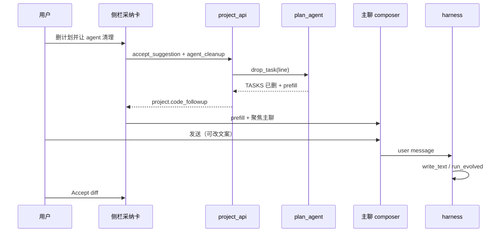

# Desktop 教科书流程（产品定调）

> 版本 **0.1.9** · 2026-08-14  
> **状态**：**M0 文档已签 · M1 待实施**（流程轨 UI / 配方 CI / §6.3 边角 · 见 §6.0）  
> 关联：[LOCAL-DELIVERY-MODEL.md](./LOCAL-DELIVERY-MODEL.md) · [PROGRESS-GATE.md](./PROGRESS-GATE.md) · [PROJECT-MODE.md](./PROJECT-MODE.md) · [PROJECT-SIDEBAR.md](./PROJECT-SIDEBAR.md) · [PLAN-REVIEW-UI.md](./PLAN-REVIEW-UI.md) · [UX-POLISH.md](./UX-POLISH.md) UX-026 · [TERMINAL-MODE.md](./TERMINAL-MODE.md) · [TASKS.md](./TASKS.md) Phase 58

---

## 0. 一句话

**Desktop = 只为写 workspace 项目服务的主战场**；进度靠 **闸门 + 证据** 推动，不是聊天语气。  
**Terminal = 独立入口的狂野挎包**（卖点、维护态），**不进** Desktop 流程轨。

---

## 1. 产品分工（定调）

| 线 | 角色 | 开发策略 |
|----|------|----------|
| **Desktop** | 主战场 · 日常写码工作台 | **唯一主动演进面**：unified **project** 视角、项目纪律、侧栏、编码 harness |
| **Terminal** | 狂野模式 · 卖点 | **功能冻结**：不排新 Phase、不改行为/UX；仅 P0 bug、依赖安全 |

| 决议 | 说明 |
|------|------|
| **默认 project** | 打开 Desktop 即「写项目」；不为第三方造工具平台，**我们自己用 Desktop 造自己的软件** |
| **Terminal 独立入口** | 仅 `start-terminal.bat`；Desktop **不嵌**狂野模式、不做导流按钮（README 一句说明即可） |
| **非目标** | 通用助手、四壳复活、evolve 工坊产品化、Terminal 功能 parity、追 Cursor 全场景 |

Terminal 继续宣传：`cd` 进仓库就开干、effective root 内狂野、auto-plan、Ink v0.3.2——当作 **挎包 / 狂热模式**。

---

## 2. 开发模式：闸门 + 证据（不是瀑布签字）

本流程 **不是**「PRD 签完才能写代码」的瀑布，也 **不是** LLM 自报「我在设计阶段」。

| 原则 | 含义 |
|------|------|
| **阶段 = UI 叙事** | 后端已有 `armed` / Progress Gate / `report_progress`；流程轨 **反映** 状态，不新建 agent 模式 |
| **出口 = 可观测事件** | 磁盘、工具 `ok`、采纳控件、`report_progress` toggle、人点的明确动作 |
| **段内可循环** | 验证失败 → 实现；Plan 驳回 → 设计 |
| **人只审异常** | 对齐 PROGRESS-GATE **G4**：规则判错才 override；工具失败不给「强制完成」 |
| **只为写项目** | 出口条件只谈 `workspace/` 项目交付，不谈 evolve 工坊、不谈 Terminal |

与常见模式对照：

- **vs 瀑布**：有五段名字，但无「阶段文档签字大门」，只有 **主焦点** 切换（chat ↔ plan-review ↔ 验证态势）。
- **vs Shape Up**：类似 **武装一条任务**，但证据门更硬（对口工具 ok）。
- **vs Cursor Plan**：完成 = **`report_progress` 成功 toggle**（G8），不是口头 Build 完了。

**加载到 Desktop** = 把已有 **栈-D / 栈-C**（[LOCAL-DELIVERY-MODEL.md](./LOCAL-DELIVERY-MODEL.md)）收成用户可见的 **流程轨五段**，不是另写一套流程引擎。

---

## 3. 流程轨五段与出口条件（v0.2）

> **粒度**：任务级 **实现** 出口 + Phase/milestone 级 **验证/发布** 出口。  
> **验证**：`[x]` toggle 与 **栈-C / 源-L1** **双闸门**（UI 分开显示）。  
> **发布**：**必须人点** milestone 验收（suggestion 不自动关门）。

### 3.1 总览

```text
[ 需求 ] → [ 设计 ] → [ 实现 ] → [ 验证 ] → [ 发布 ]
```

| 段 | 产品问题 | 主信号（系统认） | 不算出口 |
|----|----------|------------------|----------|
| **需求** | 范围够写第一轮代码 | `PROJECT`/`SCOPE` 已采纳且非 stale；TASKS 真源 ≥1 条 **可执行** 开放任务 | 聊天口头「清楚了」；TASKS 仍空 |
| **设计** | 计划可武装、Gate 能分类 | `DESIGN`/`TECH-DESIGN` 基线 current；**武装项相关** Plan patch **已采纳** | 口述采纳；`evidence_kind=unknown` 仍去实现 |
| **实现** | 本项可宣告完成 | 代码 + TASKS 引用 `DESIGN@revision`/`SCOPE@revision`；对本武装任务 **`report_progress` toggle 成功** | 只写盘但 Gate 拒勾；G9 口头完成 |
| **验证** | 栈-C 对本项/本 Phase 成立 | `VERIFY` 的 AC→V 覆盖 + **源-L1** 对口工具 **本回合 ok** + 栈-C 磁盘一致 | 历史会话 BUILD；toggle 成功但无 L1 |
| **发布** | milestone 可收 | `RELEASE` 就绪；开放队列阶段性清空 + 栈-C 对本 milestone + **人点验收** | 自动 spawn review；仅改文档 |

### 3.2 需求 — 「范围够写第一轮代码」

| 项 | 内容 |
|----|------|
| **主信号** | `TASKS.md`（或 Plan 真源）≥1 条开放任务，且非纯占位（如仅「调研一下」无 deliverable——细则可迭代） |
| **辅助** | 项目已绑定；`ENV.md` 已脚手架（PROJECT-MODE E2） |
| **配方** | Phase 43 脚手架项目：模板任务可视为 **需求段加速**，仍须非空开放队列 |
| **确认范围** | **软信号**（见 §3.2.1）；**不**替代「≥1 开放任务」硬条件 |
| **接点** | PROJECT-MODE；Plan `add_tasks`；**此段不勾** `[x]` |

#### 3.2.1 「确认范围」是什么、何时出现

> **已决**：流程轨在 **侧栏顶**（`project-panel` 之上），与任务流同一视觉区。

**它解决什么问题**  
开放队列可以一直 `add_tasks`，流程轨会长期停在 **需求** 高亮，看起来像「还没开始项目」。  
「确认范围」= 你说：**第一轮要做的就是这些任务，可以进入计划/武装了**——大厂里的 feasibility sign-off，solo 版。

**它不是什么**  
- **不是**新 harness、不新开会话、不锁聊天  
- **不是**替代闸门：后面设计/实现/验证仍靠证据  
- **不是**「TASKS 写满才能点」：只要 ≥1 条可执行任务即可点

**触发时机（建议 · v0.2）**

| 时机 | UI 行为 | 是否挡操作 |
|------|---------|------------|
| **绑定/创建项目后** | 流程轨在 **需求**；侧栏顶显示一句目标 + **「确认范围」**（可点状态：已有 ≥1 开放任务时高亮；无任务时灰 + 提示先加任务） | **不挡**聊天、不挡 Plan |
| **用户点击「确认范围」** | 记录 `scope_confirmed_at`（项目元数据）；流程轨 **高亮切到设计**；需求段显示「已确认」 | **不挡**；仅改 **叙事焦点** |
| **之后又 `add_tasks` 或改/删任务** | 仍允许；侧栏 **「范围已变 · 可再确认」**（扩或缩）；流程轨可按 A 保持设计高亮或徽标回需求 |
| **配方脚手架项目** | 首次进入且开放队列非空 → **可选自动确认**（等同点过一次），避免多一次无意义点击 | 可配置，默认 **自动** |

**与「需求段出口」的关系**

```text
硬出口（系统推导设计段能力）：≥1 条可执行开放任务
软出口（流程轨高亮设计段）：用户点「确认范围」或配方自动确认
```

即：**没任务 → 不能算需求完成**；**有任务但没点确认 → 可以聊、可以 Plan，但流程轨仍强调「还在定范围」**。

**推荐拍板（讨论用）**

| 选项 | 行为 |
|------|------|
| **A（推荐）** | 确认后加/改/删任务 **不强制** 再确认；侧栏顶 **「范围已变 · 可再确认」** |
| **B** | 每次 `add_tasks` 后 **自动取消** 确认，必须再点一次 |
| **C** | **取消按钮**，只靠「≥1 任务」自动进设计高亮（无确认范围） |

若选 **C**，可不做按钮，需求段出口 purely 自动——但侧栏顶长期「需求」会与用户体感「已经在写」冲突，故文档默认保留 **A + 软确认**。

**和武装的关系**  
「确认范围」**不挡**武装第一条任务；若希望更强纪律，M2 可选：**未确认时武装前一行提示**「建议先确认范围」，仍 **不硬拦**（与闸门哲学一致）。

### 3.3 设计 — 「计划已采纳，任务可武装」

| 项 | 内容 |
|----|------|
| **主信号** | 对 **即将武装** 的任务：相关 Plan patch **已采纳**（Phase 40 控件）；任务行 Gate 可分类 |
| **辅助** | 审阅面 `plan_review` 队列空；无未确认 `plan_dirty` |
| **粒度** | **武装项相关采纳**（非全队列一次性采纳） |
| **跳过** | 无 Plan patch 的 trivial 修（ typo ）可 **自动视为设计已满足**（待实施时写清规则） |
| **接点** | PLAN-REVIEW-UI；PLAN-ARCH；Gate `unknown`（PROGRESS-GATE §1.3） |

### 3.4 实现 — 「允许宣告本项任务完成」

| 项 | 内容 |
|----|------|
| **主信号** | `report_progress` **toggle 成功** |
| **前置** | 本回合 **对口工具 success**（G1/G2）；`armed_task_id` 一致（G7） |
| **辅助** | 采纳队列清空；`write_policy` 内项目写已落盘 |
| **注意** | 实现段结束 **≠** milestone 完成；**≠** 栈-C 全满足（LDM-3） |
| **接点** | PROGRESS-GATE G1–G9；TASK-STOP 一停；栈-C 磁盘部分 |

### 3.5 验证 — 「栈-C / 源-L1 成立」

| 项 | 内容 |
|----|------|
| **主信号** | 对本项或本 Phase：源-L1 对口工具本回合 ok（`run_project_tests` / `run_quality` / `verify_build` / 对口 test 的 `npm_exec` 等） |
| **与实现** | Gate 已 `[x]` 但无 L1 → **验证段亮红**（LDM-3 假阳性） |
| **辅助** | 侧栏 **本回合证据一行**（UX-026）；failure spill 摘要 |
| **接点** | LDM 栈-C、源-L1；PROJECT-VERIFY；PROJECT-QUALITY E11 |

### 3.6 发布 — 「milestone 可收」

| 项 | 内容 |
|----|------|
| **主信号** | 当前 milestone/Phase 开放队列无未勾项；栈-C 对本 milestone（**近期** L1） |
| **辅助** | 侧栏 milestone **suggestion**（LDM：提醒，**不**自动 spawn） |
| **人点** | **「本 milestone 验收」** 或 dismiss |
| **可选** | `deliverable_review` advisory；**建议** `git_commit` 快照（LDM 栈-C） |
| **发布后** | 流程轨回到下一 milestone 的 **需求/设计**（新开放项） |
| **接点** | LDM 栈-D；DELIVERABLE-REVIEW；MILESTONE-PHASE-KEY |

### 3.7 段间关系（非单向滑梯）

```text
需求 ──(有开放任务)──► 设计 ──(Plan采纳+可武装)──► 实现 ──(report_progress OK)──► 验证 ──(栈-C/L1)──► 发布 ──(人点验收)
         ▲                    │                      │                    │
         └──── add_tasks ─────┘                      │                    │
                              replan / 改文案         │                    │
                                                      └── 失败 ──► 实现   │
                                                                           └── 下一 milestone ──► 需求/设计
```

**Terminal 不在此图上**。

---

## 4. 与四层栈对齐

| 教科书段 | LDM 栈 | 已有文档/能力 |
|----------|--------|----------------|
| 需求 | 栈-D | TASKS 开放队列、配方、ENV |
| 设计 | 栈-D | Plan 子代理、审阅面、patch 采纳 |
| 实现 | 栈-B + 栈-C 磁盘 | harness、armed、一停、采纳队列、`write_policy` |
| 验证 | 栈-C | Gate、源-L1、`run_project_tests`、`run_quality` |
| 发布 | 栈-D + 栈-C | milestone suggestion、git 快照建议、advisory review |

---

## 5. 大厂实践对照与学什么

| 大厂惯例 | 证据形态 | my-agent 已有 | 建议学 | 不学 |
|----------|----------|---------------|--------|------|
| PR + Code Review | diff + approve | 内联 Accept、采纳队列、Phase 48 | **小步 + 必过采纳** | 云 PR 平台 |
| Design RFC | doc 批准 | Plan patch + 审阅面 | **短 RFC = 可采纳 patch** | 多轮委员会 |
| Jira Done | 状态机 | `report_progress` + Gate G8 | **Done = toggle** | Jira |
| CI Pipeline | 流水线绿 | `run_project_tests`、`run_quality`、E11 | **配方默认验证脚本 = 本地 CI** | 云 pipeline |
| Release checklist | 人签字 | milestone suggestion | **3～5 项 checklist + 人点** | 变更委员会 |
| 平台团队造工具 | 给别人用 CI | evolve 工坊 | — | **工坊产品化** |

### 5.1 本地版大厂一周流（solo 习惯）

| 来源 | 等价习惯 |
|------|----------|
| Google | 一条 armed + Plan 采纳 + 本回合测试绿 |
| Amazon | TASKS 行写清 deliverable + `[evidence:…]` |
| Meta | 小步 Accept；指标 = Gate/栈-C 是否绿 |

### 5.2 优先学习清单（ROI）

| 优先级 | 学什么 | 落到本项目 |
|--------|--------|------------|
| **P0** | CI 当验证门 | 配方/ENV **默认** test + quality；流程轨验证段绑按钮与证据行 |
| **P0** | CR = 采纳 | 实现段禁大块未采纳；审阅面 = review 产品 |
| **P1** | 短 RFC | 设计段出口 = patch 已采纳 |
| **P1** | Release checklist | 发布段 3～5 项 + 人点 |
| **P2** | 失败可观测 | partner_notices / failure spill = CI 失败摘要 |

### 5.3 大厂怎么做「随时看计划 + 切换流程视图」

大厂共性：**同一真相源，多种透镜（view）**；**执行状态** 与 **浏览视角** 分离。

| 产品 / 实践 | 他们怎么做 | 学什么 | 映射到 my-agent（§6.2） |
|-------------|------------|--------|-------------------------|
| **Jira** | Backlog / Sprint / Board / Timeline **多视图** 同一 issue 集；Sprint 是 **时间盒透镜**，不是另一套数据 | **多透镜 + 单真源**（TASKS） | 流程轨五段 = 透镜；`☰ 完整计划` = Backlog 全文 |
| **Linear** | Project → Cycle → Issue；侧栏 issue 详情 + 顶栏 **Roadmap** 切换；当前 cycle 高亮 | **当前迭代一眼可见** + 可点开看 roadmap | 执行阶段实心高亮；点轨预览其他段 |
| **GitHub Projects** | Table / Board / **Roadmap** 视图切换；字段驱动「阶段」列 | 阶段是 **视图维度**，不另建工单系统 | `project_plan_status` + 流程轨字段 |
| **Azure DevOps** | **Backlogs** → **Sprints** → **Boards** 三级；Delivery Plans 横贯多团队 | **当下（Sprint）vs 全貌（Backlog）** 并存 | 「阶段计划卡」vs「完整计划 overlay」 |
| **Google** | 设计 doc 常链到 **implementation doc** / **launch checklist**；**目录式导航** 各阶段 artifact | 每段有 **固定 artifact 类型** | 五段阶段计划卡：需求=目标、设计=patch、实现=armed… |
| **Amazon PR/6-pager** | PR 正文 = 需求；附录 FAQ；**修订版 PR** 有版本号；Working Backwards 从 **Press Release** 反推 | **范围文档可版本化** | Plan patch 采纳 = PR 修订；`plan_dirty` = 大改需再签 |
| **Shape Up** | **Pitch**（需求）→ **Bet**（设计下注）→ **Build**（实现）→ **Cooldown**；**Scope Hammer** 周期内砍 scope | **时间盒 + 显式砍范围** | milestone 发布段；armed 单条 = 小 bet |
| **Notion / 内部 wiki** | 项目页 **子页面**：PRD / Tech Spec / Test Plan / Release | 侧栏 **树状** 进各阶段文档 | 底栏 `📄 文档` overlay + 阶段卡链到 `PROJECT.md`/`TASKS` |

**大厂不怎么做（solo 可不学）**

- 为每个阶段 **另开一套 ticket 系统**
- 切换视图 = **自动改 issue 状态**（视图切换不应伪造 Done）
- 强制 **全公司统一 12 步** workflow（你们五段是 **透镜**，不是审批链）

**建议吸收的 UI 模式（对应 §6.2 已决）**

1. **双轨 UI**：执行阶段（系统） vs 预览焦点（用户点击轨）——学 Linear / GH Projects。  
2. **阶段计划卡**：当前透镜下的 **浓缩 artifact**——学 Google doc 链 + Jira Sprint 摘要。  
3. **全文入口**：`☰ 完整计划` 永远可达——学 Jira Backlog / ADO Backlogs。  
4. **主列谨慎联动**：预览默认 **只改侧栏**；学 GH（看 Board 不自动 merge PR）。

### 5.4 大厂怎么做「做到一半需求变更」

| 实践 | 他们怎么做 | 学什么 | 映射到 my-agent（§6.3） |
|------|------------|--------|-------------------------|
| **敏捷 Sprint** | 中途加 story：**Product Owner 决定**；常见 **swap scope**（换一项，不无限加） | **变更要显式决策**，不是静默加项 | L1 `add_tasks` 须 **采纳**；可选再「确认范围」 |
| **Change Request (CR)** | 大变更：**CR 单** → 评估工期/风险 → 批准后才进 backlog | **分级**：小改走 backlog，大改走 **CR** | L1 vs L2：`plan_dirty` mini-confirm |
| **RFC / Design Doc 修订** | Google：**新版 doc** + 评论「what changed」；旧版只读归档 | **计划变更留痕、可 diff** | Plan patch + 侧栏 diff 感；审阅面 |
| **PR 更新范围** | Amazon PR：**What changes from last review** 必填段 | 变更说明 **结构化** | Plan 提案摘要卡「变更原因一句」 |
| **Scope cut** | Shape Up：**Scope Hammer**——时间不够就砍，不偷偷扩 | **砍范围是正当操作** | dismiss milestone / Plan 关项提案 |
| **Mid-sprint cancel** | Jira：story **Cancelled** 状态；Sprint 报表体现 **removed** | 取消任务 **是状态**，不是删历史 | `[x]` 不回滚靠 Plan；开放项可划掉 |
| **Feature flag** | Meta/Google：**半开功能** 先合代码，后开 flag | 实现可超前，**发布** 才对外 | 栈-C 与发布段分离；L4 测完再改 scope |
| **Revert / Rollback** | 生产：**git revert** 标准动作；计划系统 **不自动 revert 代码** | 代码回滚 **git**；计划回滚 **Plan/TASKS** | 无自动 revert；git 快照建议（LDM） |
| **SAFe / 大型** | **变更委员会**、影响分析矩阵 | — | **不学**（solo） |

**变更分级对照（大厂 → 你们）**

| 大厂说法 | 你们机制 |
|----------|----------|
| Backlog refinement（加 story） | L1：`add_tasks` 提案 + 采纳 |
| 改 story 文案 / AC | L1 patch；动 milestone AC → L2 |
| 删 story / 砍 scope | L1 关项提案；整 Phase 砍 → L2 |
| Sprint scope change / swap | L1 + 可选再确认范围；已 `[x]` 保留 |
| CR / 合同变更 | L2：`plan_dirty` + mini-confirm + 暂停写码 |
| RFC v2 / PR 大改 | Plan patch 审阅 + `plan_dirty` |
| Spike 发现要改方向 | L3：改 armed / 改任务文案 / Gate 标签 |
| 测试失败发现 scope 错 | L4：补 L1 + 再跑验证；不口头 Done |

**建议向大厂对齐的 3 条纪律**

1. **变更必留痕**：采纳的 Plan patch = 审计记录（学 RFC/PR 修订）。  
2. **大变小拦**：结构性变更 **停写码** 直到再确认（学 CR / `plan_dirty`）——**你们已有**。  
3. **视图不切真相**：加需求后 **执行阶段** 由队列/Gate 推，不靠改 UI 假装还在设计（学 Jira 视图 ≠ workflow 篡改）。

**刻意不学**：变更委员会、跨团队 impact 矩阵、Jira 全公司 custom field 地狱。

---

## 6. Desktop UI：流程轨（待实施）

> **M0 文档**；与 [UX-POLISH.md](./UX-POLISH.md) **UX-026** 合并排期。

| 元素 | 说明 |
|------|------|
| **流程轨** | **侧栏顶**（`project-panel` 最上）：`需求→设计→实现→验证→发布` + 当前段一句出口条件；其下为任务流 / 态势（UX-026） |
| **确认范围** | 需求段侧栏顶 **软按钮**；见 §3.2.1 |
| **主焦点** | 设计段 → `plan_review`；实现段 → chat + 采纳队列；验证段 → 证据行 + 跑测入口 |
| **默认 perspective** | **project**（DESKTOP §0） |
| **非目标** | 新房间/新 harness；Terminal 嵌入 |

### 6.0 成熟度：与「完整教科书流程」的差距

> **结论（2026-08-14）**：M1 主 UI 与纠偏层已落地，当前已可在 Desktop 侧栏观察和操作五段流程；但 **S-580 北极星路径尚未完成手工验收**，因此暂不宣称整条流程已验收。  
> **Phase 58b（2026-08-14）**：L0 已决 — 下一步 **制品链**（七文件 · manifest · stale · 阶段卡展示 revision）优先于流程轨 UI 抛光；见 [DESKTOP-REAL-RD-FLOW.md](./DESKTOP-REAL-RD-FLOW.md) · [TASKS.md](./TASKS.md) Phase 58b。  
> **已具备**：产品定调（本文 §0–5）、后端纪律（Gate / 一停 / plan_partner / 采纳）、五段流程轨、阶段计划卡、预览/返回、默认 project、范围变更、编码中途采纳、删任务三选一、配方默认 verify/quality、发布 checklist。  
> **当前剩余**：执行阶段的 Gate/L1/后置条件推导仍需收紧；milestone 人工验收目前是 Desktop 会话内状态，尚未形成持久化验收闭环。  
> **验收整条流程**：S-580（§6.1）— 需真实 Desktop project perspective 走完 `project → 设计 → 实现 → 验证 → 发布 → 人点验收` 并留痕。

#### 三层模型

```text
[ L0 定调 + 出口定义 ]  ✅ T-5800 doc
[ L1 主脊柱 UI      ]  ✅ 流程轨 · 阶段计划卡 · 预览 · 确认范围 · 默认 project
[ L2 变更与边角     ]  ✅ 变更 · 删任务 · 编码中途采纳（§6.3.7–8）
[ L3 后端肌肉       ]  ✅  largely（Gate · armed · 采纳 · 侧栏态势）
```

#### 任务对照（Phase 58 · [TASKS.md](./TASKS.md)）

| ID | 层 | 交付 | 状态 | 用户体感 |
|----|-----|------|------|----------|
| T-5800 | L0 | 本文档 | **doc done** | 有设计稿 |
| **T-5801** | **L1 脊柱** | 侧栏顶流程轨 + **阶段计划卡** + 预览/回到当前 | **done** | 已可观察五段流程 |
| T-5802 | L1 | 默认 `perspective=project` | **done** | Desktop 项目默认进入 project |
| T-5806 | L1/L2 | 采纳卡「相对上一版」 | **done** | 变更摘要可见 |
| T-5805 | L2 | `plan_dirty` / 范围已变 ↔ 流程轨 + banner | **done** | 改范围有轨联动 |
| T-5808 | L2 | 编码中途采纳（P1–P4 已决） | **done** | 边写边改有系统交代 |
| T-5807 | L2 | 删任务三选一 + `code_followup` | **done** | 三种清理出口可选 |
| T-5803 | L1 | 配方默认 verify/quality | **done** | 新项目本地 CI 有默认值 |
| T-5804 | L1 | 发布 milestone checklist UI | **done** | 发布段已有 checklist |
| S-580 | 验收 | §6.1 北极星手工路径 | **todo** | 端到端未验 |

#### §6.3 在整条链上的位置

§6.3（加/改/删/转向 · 删任务代码 · 编码中途）= **纠偏层**，挂在 L1 脊柱之上；**不能替代** T-5801。

#### M1 建议实施顺序

1. T-5801 → 2. T-5802 → 3. T-5806 → 4. T-5805 + T-5808 → 5. T-5803 / T-5804 → 6. T-5807 → 7. S-580 留痕

#### 新会话编码

实施前读：`docs/MAP.md` §2.1 · 本文 §3–§6.0 · `docs/TASKS.md` Phase 58 · `.cursor/rules/project-map.mdc`。  
**不要**擅自 git commit；Desktop only（Terminal frozen）。

### 6.2 随时看「当前阶段计划」+ 切换预览其他流程段

> **已决**：流程轨在侧栏顶；**执行真阶段**由闸门推导，**查看焦点**可自由切换（不伪造进度）。

#### 两层状态（必分）

| 概念 | 谁定 | 用户能否点轨改变 |
|------|------|------------------|
| **执行阶段** | 系统：开放任务 / armed / Gate / L1 / milestone | **不能**用点击轨「假装做完」 |
| **查看焦点** | 用户：想预览另一段的计划与出口条件 | **可以**；仅改侧栏透镜，不改 harness |

侧栏顶流程轨：

- **实心高亮** = 当前 **执行阶段**（由 §3 出口条件推导）
- **虚线/描边** = 用户正在 **预览** 的另一段（若与执行阶段不同）

#### 「当前阶段计划」显示什么

侧栏顶流程轨 **下方**固定一块 **阶段计划卡**（随 **查看焦点** 或默认 **执行阶段** 切换内容）：

| 查看焦点 | 阶段计划卡内容 |
|----------|----------------|
| **需求** | 项目北极星一句 + 开放队列摘要（条数 / 首条）+ `确认范围` 状态 |
| **设计** | 待采纳 Plan patch 数 + 下一条待武装任务 + 审阅面入口 |
| **实现** | **当前 armed 任务**全文 + 本回合已写/待采纳摘要 |
| **验证** | 本回合证据一行 + 上次 test/quality 结果 + 跑测入口 |
| **发布** | 开放队列剩余 + milestone suggestion + checklist 进度 |

阶段卡的制品字段固定为：`path`、`role`、`revision`、`status`（含 `stale` / `evidence_stale`）、以及当前任务的编码依据 `DESIGN@revision`、`SCOPE@revision`、`AC-*`。查看焦点只切换这些字段的只读透镜，不改变执行阶段或 manifest。

**完整 TASKS / 地图 / 验收** 仍走现有 **底栏覆盖面板**（PROJECT-SIDEBAR §6.2 `☰ 完整计划` 等）——阶段计划卡是 **当前段的浓缩**，不是替代全文。

#### 切换查看「下一流程 / 任意流程」

| 交互 | 行为 |
|------|------|
| 点击流程轨某段 | 侧栏切到该段 **阶段计划卡**（预览模式）；主列 **默认不变**（仍 chat / 审阅面） |
| 预览 ≠ 执行段 | 轨上显示「预览中」+ **「回到当前阶段」** 一键回到执行段透镜 |
| 双击 / 长按某段（可选） | 除预览外，**建议**主列焦点：设计→审阅面、验证→突出跑测（仍不改执行阶段） |
| 键盘 | `←` `→` 在五段间移动 **查看焦点**（M2） |

**非目标**：点击「发布」段即触发 milestone 验收；预览 **不** 触发闸门或 `report_progress`。

#### 与底栏图标的关系

```text
侧栏顶：流程轨 + 阶段计划卡（按段透镜 · 可预览）
中间：  任务流 / 态势（UX-026）
底栏：  [◎ 当下] [☰ 完整计划] [📄 文档] [✓ 验收] …  ← 全文/地图，非按段透镜
```

实施锚点：T-5801（流程轨 + 阶段计划卡 + 预览态）；复用 `project-panel` · overlay 协议。

### 6.3 需求变更（加、改、删、转向 — 做到一半怎么办）

> **范围**：不限于「加需求」——包含 **改需求、删需求、砍范围、改验收、换技术路线、任务拆分合并、优先级调整、方向 pivot**。  
> **结论**：**有机制**，散在 PROJECT-MODE / PLAN-ARCH / 侧栏；教科书流程需 **显式挂到阶段轨 + 变更卡**。  
> 哲学：**任何动真源的计划变更 = Plan 提案 + 采纳（或 `plan_dirty` 再确认）**；主聊口头 **不算** 变更。

#### 6.3.1 变更类型（先分类再走路径）

| 类型 | 用户常说 | 典型动作 | 默认级别 | 已有机制 |
|------|----------|----------|----------|----------|
| **加** | 「再加一条」「漏了 XX」 | 新增开放任务 | L1 | `add_tasks` 提案 → 采纳 |
| **改** | 「不是 A 是 B」「验收改成…」 | 改任务文案 / deliverable / `[evidence:…]` | L1（单任务）或 L2（验收标准） | Plan patch；单任务可直改 TASKS（不改 Phase） |
| **删 / 砍** | 「这条不要了」「scope 砍一半」 | 删开放项、关任务、降 scope | L1（单条）或 L2（整 Phase） | Plan **关项/删行** 提案；Shape Up 式 **砍范围正当** |
| **拆 / 并** | 「拆成两条」「合并」 | 一任务变多任务或反之 | L1 | Plan patch + 采纳；armed 需重绑 |
| **换序** | 「先做 B 再做 A」 | 重排 TASKS | L1 | Plan patch（非结构性可 confirmed 下改） |
| **转向** | 「不做这个了，改做…」 | 换北极星 / 换 Phase 结构 | **L2** | `plan_dirty` → mini-confirm |
| **武装中纠错** | 「当前这条做错了」 | 换 armed、改文案、拆分 | L3 | `plan_partner` + 一停；Gate 标签 |
| **测后纠偏** | 「测完才发现理解错」 | 回改 scope、补测 | L4 | Plan 改任务 + 再 L1；**禁**口头 Done |

**原则**：**改真源 = 提案落盘**；已实现代码 **不** 随 TASKS 自动 revert（用 git；LDM 快照）。

#### 6.3.2 变更分级（与 PROJECT-MODE 对齐）

| 级别 | 涵盖（加+改+删） | 已有机制 | 对流程轨 / 执行的影响 |
|------|------------------|----------|------------------------|
| **L1 任务级** | 加/改/删 **单条或若干条** 开放任务；改文案；拆并 **不动 Phase 骨架** | Plan patch **提案** → 侧栏采纳；PROJECT-MODE §4.1：仅增删 task、**不改 Phase** 时可直改 TASKS | 执行可仍在 **实现**；**范围变更**（扩或缩）→ 侧栏「范围已变 · 可再确认」（§3.2.1 A） |
| **L2 结构性** | 增删 **Phase**、改 **milestone 验收标准**、改 **项目北极星/范围段落**、大 pivot | `plan_dirty` → **mini-confirm**；确认前 **禁止写码**（§4.2） | 执行阶段回到 **需求/设计**；变更 banner + diff（SIDEBAR §1） |
| **L3 武装中** | 改/删/拆 **当前 armed** 相关任务 | `plan_partner`；删 armed 行须 Plan；Gate `unknown` → 改标题/标签 | **实现** 透镜；换武装或清 armed |
| **L4 验证后** | 改验收理解、发现 scope 错 | Plan 提案改 TASKS；**撤销 `[x]`** 须提案（**无人强制完成**）；再跑 L1 | **验证** 红至新 L1 绿 |

#### 6.3.3 采纳卡 · 变更摘要（已决 · Amazon PR 式）

> **已决（2026-08-14）**：凡 Plan **改真源** 的待采纳项（非纯 `[x]` toggle），侧栏短卡 + 审阅面 **必须** 展示一行：

**「相对上一版：…」**（`what_changed` / 变更摘要，≤120 字）

| 项 | 规则 |
|----|------|
| **谁写** | Plan 子代理在提案时生成；缺则 UI 显示「见 diff」但不省略 diff 入口 |
| **展示** | 短卡一行 + 审阅面标题下；与 `+n −m` 行数并列 |
| **采纳** | 用户仍须 **控件采纳**（Phase 40）；摘要 **不** 替代 diff |
| **留痕** | 采纳后写入变更时间线（§6.3.5） |

实施：T-5806 · 对齐 [PLAN-REVIEW-UI.md](./PLAN-REVIEW-UI.md) §10 短卡 · Phase 40。

#### 6.3.4 用户操作路径（加 / 改 / 删 / 转向）

| 你想干什么 | 怎么说 | 系统路径 |
|------------|--------|----------|
| **加一点** | 「加一条：…」 | L1 提案 → 采纳 → 任务流新行 |
| **改一条** | 「T-03 改成…」「验收要包含…」 | L1 patch → 采纳；若动验收标准且跨 Phase → **L2** |
| **删一条** | 「这条不要了」「砍掉 XX」 | L1 **关项/删行** 提案 → 采纳；若 armed 在该行 → L3 先处理 |
| **砍一大块** | 「Phase 3 整个不做」 | L2 `plan_dirty` → 确认变更 → 再写码 |
| **换方向** | 「不做斗地主了，做 XX」 | L2 + 建议 **再确认范围**；已 `[x]` **不自动清** |
| **当前这条错了** | 「拆分 / 换武装」 | L3；代码用 git |
| **测完才发现错** | 「理解错了，要改…」 | L4 + 再跑测 |

**已 `[x]` 的任务**：改/删 **开放队列** 不等同于撤销已完成；若业务上要「当作没做过」→ Plan 提案 **重开** 或新任务补洞，**无** Gate 强制回滚。

#### 6.3.5 尚未产品化（Phase 58 M1/M2）

| 缺口 | 建议 |
|------|------|
| 流程轨与 `plan_dirty` 联动 | 结构性变更时执行阶段 **设计**；需求透镜显示 **缩/扩** 徽标 |
| **变更时间线** | 侧栏：采纳时间 + `what_changed` 一行（只读） |
| 删任务自动释放 armed | T-5807 · §6.3.7 |
| **Swap scope**（可选 M2） | 加一条同时建议关一条（Shape Up）；**不强制** |

#### 6.3.6 与 Terminal 的边界

计划真源变更 **只在 Desktop**（Plan 采纳 / `plan_dirty`）；Terminal **不** 同步纪律，不改 TASKS 真源。

#### 6.3.7 删任务与代码遗留（无内置编辑器）

> **问题**：Desktop **没有** VS Code 式代码编辑界面；若只弹「是否要 revert 代码」，用户 **没有可点的下一步** = 坏 UX。  
> **原则**：计划真源（`TASKS.md`）与代码真源（`workspace/` + git）**分离**；删任务 **不自动** 动代码。  
> **结论**：不强制裸 revert 提示；删 `drop_task` 类采纳卡上提供 **三选一**，每条路都有 **可执行出口**（实施：**T-5807**）。

##### 6.3.7.1 现状（代码基线 · 2026-08-14）

| 步骤 | 行为 |
|------|------|
| 1 | Plan 侧栏 / 审阅面出现 `action: drop_task` 建议卡 |
| 2 | 用户点「删除」→ `project.plan.accept_suggestion` |
| 3 | `plan_agent.drop_task` → `drop_task_line` → `archive_and_remove_task_line`（`TASKS.archive.md` + 从 `TASKS.md` 删行） |
| 4 | 前端 `resolvePendingAdopt` 仅 flash「已采纳写入」—— **不动 workspace、不引导下一步** |

锚点：`agent-core/plan_agent.py` · `project_mode.archive_and_remove_task_line` · `desktop/.../index.ts` `acceptSuggestionById`。

##### 6.3.7.2 目标交互（仅 `drop_task` 建议卡）

其它 `apply_patch` / `add_task` 卡 **不改**。

```
┌ 建议删除任务「T-012 …」──────────────────┐
│ 仓库里的代码不会自动删。                  │
│ [只删计划]  [删计划并让 agent 清理]       │
│ [我自己用 git / IDE]  → 展开指引          │
└──────────────────────────────────────────┘
```

| 选项 | 用户得到什么 |
|------|----------------|
| **只删计划**（默认） | TASKS 行删除；灰字「仓库内文件可能仍存在」 |
| **删计划并让 agent 清理** | TASKS 删 + 主聊 **预填** 清理说明（用户确认后发送）→ harness 改文件 → **Accept** |
| **我自己用 git / IDE** | 侧栏展开 **可复制** 的简短 git 指引；可选打开项目目录 |

##### 6.3.7.3 三条路径 · 实现要点（草案）

**路径 A · 只删计划**

- `code_policy: plan_only`（或缺省）。
- 行为与今日一致；`partner_notices` 追加一行灰字提示。
- **Undo** 仍只恢复 TASKS 行（现有 undo 栈）， **不** 碰代码。

**路径 B · agent 清理（主路径 · 无内置编辑器）**

Desktop 清理代码 = **主聊 agent 写码 + Accept**（与平时实现阶段相同），不是新编辑器。

1. 用户点「删计划并让 agent 清理」→ `code_policy: agent_cleanup`。
2. 后端照常 `drop_task`，额外返回清理上下文（见 §6.3.7.4）。
3. 前端 **prefill 主聊 composer**，聚焦 chat，**不自动发送**（防误删）。
4. 用户改文案后发送 → Agent `write_text` / `run_evolved` → 用户 Accept diff。

**预填文案模板（草案）**：

```text
刚删了计划任务「{task_id} {body}」。请清理 workspace 里仅为该任务写的代码：
删除或还原相关改动，不要动无关文件。
{可选：相关路径：src/foo.ts, …}
```

**相关文件从哪来（分级）**：

| 版本 | 来源 |
|------|------|
| **v1（M1）** | 若删的行 = 当前 `armed_task_id`：从本会话 `turn_evidence` 抽 `paths`（`executor._record_turn_evidence` 已记） |
| **v2（待定）** | 扫 `messages.jsonl` 中 `armed_task_id` 相同的回合，汇总 write 路径 |

**可选增强（待定 · §6.3.10 D1）**：删后自动 `park_gated_suggestion` 一条 `add_task`「清理 {id} 遗留」→ 用户武装后再清（更贴流程轨，多一步）。

**路径 C · git / IDE**

- **不执行** git；只展示指引 + 可选打开目录。
- `code_policy: git_guide` → 返回 `workspace_rel`、建议命令列表、一句说明。
- 命令草案（非教程）：

```text
git status
git log --oneline -5
git restore -- <path>    # 或 git checkout <commit> -- <path>
```

- 可复用 [GOVERNANCE](./GOVERNANCE.md) / README「Git 回滚习惯」思路；`governance/git_hints.py` 现仅覆盖 `evolve/`，workspace 需扩展或并列展示。
- **打开目录**：Electron 可加 `shell.openPath`（今日仅有 `openExternal`）；与 Cursor **并存**（PROJECT §2.3）。
- 用户也可在主聊让 agent 跑 `run_command` / evolved `git_commit`（带 confirm）——仍非内置编辑器。

**用户其它手段（不新造 UI）**

| 手段 | 说明 |
|------|------|
| Terminal 挎包 | 狂野 git / 手搓 revert；**不改** TASKS 真源纪律 |
| 外部 IDE | 打开 `workspace/<project>` 手改 |

##### 6.3.7.4 API 契约（草案 · T-5807）

**请求**（扩展 `project.plan.accept_suggestion`）：

```json
{
  "type": "project.plan.accept_suggestion",
  "suggestion_id": "sug-drop-short-12",
  "code_policy": "plan_only" | "agent_cleanup" | "git_guide"
}
```

**响应事件**（插在 accept 的 `_events` 里，或独立类型）：

```json
{ "type": "project.code_followup", "mode": "agent_cleanup",
  "prefill": "…", "paths": ["src/foo.ts"], "dropped_body": "…", "dropped_id": "T-012" }

{ "type": "project.code_followup", "mode": "git_guide",
  "guide": { "workspace_rel": "workspace/my-project", "commands": ["…"], "note": "…" } }
```

`plan_agent.drop_task` / `accept_suggestion` 可内联 `_composer_prefill` / `_git_guide`，由 `project_api` 转成 `project.code_followup`。

##### 6.3.7.5 实施文件清单（M1）

| 层 | 文件 | 变更 |
|----|------|------|
| 后端 | `plan_agent.py` | `drop_task` 返回 body/id；按 `code_policy` 拼 prefill / git_guide |
| 后端 | `project_api.py` | 读 `code_policy`；发 `project.code_followup` |
| 后端 | `session` / `executor` | 删 **armed** 任务时 **disarm**（若尚未做） |
| 前端 | `project-panel.ts` | `drop_task` 三按钮 + git 指引面板 |
| 前端 | `plan-review.ts` | 审阅面同样三按钮 |
| 前端 | `index.ts` | 处理 `project.code_followup` → prefill / 展开指引 |
| 前端 | `ws.ts` | 事件类型 + `acceptPlanSuggestion(sid, codePolicy?)` |
| 可选 | `electron/main.ts` | `openPath` 打开 workspace |
| 测试 | IT | accept + 三 policy；armed disarm；prefill 事件 |

##### 6.3.7.6 端到端（agent 清理）



##### 6.3.7.7 明确不做

| 不做 | 原因 |
|------|------|
| 假「Revert」按钮 | 无 diff 编辑器 |
| 删开放项 **自动** `git checkout` | 须用户意图 + confirm |
| prefill **自动发送** | 防误删代码 |
| 把 **撤销 `[x]`** 与 **删文件** 绑一步 | Gate 不允许人强制勾/撤 |
| 计划与代码 **自动联动 revert** | 真源分离；git 快照（LDM） |

**已 `[x]` 再删/改**：视为 **需求变更**（§6.3.1），不是「删任务」；代码靠清理任务或 git，**不** 自动回滚 Gate 历史。

#### 6.3.8 编码中途 · 并行操作（变更需求等）

> **问题**：Agent 正在写码（`is-working`）时，用户能否改需求、采纳 Plan、切项目？**该怎么办？**  
> **原则**：计划真源变更与 **在飞写码** 可短暂并行，但 **不保证** agent 仍按旧计划写；纪律是 **先停或等本轮结束 → 再改真源 → 再武装/继续**。

##### 6.3.8.1 现状（代码基线 · 2026-08-14）

| 操作 | 进行中能否做 | 机制 |
|------|----------------|------|
| **停止**（Stop） | ✅ | `turn.cancel` · `_dispatch_inline` 不等 `TURN_LOCK` |
| **工具 Confirm**（Accept 写文件等） | ✅ | `confirm.response` inline |
| **主聊发消息** / `plan_partner` 口头 | ⏳ **排队** | `user.message` / `command` 持 `TURN_LOCK`，当前 turn 结束后才进下一轮 |
| **侧栏采纳** `accept_suggestion` | ⚠️ **能**（无锁） | `project.*` 不经 `TURN_LOCK`；可与 agent 写码 **并行** |
| **切换项目 / 会话线 / 新开线** | ❌ 前端拦 | `chat.isWorking()` → status 提示稍后再试 |
| **换模型** | ❌ 后端拒 | `turn_busy` →「回合进行中，结束后再切换模型」 |
| **结构性变更后写码** | 🛑 下一 tool | `plan_dirty` → executor **拒** workspace 写（已落盘的不自动回滚） |

锚点：`server.py` `TURN_LOCK` · `_dispatch_inline` · `_dispatch_project`；`unified/index.ts` `isWorking` 守卫。

##### 6.3.8.2 推荐用户路径（按变更级别）

| 级别 | 编码途中想… | 推荐做法 |
|------|-------------|----------|
| **L1** 加/改/删单条任务 | 加一条、改文案、删开放项 | **可**边跑边采纳；系统 **展示变更摘要 + overlay**（P2），**不**要求用户「核对」代码 |
| **L2** 砍 Phase / 改验收 / pivot | 大改范围 | **必须**：**停止** → Plan 提案 → 采纳 → `plan_dirty` **mini-confirm** → **禁止写码**至再确认 → 再武装/继续 |
| **L3** 当前 armed 错了 | 换武装、拆当前条 | **停止** → `plan_partner`（L3）→ 采纳 → **清/换 armed** → 再「继续」或新武装 |
| **L4** 测后发现理解错 | 改 scope | 停止 → L4 Plan 改任务 → 再跑 L1 测；**禁**口头 Done |
| **仅看计划** | 不改正源 | 审阅面 / 流程轨 **只读** 预览 — **随时** |

**口诀**：**动真源 = 先停或等停；只读 = 随时。**

##### 6.3.8.3 与一停门 / Gate 的关系

- **Task 一停**（[TASK-STOP.md](./TASK-STOP.md)）：本项 `report_progress` 成功后同 turn **禁**下一项产物；与「中途改需求」独立——改 TASKS **不自动** disarm 一停。
- **Progress Gate**：改 `[evidence:…]` 后，在飞代码可能 **不满足新证据**；须再跑对口工具或改任务后再勾。
- **代码与计划**：中途删任务 **不** revert 已写文件（§6.3.7）；agent 可能写完 **已删** 任务的代码 → 用清理路径或 git。

##### 6.3.8.4 产品化缺口（M1 · T-5808）

| 缺口 | 系统应做（**不**甩锅用户「自己核对」） |
|------|----------------------------------------|
| 编码中 L1 采纳后 | 侧栏展示 **「相对上一版：…」**（只读）；流程轨 **范围已变** 徽标；若动到 armed → **disarm**；下一 turn **overlay**（P2） |
| 编码中 `drop_task` / L2 采纳 | **软拦**确认（P1）；采纳后同上 + `plan_dirty` 时 **停写码门**（已决） |
| `plan_dirty` + `is-working` | 侧栏：「计划待再确认」+ **一键停止**（非「你去核对」） |
| 排队消息与 plan 变更 | P4 + P2：`cancelled` 丢队列；自然结束则 overlay 注入 |

> **禁止**空文案：「计划已变，请自行核对」——无 IDE，用户 **无法** 核对 diff；信息须在 **侧栏摘要 + overlay + 流程轨** 可见。

##### 6.3.8.5 已决（2026-08-14 · P1–P4 · **用户确认**）

| # | 决议 |
|---|------|
| **P1** | **分级**：L1 `add_task` / 小 patch → 采纳后 **系统展示** `what_changed` + 流程轨徽标 + disarm（若需），**不**硬拦、**不要求**用户「停止后核对」。`drop_task` / L2 结构性 patch → **软拦**（「助手仍在执行；仍要改计划？」）；**不**硬拦采纳按钮。 |
| **P2** | **要**：本 turn 内发生过 `accept_suggestion` → **下一 turn** 内核 overlay 一行 `侧栏已采纳计划变更：{what_changed}`；**不**自动发用户消息；与用户排队主聊 **并存**。 |
| **P3** | **人采纳 = 真源**；`plan_partner` 仅 parked 提案；采纳后刷新 snapshot，**过期建议标无效**；子代理 **不**直写 TASKS。 |
| **P4** | `completed` / `task_paused` → **保留** 排队 `user.message` 并投递；`cancelled`（用户 Stop）→ **丢弃** 排队消息（可选 status「已取消 1 条排队消息」）。 |

实施：**T-5808**（与 T-5805 banner / T-5806 `what_changed` 复用）。

#### 6.3.10 待讨论（T-5807 细节 · 实施前对齐）

| # | 议题 | 选项 / 备注 |
|---|------|-------------|
| D1 | 清理增强：仅 prefill vs 自动 `add_task`「清理遗留」 | prefill 快；add_task 贴流程轨 |
| D2 | `paths` 来源 v1 够否 | v1=`turn_evidence`；v2=扫 messages |
| D3 | git 指引范围 | 仅 workspace vs 含 agent 根；是否链 milestone commit |
| D4 | 「打开目录」 | 仅 Electron `openPath` vs 也 `openExternal` Cursor URI |
| D5 | `code_policy` 是否扩到 **砍 Phase**（L2 patch） | 本期仅 `drop_task` |
| D6 | 删 armed 后 disarm 时机 | 与 T-5805 流程轨联动 |
| D7 | Undo 文案 | Undo 只恢复 TASKS；是否提示「代码未恢复」 |

讨论结论回填 §6.3.7 · §6.3.8 P1–P4 **已决**；关闭 D 项后 T-5807 可标 **spec locked**。

### 6.1 北极星手工路径（Desktop 验收用）

全程 **project perspective**，不经过 Terminal：

1. 绑定项目 → 见目标 + 流程轨  
2. 侧栏开放任务 → **设计**（审阅 Plan → 采纳）  
3. 武装一条 → **实现**（改代码 → Accept）  
4. 跑测/质量命令 → **验证**（绿 + Gate 允许 `[x]`）  
5. 队列清空 → **发布** suggestion → 人点验收  

建议手工 ID：**S-580**（见 [TASKS.md](./TASKS.md) Phase 58）。

---

## 7. 模板（实施时引用）

### 7.1 设计段 · 短 RFC（Plan 产出参考）

1. **范围**（in / out，一条北极星）  
2. **交付物**（文件/接口/命令，可对照 Gate）  
3. **验证方式**（`[evidence:…]` 或对口工具名）  
4. **风险 / 依赖**（可选，一句）  
5. **普通功能补充**：默认 `normal` 项目还应给出用例、主/异常流程、状态变化和关键时序；复杂项目再补架构、数据流、部署和回滚图。  

### 7.2 发布段 · Milestone checklist（建议 5 项）

- [ ] 本 milestone 开放任务均已 `[x]`  
- [ ] 本 milestone **源-L1** 近期绿（栈-C）  
- [ ] 无未处理 **partner_notices** / 关键 blocker  
- [ ] **建议** `git_commit` 快照（LDM）  
- [ ] 人点 **「本 milestone 验收」**（或记录 dismiss 理由）  

---

## 8. 纪律：TASKS · DOC-04 · Cursor 会话

### 8.1 产品面（surface）

| 规则 | 说明 |
|------|------|
| 新 task 默认 | `surface: desktop` |
| Terminal 相关 | 标 `frozen` 或 tag `TERMINAL-MAINT`；仅 **BUG-P0** / **security** 破例 |
| DOC-04 提案 | 新 Phase 写 `Surface: desktop`；动 `terminal-*` / `cli_terminal` / `TERMINAL-MODE` **功能扩展** 须单独破例理由 |

### 8.2 Terminal 维护白名单

| 允许 | 禁止 |
|------|------|
| P0：黑屏、崩溃、无法启动、数据丢失 | 新 Phase 能力、新 TUI 面板 |
| 依赖安全、可安装性 | 与 Desktop parity 的功能 |
| 文档纠错（非新 § 功能） | `terminal-ui/` 功能扩展（§6.6+） |

### 8.3 Cursor 会话

- 默认不改 `terminal-ui/`、`TERMINAL-MODE.md` 功能章节。  
- 用户提 Terminal → 维护/排障，不自动提议新 Phase。

---

## 9. 非目标（复述）

| 非目标 | 理由 |
|--------|------|
| Terminal 功能堆叠 | 冻结卖点 |
| evolve 工坊对外产品化 | 只为写项目 |
| 通用 default 助手人格 | 默认 project |
| Desktop 内嵌 Terminal | 独立入口 |
| 复活四壳 / govern / Skill | DOC-05 |
| 云 PR / 灰度 / 多团队 PI | LDM 本地交付 |

---

## 10. 变更记录

| 日期 | 版本 | 说明 |
|------|------|------|
| 2026-08-14 | 0.2.1 | Phase 58b T-5819：阶段卡展示制品 path/role/revision/status 与阶段依据；流程轨保持只读查看焦点 |
| 2026-08-14 | 0.2.2 | Phase 58b T-5818：milestone 验收与 RELEASE checklist 持久化并绑定 RELEASE revision |
| 2026-08-14 | 0.1.9 | §6.0 成熟度与完整流程差距 · M1 任务对照与实施顺序 |
| 2026-08-14 | 0.1.8 | §6.3.8 P1–P4 已决（用户确认）；P1 系统展示变更、禁甩锅核对 |
| 2026-08-14 | 0.1.7 | §6.3.8 编码中途并行操作（变更需求纪律 · 现状表 · 待讨论 P1–P4） |
| 2026-08-14 | 0.1.6 | §6.3.7 扩写：现状·三路径·API 草案·文件清单·§6.3.10 待讨论 |
| 2026-08-14 | 0.1.5 | §6.3.7 删任务与代码遗留（无编辑器时的三选一） |
| 2026-08-14 | 0.1.4 | §6.3 扩为加/改/删/转向；§6.3.3 变更摘要已决 |
| 2026-08-14 | 0.1.3 | §5.3 大厂多视图 · §5.4 大厂需求变更 |
| 2026-08-14 | 0.1.2 | §6.2 阶段计划卡 + 流程预览；§6.3 需求变更分级 |
| 2026-08-14 | 0.1.1 | 流程轨 **侧栏顶** 已决；§3.2.1 确认范围触发时机 |
| 2026-08-14 | 0.1.0 | 初版：产品分工、闸门证据模式、五段出口 v0.2、大厂对照、纪律、模板 |
