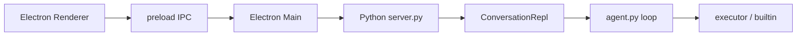

# Electron 桌面壳设计（DESKTOP）

> 版本 **0.4.0** · 2026-07-30  
> 状态：`doc` — **当前 UI 真源 = `shells/unified/`**（perspective: default | project | night）+ **`shells/pet/`**；旧 grow/daily/project/govern **已删除**。历史章节保留作设计溯源，标 **deprecated**。  
> 关联：[SHELL-CONSOLIDATION.md](./SHELL-CONSOLIDATION.md) · [UX-POLISH.md](./UX-POLISH.md) · [PROJECT-MODE.md](./PROJECT-MODE.md) · [PROJECT-SIDEBAR.md](./PROJECT-SIDEBAR.md) · [RUNTIME.md](./RUNTIME.md) · [BUGS.md](./BUGS.md) · `TASKS.md`

---

## 0. 当前形态（2026-07-30 · 已决）

| 表面 | 路径 | 说明 |
|------|------|------|
| **统一聊天壳** | `desktop/src/shells/unified/` | 唯一全功能工作台；`shell-router` 只挂载此壳 |
| **视角** | `data-perspective` | `default`（车间+过程块）· `project`（侧栏任务流）· `night`（暗色/Amp 手感，可选 starfield） |
| **伴侣窗** | `desktop/src/shells/pet/` | 默认入口；独立窗；backend 会话线仍可标 `daily` |
| **皮肤** | `desktop/src/skins/starfield/` | 自旧 daily 迁出 |
| **不再存在** | `shells/grow|daily|project|govern` | 代码已删；勿再引用为实现路径 |

**切壳 DOM / `ui.route` 硬切**：已退役。主题/项目切换在 **壳内**完成；后端 `active_shell` 仅作会话线标签（见 SHELL-CONSOLIDATION §0）。

---

## 1. 动机

### 1.1 现状

- 对话入口是 `agent-core/main.py` REPL：`input("you> ")` + `print()`（T-207）。
- Phase 7 已把 **编排内核**（ask/agent、explore 子代理、execute segment）往 Cursor 靠齐。
- **呈现层**仍停留在终端：无流式、选中复制别扭、confirm 打断输入体验——但 **不等于** 要在 UI 里展示进化仪表盘。

### 1.2 为什么要 Electron

| 选项 | 优点 | 缺点 | 结论 |
|------|------|------|------|
| 继续抛光 CLI | 零依赖、U 盘友好 | 备用入口 | 保留；**默认不用**，随时可切 |
| 浏览器 Web | 开发快 | 不像「桌面应用」；本地文件/托盘弱 | 可作 API 调试壳 |
| **Electron** | 真桌面、系统托盘、全局快捷键、可嵌 Web UI | 包体大 | **选用** |
| Fork VS Code | 编辑器能力强 | 等于做第二个 Cursor；违背定位 | **否决** |

### 1.3 和 Cursor 的关系（已决）

摘自 [PROJECT.md](./PROJECT.md) §2.3：**并存 + 可导入，不是替代 Cursor**。

桌面壳 **以 unified 为唯一工作台**（见 §0）；伴侣窗独立。历史「分阶段多壳」已合并。

---

## 2. 目标与非目标

### 2.1 目标

1. **统一工作台 + 伴侣窗**：聊天交互集中在 `unified`；差异用 perspective；pet 独立。
2. **用了再推进**：能力按真实使用打磨（见 UX-POLISH），不堆仪表盘。
3. **轻入口 + 内核复用**：Electron 只换 I/O；`agent.py` / `session.py` / `evolve.py` 不重写。
4. **交互顺手**：流式、**点击确认**（工具 confirm / proposal 均用按钮，**不**在输入框打 `y/n/a`）；键盘快捷键见 UX-POLISH。
5. **入口**：**默认 Electron**；`start.bat` / 菜单 **随时切 CLI**；不建议两界同时抢同一 session。

### 2.2 非目标（第一版不做）

| 非目标 | 理由 |
|--------|------|
| 长得像 Cursor / VS Code | 刻意差异化；不做 IDE |
| 内置完整代码编辑器 | 最多只读预览；编辑用外链或 Cursor |
| Cloud Agent / 多 worktree 并行 | 单人本地；后期再说 |
| 打包嵌入式 Python | M0 假设本机已有 Python 3.12+ |
| 替代 `my-agent tool run` CLI | 工具层仍走 T-112 |
| 自动 git commit | 同 EVOLVE 治理原则 |

---

## 3. 产品形态：统一壳 + 视角（核心）

> **§3.1～3.x 以下大量「grow/daily/project 分壳」叙述为 Phase 9～11 历史设计。**  
> **实现以 §0 + [SHELL-CONSOLIDATION.md](./SHELL-CONSOLIDATION.md) 为准。**

### 3.1 原则（现行）

| 原则 | 说明 |
|------|------|
| **一个聊天壳** | `unified` 承载全部聊天交互；差异用 **perspective**，不切 DOM |
| **pet 独立** | 伴侣是独立产品形态，不与聊天壳合并 |
| **旧版已删** | 不再保留 `shells/grow|daily|project|govern` 目录 |
| **主题路由 ≠ 切壳** | `activity_router` 可推荐主题；**不再**驱动前端切壳 |
| **会话线标签** | 后端 `active_shell` / `shell_sessions` 仍可区分会话归属（兼容 pet/历史数据） |

```text
desktop/src/shells/
  unified/   # 唯一全功能聊天壳
  pet/       # 伴侶期 — 默认入口（独立窗）
  chat-state.ts
desktop/src/skins/
  starfield/ # night 视角可选背景
```

**切换（现行）**：

- **视角**：外观/项目绑定驱动 `default` | `project` | `night`（见 settings · unified）
- **项目**：侧栏 / `project.switch`（[PROJECT-SIDEBAR.md](./PROJECT-SIDEBAR.md)）
- **新会话 / 会话列表**：顶栏按钮 + `session.refresh` / `session.list` / `session.open`（UX-018/020）
- **模型**：顶栏「模型」下拉 Flash / Pro → `session.set_model`（`deepseek-v4-flash` / `deepseek-v4-pro`）；`session.banner.llm_model` 同步
- **历史**：曾有顶栏「外壳」下拉 + `ui.route` 自动切壳（T-906）— **已移除**

### 3.2 Shell `grow` · 生长期（**deprecated · 能力并入 unified default**）

**历史定位**：指挥加 tool、过 proposal、试 `write_evolve`。现行由 `unified` + `perspective=default` 承担。

**布局（定稿 · 历史）**：

```text
┌─ my-agent ─────────────────────────────────────────────────────┐
│ ■ 当前：1 条 proposal 待接受 · tool-flatten-dir    [去处理]    │  ← 顶栏任务条
├────────────────────────────────────────────────────────────────┤
│                                                                │
│  （对话区：段落排版，无气泡、无 > 提示符）                         │
│                                                                │
│  点 [去处理] 后，顶栏下方展开（非侧栏）：                          │
│  ┌──────────────────────────────────────────────────────────┐  │
│  │ tool-flatten-dir                                         │  │
│  │ 摘要…                                                     │  │
│  │  [接受]  [拒绝]  [查看全文]  [下一条]                      │  │
│  └──────────────────────────────────────────────────────────┘  │
│                                                                │
│  工具 confirm：对话流内 **surface 块 + 可点按钮**（见 §3.2.1）          │
│                                                                │
├────────────────────────────────────────────────────────────────┤
│  输入消息…                                         [发送]      │
└────────────────────────────────────────────────────────────────┘
```

| 元素 | 策略 |
|------|------|
| 顶栏 | 一条当前最优先待办；**无待办时**一行 `text-muted`「**当前无待处理**」，不收起、高度不变 |
| 展开区 | 一次处理一项；`[下一条]` 切到下条 pending |
| 对话区 | 全宽；用户/助手可用小标题或缩进区分，**不用**聊天气泡 |
| 菜单 | `打开 evolve/tools/` 等放菜单/托盘，不占主界面 |
| 统计 | **无** |

**色系**：**P 纸白赭石** 默认；**R 暖夜** 后加 `theme` 切换（§9.3）。

**生长期不做**：侧栏待办、进化首页、终端风 REPL 窗（`repl` 壳可选保留，非默认）。

**回合模式（已定）**：Shell **`grow` 默认 `动手`（`turn_mode=agent`）**——与 `session.py` `DEFAULT_TURN_MODE` 一致；生长期要 `run_evolved` / 写 evolve。切 **只聊** 用输入 `只聊` 或菜单，写入 `meta.json` 续接仍有效。UI **不设** 顶栏模式 pill。

**新会话（已定 · 直接开聊）**：**CLI 与 Electron 一致**——`新会话` **不问 goal、不走 S2 主题确认**；`create_new` 即 **S4**，立刻可输入。

| 项 | 行为 |
|----|------|
| `goal.md` | 默认空；需要时用 `prompt_and_set_goal` 或日后 `目标 …` 命令（待定） |
| `topics` | 默认 `[]`；手动 `主题 workflow` / `换主题` / `注册主题`；**桌面自动路由**时内核 **加主题**（merge，不替换） |
| `phase` | 新建即 `S4` |
| 续接 | 沿用磁盘 goal / topics（RUNTIME §2）；**grow** 连接时 `session.history` 灌入聊天区（§5.2） |

`prompt_and_set_goal` **保留**（`session.py`），供测试或显式调用；**不再**在 `start_new_session` 默认路径触发。

#### 3.2.1 工具 confirm（**已定：点击，非输入 y**）

执行 `run_evolved` 等需确认时，在对话流插入与展开区 **同款** `surface` 块；用户 **点按钮**，不在底栏输入 `y` / `n` / `a`。

```text
│ ┌─ surface + border ─────────────────────────────────────┐ │
│ │ write_evolved · patch_file                             │ │
│ │ evolve/tools/workflow/flatten_dir/ …                   │ │
│ │  [同意]  [拒绝]  [本会话 workspace 均允许]              │ │
│ └────────────────────────────────────────────────────────┘ │
```

| UI 按钮 | 等价 REPL | 说明 |
|---------|-----------|------|
| **同意** | `y` | 执行本次 |
| **拒绝** | `n` | 跳过本次 |
| **本会话 workspace 均允许** | `a` | 仅 `workspace_only` evolved（同 TOOLS §6.3） |

- 点选后块 **收起或置灰**，不可重复点；结果一行 `text-muted` 即可（「已执行」/「已跳过」）。
- **可选增强**（非 M0）：按钮聚焦时 `Y`/`N`/`A` 快捷键仍可调 `confirm.response`，但 **不提示用户打字**。
- 底栏输入框 **始终用于发消息**；**confirm 等待期间禁用发送**（输入框灰显、发送钮不可点），点选后再恢复。

协议层仍发 `confirm.response` + `y|n|a` + `request_id`（§5.1）；仅 **呈现** 改为点击。

#### 3.2.2 过程可见 · 思考展示（**已定：要，两层**）

空等整段回复会显得闷；桌面壳在 **同一轮助手回复区域** 内展示 **过程**，仍不是仪表盘。

**两层来源（都真，不编造）**：

| 层 | 内容 | 来源 | 优先级 |
|----|------|------|--------|
| **A 运行过程** | 调了啥工具、segment 续跑 | **`tool.start`/`tool.end`**、`notice`（`explore.progress` **未实现** · 规划） | **M0/M1 必做** |
| **B 模型推理** | 模型思考链（若 API 有） | 流式 `reasoning_content` / reasoner 模型 | **M1+**，有则显示 |

**对话区示意（P 色系）**：

```text
│ 你                                                              │
│ 帮我在 workflow 下加一个按日期归档的 tool                         │
│                                                                 │
│ 助手                                                              │
│ ┌─ 过程 ─ text-muted · 略小字号 ─────────────────── [收起 ▾] ┐ │
│ │ 思考中…                                                       │ │  ← 仅 B 层有内容时显示标题
│ │ 需要先看清现有 workflow 工具再决定 patch 路径…                  │ │  ← reasoning.delta 流式
│ │ · list_dir  evolve/tools/workflow/                            │ │  ← A 层：等宽 · 开头
│ │ · read_file  evolve/tools/workflow/archive_by_date/tool.toml  │ │
│ │ · explore  子代理 3/8 轮…                                     │ │
│ └───────────────────────────────────────────────────────────────┘ │
│                                                                 │
│ 好，我看了现有工具结构，建议新增 archive_by_date…（assistant 流式）│
```

| 规则 | 说明 |
|------|------|
| **过程块位置** | 紧挨在该轮 **正式回答之上**；历史轮次过程 **默认折叠**，可点开 |
| **进行中** | 过程块 **展开**；行首 `思考中…` 或 `· tool_name` 用 `text-muted`；B 层无则 **不显示**「思考中」假文案 |
| **结束后** | 正式回答 `assistant.delta` 流式出现在过程块 **下方**；过程块 **自动收起**（用户可再点 `[展开]` 查看） |
| **样式** | 过程块 `surface` 浅底或仅左边线 + `text-muted`；**无** Cursor 式大卡片、无图标墙 |
| **与 confirm** | 过程块只记录 **已发生** 的 tool；**待 confirm** 的 tool 用 §3.2.1 按钮块，不重复进过程列表 |

**内核改动（预期）**：

- `llm_client`：支持 `stream: true`；若 message 含 `reasoning_content`，发 `reasoning.delta`（T-904b）。
- `agent.run_turn` / `server.py`：A 层过程由 **`tool.start`/`tool.end`** 驱动（**无**独立 `activity.line` emit；见 §5.2）。
- `messages.jsonl`：**默认仍只存** 最终 assistant 与 tool 消息；过程流 **可选** 不落盘（省体积），或落 `meta` 调试开关。

**设置（草案）**：`显示思考过程` 默认 **开**；关则仅流式正式回答 + confirm。过程块结束后 **自动收起**（**已定**）。

#### 3.2.3 运行态渐变（**已定 · 2026-07-12 · 全窗 v2**）

助手 **正在执行本轮**（思考 / 调工具 / 流式输出）时，进入 **`is-working`** 视觉态；轮次结束或进入 confirm 等待时恢复平静。

**两层联动**：

| 层 | 范围 | grow | daily |
|----|------|------|-------|
| **L1 全窗** | `.app-frame` + **app-chrome** 顶栏 | 赭石暖流 5s | 四色霓彩 3s |
| **L2 壳内** | `grow-shell` / `daily-shell` 子层玻璃化 | 顶栏/展开/对话/输入/状态 | 对话/胶囊输入/confirm |

L1 由 `agent-busy.ts` 在 `setAgentBusy(busy, shell)` + `setActiveShell(shell)` 时驱动；**染色色带跟当前可见壳**，避免切壳后顶栏仍用另一壳配色。

| 元素 | 行为 |
|------|------|
| **背景** | 全窗 + 壳体双层渐变流动；子面板 **高透明玻璃**（非仅底层变色） |
| **边框** | 内描边改为 **柔光扩散**（非硬 2px 线） |
| **顶栏 app-chrome** | busy 时半透明 + blur；下拉/按钮随色带 |
| **grow 顶栏 / 底栏** | proposal 条、composer、status 同步玻璃化 |
| **状态栏** | accent 加粗 / 脉冲（daily：`处理中…`） |

**生命周期（与 WS 事件对齐）**：

| 开始 | 持续 | 暂停 | 结束 |
|------|------|------|------|
| 用户发送 / `turn.start` | `reasoning.delta` · `tool.start/end` · `assistant.delta` | `confirm.request`（等用户点按钮） | `assistant.done` 且工具计数归零；或 `error` |
| 用户点 confirm 后继续 | 同上 | — | 同上 |

**约束**：不用青紫渐变（同 §9.3）；`prefers-reduced-motion: reduce` 时停流动，保留静态多色描边/底色。

**实现**：`desktop/src/shells/grow/` · `desktop/src/shells/daily/`（`.is-working`）；`desktop/src/app-chrome.css`（`.app-frame.is-agent-busy`）；`desktop/src/agent-busy.ts`（Renderer 同步 + Main 退出查询 §4.4.2）。

#### 3.2.4 停止本轮（**Phase 15 M0 implemented · [TURN-CONTROL.md](./TURN-CONTROL.md)**）

对标 Cursor **Stop**：用户可随时打断 in-flight 回合，**不必**杀 sidecar。

| 项 | 约定 |
|----|------|
| 按钮 | composer 行 **`发送` 左侧**「停止」；`isWorking()` 时可见（grow / project / daily 展开 / pet 展开） |
| 协议 | 客户端 `turn.cancel`；服务端 `_dispatch_inline`（**不经** `TURN_LOCK`） |
| 结束 | `turn.end` · `finish_reason: cancelled`；pending confirm → `confirm.done` · `choice: cancelled` |
| UI | 点击后「正在停止…」→「已停止」→ 2s 后「就绪」；composer **立即可输入** |
| 自动超时 | stall / 墙钟 / `LLMTimeoutError` → `finish_reason: timeout`；UI「已超时」→ 2s 后「就绪」（Phase 16 · [RUNTIME-GUARDS.md](./RUNTIME-GUARDS.md)） |
| 数据 | **不**回滚 `messages.jsonl`；未完成 tool → 下次 `Session.load` repair（BUG-005） |

**与 confirm 等待**：Stop **优先于**挂起的确认卡；旧卡标「已取消」，禁止永久「提交中…」（BUG-014）。

**确认超时（同期）**：`CONFIRM_TIMEOUT_SEC` 默认 **90s**（T-1403 · Phase 15；见 [TURN-CONTROL.md](./TURN-CONTROL.md)）。

### 3.3 Shell `daily` · 日用期 · **极致嗨（Amp）**

> 完整设计：[DAILY-SHELL.md](./DAILY-SHELL.md) **v0.3.1-draft**（Amp 已实现；星图/咖啡馆已否决）

**什么时候做**：evolve 基本够用，主要 **聊天 / workflow**（M2+；`TASKS.md` T-904g / **T-904i***）。

**实现进度**：**T-904i1–i9 done**（Amp 视觉 + 全窗染色 + grow 沉浸 + 柔化 UI）；**i6** 清理 starfield/constellation optional。

**已定方向（2026-07-12）**：**极致嗨** — 亮底高饱和、单栏、胶囊输入；busy 时 **全窗 + 壳内** 同步变色，色带/节奏 ≠ grow。

| 项 | 约定 |
|----|------|
| 气质 | 亮底霓彩、**冲**（与 grow 纸白车间区分） |
| 布局 | shimmer 底 + 居中对话列 + **胶囊**底栏；**无** proposal 顶栏 |
| busy | **全窗四色渐变**（3s）+ 壳内玻璃子层 |
| 过程块 | **默认不显示** |
| recall | 对话区聚焦最近 k 轮；**无**镜头缩放 |

```text
│ ░░ 亮底霓彩 shimmer，字大、干净 ░░░░░░░░░░░░░░░░░░░░░░░░░░░░ │
│  你                                                        │
│  这周先把项目跑起来                                          │
│  助手                                                        │
│  行，先看 Node 版本…                                         │
│  输入…                                          [发送]      │
```

切换到 `daily` 后，grow 的 proposal 顶栏 **不出现**；要审 proposal 切回 `grow`。

~~已否决~~：星图、深木咖啡馆（见 DAILY-SHELL §1）。

### 3.3.6 Shell `pet` · 伴侶（**M0 · 2026-07-12**）

> **默认入口**：开机右下角 **伴侶光球**蹲守；窄聊天气泡；重活进 **工作台**（原 grow/daily/project 全窗）。

**姿态（已定）**：

| 项 | 约定 |
|----|------|
| 主价值 | **有个伴** — 蹲在旁边，不抢主屏 |
| 聊天 | 点击光球展开 **~340px 窄气泡**，可打字；后端走 `daily` 壳 WS |
| busy | 光球轻动画（idle / listening / busy / nudge）；**不**全窗 `is-agent-busy` 染色 |
| confirm | 气泡内小卡片；`confirm.request` 时自动展开 |
| 关窗 | 点 X **缩托盘**，不杀 sidecar |
| 工作台 | 托盘 / 气泡内「工作台」/ 原全窗壳；关工作台回伴侶 |
| WS | 伴侶与工作台 **互斥连接**（`session:control` suspend/resume） |

#### DOC-01 · pet→daily 会话映射（**已定 · T-1806-doc-01**）

| 层 | 值 |
|----|-----|
| UI 壳 | `pet`（光球 / 气泡） |
| Backend / `shell.switch` | **`daily`**（`BACKEND_SHELL = "daily"`） |
| `shell_sessions` 键 | **`daily`**（与工作台日用 **共用** `session_id`；**无** `pet` 键） |
| 历史 / 拖放 | 同 `data/sessions/<daily_id>/` · `_drops/<daily_id>/` |

完整表与三线对照见 [PET-SHELL.md](./PET-SHELL.md) **§1.3**。壳分线总览见 §3.9.2。

**窗口（参考 code-pet MIT `window-manager.js`）**：

```text
收起：120×120 透明 · 右下角 · click-through · always-on-top
展开：340×480 · 气泡 + 输入 + confirm
```

实现：`desktop/pet.html` · `desktop/src/pet-main.ts` · `desktop/src/shells/pet/` · `electron/main.ts` 双窗。

**M1 规格**：[PET-SHELL.md](./PET-SHELL.md) v0.2.1（M1 done · DOC-01）。

### 3.3.5 Shell `project` · 项目期（**M3 done**）

> 完整协议与计划门见 [PROJECT-MODE.md](./PROJECT-MODE.md)。此处仅桌面行为摘要。

| 项 | 约定 |
|----|------|
| 布局 | 左侧栏（项目列表 + 计划卡 + 任务/地图 + 验收）+ 右侧 grow 聊天区 |
| 侧栏 **我的项目** | `project.list`；每项显示进度与 **当前 / 可续接 / 新建会话** |
| 切换 | 点击 → `project.switch`；跨项目且当前已绑定时 **确认切换** 卡（`project.switch.request`） |
| 续接 | 一会话一项目：`data/state.json` · `project_sessions`；切换后 `session.history` **替换**聊天区 |
| 忙时 | 助手执行中禁止切换（与关窗确认共用 `agent-busy`） |
| 视觉 | 蓝图色系 `project.css`；`data-busy-shell=project` 蓝绿全窗渐变 |

实现：`desktop/src/shells/project/` · `project_api.py` · `project_switch.py`。

### 3.4 Shell `govern` · 治理期（占位，后做）

**什么时候做**：你开始定期跑 `review` / `audit`，想 **读报告** 而不是聊天。

```text
┌────────────────────────────────────────┐
│  [治理]  ReviewReport 2026-07-10       │
│  ─────────────────────────────────     │
│  suspect: tool foo (streak 3)          │
│  llm_findings: …                       │
│  [在生长壳中处理]  [导出]  [关闭]        │
└────────────────────────────────────────┘
```

可与对话同窗口 **Tab 切换**，或独立小窗；**实现时再定**。

### 3.5 Shell `repl` · REPL 窗（可选保留）

与 `main.py` **1:1 信息量** 的图形终端；无右侧栏。给「只想换个好看终端」或调试用的 **永久备选 Shell**。

### 3.6 阶段与里程碑对应

| Shell | 何时实现 | 触发条件（建议） |
|-------|----------|------------------|
| `grow` | **M0–M2 首选** | 现在：正在加 tool / 审 proposal |
| `daily` | **M2 done** | 活动路由 / 手动切换；Amp 壳可用 |
| `project` | **M3 done** | `workspace/<id>/` 做产物；侧栏切换续接专用会话 |
| `govern` | 更晚 | 开始周期性 review |
| `repl` | 任意 | 需要 CLI 等价图形时 |

### 3.8 入口：Electron 默认 · 可切 CLI（**已定**）

| 项 | 约定 |
|----|------|
| **默认** | 双击 `start-desktop.bat` = **Electron + grow**；运行中可 **最小化**，托盘/快捷键可唤回 |
| **CLI** | `start.bat` 或托盘 **「改用终端 (CLI)」**；与 REPL 行为一致 |
| **切换** | 随时可切；**切换 = 换界面，不是两开对讲** |
| **并存** | **不建议** Electron 与 CLI 同时对同一 `session` 发消息；后开者提示先关另一侧或「接管会话」 |
| **关窗** | 伴侶 / 工作台点 **X** = **缩托盘**（sidecar 常驻）；托盘 **退出** = 杀 sidecar（2026-07-12 pet M0） |

**切换到 CLI（草案）**：

1. 托盘 / 菜单 → **改用终端 (CLI)**
2. Electron 释放会话锁（§4.5）→ 用系统终端启动 `agent-core/main.py`（工作目录 = agent 根）
3. Electron **缩到托盘并停 sidecar**（窗口仍驻留，可托盘/快捷键再打开；与 **关窗退出** 不同）

**从 CLI 回到 Electron**：关终端 REPL 或 `exit` 后开桌面；若 CLI 仍占锁，Electron 启动时提示 **「终端正在占用会话，是否让桌面接管？」**

**持久化**：`data/state.json` 增加 `preferred_ui: "electron" | "cli"`，默认 **`electron`**（仅记录偏好，不阻止手动 `start.bat`）。

**`my-agent tool run`**：与界面无关，随时可用（T-112）。

#### 3.8.1 DOC-08 · Windows CLI 编码策略（**已定 · T-1824-02 / S-50**）

中文 Windows 默认控制台多为 **CP936（GBK）**。裸跑 `python agent-core\main.py` 时 `sys.stdout.encoding` 常为 **gbk**，中文 banner / 锁提示在部分终端或按 UTF-8 捕获时会乱码。

| 项 | 约定 |
|----|------|
| **推荐入口** | 仓库根目录 **`start.bat`**（或托盘「改用终端」走同一策略） |
| **强制** | `chcp 65001` + `PYTHONIOENCODING=utf-8` + `PYTHONUTF8=1` |
| **验收** | PowerShell / cmd 下 CLI 中文命令行、banner、`interface_lock` 提示无乱码（S-50） |
| **勿依赖** | 裸 `python …\main.py`（无上述 env 时仍可能 GBK） |
| **运维捕获** | 避免 PowerShell `Tee-Object` 重编码；探针/日志用脚本写 **UTF-8 文件** |
| **磁盘日志** | sidecar `data/logs/sidecar-*.log` 已是 UTF-8（§4.4.3）；与本策略独立 |
| **Electron spawn** | `startSidecar` 强制 `PYTHONIOENCODING=utf-8` + `PYTHONUTF8=1`（**T-1824-03**）；stdout/stderr 按 UTF-8 解码 |

对照调查矩阵：[stabilization-log.md](./stabilization-log.md) · T-1824-01；平台面 [STABILIZATION.md](./STABILIZATION.md) §3.11。

### 3.9 Activity Router · 活动路由（**已定 · T-906**）

**目标**：用户在干什么，就自动进入对应 **外壳 + 主题**——不必手选下拉。

```text
用户输入 / 连接续接
  → agent-core/activity_router.py（规则表，P1）
  → apply_route_topics（加主题，等同 REPL「加主题」）
  → emit ui.route +（topics 变更时）session.banner
  → desktop/main.ts 切壳（未锁定）+ 顶栏提示
```

#### 3.9.1 推断规则（初版）

| 信号 | `shell` | `topics`（追加） |
|------|---------|------------------|
| pending proposal > 0 | `grow` | — |
| `proposal` / `proposals` | `grow` | — |
| `execute` + 造/写工具、`write_evolve`、`tool.toml`… | `grow` | `coding` / `workflow` / `data`（看路径或工具名） |
| `research` + `evolve/tools` / 探索 | `grow` | 路径推断 scope |
| `sort_by_extension` 等 workflow 工具名 | `daily` | `workflow` |
| `qa` / `recall` / `plan` | `daily` | — |
| review / audit / 治理 | `govern` | — |
| 续接且 `meta.topics` 含 `coding` | `grow` | — |
| 续接有其他 topics | `daily` | — |

模糊句 **P2** 再走 `router.py` LLM topic 提议；**P1** 仅规则。

#### 3.9.2 壳保活与会话分线（T-906a · T-1116）

| 项 | 约定 |
|----|------|
| DOM | `desktop/src/main.ts`：每 `ShellId` 一个 `.shell-host`，`hidden` 切换 |
| 会话 | 切壳发 **`shell.switch`** → sidecar 换 `repl.session`（`shell_sessions` + `project_sessions`） |
| 三线 | `shell_sessions` 仅 **grow / daily / project**；伴侶窗 **复用 daily**（DOC-01 · [PET-SHELL.md](./PET-SHELL.md) §1.3 · §3.3.6） |
| 聊天区 | 仅**活跃壳**处理 `session.history` / 流式事件；切回该壳时由 `shell.switch` 重灌 |
| 跨壳查阅 | 不混 prompt；`project_catalog` + `read_file data/sessions/<id>/messages.jsonl`（非当前会话 confirm） |

#### 3.9.3 与手动命令关系

| 行为 | 自动路由 | 手动 |
|------|----------|------|
| 外壳 | `ui.route.shell` | 顶栏下拉；锁定后忽略 `ui.route` |
| 主题 | `加主题` merge | `主题 …` 仍 **替换**；`加主题` / `换主题` 仍走 REPL 语义 |

实现：`activity_router.py` · `agent.run_turn` · `server.py`（连接 / `session.refresh`）· `desktop/main.ts` · `app-chrome.ts`。

### 3.10 托管区设置（T-1008，已实现）

> 设计细节：[HOST-SCOPE.md](./HOST-SCOPE.md) §6.4 · §7.2 · 验收 [TASKS.md](./TASKS.md) §T-1008。

| 项 | 约定 |
|----|------|
| 入口 | 顶栏 **托管区**（`app-chrome.ts` → `host-settings.openSettings()`） |
| 实现 | `desktop/src/host-settings.ts` · `host-settings.css` |
| 首次向导 | `wizard_suggested` 时弹层：勾选 **下载 / 桌面** + **只读 / 读写** |
| 添加 | Electron `pickDirectory` → 填 `host:id` 与权限 → UI 确认 |
| 改动 | **开启写** / **关闭写** / **更换文件夹**（`host_scope.repath`）/ **删除** |
| 数据 | `data/host_scope.json`（与 CLI `托管目录` 共用；gitignore） |
| preload | `pickDirectory` · `getDownloadsPath` · `getDesktopPath` |

**与对话**：只读可 `host_list` / `host_read`；整理（`sort_by_extension` 等）须对应 root `write: true`。

### 3.7 与 REPL 命令映射（按 Shell）

| REPL 命令 | `grow` | `daily` | `govern` |
|-----------|--------|---------|----------|
| （默认） | 续接；顶栏显示当前待办 | 续接，无顶栏 | 打开最近 report |
| `新会话` | **直接开聊**（无 goal/S2）；托盘/菜单 | 同左 | — |
| `只聊` / `动手` | 输入或菜单切换 | 同左 | — |
| `proposals` | 顶栏 `[去处理]` / 展开队列 | 切 `grow` 或命令 | — |
| `proposals accept/reject` | 展开区内按钮 | 同左 | — |
| `记住 …` / 检查点 | 顶栏更新 + 展开区或行内 confirm | 仅对话 | — |
| `外壳 日用` 等 | 切换 Shell | 切换 Shell | 切换 Shell |
| `exit` | 关窗 **退出**（忙时确认，§4.4.2） | 同左 | 同左 |

---

## 4. 技术架构

### 4.1 总览

```text
┌──────────────────── desktop/ (Electron) ────────────────────┐
│  Renderer：按 `active_shell` 加载 `shells/*`                 │
│       ↕ IPC（preload 白名单）                                 │
│  Main：窗口、托盘、快捷键、spawn/kill Python sidecar          │
└──────────────────────────┬──────────────────────────────────┘
                           │ WebSocket 127.0.0.1:8765（默认；`MY_AGENT_WS_PORT` 可覆盖）
┌──────────────────────────▼──────────────────────────────────┐
│  agent-core/server.py  [新增]                               │
│    · 包装 ConversationRepl（main.py 已有逻辑）               │
│    · 事件流：token / tool / confirm / session / evolve       │
│  agent.py · session.py · evolve.py · tools/*  [现有，少改]   │
└─────────────────────────────────────────────────────────────┘
```



### 4.2 目录规划（草案）

```text
my-agent/
├── agent-core/
│   ├── main.py              # CLI REPL（保留）
│   ├── server.py            # [新增] 本地 WS API
│   └── ...                  # 现有内核
├── desktop/                 # [新增]
│   ├── package.json
│   ├── electron/
│   │   ├── main.ts          # 窗口 + sidecar 生命周期
│   │   └── preload.ts       # 安全 IPC 桥
│   └── src/
│       ├── shells/
│       │   ├── grow/        # M0 先做
│       │   ├── daily/       # 日用 Amp（T-904i）
│       │   ├── project/     # 项目期（T-1105～T-1113）
│       │   ├── chat-state.ts # grow/daily/project 共用 WS 聊天状态机
│       │   ├── govern/      # 占位
│       │   └── repl/
│       ├── shell-router.ts  # 读 active_shell，挂载对应壳
│       └── api/ws.ts
├── start.bat                # CLI（备用；默认不主推）
└── start-desktop.bat        # **默认入口** → Electron
```

### 4.3 窗口与系统菜单（**已定 · 2026-07-12**）

| 项 | 约定 |
|----|------|
| **系统菜单** | Windows/Linux：**无** File/Edit/View/Help 栏（`Menu.setApplicationMenu(null)`） |
| **macOS** | 保留最小应用菜单（仅「退出」），符合平台惯例 |
| **操作入口** | 自定义 **app-chrome** 顶栏 + 托盘右键 + `Ctrl+Shift+M` |
| **窗口** | `autoHideMenuBar: true`；标题栏仍显示 `my-agent` 与系统最小化/关闭钮 |

### 4.4 Sidecar 生命周期

1. Electron `app.ready` → spawn `python agent-core/server.py --port 8765`（默认；可用环境变量 `MY_AGENT_WS_PORT` 覆盖）。
2. **编码（T-1824-03）**：spawn env 强制 `PYTHONIOENCODING=utf-8` + `PYTHONUTF8=1`（与 CLI `start.bat` / DOC-08 对齐），避免 Windows CP936 下中文 `port_in_use` / `lock_conflict` 经 `chunk.toString("utf-8")` 乱码。
3. sidecar stdout 打印一行 JSON：`{"ready": true, "host": "127.0.0.1", "port": 8765}`。
4. Renderer 经 preload `getSidecar()` 取 host/port，连 `ws://127.0.0.1:<port>`；断线后重连并重新 `getSidecar()`。
5. **关窗 / 托盘「退出」** → 见 §4.4.2（真退出 + 忙时确认）→ `before-quit` 杀 sidecar。
6. **已决（2026-07-11）**：sidecar 意外退出时 Electron **自动重启** Python；固定端口便于 WS 重连。
7. **仍 defer**：多窗口共用一个 sidecar。

#### 4.4.1 开发模式（`npm run dev`）

- `vite-plugin-electron` 默认在 Electron 退出时 `process.exit` 拖垮 Vite → **已定制 `onstart`**：Electron **异常退出**后 1.5s 自动重启；**用户关窗**（exit code `100`）→ **整包 dev 退出**（Vite + Electron + sidecar）；其它 `code=0` 不 respawn；dev 进程保持运行。
- Vite `server.watch.ignored` 排除 `../agent-core`、`../data`、`../evolve`，避免 Agent 写盘触发无关热更新。
- 详见 [BUGS.md](./BUGS.md) BUG-002、BUG-003。

#### 4.4.2 退出与忙时确认（**已定 · 2026-07-12**）

| 操作 | 行为 |
|------|------|
| 窗口 **X** | **退出** Electron 进程；销毁托盘；`stopSidecar()` |
| 托盘 **退出** | 同上 |
| 助手 **仍在跑**（§3.2.3 `is-working`） | 弹窗：**「助手仍在执行任务」**；默认 **[继续等待]**；选 **[仍要退出]** 才杀进程 |
| **confirm 等待**（用户须点按钮） | **不算**在跑，可直接退出 |
| **改用终端 (CLI)** | 不关 Electron 进程；释放锁、停 sidecar、**隐藏窗口**（可再托盘打开） |

Main 经 `webContents.executeJavaScript('window.__myAgentIsBusy?.()')` 读 Renderer 的 `agent-busy.ts`（**任外壳** busy 即 true；grow/daily 在 `syncWorkingVisual` / `syncShellState` 时按壳上报）。

```text
用户点 X / 托盘退出
  → main: isAgentBusy?
  → 若 true：dialog [仍要退出 | 继续等待]（default 继续等待）
  → performAppQuit：quitting=true → destroy tray → stopSidecar → app.quit()
```

#### 4.4.3 Sidecar 日志落盘（**已定 · Phase 18 T-1805-01**）

| 项 | 约定 |
|----|------|
| 目录 | `<agent_root>/data/logs/`（自动创建；**不进 Git**） |
| 文件名 | `sidecar-YYYYMMDD.log` — **本地日历日**一条（非 UTC 强制） |
| 代码 | `agent-core/sidecar_logging.py` · `sidecar_log_path(paths)` |
| Logger 名 | `my_agent.sidecar`（`RotatingFileHandler` · T-1805-02/05） |
| 格式 | `%(asctime)s %(levelname)s %(message)s` · UTF-8 · append |
| stdout | 保留 `{"ready": true, ...}` 单行 JSON；**不**把 WS 事件流写入日志 |
| 轮转 | 单文件 **≥10MB** 自动轮转（`SIDECAR_LOG_BACKUP_COUNT=5` → `sidecar-YYYYMMDD.log.N`） |
| 用途 | sidecar 崩溃 / 未捕获异常后取证；见 [STABILIZATION.md](./STABILIZATION.md) §3.10 |

CLI `main.py` **不**写此文件（仅 Electron / `server.py` sidecar）。

### 4.5 安全边界

- WebSocket **仅 bind 127.0.0.1**，不暴露局域网。
- preload **禁止** Renderer 直接 `require('child_process')`。
- 工作区路径由 sidecar 的 `AgentPaths` 解析，UI 只展示不任意拼接。
- **待定**：是否要做本地 token（防其他进程连同一端口）。

### 4.6 会话锁（Electron ↔ CLI）

避免 `messages.jsonl` 双写（§3.8）：

```text
data/sessions/.interface.lock   # { "ui": "electron"|"cli", "pid": N, "since": ISO }
```

| 场景 | 行为 |
|------|------|
| Electron 启动 | 无锁或 stale → `ui=electron`；活锁 `cli` → 提示是否 **接管** |
| CLI `main.py` | 无锁或 stale → `ui=cli`；活锁 `electron` → 提示；可选 `--takeover` |
| **改用终端** | Electron 释放锁 → 启 CLI → **隐藏窗口**并 **停 sidecar**（进程可驻留托盘） |
| stale | pid 已死 → 可抢锁 |

**M0**：仅打印警告；**M1**（T-904i）：硬锁 + 接管确认。

---

## 5. 通信协议（粗糙）

> 第一版倾向 **WebSocket + JSON 事件**；REST 仅用于健康检查（可选）。

### 5.1 客户端 → 服务端

| type | 说明 | 对应现有 |
|------|------|----------|
| `user.message` | 用户一行/多行输入；**含**聊天框发的 REPL 元命令（`新会话`、`压缩` 等）；可含 `{ attachments: [id…] }`；纯附件可空 `text` | `handle_line` · `file_stage.compose_user_message` |
| `command` | 结构化命令（托盘/菜单/程序化；与 `user.message` 元命令等价） | `新会话`、`压缩` 等 |
| `confirm.response` | `y` / `n` / `a` + `request_id` | `executor` confirm；**UI 由按钮映射，用户不输入字母** |
| `turn.cancel` | 打断当前 in-flight 回合（**Phase 15**） | `WsBridge.request_cancel` · 见 [TURN-CONTROL.md](./TURN-CONTROL.md) |
| `session.list` | 拉会话列表 | `data/sessions/*` |
| `session.open` | 切换 session id | `resume_or_create` 变体 |
| `session.refresh` | 重推会话状态 + `ui.route`（grow 挂载 / 重连） | `emit_session_state` + `compute_session_route` |
| `session.set_model` | 切换会话模型 `deepseek-v4-flash` / `deepseek-v4-pro`；忙时拒绝；Pro→Flash 超 Flash×85% 拒绝（须先压缩/新会话） | `validate_llm_model_switch` + `Session.set_llm_model` + banner |
| `proposal.accept` / `reject` | 审阅 proposal | `evolve.py` |
| `shell.switch` | `{ shell: grow\|daily\|project\|govern, project_id? }` 切壳并换专用会话 | `shell_switch.switch_shell` |
| `host_scope.list` | 拉托管区配置 | `host_scope_api` |
| `host_scope.add` | `{ host_id, path, write?, label? }` | 设置页添加 |
| `host_scope.remove` | `{ host_id }` | 设置页删除 |
| `host_scope.write` | `{ host_id, write }` | 开启/关闭写 |
| `host_scope.repath` | `{ host_id, path }` | 更换绑定文件夹 |
| `host_scope.wizard` | `{ entries[] }` 或 `{ skip: true }` | 首次向导 |
| `project.list` | 拉 workspace 项目列表（含 `session_id` · `is_current`） | `project_api.project_list_payload` |
| `project.state` | 刷新当前绑定项目侧栏 | `project.state` 事件 |
| `project.open` | `{ project_id }` 在当前会话打开（须未绑其他项目） | `open_project_on_session` |
| `project.switch` | `{ project_id, confirm?, request_id? }` 切换项目专用会话 | `perform_project_switch` |
| `plan.response` | `{ request_id, choice: confirm\|edit }` | 计划确认卡 |
| `project.verify` | 一键验收（须 `confirmed`） | `run_acceptance_check` |
| `file.stage` | `{ paths[], shell? }` 拖入暂存；project 壳 → `<project_root>/_incoming/` | [FILES-DROP.md](./FILES-DROP.md) |
| `file.unstage` | `{ attachment_id }` 发送前移除 chip | — |

### 5.2 服务端 → 客户端（事件流）

| type | 说明 |
|------|------|
| `session.banner` | 续接信息、goal 摘要、topics、turn_mode |
| `session.memory` | `message_count` · `memory_mode_label`（+ 已压缩时 `keep_turns`） |
| `session.history` | 续接时灌入聊天区：`user` / `assistant` 可见行（跳过锚定、tool、内核提醒、连续重复 user） |
| `session.list` | 入站 `session.list` 的应答：`session_ids` |
| `turn.start` | 每轮意图：`intent` + `intent_label`（**默认显示**于顶栏） |
| `ui.route` | **T-906**：建议/驱动外壳 + 当前 topics；`auto: true` 时桌面自动切（可锁定） |
| `turn.notice` | 压缩进度、首次压缩教育、偏航提醒（**不落盘**） |
| `turn.end` | 回合线程退出：`ok` · `finish_reason`（`completed` / `error` / **`cancelled`** / **`timeout`** / **`task_paused`**）；桌面 `resetTurnActivity` + 状态文案（`cancelled`→已停止，`timeout`→已超时，`task_paused`→本项已完成） |
| `checker.verdict` | checker 监工结论：`tool_name` · `verdict`（`pass`/`fail`/`warn`）；见 [CHECKER-SUBAGENT.md](./CHECKER-SUBAGENT.md) |
| `assistant.delta` | 流式 token（**正式回答**） |
| `assistant.done` | 一轮结束；含完整文本引用（可选） |
| `reasoning.delta` | 流式推理（**B 层**；模型无则不发） |
| `tool.start` | 工具名、参数摘要、call_id（**A 层过程**；无独立 `activity.line`） |
| `tool.end` | 结果摘要、success、落盘路径（若有 spill） |
| `confirm.request` | 待确认工具；带 `request_id`；客户端 **禁用底栏发送** |
| `confirm.done` | 用户已点选；`choice` 含 `y`/`n`/`a`/`timeout`/`stale`/**`cancelled`**；客户端 **恢复底栏** |
| `prompt.request` | REPL/`input_fn` 等待用户一行输入（`prompt` 文案） |
| `shell.switch.done` | 切壳完成：`shell` · `session_id` · `session_replaced`（**出站**；非入站） |
| `evolve.proposals` | pending 列表（**grow** 壳消费） |
| `project.list` | workspace 项目列表（`session_id` · `is_current` · 任务进度） |
| `project.state` | 当前绑定项目的侧栏状态（`TASKS.md` · `MAP.md` · 计划态 · 验收） |
| `project.switch.request` | 跨项目切换须确认（`message` · `action` · `needs_confirm`） |
| `project.switch.done` | 切换完成（`session_id` · `session_replaced`） |
| `plan.request` / `plan.done` | 计划确认卡请求与结果 |
| `project.verify.done` | 验收 `run_python` 结果 |
| `host_scope.state` | 托管区列表 + `wizard_suggested`（连接后 `list` 或变更后 `updated`） |
| `host_scope.updated` | 配置变更后全量状态（同 `state` 载荷） |
| `notice` | 压缩、segment 续跑等提示 |
| `error` | LLM / 工具 / 协议错误 |
| `file.staged` | 暂存成功：`items[]`（`id` · `name` · `ref` · `readable_text`） |
| `file.unstaged` | chip 已移除 |
| `file.error` | 单文件暂存失败（不阻断同批其它文件） |

**未实现 / 规划（不在当前 wire 合同；实现 defer）**：

| type | 说明 |
|------|------|
| `activity.line` | 曾设想的 A 层单行过程；**现由 `tool.start`/`tool.end` 覆盖**（T-1813-03 D-02） |
| `explore.progress` | 子代理轮次 / 摘要片段；放行后按 [STABILIZATION.md](./STABILIZATION.md) P1/IT-14 另开任务（T-1813-03 D-03） |

**连接顺序（已定）**：`session.banner` → `session.memory` → **`session.history`** → `evolve.proposals` → **`ui.route`**（续接推断）。

#### 5.2.1 `session.history`（T-905d，已实现）

桌面 **不** 直接读 `messages.jsonl`；由 sidecar `session.build_session_chat_history()` 过滤后推送：

| 项 | 约定 |
|----|------|
| 载荷 | `{ "type": "session.history", "items": [{ "role": "user"\|"assistant", "text": "…" }, …] }` |
| 时机 | `emit_session_state`（连接 / 续接 / **`session.refresh`** / **`project.switch` 会话替换** / REPL 元命令 **`新会话`·`换主题`·`压缩`**）；**替换** grow / project 聊天区 `blocks`（非追加） |
| 包含 | `role: user` / `assistant` 且 `content` 非空 |
| 跳过 | 锚定块 `[本次会议上下文]` · `[内核]…` · `role: tool` · 仅 `tool_calls` 无文字的 assistant |
| 去重 | **连续**相同 user 文本只保留一条（重连重复发送） |
| 不含 | tool 过程行、reasoning 流（历史轮过程默认不恢复；见 §3.2.2） |

与 `session.memory` 分工：**memory** = 条数/压缩元数据（顶栏）；**history** = 用户可见对话正文（聊天区）。

实现：`session.py` · `build_session_chat_history` / `session_history_event` · `context.py` · `session_memory_event` · `server.py` `emit_session_state` + `_repl_refreshes_session_state` · `project_api.py`（`project.switch` 会话替换时亦推送 memory+history）· `chat-state.ts` `resetTurnActivity` on banner/history · `grow/index.ts` · `project/index.ts` case `session.history`。

**REPL 元命令与忙碌态（BUG-007）**：桌面聊天发 `新会话` 等走 `user.message`，发送时前端 `beginTurnActivity()`。sidecar 须在 `_run_line` 后对元命令 **`emit_session_state`**；前端 `session.banner` / `session.history` 须 **`resetTurnActivity()`**，否则状态栏永久「处理中…」。`_print_session_banner` 的 `--- session …` 文本 **不**下发 WS（仅 CLI）。

#### 5.2.2 `ui.route`（T-906，已实现）

| 项 | 约定 |
|----|------|
| 载荷 | `{ "type": "ui.route", "shell": "grow"\|"daily"\|"govern"\|"project", "topics": [...], "topics_added": [...], "reason": "…", "auto": true }` |
| 时机 | WebSocket 连接；`session.refresh`；每轮 `turn.start` 后（`agent.run_turn`） |
| 主题 | 内核已 `加主题` merge；`topics_added` 供顶栏提示 |
| 桌面 | 未锁定 → 切 `shell` + 提示「已切到 …」+ **撤销**；锁定 → 忽略 `auto` |
| CLI | 不消费；行为同 REPL，仅多自动 `加主题` |

实现：`activity_router.py` · `agent.py` · `server.py` · `desktop/main.ts` · `app-chrome.ts`。

### 5.3 流式 LLM · Phase 15 闭环（T-1813-04）

- **已实现（T-904d）**：`llm_client.chat(..., stream=StreamHandlers)`；桌面经 `WsBridge.emit_content_delta` / `emit_reasoning_delta` 推 `assistant.delta` / `reasoning.delta`。
- 流式 HTTP **错误**须 `response.read()` 再解析（见 [BUGS.md](./BUGS.md) BUG-004）。
- **Phase 15（已实现 · 勾选与代码一致）** — 见 [TURN-CONTROL.md](./TURN-CONTROL.md) · [BUG-014](./bugs/2026-07-13-turn-stall-no-stop.md)：
  - [x] `turn.cancel` + 四壳 Stop 按钮（T-1402～T-1405）
  - [x] `CONFIRM_TIMEOUT_SEC` 默认 **90s**（T-1403；非 3600s）
  - [x] LLM 流式协作取消（T-1404）

### 5.4 ConversationRepl 改造点

`main.py` 里 `ConversationRepl` 已支持注入 `input_fn` / `output_fn`：

```python
# 实现：server 侧（WsBridge）
def confirm_fn(preview, allow_approve_all) -> str:
    # emit confirm.request；工作线程阻塞在 queue
    # confirm.response 必须由独立 asyncio 任务处理（不可卡在 async for 的 await 回合上）
    ...
```

**已决（2026-07-11）**：

- [x] `output_fn` / `StreamHandlers`：assistant 流式、`tool.start`/`tool.end`、notice 分流（T-904d）
- [x] confirm：工作线程阻塞 + `confirm.response` 走 `asyncio.create_task(_handle_incoming)`，避免 WS 读循环死锁（见 [BUGS.md](./BUGS.md) BUG-002）
- [x] 残缺 `tool_calls` 历史：`context.repair_orphaned_tool_calls` 在 `Session.load` / `build_llm_messages` 自动修复（BUG-005）

**已决（2026-07-13）** — 见 [CONFIRM-PIPELINE.md](./CONFIRM-PIPELINE.md) · [BUG-008](./bugs/2026-07-13-confirm-pipeline-stuck.md)：

- [x] `confirm_fn` 错 `request_id` 不得无限空转；超时须 `confirm.done`
- [x] 桌面确认卡防重入；状态栏与 `isWorking` 一致
- [x] `turn.end` 对称 `turn.start`；executor 保证 `tool.end`

**已决（2026-07-13 · Phase 15）** — 细节与勾选见 **§5.3**；smoke：S-05 / S-25 / S-26。

### 5.5 稳定化 smoke（Phase 18 · T-1801-xx/T-1820-xx）

全表面与分档见 **[STABILIZATION.md](./STABILIZATION.md) v1.0 §3～§5**：**P0 清单 = §5.1**（S-01～S-17、S-48：grow/project/**daily/pet**/忙时退出/LLM 异常）、**P1 清单 = §5.2**（S-11、S-15、S-18～S-46：host/evolve/checker/路由等）。执行项见 [STABILIZATION-TASKS.md](./STABILIZATION-TASKS.md) M1-A（P0）/ M2-A～C（P1/P2）。每次发版或大批量修 bug 后：

1. 完全退出托盘/Electron → `start-desktop.bat` 冷启动  
2. 先跑 **P0**（STABILIZATION §5.1），再跑 **P1**（§5.2）；结果记入 **[stabilization-log.md](./stabilization-log.md)**  
3. P0 连续 3 次全 pass + Gate 测试绿 → 可申请 Phase 18 放行（STABILIZATION §11 / T-1890-xx）

---

## 6. 技术选型（待定）

| 层 | 候选 | 备注 |
|----|------|------|
| Electron | 最新 LTS | 已定 |
| UI 框架 | Svelte / Solid / React | **待定**；倾向轻量、非 VS Code 生态 |
| 样式 | Tailwind + 自定义 token | **待定**主题色 |
| Python WS | `websockets` | **已定**（`requirements.txt`）；读循环与回合处理解耦 |
| 打包 | electron-builder | 后期；M0 不打包 |
| 类型 | 前后端共享 JSON Schema？ | **待定** |

---

## 7. 里程碑（粗糙）

| 阶段 | 交付 | 验收（草案） |
|------|------|--------------|
| **M0** | `server.py` + Shell **`grow`** | 顶栏 + 点击 confirm + **A 层过程行**（tool 简写，可非流式） |
| **M1** | 流式正式回答 + **B 层 reasoning（若模型有）** + 过程块折叠 + R 暗色 | Shell 切换骨架 |
| **M2** | Shell **`daily` · Amp**（见 [DAILY-SHELL.md](./DAILY-SHELL.md)） | 亮底霓彩 + 全窗 busy + 单栏能聊；grow 可切回 |
| **M3** | 托盘、快捷键、`start-desktop.bat` | 默认 shell 可配置 |
| **M4+** | **`govern`** 读 review 报告 | 按需 |

**不纳入 M0–M3（defer）**：嵌入式 Python、自动更新、多窗口、主题商店。

---

## 8. 任务拆分（对应 TASKS）

| ID | 任务 | 依赖 | 状态 |
|----|------|------|------|
| T-904 | 桌面壳总览 | Phase 7 done | done |
| T-904a | `server.py` WS + `ConversationRepl` 适配 | T-207 | done |
| T-904b | `llm_client` 流式 + `reasoning.delta`（可选） | T-201 | done |
| T-904c | `desktop/` 脚手架 + Shell **`grow`** M0 | T-904a | done |
| T-904d | 顶栏 + confirm 点击 + **过程块 A 层** | T-108, T-904c | done |
| T-904e | Shell 路由器 + 过程块折叠 / B 层 reasoning UI | T-904b, T-904d | done |
| T-904f | 托盘 / 快捷键 / `start-desktop.bat` + **切 CLI** | T-904e | done |
| T-904i | `interface.lock` Electron↔CLI（M1 硬锁） | T-904a | done |
| T-904g | Shell **`daily` · Amp** | [DAILY-SHELL.md](./DAILY-SHELL.md) | **done**（i1–i9） |
| T-904h | Shell **`govern`** | 周期性 review 时 | `defer` |
| T-1008 | 桌面 **托管区** 设置 + WS API | T-1004 | done（见 [HOST-SCOPE.md](./HOST-SCOPE.md) §6.4） |

原 T-904「Web / TUI」拆为 **Electron 桌面**；纯 TUI 不再单独做，除非桌面搁浅。

---

## 9. 开放问题（请逐条敲定）

### 9.1 产品

1. ~~色系 / 顶栏无待办~~ → **已决**（P + R 切换；灰字「当前无待处理」）
2. ~~工具 confirm~~ → **已决**：**点击按钮**（同意/拒绝/本会话均允许），同款 surface 块；底栏 **不**输入 `y/n/a`
3. ~~confirm 等待时底栏~~ → **已决**：禁用发送
4. ~~思考过程~~ → **已决**：§3.2.2；结束后 **自动收起**
5. ~~过程收起~~ → **已决**：自动收起，可手动再展开
6. ~~默认 `active_shell`~~ → **已决**：`grow`，可切换 `daily` / `govern` / `repl`
7. ~~新会话~~ → **已决**：CLI + 桌面 **直接开聊**（`create_new` → S4）
8. ~~Electron vs CLI~~ → **已决**：**默认 Electron**；随时可切 CLI（§3.8）；不建议双开抢 session

### 9.2 技术

9. UI 框架选哪个？（建议 Svelte，可你定）
10. WebSocket 库：`websockets` 可否？
11. 多 session 标签：M0 不做？
12. ~~sidecar 与 CLI~~ → 见 §3.8、§4.5；M0 软提示，M1 硬锁

### 9.3 色系（`grow` · 版 4 顶栏）

> **布局已定**（版 4 顶栏）。**色系已定**：默认 **P 纸白赭石**；后续加 **R 暖夜** 暗色切换。第一版实现 P，R 随主题切换一并交付（M1 或 M2，待定）。

#### 9.3.0 语义 token（各方案共用名）

| Token | 用途 |
|-------|------|
| `bg` | 窗口 / 对话区背景 |
| `surface` | 顶栏任务条、展开区、底栏输入框底 |
| `text` | 正文 |
| `text-muted` | 摘要、次要说明 |
| `border` | 分隔线、展开区外框 |
| `accent` | `[去处理]`、主按钮 `[接受]`、`[发送]` |
| `accent-muted` | 顶栏左侧竖条 / 小方块 `■` |
| `danger` | `[拒绝]`（文字按钮或细边框，非大红底） |
| `focus` | 输入框聚焦描边 |

**约束**：不用 `#007ACC`（VS Code 蓝）、不用青紫渐变、不用终端绿；按钮 **扁平面** 或 **细边框**，不做大圆角胶囊。

---

#### 方案 P · 纸白赭石（**亮色默认 · 已定**）

暖、像纸本；顶栏一眼能认出，但不刺眼。

| Token | 色值 | 说明 |
|-------|------|------|
| `bg` | `#F6F3ED` | 略暖的纸白 |
| `surface` | `#EDE8DF` | 顶栏 / 展开区 / 底栏 |
| `text` | `#2C2925` | 墨 |
| `text-muted` | `#7A746A` | 灰褐；**无待办顶栏文案** |
| `border` | `#D4CEC4` | 浅褐线 |
| `accent` | `#B4532A` | 赭石（接受、去处理、发送） |
| `accent-muted` | `#C4A882` | 顶栏 `■`（有待办时） |
| `danger` | `#9B4D4D` | 暗红字（拒绝） |
| `focus` | `rgba(180, 83, 42, 0.4)` | 输入框聚焦 |

**气质**：安静、个人、不像 SaaS。长时间看不累。

#### 方案 R · 暖夜（**暗色 · 已定，后做切换**）

与 P 共用 token 名；实现 `theme: light | dark` 时在 P/R 间映射。

| Token | 色值 | 说明 |
|-------|------|------|
| `bg` | `#1A1917` | 暖黑 |
| `surface` | `#252320` | 顶栏 / 展开区 / 底栏 |
| `text` | `#E6E2DA` | 暖白字 |
| `text-muted` | `#9A948A` | **无待办顶栏文案** |
| `border` | `#3A3834` | |
| `accent` | `#D4A06A` | 琥珀 |
| `accent-muted` | `#A67C52` | 顶栏 `■` |
| `danger` | `#C97B7B` | |
| `focus` | `rgba(212, 160, 106, 0.45)` | |

**切换（草案）**：托盘 / 设置 `外观 → 亮色 | 暗色`；持久化 `desktop-settings.json` → `theme`；默认 `light`（P）。

---

#### 方案 Q · 浅灰鼠尾草（未选用，保留参考）

更「工具」一点，仍非 IDE；偏冷静。

| Token | 色值 | 说明 |
|-------|------|------|
| `bg` | `#F7F8F7` | 冷灰白 |
| `surface` | `#EEF1EE` | 带一点绿灰 |
| `text` | `#1E2421` | |
| `text-muted` | `#6B736C` | |
| `border` | `#D8DCD8` | |
| `accent` | `#4F6F5E` | 鼠尾草绿 |
| `accent-muted` | `#7A9A88` | 顶栏 `■` |
| `danger` | `#8B5A5A` | |
| `focus` | `#4F6F5E` | |

**气质**：克制、干净；顶栏像「提醒条」而不是警报。

---

#### 方案 S · 系统跟随（未选用，保留参考）

Electron 用 Windows **浅/深系统背景**；my-agent 只定制 **顶栏一条 accent 线** + 按钮文字色。

| 项 | 值 |
|----|-----|
| 背景 / 字色 | `system`（不硬编码） |
| 唯一品牌色 | `accent` = `#B4532A`（赭石）或 `#4F6F5E`（鼠尾草）二选一 |
| 顶栏 | 系统 `surface` + 左侧 3px `accent` 竖线 |

**气质**：最像原生桌面小工具；省事，但个性最弱。

---

#### 9.3.1 顶栏 + 展开区（已定行为）

**有待办**：

```text
│ ■ 当前：1 条 proposal 待接受 · tool-flatten-dir    [去处理] │
```

- `■` 使用 `accent-muted`；文案 `text`；`[去处理]` 使用 `accent`。

**无待办**（**已定：不收起**）：

```text
│ 当前无待处理                                              │
```

- 全文 `text-muted`；**无** `■`、**无** `[去处理]`；顶栏仍占一行，高度与有待办时一致（避免布局跳动）。

**展开区**（点 `[去处理]` 后，顶栏下方）：

```text
│ ┌─ surface + border ─────────────────────────────────────┐ │
│ │ 标题 text · 摘要 text-muted                           │ │
│ │ [接受 accent] [拒绝 danger 字] [查看全文] [下一条]     │ │
│ └──────────────────────────────────────────────────────┘ │
```

- **`[接受]`**：accent 实心小按钮（P）/ 琥珀描边（R）。
- **`[拒绝]`**：ghost，danger 色字，无红底。

#### 9.3.2 CSS 变量（实现用，P 默认）

```css
/* theme-light (P) — M0 默认 */
--ma-bg: #F6F3ED;
--ma-surface: #EDE8DF;
--ma-text: #2C2925;
--ma-text-muted: #7A746A;
--ma-border: #D4CEC4;
--ma-accent: #B4532A;
--ma-accent-muted: #C4A882;
--ma-danger: #9B4D4D;
--ma-focus: rgba(180, 83, 42, 0.4);

/* theme-dark (R) — M1/M2，同名覆盖 */
--ma-bg: #1A1917;
--ma-surface: #252320;
--ma-text: #E6E2DA;
--ma-text-muted: #9A948A;
--ma-border: #3A3834;
--ma-accent: #D4A06A;
--ma-accent-muted: #A67C52;
--ma-danger: #C97B7B;
--ma-focus: rgba(212, 160, 106, 0.45);
```

**字体（草案）**：`system-ui`, `"Segoe UI"`, `"PingFang SC"`, `"Microsoft YaHei"`, sans-serif；路径/工具名 `ui-monospace`, `"Cascadia Mono"`, monospace。

#### 9.3.3 仍待定

- [ ] 暗色切换跟 M1 还是 M2 交付

**已决**：confirm 点击 + 等待禁用发送；过程/思考两层；**结束后自动收起**。

**已否决**：mockup 图、Cursor 色、终端绿琥珀、Q/S 作默认。

### 9.4 发布

11. M0 是否要求 `npm run dev` 一键起？
12. 何时做 electron-builder 安装包？

---

## 10. 相关文档

| 文档 | 关系 |
|------|------|
| [RUNTIME.md](./RUNTIME.md) | session、digest、REPL 命令语义不变 |
| [ORCHESTRATION.md](./ORCHESTRATION.md) | ask/agent、explore、segment 行为不变 |
| [EVOLVE.md](./EVOLVE.md) | proposal 审阅规则不变 |
| [TOOLS.md](./TOOLS.md) | confirm / spill / log 不变 |
| [DAILY-SHELL.md](./DAILY-SHELL.md) | 日用壳 Amp：气质、全窗动效、与 grow 分工 |
| [TURN-FEEDBACK.md](./TURN-FEEDBACK.md) | 轮次反馈、`recall`、`session.history` 续接 |
| [HOST-SCOPE.md](./HOST-SCOPE.md) | 主机托管区、桌面设置、WS `host_scope.*` |
| [PROJECT.md](./PROJECT.md) | 定位：非 Cursor 替代 |

---

## 修订记录

| 版本 | 日期 | 说明 |
|------|------|------|
| 0.1.0-draft | 2026-07-10 | 初稿：动机、布局、架构、协议草案、里程碑、开放问题 |
| 0.1.1-draft | 2026-07-10 | 视觉改为纯文字四方向；布局去三栏；反 Cursor 约束 |
| 0.1.2-draft | 2026-07-11 | 个人使用：去信息展示；A 续写 / B 唤出 / C REPL / D 缩小壳 |
| 0.2.0-draft | 2026-07-11 | 分阶段外壳；grow / daily / govern / repl |
| 0.2.1-draft | 2026-07-11 | grow 布局版 4 顶栏；色系 P/Q/R/S 候选 |
| 0.2.2-draft | 2026-07-11 | P 默认 + R 暗色切换；无待办顶栏「当前无待处理」 |
| 0.2.3-draft | 2026-07-11 | confirm 点击按钮（非输入 y/n/a）；§3.2.1 |
| 0.2.4-draft | 2026-07-11 | confirm 等待时底栏禁用发送 |
| 0.2.5-draft | 2026-07-11 | §3.2.2 过程可见 / 思考两层 |
| 0.2.6-draft | 2026-07-11 | 过程块结束后自动收起 |
| 0.2.7-draft | 2026-07-11 | 默认 Electron，随时切 CLI |
| 0.2.8-draft | 2026-07-11 | grow 默认动手 |
| 0.2.9-draft | 2026-07-11 | 桌面新会话直接开聊 |
| 0.3.0-draft | 2026-07-11 | **CLI 对齐**：`create_new` S4；`新会话` 不问 goal/S2 |
| 0.3.1-draft | 2026-07-11 | **联调收口**：sidecar 8765 + 崩溃重启；confirm WS 解耦；索引 [BUGS.md](./BUGS.md) |
| 0.3.2-draft | 2026-07-11 | T-905：`turn.start` / `session.memory` / **`session.history`** 续接灌聊天区（§5.2.1） |
| 0.3.3-draft | 2026-07-11 | **T-906**：Activity Router + `ui.route` 自动切壳/加主题；壳保活；`session.refresh`（§3.9 · §5.2.2） |
| 0.3.4-draft | 2026-07-11 | **T-1008**：§3.10 托管区设置；§5.1 `host_scope.*`；wizard 下载/桌面 + 读写 + repath |
| 0.3.5-draft | 2026-07-12 | §3.2.3 grow **运行态渐变**；§4.3.2 **关窗真退出** + 助手忙时确认；§3.8 关窗≠缩托盘 |
| 0.3.6-draft | 2026-07-12 | §3.3 daily 星图方向（后否决） |
| **0.3.7-draft** | 2026-07-12 | §3.2.3 **全窗运行态**；§3.3 **daily Amp done**；§4.2 隐藏系统菜单；T-904i7–i9 |
| **0.3.8-draft** | 2026-07-12 | §3.3.5 **project M3**：侧栏项目列表 + `project.switch` 续接；§5.1/§5.2 `project.*` WS；`session.history` 亦用于 project 壳 |
| **0.3.9-draft** | 2026-07-13 | §5.2.1 REPL 元命令 `user.message` + `resetTurnActivity`；[BUG-007](./BUGS.md) |
| **0.3.10-draft** | 2026-07-18 | **T-1813-04**：§5 协议漂移落盘（D-01～D-09）；`shell.switch.done` 改出站；补 `checker.verdict`/`prompt.request`/`session.list`；`activity.line`/`explore.progress` 标未实现；Phase 15 §5.3 勾选与 90s 散文对齐 |
| **0.3.11-draft** | 2026-07-18 | **DOC-08 / T-1824-02**：§3.8.1 Windows CLI UTF-8 策略（`start.bat` · S-50） |
| **0.3.12-draft** | 2026-07-18 | **T-1824-03**：`startSidecar` 强制 PYTHON UTF-8；§4.4 / §3.8.1 对齐 |
| **0.3.13-draft** | 2026-07-18 | **DOC-01 / T-1806-doc-01**：§3.3.6 pet→daily 映射表；§3.9.2 三线注 pet 复用 daily |
