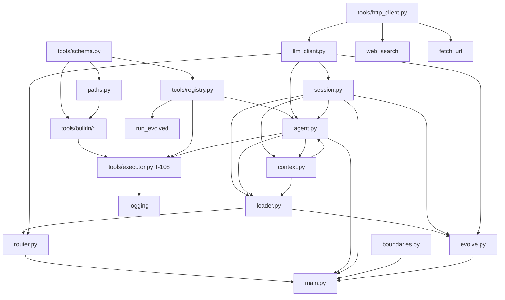

# my-agent 项目地图（MAP）

> 版本 2026-07-09 · **新会话请先读本文 + `TASKS.md` 当前 Phase**  
> 设计文档已收口（CHANGELOG 0.2.14）；代码处于 **Phase 6 M4**（`T-601` done）。

---

## 1. 一句话

个人用、可进化的本地 Agent：**Git 为真源**，LLM 只能通过 **6 个 Builtin + `run_evolved`** 动手；进化产物在 `evolve/`（prompt / memory / tool），**M1 不做 skill**。

---

## 2. 当前进度（代码）

| Phase | 范围 | 状态 |
|-------|------|------|
| Phase 0 | 设计文档 | done（`T-001`～`T-005e`） |
| **Phase 1** | 工具层，无 LLM | **done**（`T-101`～`T-112`） |
| Phase 2 | 对话壳 + LLM | **done**（`T-201`～`T-210`） |
| **Phase 3** | 记忆三件套 / 主题索引 | **done**（`T-301`～`T-308`） |
| **Phase 4** | 进化写入 | **done**（`T-401`～`T-407`；`T-406` 文档已决） |
| **Phase 5** | 真实任务固化 tool + memory | **done**（`T-501`～`T-504`） |
| **Phase 6** | M4 治理（review / audit） | **done**（`T-601`～`T-604`、`T-006`） |

**Phase 2～6 与 `T-006` 已完成**。远端：https://github.com/21136/my-agent（private，默认分支 `main`）。可选：`T-601b` / `T-605` skill。

---

## 3. 仓库目录（实际 + 规划）

```text
my-agent/
├── agent-core/                 # 内核 Python（稳定、少变）
│   ├── paths.py                # T-102 agent 根 + workspace 边界
│   ├── llm_client.py           # T-201 DeepSeek / OpenAI 兼容薄封装
│   ├── agent.py                # T-202 tools + T-206 主循环 + T-208 context 检查
│   ├── context.py              # T-208 digest 压缩（RUNTIME §8）
│   ├── session.py              # T-203 续接 + 持久化
│   ├── loader.py               # T-204 system 基础 + overlay
│   ├── router.py               # T-205 主题 JSON / 快捷命令
│   ├── boundaries.py           # T-401 对话边界 + CheckpointGate
│   ├── evolve.py               # T-402 checkpoint + T-404 proposal 审阅
│   ├── governance/             # T-601 ReviewCollector + my-agent review
│   │   ├── collector.py
│   │   ├── entities.py
│   │   ├── report.py           # ReviewReport schema v1.0
│   │   ├── renderer.py
│   │   ├── review.py           # CLI + demo
│   │   ├── entity_usage.py     # T-602a entity_used L2
│   │   ├── feedback.py         # T-602b exit feedback
│   │   ├── suspect.py          # T-602c failure_streak / marked_suspect
│   │   ├── audit.py            # T-603 LLM audit
│   │   └── git_hints.py        # T-604 commit / rollback hints
│   ├── main.py                 # T-207 REPL + 命令
│   ├── prompts/
│   │   └── core.txt            # 内核规则（T-209）
│   └── tools/
│       ├── schema.py           # T-101 统一 ToolResult / ToolError
│       ├── http_client.py      # httpx 工厂（SOCKS 代理回退）
│       ├── registry.py         # T-105/106 builtin 清单 + evolved 扫描/校验
│       ├── executor.py         # T-108–T-110 confirm / spill / log
│       ├── logging.py          # T-110 evolve_log.jsonl
│       ├── builtin/
│       │   ├── read_file.py    # T-103
│       │   ├── list_dir.py     # T-104
│       │   ├── grep.py         # T-104a
│       │   ├── web_search.py   # T-104b
│       │   ├── fetch_url.py    # T-104c
│       │   └── run_evolved.py  # T-107
│       ├── cli_tools.py        # T-112 my-agent tool run
│       ├── my-agent            # agent-core 下启动器（同 cli_tools）
│       └── ...
├── evolve/                     # 用户策展，Git 真源
│   ├── _index.toml             # 主题索引（prompt + memory_dirs + tool_dirs）
│   ├── prompts/                # 主题 overlay + safety.md（始终加载）
│   ├── memories/               # 记忆 md（规划）
│   ├── tools/                  # evolved 工具（种子 write_text）
│   │   ├── common/write_text/  # T-111
│   │   └── workflow/sort_by_extension/  # T-502 按扩展名整理
│   │   └── <topic>/<name>/     # 主题专用
│   └── proposals/              # T-402 生成；用户审后 accept（T-404）
├── docs/                       # 设计真源（先评审再写代码）
│   ├── MAP.md                  # ← 本文件
│   ├── TASKS.md                # 实施细表（task id + 状态）
│   ├── TOOLS.md                # 工具协议 §6～§7
│   ├── RUNTIME.md              # 对话层
│   ├── MEMORY.md               # 三件套 + 主题路由
│   ├── EVOLVE.md               # proposal
│   └── GOVERNANCE.md           # M4 治理
├── data/                       # gitignore（除可选 conversations 摘要）
│   ├── state.json
│   ├── sessions/<id>/          # goal, messages.jsonl, tool_outputs/
│   └── evolve_log.jsonl        # T-110 起每次 tool 调用
├── workspace/                  # gitignore，用户工作文件
├── requirements.txt            # httpx>=0.27；Python 3.12+
├── start.bat                   # T-210 双击进 CLI REPL
├── my-agent                    # T-112 根目录启动器 → cli_tools.py
└── README.md
```

---

## 4. `agent-core` 模块依赖图



**导入约定（重要）**：

- 目录名是 `agent-core`（带连字符），**不是** Python 包名。
- 开发时在 `agent-core/` 下执行，或把 `agent-core` 加入 `sys.path`。
- 各 builtin / `paths.py` 顶部有 `sys.path.insert(0, agent-core)`，支持 `python tools/builtin/xxx.py` 直接跑 demo。
- `from tools.schema import ...`、`from paths import AgentPaths`（**不要** `from agent_core`）。
- `tools/__init__.py` **仅**导出 schema，避免与 `paths` 循环导入；registry 用 `from tools.registry import ...`。

---

## 5. 统一工具协议

所有 builtin / `run_evolved` 对外返回 **`ToolResult`**（`tools/schema.py`）：

```json
{
  "ok": true,
  "tool": "grep",
  "data": { },
  "truncated": false,
  "error": null,
  "duration_ms": 12
}
```

- 每个 builtin 暴露 **`run(arguments: dict, *, paths=None, ...) -> ToolResult`**。
- Evolved 脚本 stdout 为**内层** JSON（`{"ok": true, "written": "..."}`），由 `run_evolved` 包一层。

详见 `docs/TOOLS.md` §6.6、§7。

---

## 6. Builtin 速查

| name | 文件 | 关键参数 | 依赖 |
|------|------|----------|------|
| `read_file` | `builtin/read_file.py` | `path` | paths |
| `list_dir` | `builtin/list_dir.py` | `path`, `recursive?` | paths |
| `grep` | `builtin/grep.py` | `pattern`, `path`, `glob?`, `max_results?` | paths, 优先 `rg` |
| `web_search` | `builtin/web_search.py` | `query`, `max_results?` | httpx, `LLM_API_KEY` |
| `fetch_url` | `builtin/fetch_url.py` | `url`, `max_chars?` | httpx, SSRF 防护 |
| `run_evolved` | `builtin/run_evolved.py` | `tool_name`, `arguments`, `dry_run?` | registry |

**路径规则**（`paths.py`）：

- 读/列/搜：`resolve_under_agent`（`docs/...`、`workspace/...`；裸文件名先试 workspace）。
- 写（evolved）：`resolve_under_workspace`（T-111 `write_text`）。

---

## 7. Registry（evolved 工具）

`tools/registry.py`：

| API | 作用 |
|-----|------|
| `ToolRegistry.load()` | 扫描 `evolve/tools/**/tool.toml` 并校验 |
| `parse_tool_manifest(path, evolve_dir=...)` | 单文件解析 |
| `ToolManifestError` | 非法 manifest → 启动失败 |
| `EvolvedTool` | 含 `entry.script_path`、`input_schema`、`policy` |

**目录约定**：

- `evolve/tools/common/<name>/tool.toml` → `topics` 须含 `"common"`
- `evolve/tools/<topic>/<name>/tool.toml` → `topics` 须含 `<topic>`
- `[entry] path = "main.py"` 必须存在

当前仓库 **已有** `evolve/tools/common/write_text/`（T-111）与 `evolve/tools/workflow/sort_by_extension/`（T-502）。

---

## 8. 环境变量（已实现部分）

| 变量 | 用于 | 默认 |
|------|------|------|
| `MY_AGENT_ROOT` | 指定 agent 根 | 自动发现 `evolve/_index.toml` |
| `LLM_API_KEY` | `web_search` deepseek | — |
| `WEB_SEARCH_PROVIDER` | `deepseek` \| `brave` | `deepseek` |
| `WEB_SEARCH_MODEL` | DeepSeek 搜索子调用 | `deepseek-v4-flash` |
| `WEB_SEARCH_ANTHROPIC_BASE_URL` | Anthropic 兼容端点 | `https://api.deepseek.com/anthropic` |
| `WEB_SEARCH_TIMEOUT_SEC` | 搜索超时 | `15` |
| `BRAVE_SEARCH_API_KEY` | brave 搜索 | — |
| `FETCH_URL_TIMEOUT_SEC` | 拉 URL | `15` |
| `FETCH_URL_MAX_BYTES` | 原始 body 上限 | `2097152` |
| `FETCH_URL_MAX_CHARS_DEFAULT` | 默认字符上限 | `32000` |
| `FETCH_URL_USER_AGENT` | UA | `my-agent/1.0` |
| `LLM_BASE_URL` | 主对话 API | `https://api.deepseek.com` |
| `LLM_MODEL` | 通用会话（flash） | `deepseek-v4-flash` |
| `LLM_MODEL_CODING` | 含 `coding` 主题 | `deepseek-v4-pro` |
| `LLM_TIMEOUT_SEC` | 主对话超时 | `120` |
| `LLM_CONTEXT_LIMIT` | context 上限（可选覆盖） | flash `128000` / pro `1000000` |

Phase 2 主对话复用 `LLM_API_KEY`（与 `web_search` 相同），详见 `RUNTIME.md` §6.1。

**本机提示**：Clash 等 SOCKS 代理需 `httpx[socks]`，或 `http_client.py` 会 `trust_env=False` 回退直连。

---

## 9. 手工验收（复制即用）

在 PowerShell 中：

```powershell
cd D:\my-agent\agent-core

python tools\schema.py
python paths.py
python tools\builtin\read_file.py
python tools\builtin\list_dir.py
python tools\builtin\grep.py
python tools\builtin\web_search.py      # 需 LLM_API_KEY
python tools\builtin\fetch_url.py
python tools\registry.py
python tools\builtin\run_evolved.py
python tools\executor.py
python tools\logging.py
python cli_tools.py demo
python llm_client.py                  # T-201；可选 LLM_API_KEY live
python agent.py                       # T-202 6 Builtin → LLM functions
python session.py                     # T-203 session 续接 + 持久化
python loader.py                      # T-204 system 拼装
python router.py                      # T-205 主题路由
python agent.py                       # T-202 tools + T-206 agent loop + T-208 auto compact
python context.py                     # T-208 digest 压缩
python main.py --demo                 # T-207 REPL（脚本验收）
```

每个文件的 `if __name__ == "__main__"` 内含 `_demo()`，exit 0 即通过。

### 9.1 T-108 `ToolExecutor` confirm（§6.3）

`python tools\executor.py` 的 `_demo()` 已脚本化验证：

| 场景 | 预期 |
|------|------|
| `read_file` | 无 confirm，直接执行 |
| `run_evolved` + `n` | `confirm_rejected` |
| `run_evolved` + `y` | 执行；**不**写入 `workspace_evolved_approved` |
| `run_evolved`（`workspace_only`）+ `a` | 执行；`meta.json` 写入 `workspace_evolved_approved: true`；触发 `session_workspace_approved` 事件 |
| 同上 session 再调 `workspace_only` evolved | 免 confirm |
| `workspace_only=false` evolved | 仍须 confirm（仅 `y`/`n`） |
| 续接 session（重载 `meta.json`） | 保留免确认状态 |

阻塞式手测：构造 `ToolExecutor(..., confirm_fn=None)`（默认 `input()`），对 `run_evolved` 输入 `y`/`n`/`a` 观察行为。Builtin **无** `a` 选项。

### 9.2 T-109 dry_run + 超长落盘（§6.4）

`python tools\executor.py` 另含 3 条 `[PASS]`：

| 场景 | 预期 |
|------|------|
| `run_evolved` + `dry_run: true` | 成功返回；目标文件**不存在** |
| `run_evolved` + `dry_run: false` | 写入 workspace 文件 |
| `read_file` 读 >8k 结构化结果 | `truncated: true`；`data.preview` 为前 2000 字符；全文在 `data/sessions/<id>/tool_outputs/<uuid>.txt` |

阈值 env：`TOOL_OUTPUT_SPILL_CHARS`（默认 8000）、`TOOL_OUTPUT_PREVIEW_CHARS`（默认 2000）。demo session 目录：`data/sessions/_executor_demo/`。

### 9.3 T-110 `evolve_log.jsonl`

`python tools\logging.py` exit 0；`executor` demo 另含 `[PASS] evolve_log records … tool_call line(s)`。

每次 `ToolExecutor.run()` 追加一行 `event: tool_call`（含 `tool`、`arguments` 摘要、`ok`、`duration_ms`、`confirm` 等；**不**记密钥/超长正文）。`confirm a` 另写 `event: session_workspace_approved`。默认路径：`data/evolve_log.jsonl`。

### 9.4 T-111 `write_text` 种子

```powershell
cd D:\my-agent\agent-core
python ..\evolve\tools\common\write_text\main.py demo
```

exit 0 且 7 条 `[PASS]`：`registry` 扫描、`dry_run` 不写盘、`skip`/`overwrite`/`rename`、越界拒绝。

### 9.5 T-112 CLI `tool run`（Phase 1 完成）

**在仓库根目录**（`D:\my-agent`）：

```powershell
python my-agent tool list
python my-agent tool run grep --json '{\"pattern\":\"Phase 1\",\"path\":\"docs/MAP.md\",\"max_results\":2}'
python my-agent tool run evolved write_text --json '{\"path\":\"_cli_test.txt\",\"content\":\"hi\"}' --dry-run -y
```

> **PowerShell**：`--json` 用**单引号**包裹，内部双引号写成 `\"`；双引号外层写 `\"...\"` 会把 JSON 拆碎并报 `unrecognized arguments`。

**在 `agent-core/` 下**（等价，用本目录启动器或 `cli_tools.py`）：

```powershell
cd D:\my-agent\agent-core
python my-agent tool list
# 或
python cli_tools.py tool list
python cli_tools.py demo
```

`python cli_tools.py demo` exit 0（7 条 `[PASS]`）。CLI **不受**主题限制；`-y` 自动 confirm；`--session` 指定 session 目录（默认 `_cli`）；结果 JSON 打印到 stdout，并写入 `data/evolve_log.jsonl`。

### 9.6 T-201 `llm_client.py`（Phase 2 起步）

```powershell
cd D:\my-agent\agent-core
python llm_client.py
```

exit 0；**无** `LLM_API_KEY` 时 7 条 `[PASS]` + 1 条 `[SKIP] live chat`：

| 场景 | 预期 |
|------|------|
| 默认 env | `base_url=https://api.deepseek.com`；flash / pro 模型名；`timeout_sec=120` |
| `resolve_session_model([])` | `deepseek-v4-flash` |
| `resolve_session_model(["coding"])` | `deepseek-v4-pro` |
| `resolve_context_limit(flash)` | `128000` |
| `resolve_context_limit(pro)` | `1000000` |
| `LLM_CONTEXT_LIMIT=99999` | 两模型均返回 `99999` |
| 无 `LLM_API_KEY` 调 `chat()` | `LLMMissingApiKeyError` |
| 不可达 host + 短超时 | `LLMTimeoutError` 或 `LLMNetworkError` |

**有 key 时**（可选 live）：

```powershell
$env:LLM_API_KEY = "sk-..."
python llm_client.py
```

多 1 条 `[PASS] live chat`；打印 model 与 content 预览。无流式；整段返回。

### 9.7 T-202 `agent.py`（6 Builtin → LLM functions）

```powershell
cd D:\my-agent\agent-core
python agent.py
```

exit 0；7 条 `[PASS]`：

| 场景 | 预期 |
|------|------|
| `build_builtin_tools()` | 恰好 **6** 个 OpenAI `type: function` |
| 工具名 | `read_file` · `list_dir` · `grep` · `web_search` · `fetch_url` · `run_evolved` |
| 无平铺 evolved | `write_text` 等 **不在** function 列表；仅经 `run_evolved` |
| 参数 schema | 各 builtin 含 `parameters`（JSON Schema），`required` 字段在 `properties` 内 |
| `format_session_evolved_catalog([])` | 含 `write_text`（common）；evolved 列在 system 文案而非独立 function |

主循环（T-206）用法：`LLMClient.chat(messages, tools=build_builtin_tools())`。

### 9.8 T-203 `session.py`（续接 + 持久化）

```powershell
cd D:\my-agent\agent-core
python session.py
```

exit 0；10 条 `[PASS]`：

| 场景 | 预期 |
|------|------|
| `create_new()` | 创建 `data/sessions/<id>/`：`goal.md`、`meta.json`、`messages.jsonl`、`tool_outputs/` |
| `Session.load` | goal / topics / messages  round-trip |
| `resume_latest()` | 按 `meta.updated_at` 取最近非 `_` 前缀 session |
| 无 session | `resume_latest()` 自动 `create_new()` |
| `resume_or_create()` | 优先 `state.json` 的 `last_conversation_id`；否则同 `resume_latest` |
| `_` 前缀 id | 不参与默认续接；不写入 `last_conversation_id` |
| `build_anchor_message()` | RUNTIME §5 锚定块模板 |

`meta.json` 字段：`topics[]`、`llm_model`、`updated_at`、`phase`（S1～S4）、`workspace_evolved_approved`、`pending_feedback[]`。

### 9.9 T-204 `loader.py`（system 基础 + overlay）

```powershell
cd D:\my-agent\agent-core
python loader.py
```

exit 0；13 条 `[PASS]`：

| 场景 | 预期 |
|------|------|
| §4.1 基础层顺序 | `core` → `topic_index` → `memory_index` → `builtin_summary` |
| §4.2 overlay | `session` → `safety` → `topic_prompt:*` → `evolved_catalog` → `digest`（若有） |
| safety 始终加载 | `topics=[]` 时仍含 `evolve/prompts/safety.md` |
| digest | `digest.md` 存在时注入 `[对话摘要 digest]` 段 |
| 分隔符 | 段落间 `\n---\n` |
| `include_overlay=False` | 仅 S0 四层基础 |
| 真实仓库 | `write_text` 出现在 evolved 清单段 |

用法：`build_system_prompt(session).prompt` → 作为 LLM `system` 消息。

### 9.10 T-205 `router.py`（主题 JSON + 快捷命令）

```powershell
cd D:\my-agent\agent-core
python router.py
```

exit 0；10 条 `[PASS]`（无 key 时 +1 `[SKIP] live`）：

| 场景 | 预期 |
|------|------|
| `主题 coding workflow` | `replace` → `["coding","workflow"]` |
| `加主题 workflow` | `append` |
| `换主题` | `re_route`（返回 None，由调用方走 S2 LLM） |
| `parse_topic_proposal` | 过滤未注册 id；支持 markdown fence |
| `apply_confirmed_topics(replace)` | 含 `coding` → `llm_model` = pro |
| `apply_confirmed_topics(append)` | 与现有 topics 并集 |
| `propose_topics_with_llm` | S2：flash、temperature=0、无 tools（需 key） |

### 9.11 T-206 `agent.py` 主循环 + tool 内循环

```powershell
cd D:\my-agent\agent-core
python agent.py
```

exit 0；T-202 的 7 条 `[PASS]` + T-206 的 4 条 `[PASS]`（无 key 时 +1 `[SKIP] live`）：

| 场景 | 预期 |
|------|------|
| `prepare_session_for_s4` | 首条 message 为 §5 锚定块 |
| `Agent.run_turn` | user → assistant(tool_calls) → tool → assistant |
| `maybe_auto_compact` | 每轮 LLM 前检查 85% 阈值（T-208） |
| `messages.jsonl` | 每轮追加；`Session.load` 可续读 |
| tool 内循环上限 | 10 轮无最终回复 → `ToolLoopExceededError` |
| `Agent.create` | 绑定 `ToolExecutor` + 会话 evolved 白名单 |

有 key 时可选 live：`list_dir docs` 一句话总结。

### 9.12 T-207 `main.py`（REPL + 命令）

```powershell
cd D:\my-agent\agent-core
python main.py --demo
```

交互式对话：

```powershell
python main.py
python main.py --record
python main.py --record full
```

`--demo` exit 0；6 条 `[PASS]` + `[SKIP]`：

| 命令 / 场景 | 预期 |
|-------------|------|
| 默认启动 | `resume_or_create` 续接最近 session |
| `新会话` | 问 goal → S2 主题提议 → 确认 → 写 `meta.json` |
| `主题 workflow` / `加主题 …` / `换主题` | 替换 / 并集 / 重走 S2 |
| `压缩` | 手动触发 digest 压缩（RUNTIME §8）；同 thread 不换 id |
| `exit` / `exit --record` | 保存 session；可选归档 `data/conversations/` |
| `--record` / `--record full` | exit 时写摘要 JSON；full 另存 messages 副本 |

### 9.13 T-208 `context.py`（digest 压缩，RUNTIME §8）

```powershell
cd D:\my-agent\agent-core
python context.py
```

exit 0；10 条 `[PASS]` + `[SKIP]`（无 key 时）：

| 场景 | 预期 |
|------|------|
| 默认 env | `CONTEXT_COMPACT_RATIO=0.85`、`CONTEXT_KEEP_TURNS=8`、`CONTEXT_DIGEST_MAX_CHARS=8000` |
| Token 估算 | `len(text)//4` |
| `compute_compact_split_index` | 保留最近 K=8 轮；锚定块不摘要 |
| `compact_context(force=True)` | 写 `digest.md` `# 压缩 N`；`messages.jsonl` 条数不变 |
| `build_llm_messages` | 发给 LLM 的 payload 去掉已摘要前缀 |
| `loader` | digest 注入 `[对话摘要 digest]` 段 |
| `should_auto_compact` | `system+messages` ≥ `LLM_CONTEXT_LIMIT×0.85` 时为 true |
| 多节 digest | `# 压缩 1` … `# 压缩 N` 顺序追加 |
| 轮次不足 | `force` 压缩返回「无需压缩」 |

**主循环自动压缩**（`agent.py` `run_turn`）：每轮 LLM 调用前 `maybe_auto_compact`；达 85% 阈值时自动摘要早前对话。

**REPL 手动压缩**：

```powershell
python main.py --demo   # 含 `压缩` 命令脚本验收
python main.py          # 交互输入 `压缩` 或 `summarize`
```

压缩后检查：`data/sessions/<id>/digest.md` 有新节；`meta.json` 的 `compact_before_index` 前移；`messages.jsonl` 仍含完整历史（可用 `read_file` / `grep` 检索）。

### 9.14 T-209 `prompts/core.txt`（内核规则）

```powershell
cd D:\my-agent\agent-core
python loader.py
```

exit 0；含 `[PASS] core.txt: identity, boundaries, no pretend (T-209)`。

| 内容 | 预期 |
|------|------|
| 身份 | my-agent、本地进化助手、仅经注册 tool 动手 |
| 执行边界 | 6 Builtin + `run_evolved` 对照表；禁止无 tool 结果声称已读写/执行 |
| 路径 | `docs/`、`evolve/`、`workspace/`、`data/`；相对 agent 根 |
| 工具纪律 | 先 `read_file`/`grep`；错误不编造；`dry_run` 预览 |
| 进化 | `记住` 走 proposal；digest 有损、verbatim 查 `messages.jsonl` |

手工查看：`agent-core/prompts/core.txt`（`loader` §4.1 第一段注入 system）。

### 9.15 T-210 `start.bat`（双击进 CLI）

```powershell
# 资源管理器双击 D:\my-agent\start.bat
# 或 cmd：
D:\my-agent\start.bat
D:\my-agent\start.bat --record
cmd /c "D:\my-agent\start.bat --demo"   # 脚本验收，exit 0
```

| 场景 | 预期 |
|------|------|
| 正常启动 | 进入 `main.py` REPL（默认续接最近 session） |
| 传参 | `%*` 转发给 `agent-core\main.py`（如 `--record`、`--demo`） |
| 无 Python | 提示安装 Python 3.12+ 并 `pause` |
| 非零退出 | `pause` 保留窗口便于查看错误 |

### 9.16 T-301 主题索引（`evolve/_index.toml` → system S0）

```powershell
cd D:\my-agent\agent-core
python loader.py
```

exit 0；在 T-204 的 13 条 `[PASS]` 基础上另含 2 条 T-301 专用：

| 场景 | 预期 |
|------|------|
| `load_topic_index` | 解析仓库 `evolve/_index.toml` 得 4 个 topic（coding / writing / workflow / safety） |
| `format_topic_index` | 每行含 `id: name — description`；下一行 `tool_dirs: …`（空为 `(none)`） |
| S0 system（`include_overlay=False`） | `[主题索引]` 段含 `tool_dirs: tools/coding`、`tool_dirs: tools/workflow` 等 |

**快速肉眼检查**（可选）：

```powershell
cd D:\my-agent\agent-core
python -c "from paths import AgentPaths; from loader import load_topic_index, format_topic_index; p=AgentPaths.discover(); print(format_topic_index(load_topic_index(p.evolve)))"
```

应看到 4 个主题及各自 `tool_dirs`；`safety` 为 `tool_dirs: (none)`。

实现位置：`loader.py` 的 `load_topic_index` / `format_topic_index`；`build_system_prompt` §4.1 第二层注入。

### 9.17 T-302 久远记忆索引（`evolve/memories/**/*.md` → system S0）

```powershell
cd D:\my-agent\agent-core
python loader.py
```

exit 0；含 `[PASS] T-302: scan memories; archived skipped; MEMORY §5.2 format` 与 `[PASS] T-302: memory index in S0`。

| 场景 | 预期 |
|------|------|
| `scan_memory_index` | 递归扫描 `evolve/memories/**/*.md`；解析 frontmatter |
| `status: archived` | **不**进入索引 |
| `status: active` / `suspect` | 注入 `- {id} ({topics}): {summary}` |
| 无 frontmatter / 缺 id 或 summary | 跳过 |
| S0 system | `[久远记忆]` 段在 `topic_index` 之后、`builtin_summary` 之前 |
| 仓库尚无 memory 文件 | 显示 `(none active)`（T-307 将添加样例） |

**格式示例**（MEMORY §5.2）：

```text
[久远记忆]
- project-my-agent (coding): my-agent 个人进化 agent，Python 3.12…
- downloads-sort (workflow): 下载目录按扩展名分子文件夹…
```

**快速检查**（可选）：

```powershell
cd D:\my-agent\agent-core
python -c "from paths import AgentPaths; from loader import scan_memory_index, format_memory_index; p=AgentPaths.discover(); print(format_memory_index(scan_memory_index(p.evolve)))"
```

实现位置：`loader.py` 的 `scan_memory_index` / `format_memory_index`；`build_system_prompt` §4.1 第三层注入。

### 9.18 T-303 Session 目标问答（`goal.md` + 对话上下文）

```powershell
cd D:\my-agent\agent-core
python session.py
python main.py --demo
```

| 场景 | 预期 |
|------|------|
| `新会话` / `new` | 首屏问「这次主要做什么？」（`session.GOAL_PROMPT`） |
| 回答后 | 写入 `data/sessions/<id>/goal.md`；`meta.phase` S1→S2 |
| 续接启动 | **不**重复问目标；沿用磁盘 `goal.md` |
| 锚定块 | `prepare_session_for_s4` 插入 `目标: <goal 全文>`（RUNTIME §5） |
| system overlay | `[本次会议]` 段含 `goal: …`（`loader.format_session_overlay`） |

`session.py`：`prompt_and_set_goal` · `persist_goal` · `GOAL_PROMPT`  
`main.py`：`ConversationRepl.start_new_session()` 调用上述 API。

exit 0 时应含：

- `session.py`: `[PASS] T-303: goal prompt → goal.md → anchor context`
- `main.py --demo`: `[PASS] T-303: 新会话首屏问目标；goal 注入 anchor + system` 与 `[PASS] T-303: resume 不重复问目标`

### 9.19 T-304 主题路由阶段1（S2 LLM 提议 + S3 用户确认）

```powershell
cd D:\my-agent\agent-core
python router.py
python main.py --demo
```

| 场景 | 预期 |
|------|------|
| S2 `run_topic_routing_s2` | flash LLM 读 `_index` + goal，输出 `topics[]` JSON（`propose_topics_with_llm`） |
| 未注册 id | `parse_topic_proposal` 过滤；banner 显示 `[已忽略未注册: …]` |
| S3 `y` / 是 | 接受提议，`apply_topic_confirmation` → `meta.topics` + phase S4 |
| S3 `n` / 否 | **否决**，topics 不变，提示「主题未变更」 |
| S3 直接输入 id | **改选**（如只输入 `writing` 覆盖 `coding,workflow` 提议） |
| `换主题` | 重走 S2/S3（`TopicCommandKind.RE_ROUTE`） |

实现：`router.py` — `resolve_topic_confirmation` · `apply_topic_confirmation` · `format_proposal_banner`  
`main.py` — `ConversationRepl._run_topic_flow()`

exit 0 时应含 `[PASS] T-304: resolve accept / reject / override` 与 main 中 reject/override 用例。

### 9.20 T-305 主题 prompt 全文（S3 后 overlay §4.2.7）

```powershell
cd D:\my-agent\agent-core
python loader.py
```

| 场景 | 预期 |
|------|------|
| `meta.topics=[]` | 无 `topic_prompt:*` 段（S0 仅有主题索引列表） |
| 确认 `coding` | system overlay 含 `topic_prompt:coding` + `evolve/prompts/coding.md` **全文** |
| 多主题 | 按 `meta.topics` 顺序各注入一段；`safety` 主题 id **不**重复（另有独立 safety 段） |
| 路径解析 | `load_confirmed_topic_prompts` 读 `_index.toml` 的 `prompt` 字段 |
| overlay 顺序 | `session` → `safety` → `topic_prompt:*` → `evolved_catalog` → `digest` |

**快速检查**（可选）：

```powershell
python -c "from paths import AgentPaths; from session import Session, SessionMeta, utc_now_iso; from loader import build_system_prompt; p=AgentPaths.discover(); s=Session('_t', p.data/'sessions'/'_t', 'g', SessionMeta(topics=['coding'], llm_model='pro', updated_at=utc_now_iso()), [], p); r=build_system_prompt(s); print('topic_prompt:coding' in r.section_names, 'Python 3.12' in r.prompt)"
```

应输出 `True True`。

实现：`loader.py` — `resolve_topic_prompt_path` · `load_confirmed_topic_prompts` · `build_system_prompt` overlay 循环。

### 9.21 T-306 evolve_log 启动 / 主题确认（MEMORY §8）

```powershell
cd D:\my-agent\agent-core
python tools\logging.py
python loader.py
```

| 事件 | `event` | 字段 |
|------|---------|------|
| CLI 启动 / `新会话` | `session_start` | `conversation_id`, `memory_ids_loaded[]`, `topics_available[]` |
| 主题确认（S3）/ `主题 …` 快捷 | `topics_confirmed` | `topics_confirmed[]`, `prompt_files_loaded[]`, `evolved_tools_listed[]` |

写入路径：`data/evolve_log.jsonl`（与 T-110 `tool_call` 同文件）。

实现：
- `tools/logging.py` — `log_session_start` · `log_topics_confirmed`
- `loader.py` — `log_session_start(session)` · `log_topics_confirmed(session)` 及字段收集
- `main.py` — REPL `run()` 启动写 `session_start`；`_run_topic_flow` / `主题` 快捷写 `topics_confirmed`

**快速检查**（可选）：

```powershell
Get-Content D:\my-agent\data\evolve_log.jsonl -Tail 5
```

exit 0 时应含 `[PASS] T-306: evolve_log session_start + topics_confirmed`。

### 9.22 T-307 evolve 样例（coding prompt + memory）

```powershell
cd D:\my-agent\agent-core
python loader.py
```

| 文件 | 作用 |
|------|------|
| `evolve/prompts/coding.md` | coding 主题规则；确认 coding 后全文进 `topic_prompt:coding` |
| `evolve/memories/coding/example.md` | 久远记忆样例；S0 注入 `project-my-agent (coding): …` 索引行 |

**对话侧预期**（确认 `topics=["coding"]` 后）：

- system S0：`[久远记忆]` 含 `project-my-agent (coding): my-agent 个人进化 agent…`
- system overlay：`topic_prompt:coding` 含「不要 `import agent_core`」等 coding 规则
- 记忆正文不进 context；需要时 `read_file evolve/memories/coding/example.md`

**快速检查**：

```powershell
python -c "from paths import AgentPaths; from session import Session, SessionMeta, utc_now_iso; from loader import build_system_prompt; p=AgentPaths.discover(); s=Session('_t', p.data/'sessions'/'_t', 'g', SessionMeta(topics=['coding'], llm_model='pro', updated_at=utc_now_iso()), [], p); r=build_system_prompt(s); print('memory', 'project-my-agent' in r.prompt); print('prompt', 'import agent_core' in r.prompt)"
```

应输出 `memory True` 与 `prompt True`。

exit 0 时应含 `[PASS] T-307: coding prompt + memory index in system`。

### 9.23 T-308 evolved 清单 + `run_evolved` 白名单（TOOLS §4.3）

```powershell
cd D:\my-agent\agent-core
python loader.py
python agent.py
```

| 场景 | 预期 |
|------|------|
| `meta.topics=[]` | overlay 仅列 `common`（如 `write_text`） |
| 确认 `workflow` | 清单含 `write_text` + 该主题 scope 下 active 工具 |
| 未确认主题的工具 | **不在** system 清单；`run_evolved` 返回 `tool not allowed in this session` |
| allowlist 来源 | `loader.session_evolved_allowlist(session)` = `registry.session_evolved(topics)` |
| Agent 执行 | `Agent.create` / `run_turn` 同步 allowlist；与 system 清单一致 |

实现：
- `loader.py` — `format_session_evolved_catalog` · `session_evolved_allowlist` · `format_evolved_catalog_overlay`
- `agent.py` — `ToolExecutor.allowed_evolved` 绑定上述 allowlist

exit 0 时应含 `[PASS] T-308: evolved catalog (common+topic) + run_evolved allowlist`。

**Phase 3 完成标志**：主题确认后 system 含 prompt 全文 + 记忆索引 + evolved 清单；`run_evolved` 仅允许清单内工具名。

### 9.24 T-401 对话边界（exit / Ctrl+C，EVOLVE §3）

```powershell
cd D:\my-agent\agent-core
python boundaries.py
python main.py --demo
```

| 场景 | 预期 |
|------|------|
| `exit` / `exit --record` | 持久化 session；写 `session_end` 到 `evolve_log.jsonl`；**不**开检查点、**不**生成 proposal |
| `Ctrl+C`（主循环） | 打印 `(cancelled)`；**不**结束 thread；**不**开检查点 |
| `Ctrl+C`（confirm / 主题确认） | 等同拒绝 / 取消；**不**开检查点 |
| `记住` / `沉淀` 等显式触发 | 识别触发词；路由离开主循环 LLM（T-402 前仅提示，不写 `proposals/`） |
| `Ctrl+C` 后输入 `记住` | 输出「未开检查点」；**不**写 `checkpoint_opened` |

实现：`boundaries.py` — `CheckpointGate` · `classify_user_line` · `match_evolve_trigger`；`main.py` — `_exit_session` / `_handle_evolve_trigger`；`tools/logging.py` — `session_end` 事件。

**交互式手测**（可选）：

```powershell
python main.py
# 输入一行对话 → Ctrl+C → 应仍在 REPL
# 输入 记住 → 应提示 T-402，且 evolve/proposals/ 无新文件
# 输入 exit → 应显示 session saved；检查 data/evolve_log.jsonl 末行 event=session_end
```

`main.py --demo` exit 0 时应含 3 条 `[PASS] T-401:`。

### 9.25 T-402 Proposal 生成（EVOLVE §4）

```powershell
cd D:\my-agent\agent-core
python evolve.py
python main.py --demo
```

| 场景 | 预期 |
|------|------|
| `记住` / `沉淀` / `写进 evolve` 等 | 开检查点 → LLM 生成 ≤2 条 proposal → 写入 `evolve/proposals/<date>-<seq>-<type>-<slug>.md` |
| 文件结构 | YAML frontmatter + `## Summary` / `## Proposed` / `## Evidence`（每条 evidence ≤2） |
| evolve_log | `checkpoint_opened` + `proposal_created`（含 `proposal_id`、`type`、`fingerprint`） |
| 无 API key | `evolve.py` / `main.py --demo` 用 mock LLM 仍可验收 |

实现：`evolve.py` — `run_explicit_checkpoint` · `build_evolve_index_block` · `parse_proposal_batch` · `write_proposal`；`main.py` — `_handle_evolve_trigger` 调用上述 API。

**交互式手测**（需 `LLM_API_KEY`）：

```powershell
python main.py
# 先聊一两轮，再输入：记住 <要沉淀的内容>
# 检查 evolve/proposals/ 有新 .md；data/evolve_log.jsonl 有 checkpoint_opened
```

`evolve.py` exit 0 时应含 4 条 `[PASS]`；`main.py --demo` 含 `[PASS] T-402:`。

### 9.26 T-403 触发降噪与升格两跳（EVOLVE §3）

```powershell
cd D:\my-agent\agent-core
python boundaries.py
python evolve.py
python loader.py
python main.py --demo
```

| 场景 | 预期 |
|------|------|
| 强触发 `记住` 等 | 立即开检查点（不受升格次数限制） |
| 弱确认 `好`/`要`/`写进去`/`对` | **仅当** `meta.evolve_offer_pending=true` 时开检查点；`triggered_by=llm_offer` |
| 无 pending 时说 `好` | 走正常对话，**不**开检查点 |
| LLM 口头升格 | system 注入 `[进化升格]` 提示；每会话 **≤1 次**（`evolve_offer_used`） |
| 助手回复含「要写进 prompt 吗？」等 | 设 `evolve_offer_pending`；**不写** proposals |
| 同检查点 fingerprint 重复 | `dedupe_drafts_by_fingerprint` 只留 1 条 |
| `新会话` | 重置 `evolve_offer_pending` / `evolve_offer_used`；**不**软问沉淀 |
| `exit` / 压缩 / 任务成功 | **不**自动开检查点（T-401） |

实现：`boundaries.py` 弱确认 · `session.meta` 升格状态 · `loader.format_evolve_escalation_hint` · `evolve.detect_escalation_offer` / `dedupe_drafts_by_fingerprint` · `main.py` 两跳路由。

`main.py --demo` exit 0 时应含 3 条 `[PASS] T-403:`。

### 9.27 T-404 Proposal 审阅 accept/reject（EVOLVE §7、§10）

```powershell
cd D:\my-agent\agent-core
python evolve.py
python main.py --demo
```

| 场景 | 预期 |
|------|------|
| `proposals` | 列出 `status: pending` 的 proposal（id / type / summary / target） |
| `proposals accept <id>` | 按 type 路由写入 `evolve/`；proposal `status=accepted` |
| `proposals reject <id>` | `status=rejected`；移入 `proposals/archive/` |
| memory + create | 写入 `evolve/memories/<topic>/<id>.md`（## Proposed 全文） |
| memory + update | 目标文件追加 `## 修订 YYYY-MM-DD`（不覆盖正文） |
| prompt_patch | `append_section` 到 `evolve/prompts/<topic>.md` |
| tool_suggestion | 仅 `accepted` + log「待实现」；**不**生成代码 |
| 检查点后 | 可选「现在审？(y/稍后/拒绝)」；`y` 接受本批、`拒绝` 拒绝本批 |
| evolve_log | `evolve_accepted` / `evolve_rejected` / `tool_spec_accepted` |
| 接受后 | **不重载** 当前 session overlay（下次启动/换主题生效） |

实现：`evolve.py` — `list_pending_proposals` · `accept_proposal` · `reject_proposal` · 路由函数；`main.py` — `proposals` REPL 命令 · `_maybe_review_proposals`；`tools/logging.py` — 审阅事件。

**交互式手测**（可选）：

```powershell
python main.py
# 输入 记住 … → 生成 proposal 后输入 y 接受，或稍后再用 proposals accept <id>
# proposals → 列 pending
# proposals reject prop-… → 检查 evolve/proposals/archive/
```

`evolve.py` exit 0 时应含 8 条 `[PASS] T-404:`；`main.py --demo` 含 4 条 `[PASS] T-404:`。

### 9.28 T-405 Evidence 原文摘录（EVOLVE §5）

```powershell
cd D:\my-agent\agent-core
python evolve.py
```

| 场景 | 预期 |
|------|------|
| evidence 来源 | 仅 `messages.jsonl` 或 `digest.md` **逐字**子串 |
| 自评/改写 | 「用户表示…」、 paraphrase 拒绝；回退到 `user_line` 可匹配原文 |
| 数量 | 每条 proposal **≤2** 条 evidence |
| ref | 校正为 corpus 中真实 `messages.jsonl#N` 或 `digest.md#N` |
| 锚定块 | `[本次会议上下文]` 行不进 evidence 池 |

实现：`evolve.py` — `build_dialogue_corpus` · `match_dialogue_quote` · `resolve_evidence_for_proposal`；`parse_proposal_batch` 生成时校验。

`evolve.py` exit 0 时应含 5 条 `[PASS] T-405:`。

### 9.29 T-407 防重复（EVOLVE §6）

```powershell
cd D:\my-agent\agent-core
python evolve.py
```

| 场景 | 预期 |
|------|------|
| `evidence_fingerprint` 已 accepted | **硬拦**，不写新 proposal；log `dedup: blocked` |
| 同 `target.path` 已有 pending | **supersede** 旧条（`status: superseded` + `superseded_by`） |
| 同 evidence_fp 已有 pending | supersede 旧 pending |
| memory `create` 且 id 已存在 | 硬拦 |
| `prompt_patch` 同 anchor 已存在 | 硬拦 |
| `tool_suggestion` 同名已注册 | 硬拦（如 `write_text`） |
| accept 时 | 再次硬查 identity |

实现：`evolve.py` — `evaluate_dedup_gate` · `supersede_proposal_record` · `collect_accepted_evidence_fingerprints`；`tools/logging.py` — `proposal_superseded`。

`evolve.py` exit 0 时应含 5 条 `[PASS] T-407:`。

**Phase 4 完成标志**：`记住` → proposal → accept → 索引可见；同 evidence 重复句不再生成第二条 pending。

### 9.32 Phase 5（M3）完成标志

| 交付 | 路径 |
|------|------|
| 场景 | workflow：workspace 目录按扩展名整理（`T-501`） |
| evolved tool | `evolve/tools/workflow/sort_by_extension/`（`T-502`） |
| 对话调度 | `agent.py` `[PASS] T-503`；可选 `python t503_live.py` 交互（`T-503`） |
| workflow prompt | `evolve/prompts/workflow.md` |
| 久远记忆 | `evolve/memories/workflow/downloads-sort.md`（`T-504`） |

**下一步**：可选 `T-601b` / `T-605` skill；日常用 `git commit` 策展 `evolve/`。

### 9.38 T-604 Git 回滚习惯（README + CLI 提示）

```powershell
cd D:\my-agent
# 阅读 README「Git 回滚习惯」
python agent-core\governance\git_hints.py
python my-agent review --topic coding
```

| 场景 | 预期 |
|------|------|
| `README.md` | 何时 commit、`git checkout` 回滚、`rollback_noted` 说明 |
| `proposals accept` | 消息末行 `Git: git commit -m "evolve: accept …"` |
| `my-agent review` / `audit`（cli） | 输出末段 `== Git ==` |

实现：`governance/git_hints.py` · `evolve.accept_proposal_at_path` · `governance/renderer.render_cli`。

### 9.37 T-603 `my-agent audit`（LLM 语义审计）

```powershell
cd D:\my-agent\agent-core
python governance\audit.py demo

cd D:\my-agent
python my-agent audit
python my-agent audit --topic coding
python my-agent audit prompts --topic coding
python my-agent audit --only-llm
python my-agent audit --format json -o data\reviews\audit-latest.json
```

| 场景 | 预期 |
|------|------|
| 流程 | `collect()` 确定性数据 → LLM 读 prompt + 同 topic active memory → `llm_findings[]` |
| `audit prompts` | corpus 仅含 prompt 文件 |
| `--only-llm` | CLI/markdown 跳过 never-used / conflicts 等确定性块 |
| JSON | `ReviewReport` v1.0；`summary.llm_findings_count`；`scope.audit_ran=true` |
| 副作用 | **不**自动改 evolve 文件；写 `audit_completed` 到 `evolve_log` |

实现：`governance/audit.py` · `governance/renderer.py`（LLM findings 段）· `cli_tools.py` · `tools/logging.log_audit_completed`。

### 9.36 T-602c `failure_streak` / `marked_suspect`

```powershell
cd D:\my-agent\agent-core
python governance\suspect.py
python governance\feedback.py
```

| 场景 | 预期 |
|------|------|
| `compute_failure_streak` | 从 `evolve_log` 聚合；`feedback_positive` 归零 |
| `failure_streak` 达 3 | memory `status: suspect` 或 `tool.toml` `status = "suspect"` |
| 达阈值 | `evolve_log` 追加 `marked_suspect`（`entity_id`, `failure_streak`） |
| 已 suspect | 幂等，不重复 `marked_suspect` |
| exit 否定链 | `apply_exit_feedback(negative)` ×3 触发上述（`feedback.py` demo） |

实现：`governance/suspect.py` · `governance/feedback.apply_exit_feedback` · `tools/logging.log_marked_suspect`。

### 9.35 T-602b exit 反馈（`feedback_*`）

```powershell
cd D:\my-agent\agent-core
python governance\feedback.py
python main.py --demo
```

| 场景 | 预期 |
|------|------|
| 默认 | **不问**（`MY_AGENT_FEEDBACK_ON_EXIT` 未设） |
| `MY_AGENT_FEEDBACK_ON_EXIT=1` + `exit` + `pending_feedback` L2+ | 打印问句；`y`/`对` → `feedback_positive`；`n`/`不对` → `feedback_negative`；回车/skip → 无事件 |
| 反馈后 | 该 `entity_id` 从 `meta.pending_feedback` 移除 |
| 多实体 | 只问 **一个**：L4 > L3 > L2；同层 `used_at` 最新 |
| 已反馈实体 | 本 session 已有 `feedback_*` 则不再问 |

实现：`governance/feedback.py` · `main.ConversationRepl._maybe_exit_feedback` · `tools/logging.log_feedback_*` · `session.refresh_pending_feedback_from_disk`。

### 9.34 T-602a `entity_used` L2（read_file → evolve/memories/**）

```powershell
cd D:\my-agent\agent-core
python governance\entity_usage.py
python tools\executor.py
```

| 场景 | 预期 |
|------|------|
| `read_file` + `evolve/memories/**/*.md` 成功 | `evolve_log` 追加 `entity_used`（`level: L2`, `type: memory`, `entity_id`=frontmatter `id`） |
| memory 文件 | frontmatter `use_count` +1、`last_used_at` 更新 |
| `meta.json` | `pending_feedback[]` 追加/去重 `{ entity_id, type, level, used_at }` |
| `read_file` 非 memory（`docs/`、`evolve/prompts/` 等） | **不**写 `entity_used` |
| L0 索引注入 | **不算**引用（仍须 `read_file` 正文） |

实现：`governance/entity_usage.py` · `tools/logging.log_entity_used` · `tools/executor._maybe_record_memory_entity_used`。

### 9.33 T-601 / T-601a `my-agent review`（确定性治理清单）

```powershell
cd D:\my-agent\agent-core
python governance\review.py demo

# 仓库根或 agent-core 均可
cd D:\my-agent
python my-agent review
python my-agent review --topic coding
python my-agent review --format json
python my-agent review --format markdown -o data\reviews\latest.md
```

| 场景 | 预期 |
|------|------|
| `ReviewCollector.collect()` | 返回 `ReviewReport` schema **v1.0** |
| **Never-used** | `active` 且 L2+（memory/tool）或 L1+（prompt）无引用；创建 ≥14 天 |
| **Observation** | 创建 &lt;14 天且 `use_count=0`（不进 never-used） |
| **Suspect** | `status: suspect` 条目列出 |
| **Conflicts (hard)** | `conflicts_with` 双向仍 `active` 的 memory 对 |
| **Conflicts (soft)** | 同 topic 两 `active` memory：`summary` 分词（长度 ≥3）交集 **≥3** |
| **Pending** | `staged` tool；`tool_spec_accepted` 且无 `active` 注册 |
| `--format cli` | 默认；人类可读 stdout |
| `--format json` | canonical `ReviewReport`；`jq` / `json.load` 可解析 |
| `--format markdown` + `-o` | 落盘 Markdown；无 `-o` 仍 stdout |
| evolve_log 用法 | `read_file evolve/memories/**` → L2；`topics_confirmed` → L1；`run_evolved` ok → L3 |

`governance/review.py demo` exit 0；16 条 `[PASS]`（`T-601`×12 + `T-601a`×4）。

### 9.30 T-501～T-502 `sort_by_extension`（workflow 按扩展名整理）

**场景（T-501）**：workspace 里有个「待整理」目录（模拟下载夹），混有 `.pdf` / `.jpg` / `.txt` 等文件，需按扩展名自动分子文件夹（对齐 `_index.toml` workflow 主题与 MAP §9.17 记忆样例 `downloads-sort`）。

```powershell
cd D:\my-agent\agent-core
python ..\evolve\tools\workflow\sort_by_extension\main.py demo
python loader.py
python agent.py
```

| 场景 | 预期 |
|------|------|
| `registry` 扫描 | `sort_by_extension` active；`topics=["workflow"]` |
| `dry_run` | 返回 `moved[]` 计划；**不**移动文件 |
| live | `pdf/`、`txt/`、`_no_ext/` 子目录；隐藏文件默认跳过 |
| `include_hidden` | 以 `.` 开头文件也移动 |
| 越界 `path` | 拒绝 |

**CLI**（`agent-core/` 或仓库根均可；**PowerShell 勿用** `--json "{\"path\":...}"`，会被拆成多个参数）：

```powershell
# 先在 workspace/_sort_cli_test/ 放几个测试文件（路径相对 workspace，不是中文占位符）
cd D:\my-agent\agent-core
python my-agent tool run evolved sort_by_extension --json '{\"path\":\"_sort_cli_test\"}' --dry-run -y
python my-agent tool run evolved sort_by_extension --json '{\"path\":\"_sort_cli_test\"}' -y
```

确认 `workflow` 主题后 system 清单含 `sort_by_extension`；`coding` 主题会话**不含**该工具。

### 9.31 T-503 对话调度 `sort_by_extension`

```powershell
cd D:\my-agent\agent-core
python agent.py
```

exit 0；含 `[PASS] T-503: workflow session schedules sort_by_extension; evolve_log recorded`（mock LLM 经 `run_evolved` 整理 `workspace/_agent_m3_sort`，`data/evolve_log.jsonl` 有 `evolved_tool=sort_by_extension`）。

**交互式手测**（需 `LLM_API_KEY`）：`python t503_live.py` → … → `exit` 后检查目录与 `evolve_log.jsonl`。

**T-504 memory 验收**：

```powershell
cd D:\my-agent\agent-core
python loader.py
```

exit 0；`[久远记忆]` 段含 `downloads-sort (workflow):` 索引行。正文：

```powershell
python my-agent tool run read_file --json '{\"path\":\"evolve/memories/workflow/downloads-sort.md\"}' -y
```

---

## 10. 设计文档 → 问题索引

| 要问的问题 | 读哪里 |
|------------|--------|
| 下一个 task 是什么 | `docs/TASKS.md` |
| ToolResult / confirm / 落盘 | `docs/TOOLS.md` §6 |
| 某 builtin 参数与限额 | `docs/TOOLS.md` §7.x |
| `tool.toml` 格式 | `docs/TOOLS.md` §5 |
| 会话 / digest / LLM | `docs/RUNTIME.md` |
| 主题与 `_index.toml` | `docs/MEMORY.md` |
| proposal 与防重复 | `docs/EVOLVE.md` |
| review / suspect | `docs/GOVERNANCE.md` |
| 里程碑与非目标 | `docs/PROJECT.md` |
| 先 tool 后 skill | `docs/LAYERS.md` |

---

## 11. 实施约束（新会话默认遵守）

1. **按 `TASKS.md` 顺序**，不跳 Phase（用户明确要求时再并行）。
2. **严格对照** `TOOLS.md` / `RUNTIME.md` 已决条款。
3. **Python 3.12+**；依赖见根目录 `requirements.txt`（目前仅 `httpx`）。
4. **不要 git commit**，除非用户明确要求。
5. **M1 不做 skill**；不做 M2/M4 除非 task 要求。
6. 小步交付，每步可 `python .../_demo()` 手工验收。

---

## 12. 变更本图时

- 完成 task → 更新 `docs/TASKS.md` 状态 + 本节 §2 进度。
- 新增模块 → 更新 §3 目录树 + §6 速查。
- 架构决议 → 先改设计 doc（TOOLS/RUNTIME/…），再改代码。
