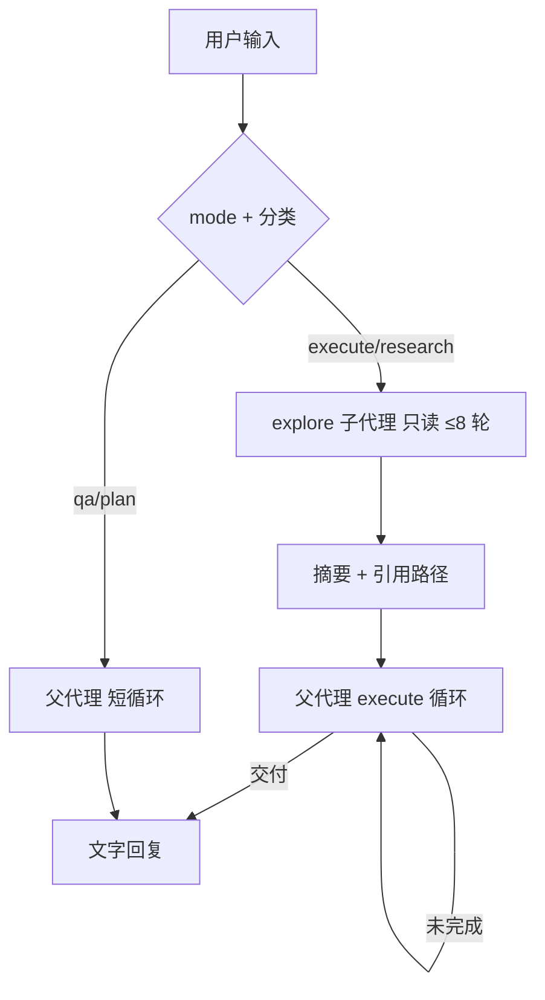

# 对话编排设计（ORCHESTRATION）

> 版本 **0.2.2** · 2026-07-12 · **设计文档**（Phase 7，M5）  
> 目标：单轮体验对齐 Cursor——**该答就答、调研进子代理、大任务在父代理分段做完**。  
> **核心机制：子代理（方案 D）**，不是「execute=15 轮」一类固定上限。  
> **T-907**（已实现）：[MODE-BUDGET.md](./MODE-BUDGET.md) — 预算跟 `turn_mode`，意图仅管提示。

---

## 1. 问题与结论

| 现象 | 旧思路（已否决） | 新结论 |
|------|------------------|--------|
| 决策题撞 10 轮 | qa=2 / plan=5 表 | **父代理纪律** + 无工具直接答 |
| 大 task 做不完 | 把 execute 调到 15、50… | **固定轮次必败**；改 **子代理 + 父代理续跑** |
| 调研占满预算 | 主循环里狂 read | **explore 子代理**（只读、独立预算） |
| 动手写不完 | 单 loop 硬顶 | **父代理 execute 可多 segment**（见 T-705） |

**对齐 Cursor 的是什么**

- **Task / explore 子代理**：调研在子上下文，父会话只收摘要  
- **Ask / Agent 模式**：能力开关，不是轮数表  
- **宽预算 / 可续跑**：大活跨 segment 做完，不靠一个 magic number  

**不做什么**

- 不增加第 7 个 Builtin（子代理是 **内核编排**，不是 LLM function）  
- 不用「intent → 固定轮次」作为任务能否完成的条件  

---

## 2. 架构总览

```text
用户一行输入
  → [T-702] turn_mode: ask | agent
  → [T-703] 轻量分类：qa | plan | execute | research（explore 触发 + 意图条；**T-907 不决定预算**）
  │
  ├─ turn_mode=ask → 父代理短循环（≤ PARENT_SHORT_MAX）
  │
  ├─ turn_mode=agent → 父代理多 segment（T-705 + T-907，≤ PARENT_EXECUTE_*）
  │     research/execute 且需上下文 → 可选 [T-706] explore 子代理
  │
  └─ recall → 无 tools 父循环（T-905）
```



| 角色 | 工具 | 预算 | 持久化 |
|------|------|------|--------|
| **explore 子代理** | read/list/grep/web/fetch | 默认 **8** 轮 / 次 | 仅摘要进父会话；子 messages **不落** `messages.jsonl` |
| **plan 子代理**（Phase 39 · 设计） | plan tools + patch 提案 | 默认 **3** 轮 | 摘要 + 侧栏采纳卡；见 [PLAN-SUBAGENT.md](./PLAN-SUBAGENT.md) |
| **父代理（ask）** | 同上（**无** run_evolved） | **≤5**（`PARENT_SHORT_MAX`） | 正常 `messages.jsonl` |
| **父代理（agent）** | 同上 + run_evolved | 每 segment **50**；可多 segment；总顶 **50**（T-907） | 每 segment 追加消息 |

---

## 3. 与 Cursor 的对照（非复制）

| Cursor | my-agent 对应 |
|--------|----------------|
| Ask 模式 | T-702 `只聊` |
| Agent 模式 | T-702 `动手`（默认） |
| Task explore 子代理 | **T-706** `SubagentRunner(explore)` |
| 主会话写文件 | 父代理 + `run_evolved` |
| 单轮很多 tool call | 父/子均支持并行 `tool_calls`（计 1 轮） |
| 大 task 跨 turn 续做 | **T-705** execute segment 续跑 |

---

## 4. T-706 — 子代理（核心）

### 4.1 模块

**新建** `agent-core/subagent.py`

```python
@dataclass
class SubagentResult:
    kind: Literal["explore"]
    summary: str
    paths_cited: list[str]
    tool_rounds: int
    truncated: bool  # 撞子代理 cap 时 true

class SubagentRunner:
    def run_explore(
        self,
        task: str,
        *,
        session: Session,
        llm: ChatClient,
        max_rounds: int = 8,
    ) -> SubagentResult: ...
```

- 子代理使用 **独立** `working_messages`（system + user task + tool 往返）  
- **禁止** `run_evolved`（executor 层拦截或根本不注册 run_evolved tool schema）  

**规划（Phase 17 · 设计已决）**：并列种类 **`checker`**（监工验收）— 见 [CHECKER-SUBAGENT.md](./CHECKER-SUBAGENT.md) v0.2.0；与 **explore**（调研）对称，另调 DeepSeek、独立 5 轮预算；M0 手动、只读，硬 demo 由 [RUNTIME-GUARDS.md](./RUNTIME-GUARDS.md) Phase 16 提供。
- 最后一轮 **必须** 产出文字摘要（撞 cap 时内核追加：「请根据已读内容输出摘要」）  
- 摘要上限 **4000** 字符，超出截断并设 `truncated=true`  

### 4.2 触发方式（MVP 两层）

| 触发 | 说明 |
|------|------|
| **自动** | `turn_intent` 为 `execute` 或 `research`，且用户句含「造/实现/查/读/参照」等 → 先跑 explore，再进父循环 |
| **显式** | CLI：`探索 …` / `调研 …` / `explore …`（`main.py` 解析，只跑子代理并打印摘要） |

**不**暴露给 LLM 为第 7 个 function（避免模型乱 spawn）。Phase 7b 可选：父代理在 system 里说「需要调研时请用户说 `探索`」。

### 4.3 摘要注入父代理

explore 结束后，在父代理 system overlay 追加：

```text
[子代理摘要 · explore]
任务: …
已读: evolve/tools/coding/run_demo/tool.toml, …
结论: …
（子代理已用 6/8 轮；若 truncated 会注明）
```

父代理 **不再** 为同一事实重复 `read_file`，除非摘要标 `truncated`。

### 4.4 日志

`evolve_log.jsonl` 新事件：

```json
{"event":"subagent_run","kind":"explore","tool_rounds":6,"truncated":false,"paths_cited":[...]}
```

### 4.5 改什么

| 文件 | 变更 |
|------|------|
| `agent-core/subagent.py` | **新建** |
| `agent-core/agent.py` | `run_turn` 在父循环前可选调用 `SubagentRunner` |
| `agent-core/main.py` | `探索`/`调研` 命令 |
| `agent-core/tools/logging.py` | `EVENT_SUBAGENT_RUN` |
| `agent-core/loader.py` | overlay 格式 `[子代理摘要]` |
| `docs/RUNTIME.md` | §7 子代理流程 |

### 4.6 验收

```powershell
cd D:\my-agent\agent-core
python subagent.py demo     # mock LLM：≤8 轮、无 run_evolved、有摘要
python agent.py             # 含 [PASS] T-706: execute 先 explore 再父循环
python main.py --demo       # 含 [PASS] T-706: 探索 命令
```

**对话验收**（有 key）：

```text
you> 探索 evolve/tools/coding 里 run_demo 和 run_tests 各做什么
# → 仅子代理；打印摘要，父循环 0～1 轮

you> 按 run_demo 模式造 bar 工具并更新 TASKS（coding 主题）
# → 子代理读范例 → 父代理 write_evolve ×2；不应在父循环里狂 read
```

---

## 5. T-705 — 父代理 execute 续跑（大 task）

固定「15 轮」不够。父代理对 **execute** 用 **多 segment**：

```text
segment 1: tool loop ≤ PARENT_EXECUTE_SEGMENT_MAX (默认 50)
  → 若已有 assistant 文字且含「交付完成」标记 → 结束
  → 若 tool_loop_exceeded 但 evolve_log 显示 write_evolved 成功 → segment 2
  → 若连续无进展 → 停止并说明已完成部分

总安全顶: PARENT_EXECUTE_TOTAL_MAX (默认 50 tool rounds / 用户消息)
```

**进展**定义（任一即可）：

- 本轮 `run_evolved` 且 `ok: true`  
- 或 assistant 明确勾选 checklist 下一项  

**对用户**：默认 **自动续 segment**（CLI 打印 `…继续执行 (segment 2/…)`）；可 env `MY_AGENT_AUTO_CONTINUE=0` 改为提示输入 `继续`。

> **Phase 20（已决）**：[TASK-STOP.md](./TASK-STOP.md) v0.2.0 — **project 壳**默认关闭同 turn auto-continue，改为「每 `TASKS.md` 条目一停」；grow 仍按上表。

### 5.1 改什么

| 文件 | 变更 |
|------|------|
| `agent-core/agent.py` | execute 多 segment 循环 |
| `agent-core/loader.py` | cap 消息改为「已完成部分 + 输入继续」 |

### 5.2 验收

```powershell
python agent.py    # [PASS] T-705: mock 大 execute 跨 2 segment 完成
```

---

## 6. T-701 — Prompt 纪律（保留）

父代理 `core.txt` 增加 **Turn discipline**，要点：

1. qa/plan：**先答**；不因排序读 `TASKS.md`  
2. 调研：**交给子代理**（已注入摘要时勿重复读）  
3. execute：对照摘要里的范例 **直接** `write_evolve`  
4. 同一轮 **并行** 多个只读 `tool_calls`  

详见 v0.1.0 §3 草案；overlay 改为展示 `subagent: used` 而非 `tool_budget: 15`。

---

## 7. T-702 — Ask / Agent（保留）

与 v0.1.0 §4 相同：`只聊` 禁 `run_evolved`；**子代理 explore 在 ask 模式仍可用**（只读）。

---

## 8. T-703 — 轻量分类（降级）

**不再**输出 `tool_loop_max` 表。只决定：

| intent | 子代理 | 父代理模式（**v0.2.0 实现，T-907 修正见下**） |
|--------|--------|------------------------------------------------|
| `qa` | 否 | 短循环 |
| `plan` | 否 | 短循环 |
| `research` | **是** | 短循环 + 摘要回答 |
| `execute` | **是**（默认） | 多 segment execute |

实现：`turn_intent.py` 仅 `classify_turn()` + `should_spawn_explore()`。

> **T-907（[MODE-BUDGET.md](./MODE-BUDGET.md)）**：上表「父代理模式」列由 **`turn_mode`** 决定，不由 intent。`agent` → 统一多 segment；`ask` → 短循环。intent 仅保留子代理触发与 overlay 纪律。

---

## 9. T-704 — 软提醒（可选、弱化）

- 子代理 cap：强制摘要（T-706 内置）  
- 父代理 segment cap：触发 **T-705 续跑**，不是失败  
- 仅 **qa 短循环** 仍可在 max-1 轮软提醒「请直接回答」  

---

## 10. 实施顺序

```text
T-701  prompt 纪律
T-702  ask/agent
T-706  子代理 explore     ← 核心
T-703  分类 + 触发子代理
T-705  execute 多 segment
T-704  可选收尾
```

| 优先级 | ID | 说明 |
|--------|-----|------|
| P0 | **T-706** | 子代理 |
| P0 | **T-705** | 大 task 续跑 |
| P1 | T-702 | 模式 |
| P1 | T-701 | 纪律 |
| P2 | T-703 | 自动触发 |
| P3 | T-704 | 软提醒 |

---

## 11. 环境变量

| 变量 | 默认 | 说明 |
|------|------|------|
| `SUBAGENT_EXPLORE_MAX` | 8 | 子代理只读轮次 |
| `SUBAGENT_SUMMARY_MAX_CHARS` | 4000 | 摘要上限 |
| `PARENT_SHORT_MAX` | 5 | **仅 `turn_mode=ask`** 父循环（T-907） |
| `PARENT_EXECUTE_SEGMENT_MAX` | 50 | **`turn_mode=agent`** 每 segment（T-907） |
| `PARENT_EXECUTE_TOTAL_MAX` | 50 | **`turn_mode=agent`** 每条用户消息总 tool 轮 |
| `MY_AGENT_AUTO_CONTINUE` | 1 | **agent 模式** segment 续跑 |

---

## 12. Phase 7 完成标志

- [x] `探索 …` 只跑子代理，父会话收到摘要，**0 次** run_evolved  
- [x] 「造工具」类：子代理读范例 ≤8 轮，父代理 `write_evolve`，**不在父循环重复读范例**  
- [x] 大 execute（≥3 次 write_evolve）可 **跨 segment** 完成，不裸 `tool loop exceeded`  
- [x] `只聊` 下子代理可用、run_evolved 拒绝  
- [x] `python subagent.py demo` + `agent.py` + `main.py --demo` exit 0  

---

## 13. 开放问题

| # | 问题 | 建议 |
|---|------|------|
| 1 | 子代理是否用 pro 模型 | 默认与父会话相同；coding 主题已是 pro |
| 2 | 以后要不要 `execute` 子代理 | defer；MVP 父代理直接 write_evolved |
| 3 | 子代理摘要进不进 digest | **否**；仅当前 turn overlay |
| 4 | 自动 explore 是否太激进 | **项目模式**：Phase 48 禁内核预 spawn，仅父调；全局 kill：`MY_AGENT_AUTO_EXPLORE=0`；见 [AGENT-PARENT-ORCHESTRATION.md](./AGENT-PARENT-ORCHESTRATION.md) · [BUG-027](./bugs/2026-08-06-explore-auto-spawn-wrong-scope.md) |

---

## 14. 文档历史

| 版本 | 日期 | 说明 |
|------|------|------|
| 0.1.0 | 2026-07-10 | 初稿：T-701～704，固定轮次表 |
| 0.2.0 | 2026-07-10 | **子代理为核心**；T-706/T-705；轮次表降级；对齐 Cursor Task |
| 0.2.1 | 2026-07-12 | 指针 [MODE-BUDGET.md](./MODE-BUDGET.md) T-907：模式驱动预算（已实现） |
| 0.2.2 | 2026-07-12 | §2 架构图与 §11 环境变量对齐 T-907 实现 |
