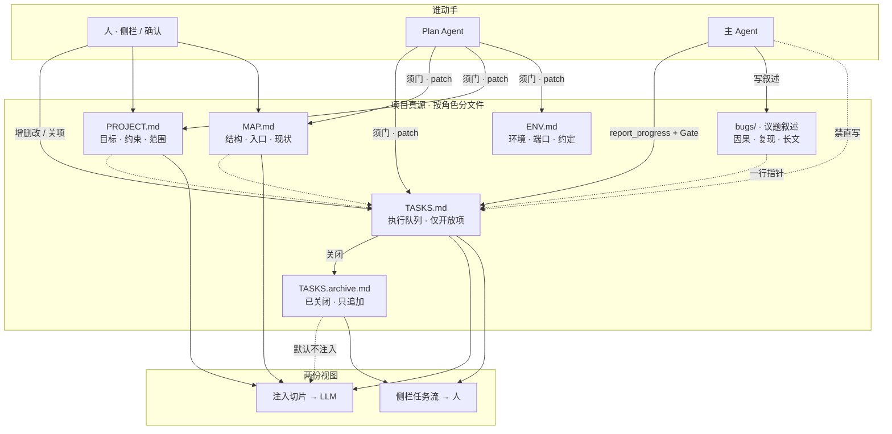
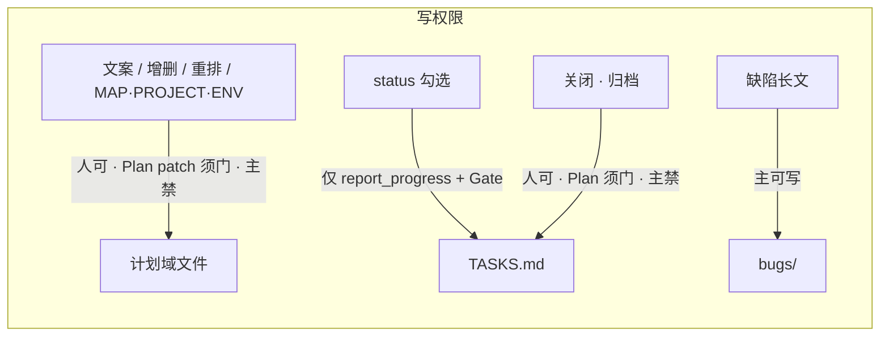

# 计划域架构（PLAN-ARCH）

> 版本 **0.5.1** · 2026-08-03  
> **状态**：**设计已决 · M1～M3 + M5 + M6 已落地**；Phase 38 已落地但 **superseded by Phase 39**（[PLAN-SUBAGENT.md](./PLAN-SUBAGENT.md)）  
> 关联：[PROJECT-MODE.md](./PROJECT-MODE.md) · [PROJECT-SIDEBAR.md](./PROJECT-SIDEBAR.md) §15.11 · [PROGRESS-GATE.md](./PROGRESS-GATE.md) · [TASK-STOP.md](./TASK-STOP.md)  
> 触发：huiyi 口头完成绕过 Plan；`TASKS.md` 单文件膨胀；反窄化——多文件按**角色**拆。  
> **M6**：Plan 读写提案；废止默认行号 LLM ops。  
> **A10/A11/A12**：Plan 用户通道 = 主输入 **自动路由**；上下文与主 Agent 隔离；查跑同权、计划域须门。

---

## 0. 已决摘要

| ID | 决议 |
|----|------|
| **A0** | **硬结构约束计划域**；不靠加长提示词防无限加项 / 单文件扛全场 |
| **A1** | **多文件 = 角色隔离**（目标 / 地图 / 队列 / 缺陷叙述 / 归档），**不是**多份同级 `TASKS` 互改 |
| **A2** | **唯一执行队列**仍是 `TASKS.md`（仅开放可武装项）；完成后进归档，默认不注入 LLM |
| **A3** | **真源 ≠ 注入**：磁盘可保留全历史；每回合只注入 **armed + 当前 Phase 开放项 + 相关指针摘要** |
| **A4** | **写权限按动作分角色**：主 Agent 对队列只有 `report_progress`（status）；增删改文案 / 归档关闭走 Plan（须门）或人 |
| **A5** | **跨文件只挂指针**：缺陷长文在 `bugs/`（或议题文件）；队列一行 = id + 短验收 + 路径指针；禁止把叙述复制成第二真相 |
| **A6** | **完成通知 Plan = `report_progress` 成功**（继承 [PROGRESS-GATE.md](./PROGRESS-GATE.md) G8/G9）；**不**另开浏览器会话。用户 Plan **通道**见 A10/A12（主输入自动路由），与「完成通知」正交 |
| **A7** | **侧栏不常驻整份计划**。侧栏只放**当下要拍板的**：当前/armed 任务、待采纳提案卡、一停/异常短告知。完整 `TASKS.md` / 归档 = **覆盖面板或打开文件**，不是主栏永久任务流长卷 |
| **Q1** | **无人值守落盘**：`add` / 改文案 / 关项 = **提案不落盘**；仅 `[ ]→[x]`（经 Progress Gate）可自动写；Phase 22 低风险侧栏 auto_apply **不含** `add_tasks` |
| **Q2** | **归档形态**：**首选** 同项目 `TASKS.archive.md`（只追加）；过渡期允许 `TASKS.md` 内「已关闭」折叠区，但对 LLM **等价不可见** |
| **Q3** | **关闭理由枚举**：`done` / `wontfix` / `duplicate` / `moved`（实现期文案可微调，集合不扩张除非改本文） |
| **A8** | Plan 对计划域文件默认走 **读写提案**（读真源 → 提 patch），**不是**行号专用 JSON ops（`move`/`drop`/`skip`/`split`/`reorder` + `line`）作为主通道 |
| **A9** | 落盘仍须 **侧栏采纳**（继承 Q1）；采纳卡展示 **diff/patch 片段**，禁止默认整文件替换预览 |
| **Q4** | **专用结构化通道白名单**（除此之外一律 patch 提案）：① Progress Gate / `report_progress` 勾选；② Phase 22 低风险 `auto_fix`（如精确重复行）；③ 人在侧栏的直接勾选/右键（非 LLM）。**默认不新增**行号 LLM ops；M2 遗留的 `move`/`drop`/… 提案路径在 M6 **废止或仅兼容只读迁移** |
| **A10** | Plan **用户通道** = 主区 **单一输入** + **自动路由**（[PROJECT-SIDEBAR.md](./PROJECT-SIDEBAR.md) §15.11.1 C9）；侧栏保留决策面，不堆 Plan 长回复。修订 Phase 22 V1/V7 |
| **A11** | Plan **上下文隔离**：只吃 Plan 本线 + 计划域文件真源；**不灌**主聊天；**进项目清空** Plan 聊。工具 **查/跑同权**，计划域四件套写仍须门（C4～C7） |
| **A12** | **路由纪律**：`classify_user_plan_intent` 不确定 → **主 Agent**；`force_agent`（Alt+发送）可覆盖；路由 **不写** `messages.jsonl`（IT-71′ / IT-192） |
| **B0～B7** | **Phase 39** 单子代理：废止 A10～A12 双通道 UX；见 [PLAN-SUBAGENT.md](./PLAN-SUBAGENT.md) · [PROJECT-SIDEBAR.md](./PROJECT-SIDEBAR.md) §15.12 |

---

## 1. 动机

### 1.1 要解决什么

| 现象 | 根因 |
|------|------|
| 证据门拒勾后仍口头「✅ 完成 · 继续」 | 完成通道未当成唯一真写口（G8/G9 已补纪律；本架构钉死落盘路径） |
| 计划无限加、文件膨胀、模型读一堆无效项 | **存储与注入未分离**；已完成项仍进提示词 |
| 「整个项目只剩一个 md」 | 执行时一切往 `TASKS.md` 倒；`PROJECT` / `MAP` / 缺陷叙述沦为摆设 |
| 「多几份 TASKS 交叉验证」 | 同级互改无裁判 → 冲突时无法裁；**不采纳** |

### 1.2 非目标（本期）

| 非目标 | 理由 |
|--------|------|
| 多份并行执行队列互相同步 | A1：无裁判 |
| 用 LLM 自由裁定「该不该加任务」无门落盘 | 与 A0/A4 冲突 |
| 复制 Jira 全量工作流 / 多项目看板 | 个人本地 Agent；先角色与写权限 |
| 取代 Progress Gate / 一停 / Plan Agent | 本文件是其上的**域架构**；细节仍归既有文档 |
| 侧栏必须常驻整份 TASKS 长卷 | **A7 否决**；完整计划另开视图 |

### 1.3 变更包与影响范围（T-5834）

计划域每次只处理一个 `CHG-*` 变更包。变更包至少包含：变更路径、关联 ID、验收条件和执行任务。Plan Agent 生成同步建议时，必须先锁定当前阶段，再按 manifest 的 `depends_on` 与 ID 引用计算影响范围。

侧栏和执行门将结果分为：

- **本阶段阻塞**：当前出口依赖缺失或 L2 stale；阻塞执行。
- **本次变更受影响**：直接拥有/引用变更 ID 的制品；提示同步但不自动扩散。
- **后续阶段待完善**：由 `required_for` 标记为未来阶段需要；不阻塞当前任务。
- **可选完善**：没有当前交付关联；不进入默认任务队列。

“某文件不完整”本身不是递归补齐理由。只有新增/修改了它拥有的事实，或当前任务明确引用它，才允许生成跨文件同步提案。若同步会改变范围、验收、API 契约或 Phase，统一转为一次 `plan_dirty` + mini-confirm。

采纳后的 freshness 更新遵循“当前制品 + 直接下游”规则，不沿 `depends_on` 递归把整条文档链标成 stale。旧提案、并发采纳或服务端重启导致卡片失效时，服务端返回 `ok: false` 的结构化状态并刷新建议队列；前端不得继续保留已失效卡，也不得把异常当成新的文档缺项。

---

## 2. 总图

```text
                    ┌─ 人 · 侧栏 / 确认 ─────────────┐
                    │  改文案 · 增删 · 重排 · 关项     │  高风险写
                    ▼                                │
            ┌───────────────┐                        │
            │  执行队列      │◄── Plan Agent ─────────┘  中风险写（须门）
            │  TASKS.md     │
            │  仅开放项      │◄── report_progress + Gate   只写 status
            └───────┬───────┘
                    │ 完成后搬迁 / 关闭
                    ▼
            ┌───────────────┐
            │  归档          │  只追加 · 默认不注入
            │  TASKS.archive │
            └───────────────┘

  PROJECT.md ──范围──┐
  MAP.md ──结构──────┼──► 注入切片（LLM）+ 侧栏（人）
  ENV.md ──环境──────┤
  bugs/ ──长文叙述───┘     队列内仅指针，不复制正文
```



---

## 3. 文档角色表

| 文件 / 目录 | 职责 | 允许写入的内容 | 禁止 |
|-------------|------|----------------|------|
| **PROJECT.md** | 目标、非目标、约束、验收口径 | 范围变更（人 / Plan 低频） | 当勾选清单用 |
| **MAP.md** | 目录、入口、现状指针 | 结构与「现在卡在哪」的地图级更新 | 复制整份任务列表 |
| **ENV.md** | 环境、端口、密钥约定（不写密钥本体） | 环境事实 | 任务 checkbox |
| **TASKS.md** | **唯一执行队列**：开放、可武装、可勾 | `- [ ]` 项；短标题；证据类暗示（Entity/编译/测试…或口语「写/接口」）；可选 **`[evidence:write|…]`**；指向 bugs/MAP 的链接 | 长复现、设计长文、已关闭项堆积 |
| **TASKS.archive.md**（或等价） | 已关闭历史 | 关闭时追加一行（含理由、来源回合可选） | 主 Agent 直写；默认进提示词 |
| **bugs/**（或 `docs/bugs` 项目内约定） | 缺陷 / 议题叙述 | 因果、复现、分析 | 代替队列里的「下一步动手项」 |

**已有三件套不变**：立项仍生成 `PROJECT` / `MAP` / `TASKS`；本架构要求**执行期守角色**，并把「已关闭」从注入面剥离。

---

## 4. 写权限表（字段 / 动作级）

| 动作 | 主 Agent | Plan Agent | 人 |
|------|----------|------------|-----|
| 勾选完成 `[x]` | 仅 `report_progress` + Progress Gate | 执行 toggle | 仅规则/身份异常卡（G4） |
| 改任务文案 / 证据类 | 禁 | **须门**：对 `TASKS.md` 的 **patch 提案**（A8/A9）；人接受才落盘（含加 **`[evidence:…]`** 标签） | 可 |
| `add_tasks` / 新增开放项 | 禁直写 | **须门**：`TASKS.md` patch 提案（插入 `- [ ]` 行） | 可 |
| 重排 / 删除开放项 | 禁 | **须门**：`TASKS.md` patch 提案（不再用行号 `move`/`drop` LLM ops） | 可 |
| 关闭并归档（非「完成勾选」语义的 wontfix 等） | 禁 | 须门 + 关闭理由（Q3）；实现上可为 patch + 归档追加，或白名单归档 helper | 可 |
| 写 / 改 `MAP.md` · `PROJECT.md` · `ENV.md` | 禁直写计划域真源（执行期）；叙述性旁路不替代地图 | **须门**：对应文件的 **patch 提案**（A8/A9）；即使用户切到 Plan 通道且 Plan 有写工具，**亦不得直写**这四件套 | 可 |
| 读文件 / 搜 / `run_command` 等查跑 | 可（主 Agent 既有） | **与主 Agent 同权**（A11 / C7）；结果进 **Plan 线**，不回灌主 transcript | 可 |
| 写业务代码 / `bugs/` | 可 | 可（与主同权；实现期可收） | 可 |
| 从叙述**晋升**为队列项 | 禁直写队列 | `TASKS.md` patch 提案 + 指针 | 可 |



---

## 4.1 Plan 读写提案（A8 / A9 / Q4 · M6）

### 要解决什么

现行 Plan LLM 主通道是专用 JSON ops（`kind=move` + `line`…）。开放队列为空或用户谈 **MAP** 时，模型仍会编造行号（如 `line 0` = 文档标题），侧栏出现「采纳写入」→ 落盘报 `line N is not a task checkbox`。  
**根因**：把「读文件、改文案」硬塞进队列行号工具，而不是读写。

### 已决形态

| 项 | 决议 |
|----|------|
| 默认通道 | Plan **读**项目内计划域文件 → 产出 **patch 提案** → 侧栏展示 → 人 **采纳** 才写盘 |
| 可写文件（须门） | `TASKS.md` · `MAP.md` · `PROJECT.md` · `ENV.md`（默认可；bugs 可选） |
| 预览 | **只展示改动片段（diff/patch）**；禁止默认整文件替换预览 |
| 专用 ops | 仅 Q4 白名单；**废止** LLM 默认 `move`/`drop`/`skip`/`split`/`reorder`+`line` 提案路径 |
| 与 Q1 | 不变：无人值守不落盘；勾选仍只走 Progress Gate |

### 建议卡 / 协议草案（动手可微调）

```json
{
  "id": "sug-…",
  "kind": "file_patch",
  "title": "短句（如：重命名 MAP Phase 6 章节）",
  "body": "可选一句理由",
  "risk": "gate",
  "action": "apply_patch",
  "payload": {
    "path": "MAP.md",
    "base_hash": "可选：防冲突",
    "diff": "unified diff 或等价 hunk 列表",
    "summary": "改了什么"
  }
}
```

- 侧栏：`[采纳写入]` → 将 patch 应用到 `workspace/<id>/<path>`；失败则撤回该卡并侧栏告知（禁止只往主聊天甩英文 `ProjectModeError`）。  
- `[忽略]` → 与现网建议卡忽略冷却一致。  
- 多文件一次意图 → **多张** patch 卡（每文件一张）或一张卡多 hunk（实现期二选一，默认倾向每文件一张，便于拒绝单文件）。

### 非目标（M6）

| 非目标 | 理由 |
|--------|------|
| Plan 无人值守直写计划域 | 与 Q1/A9 冲突 |
| 主 Agent 侧栏化 / 第二套聊天 | V1 / A7 |
| 用 patch 绕过 Progress Gate 勾选 | 勾选仍唯一通道 |
| 一次上「任意路径写整个 workspace」 | 写范围仍限计划域角色文件 |

### 迁移

| 现状（M2） | M6 后 |
|------------|--------|
| `operations: [{kind:move,line,phase}]` 停车提案 | 改为读 `TASKS.md` → patch 挪行/改标题 |
| 用户谈 MAP Phase 命名 | 读 `MAP.md` → patch 章节，**不**碰 TASKS 行号 |
| 质检 `too_short` / `split` 等结构化卡 | 可保留为 **生成 patch 的前端由**，或逐步收成 patch；验收以「可点采纳且落盘正确」为准 |

---

## 5. 生命周期与注入

### 5.1 任务状态（逻辑）

```text
open（在 TASKS.md）
  │
  ├─ armed（本回合武装）──► 主 Agent 执行
  │                              │
  │                              ▼
  │                     report_progress ok ──► done ──► 归档
  │                     report_progress 拒 ──► 仍 open（G9：禁口头完成）
  │
  └─ 人/Plan 关闭（wontfix / duplicate / moved）──► 归档（带理由）
```

### 5.2 注入切片（给 LLM）

**默认包含**：

- 当前 `armed_task_id` / `armed_task_text`（若有）
- 当前 Phase（或等价分组）下未完成项（硬顶条数，实现期定数，建议 ≤20）
- 相关指针一行摘要（如 `bugs/xxx.md` 标题）
- `PROJECT` / `MAP` 的短摘要或已有 overlay 机制（不整文件硬塞）

**默认排除**：

- `TASKS.archive.md` 全文
- 其它 Phase 的大段已完成勾选
- `bugs/` 正文（除非本回合工具显式 `read_file`）

### 5.3 侧栏（给人）· A7

**侧栏常驻（瘦）**：

| 块 | 内容 |
|----|------|
| 当前任务 | armed / 下一项短文案 + 进度 `done/total`（数字即可） |
| 待拍板 | 建议卡 / 门禁提案（采纳写入 · 忽略） |
| 短告知 | 一停、partner_notices、auto_fix 摘要 |

**不常驻**：

- 整份 `TASKS.md` markdown 长卷
- 归档全文、历史 Phase 大段勾选

**完整计划**：覆盖面板（「计划」入口）或用户打开 `workspace/<id>/TASKS.md`；归档同理可展开回看。  
**打开归档 / 完整计划 ≠ 改活线会话**（与 [PROJECT-THREADS.md](./PROJECT-THREADS.md) 正交）。

修正 [PROJECT-SIDEBAR.md](./PROJECT-SIDEBAR.md) §2.1 / §6「始终展示任务流长卷」——以 **A7** 为准；侧栏仍是 Plan 的主 UI 表面，但表面内容 = **当下决策面**，不是文件浏览器。

---

## 6. 与既有机制的边界

| 机制 | 关系 |
|------|------|
| [PROJECT-SIDEBAR.md](./PROJECT-SIDEBAR.md) Plan Agent | 仍是计划域主人；**§15.11** 起用户通道在主输入；侧栏决策面 + 采纳卡；本文件钉死写权限与注入 |
| [PROGRESS-GATE.md](./PROGRESS-GATE.md) | 勾选硬闸；A6 = G8/G9 |
| [TASK-STOP.md](./TASK-STOP.md) | 一停不变；成功勾选后同 turn 禁再 report / 禁写下一项产物 |
| [PROJECT-MODE.md](./PROJECT-MODE.md) 三件套 / 计划确认 | 开工前确认仍管「能不能执行」；本架构管「执行期计划怎么长、怎么写」 |
| [PROJECT-THREADS.md](./PROJECT-THREADS.md) | 砍的是会话线，不是计划文件；新开线不自动改 TASKS；**进项目清空 Plan 聊**（A11）与砍线正交 |

---

## 7. 实施分期（文档先行）

| 里程碑 | 内容 | 状态 |
|--------|------|------|
| **M0** | 本文 + MAP/TASKS Phase 37 挂钩 | **done**（T-3700） |
| **Q 签** | Q1～Q3 升为已决 | **done**（T-3701 · v0.2.0） |
| **M1** | 注入切片：侧栏/loader 只喂开放项；归档文件或折叠区对 LLM 不可见 | **done**（T-3702 · IT-180） |
| **M2** | `add_tasks` / 改文案落盘门（对齐 Q1）；来源字段（谁、何时）可审 | **done**（T-3703 · IT-181） |
| **M3** | 关闭理由 + 搬迁归档（Q2/Q3）；跨文件指针约定进模板 / prompt | **done**（T-3704） |
| **M4** | 可选：bugs 晋升队列的侧栏动作 | todo / defer |
| **M5** | 侧栏瘦身（A7）：常驻 = 当前任务 + 提案卡；完整 TASKS → 覆盖面板 | **done**（T-3706 · S-182） |
| **M6** | Plan **读写提案**：计划域文件 patch + 侧栏 diff 采纳；废止默认行号 LLM ops（A8/A9/Q4） | **done**（T-3707～T-3710 · IT-182/183） |
| **双通道** | 主输入自动路由 Plan；上下文隔离；查跑同权（A10/A11/A12 · §15.11） | **done**（Phase 38 · T-3801～T-3805） |

---

## 8. DOC-04 准入

### 8.1 影响矩阵行（STABILIZATION §3）

| 面 | 影响 | 档位 |
|----|------|------|
| project 执行 / 计划门 | 队列写入路径收紧；确认开工语义不变 | P0 回归 S-06～S-09 |
| Plan Agent / 侧栏 / 主输入 | 增删改须门；注入切片；M6 patch 卡；**A10/A11/A12 自动路由** | P1 · **S-183/184 · S-190～193** |
| report_progress / Progress Gate | 不变，作为唯一勾选通道 | 回归 IT-70～73 · S-70～75 |
| grow / host / 壳合并 | **无** | — |

### 8.2 回归 / 新增 ID

| ID | 用途 |
|----|------|
| **S-180** | 开放队列注入不含归档项（手工或半自动） |
| **S-181** | 主 Agent 直写 TASKS 仍拒；完成只经 report_progress |
| **S-182** | 侧栏常驻无整份 TASKS 长卷；完整计划仅覆盖面板（M5） |
| **S-183** | 谈 MAP 结构 → 出现 `MAP.md` patch 卡（含 diff 片段），**不**出现行号 `move` 卡（M6） |
| **S-184** | 采纳 patch 前磁盘不变；采纳后仅目标文件按 diff 变更；忽略不落盘（M6） |
| **S-190** | 计划域话术经主输入 **不进主 Agent turn**（自动路由或显式 Plan 消息） |
| **S-191** | Plan 回复为主区独立样式；侧栏无同等长文堆叠 |
| **S-192** | 进项目后 Plan 线为空；仅文件真源 |
| **S-193** | 自动路由时主区 **「你 · 计划」** 气泡可辨（§15.11.1） |
| **IT-180** | 注入切片构造：归档项不出现在 project overlay 文本 |
| **IT-181** | add_tasks（或等价）无接受不落盘（M2；M6 后改为 patch 等价断言） |
| **IT-182** | `apply_patch`：非法/过期 base 拒绝且不写盘；有效 hunk 写入（M6） |
| **IT-183** | LLM/解析路径不再因 `move line 0` 停车可点坏卡（M6） |
| **IT-190** | Plan 请求上下文不含主聊天 messages 全文（Phase 38） |
| **IT-191** | Plan 写计划域四件套无采纳不落盘；查/跑工具可用 |
| **IT-192** | `user.message` 自动路由 Plan：`classify_user_plan_intent` · `force_agent` 绕过 · 不写 `messages.jsonl`（§15.11.1） |

回归既有：`test_project_progress_loop` · Progress Gate 测 · Plan/sidebar 相关测 · S-07/S-08。

---

## 9. 修订记录

| 版本 | 日期 | 说明 |
|------|------|------|
| **0.1.0** | 2026-08-03 | 初稿：角色多文件 · 唯一队列 · 写权限 · 注入/归档 · Q1～Q3 默认倾向 |
| **0.2.0** | 2026-08-03 | Q1～Q3 签字并入 §0；开放项节删除；M1 解锁 |
| **0.2.1** | 2026-08-03 | M1：`build_tasks_injection_slice` · overlay `open_queue` · Plan 编号开放切片 · IT-180 |
| **0.2.2** | 2026-08-03 | M2：Plan LLM / fallback / report_progress add·move·drop 等提案不落盘；侧栏采纳写入 · IT-181 |
| **0.3.0** | 2026-08-03 | M3：勾选/删除→`TASKS.archive.md`；已关闭区迁移；模板/prompt 指针约定 |
| **0.3.1** | 2026-08-03 | **A7**：侧栏不常驻整份计划；§5.3 重写；M5 / T-3706 |
| **0.3.2** | 2026-08-03 | M5 UI：决策面 +「完整计划」覆盖面板；侧栏常驻无 TASKS 长卷（S-182） |
| **0.4.0** | 2026-08-03 | **A8/A9/Q4 · M6 设计**：Plan 读写提案 + 侧栏 diff 采纳；废止默认行号 LLM ops；写权限表扩 MAP/PROJECT/ENV |
| **0.4.1** | 2026-08-03 | M6 代码：`plan_patch` · `apply_patch` 卡 · 废止 LLM move/drop/…；IT-182/183 |
| **0.5.0** | 2026-08-03 | **A10/A11**：主输入双通道设计；Plan 上下文隔离 / 进项目清空；查跑同权·计划域须门；链 §15.11 · Phase 38 |
| **0.5.1** | 2026-08-03 | **A12 · §15.11.1**：主输入 **自动路由** Plan（C9）；撤销手动通道切换为默认 UX；S-193 · IT-192 · T-3805 |
