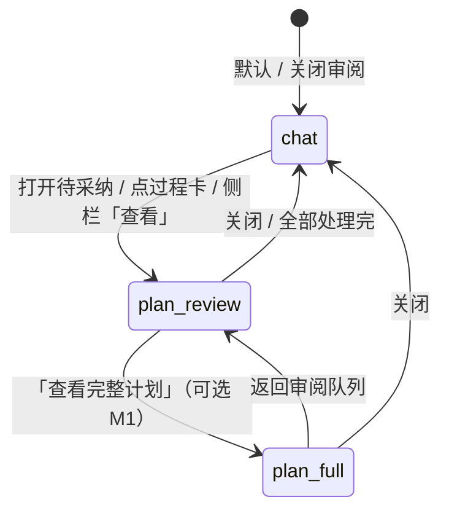

# 计划审阅主列（PLAN-REVIEW-UI）

> 版本 **0.1.0** · 2026-08-04 · **状态：设计已签（交互稿）**  
> 触发：Phase 39 单入口后，采纳 diff 挤在左窄栏（`max-height: 9rem`），完整计划看不清；对标 Cursor Plan Mode「计划开在主区、聊天在边上」。  
> 原则（用户确认）：**一个输入 · 默认聊天主列 · 审计划时主列让给计划**。  
> 关联：[PLAN-SUBAGENT.md](./PLAN-SUBAGENT.md) · [PROJECT-SIDEBAR.md](./PROJECT-SIDEBAR.md) §6/§7 · [WORKBENCH-UI.md](./WORKBENCH-UI.md)

---

## 0. 已决

| # | 结论 |
|---|------|
| P1 | **不**恢复双通道 / 双输入（废止 Phase 38） |
| P2 | **不**把完整计划长期塞左栏；左栏 = 决策入口 + 短摘要 |
| P3 | **审阅 / 采纳**占 **主列**（对标 Cursor 编辑器主区） |
| P4 | **主输入始终唯一**；审计划时仍可打字（改计划话术走 `plan_partner`） |
| P5 | Phase 39 后端不变：`plan_partner` · `project.plan.state` · 采纳 API 复用 |
| P6 | M0 **纯前端**；无新 WS 类型 |

---

## 1. 空间分工（对标 Cursor）

| Cursor | my-agent（本设计） |
|--------|-------------------|
| 编辑器主区 = 计划虚拟文件 | **主列 `plan-review` 面** = 完整 diff / TASKS 片段 |
| Agent 窄栏 = 对话 | **默认主列 = 聊天**；审计划时聊天可收成右缘或顶部条（M0 可仍可见，仅降优先级） |
| Build = 拍板 | **采纳 / 忽略**（主列底部固定操作栏） |
| Plan 与 Agent 同一会话 | 过程卡仍在聊天流；点卡 → 打开主列审阅 |

```
默认（chat）                    审计划（plan-review）
┌────────┬─────────────────┐   ┌────────┬─────────────────┐
│ 左栏    │ 主列 · 聊天      │   │ 左栏    │ 主列 · 计划审阅   │
│ 短卡入口│                 │   │ 短卡高亮│  diff / 全文     │
│        │                 │   │        │  [采纳][忽略]     │
└────────┴─────────────────┘   └────────┴─────────────────┘
         ↑ 主输入（footer 不变）──────────────┘
```

---

## 2. 主列焦点状态机



### 2.1 状态定义

| 状态 `mainFocus` | 主列内容 | 左栏 |
|------------------|----------|------|
| `chat` | `#unified-chat` 聊天流 | 当下决策面 + 待采纳 **短卡**（无完整 diff） |
| `plan_review` | `#unified-plan-review` 审阅面 | 短卡列表；当前项高亮 |
| `plan_full` | 完整 TASKS 开放队列（自 `overlayPanel=plan` 逻辑迁出） | 同左；☰ 与主列审阅互斥高亮 |

### 2.2 进入 `plan_review` 的入口

1. 侧栏采纳短卡 → **「查看」**（原 diff 区改为一行摘要 + 按钮）
2. 聊天 **过程卡** `plan-subagent`（`proposals_ready`）→ 点击卡片
3. `plan.subagent.done` 且 `proposalCount > 0` → **可选**自动打开（默认 **关**，仅闪侧栏角标；用户可设「自动展开审阅」）
4. 顶栏 / 过程卡文案：「N 条待采纳 → 审阅」

### 2.3 离开 `plan_review`

- 审阅面 **「返回聊天」** / `Esc`
- 当前队列 **全部采纳或忽略** 且无剩余 → 自动回 `chat`（toast：「计划已处理完」）
- 切换项目 / 归档线 → 强制 `chat` + 清空审阅队列焦点

---

## 3. 审阅面布局（`#unified-plan-review`）

插入位置：`unified-main` 内，与 `#unified-chat` **互斥显示**（同一槽位）。

```
┌─ 顶栏 ─────────────────────────────────────────┐
│ ← 返回聊天    计划审阅 · 2/5    [查看完整计划]      │
├────────────────────────────────────────────────┤
│ 标题：采纳写入 · TASKS.md                        │
│ 摘要：plan_partner / suggestion body（可换行）    │
├────────────────────────────────────────────────┤
│                                                │
│  diff 或 markdown 全文（可滚动，无 9rem 上限）    │
│                                                │
├────────────────────────────────────────────────┤
│  [采纳]  [忽略]  [上一条]  [下一条]               │
└────────────────────────────────────────────────┘
│  unified-composer（不变）                        │
└────────────────────────────────────────────────┘
```

### 3.1 队列数据源

优先复用现有结构，不新协议：

| 来源 | 字段 | 采纳动作 |
|------|------|----------|
| `project.plan.state.suggestions[]` | `PlanSuggestion`（`id`, `title`, `body`, `payload.diff`, `payload.path`） | `project.plan.accept_suggestion`（现有） |
| 顶栏 `evolve.proposals` | `ProposalItem` | `acceptProposal`（现有 `proposals.ts`） |

**M0 范围**：仅 **Plan 采纳卡**（`suggestions`）。evolve proposals 仍走 `#unified-expand`（已有），M1 可并入同一审阅面。

### 3.2 侧栏短卡（改造）

`renderSuggestionsBanner` 改为：

- 每条：**标题 + 一行摘要**（body 截断 80 字）
- **不渲染** `sidebar-suggestion-diff`（或仅 `+12 −3` 统计）
- 按钮：`[查看]`（主列）· `[采纳]` · `[忽略]`（保留快捷操作）

---

## 4. 过程卡（聊天内）改造

现有 `plan-subagent` 块增加：

- `data-status=proposals_ready` 时：`cursor: pointer` + `role=button`
- 副文案：「点击在主区审阅」
- 点击 → `mainFocus = plan_review`，`reviewIndex` 指向本回合关联的第一条待采纳（若可关联；否则打开队列首条）

**不**在过程卡里再塞完整 diff。

---

## 5. 与侧栏覆盖面板的关系

| 面板 | M0 行为 |
|------|---------|
| ☰ 完整计划 | 点击 → `mainFocus = plan_full`（主列），**不再**只在 `sidebar-overlay` 内滚动 |
| 地图 / 验收 / 项目 / 会话线 | 仍用 **侧栏 overlay**（辅助面，非主阅读负担） |
| `open-full-plan` 按钮 | 改绑 `mainFocus = plan_full` |

理由：完整 TASKS 与采纳审阅同属「要认真看」类，跟 Cursor 编辑器主区一致；项目列表等仍是导航，可留窄栏。

---

## 6. 组件与文件（实现地图）

| 文件 | 改动 |
|------|------|
| `desktop/src/shells/unified/index.ts` | `mainFocus` 状态；`#unified-plan-review` DOM；`chat`/`plan-review` 互斥；过程卡点击；`Esc` |
| `desktop/src/shells/unified/plan-review.ts` | **新建**：`renderPlanReview()`、`PlanReviewState`、队列导航、采纳/忽略委托 |
| `desktop/src/shells/unified/project-panel.ts` | 短卡 UI；`open-full-plan` 改发 callback；去掉侧栏内大 diff |
| `desktop/src/shells/unified/unified.css` | `.unified-plan-review`、`.unified-main[data-main-focus]` 布局 |
| `desktop/src/shells/chat-state.ts` | 可选：`plan-subagent` block 增加 `proposalIds` 供关联 |

**不改**：`agent-core/*`、WS 协议、Phase 39 `plan_partner` 流程。

---

## 7. 里程碑

| ID | 内容 | 验收 |
|----|------|------|
| **PRU-M0** | 主列审阅面 + 侧栏短卡 + 过程卡点击 | S-PRU-01～03 |
| **PRU-M1** | `plan_full` 迁主列；evolve proposals 统一审阅 UI | S-PRU-04 |
| **PRU-M2** | 偏好：「有新提案时自动打开审阅」；键盘 `j/k` 切换队列 | 可选 |

### 手工验收（S-PRU）

| ID | 步骤 | 预期 |
|----|------|------|
| S-PRU-01 | 触发 `plan_partner` 产出 ≥1 条 suggestion | 侧栏见短卡；主列默认仍聊天 |
| S-PRU-02 | 点侧栏「查看」或过程卡 | 主列全宽 diff；可滚动读完；采纳后落盘 |
| S-PRU-03 | 审阅中发送「把第三条拆开」 | 仍单输入；新提案入队；审阅面刷新计数 |
| S-PRU-04 | 点 ☰ 完整计划 | 主列 TASKS 开放队列；← 返回聊天 |

---

## 8. 非目标

- 第二套 Plan 聊天线 / `project.plan.bubble` 复活
- 主列与聊天左右对调（审计划时聊天变右栏）——留 PRU-M2+ 再评估
- 内联编辑 TASKS（M1 后可用「查看完整计划」+ 右键菜单已有能力）
- 替代 Markdown 编辑器级体验（对齐 Cursor 80% 即可）

---

## 9. 修订记录

| 版本 | 日期 | 说明 |
|------|------|------|
| 0.1.0 | 2026-08-04 | 初稿：状态机 + 组件图 + M0 范围 |
