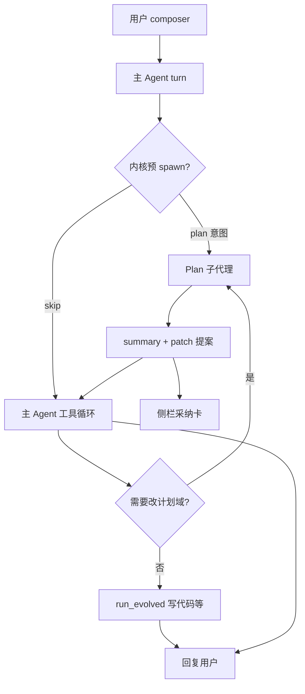

# Plan 幕后子代理（PLAN-SUBAGENT）

> 版本 **0.1.0** · 2026-08-03 · **状态：M1～M6 已实现**  
> **Phase 39** · 跟踪 [TASKS.md](./TASKS.md) T-3900～T-3906  
> 关联：[PLAN-ARCH.md](./PLAN-ARCH.md) · [ORCHESTRATION.md](./ORCHESTRATION.md) · [PROJECT-SIDEBAR.md](./PROJECT-SIDEBAR.md) §15.12 · [PROGRESS-GATE.md](./PROGRESS-GATE.md) · [PROJECT-MODE.md](./PROJECT-MODE.md)

---

## 0. 一句话

**用户只跟一个主 Agent 说话**；改计划域（TASKS / MAP / PROJECT / ENV）时，主 Agent **在幕后调用 Plan 子代理**（复用 `PlanAgent` 能力），产出 **侧栏采纳卡 + 主聊短摘要**——不再维护双通道、关键词路由、Plan 独立气泡。

**对标**：[Cursor Plan mode → Build](https://cursor.com/docs/agent/plan-mode) · [Copilot Plan → Implement](https://docs.github.com/en/copilot/how-tos/chat-with-copilot/chat-in-ide) · [Devin planner-executor（用户只见 ticket）](https://datarekha.com/blog/devin-architecture-anatomy/) · 本仓库既有 **explore / checker 子代理**（[ORCHESTRATION.md](./ORCHESTRATION.md) §4）。

---

## 1. 动机（用户一周体验）

| 现象 | 根因 |
|------|------|
| 「告诉 plan agent」仍走主 Agent 写 MAP | Phase 38 **关键词路由**漏判；主 Agent 仍可 `write_text` 计划域 |
| 两个气泡、两套 transcript 难理解 | **双通道 UX** 与 Cursor/Copilot/Windsurf「一个聊天 + 模式/子调用」不一致 |
| Progress Gate 与 Plan 采纳叠在一起 | 主 Agent 用 `report_progress` 勾规划任务；通道语义混乱 |
| 「一个输入框」诉求 | 要的是 **一个搭档**，不是两个角色抢话筒 |

### 1.1 保留什么（Phase 37 不动）

| 保留 | 说明 |
|------|------|
| **A0～A9 / Q1～Q4** | 计划域角色、唯一队列、注入切片、patch 采纳门 |
| **`PlanAgent.reason_about_intent`** | LLM + 计划域上下文 + patch 提案逻辑 |
| **侧栏采纳卡** | 计划域四件套 **唯一落盘路径**（+ Progress Gate 勾选） |
| **Progress Gate** | 代码完成 → `report_progress`；与规划正交 |

### 1.2 废止什么（Phase 38 双通道）

| 废止 | 替代 |
|------|------|
| `classify_user_plan_intent` **拦截** `user.message` | 所有用户话 **先进主 Agent turn** |
| `plan-user` / `plan-assistant` **独立气泡** | 主聊 **过程卡** + 侧栏卡 |
| Plan **独立 transcript** 作为用户通道（C4/C6） | Plan 子代理 **内部 messages**；仅摘要进主 `messages.jsonl` |
| `project.plan.message` / `auto_route` 为默认入口 | 保留 **兼容 API**（一版）；默认走子代理 |
| 主 Agent **直写** TASKS/MAP/PROJECT/ENV | executor **硬拒** + 提示 `plan_partner` |

> Phase 38 文档（§15.11）标 **superseded by §15.12**；代码在 Phase 39 完成后删除或只读兼容。

---

## 2. 已决（B 系列 · 相对 A10～A12）

| ID | 决议 |
|----|------|
| **B0** | **单一用户通道** = 主 `user.message` → 主 Agent turn；**无** Plan 平行聊天线 |
| **B1** | Plan = **第三类子代理** `kind: plan`（并列 explore / checker）；实现落 `subagent.py` + 复用 `plan_agent.py` |
| **B2** | 触发：**主 Agent 工具** `plan_partner`（Builtin 编排，**非**第 7 个 LLM function 名暴露给随意乱调——见 §4.2）+ 可选 **内核预 spawn**（LLM 判意图，**非**关键词表） |
| **B3** | 子代理产出：`summary`（≤2000 字进主聊）+ `patch_proposals[]`（侧栏采纳）+ `partner_notices[]`；**不**把 Plan 全文灌进主 transcript |
| **B4** | Plan 子上下文 = **本次 task 说明** + 计划域文件真源切片 + **可选**主聊最近 N 条用户句（默认 **2**，可关）；**不**灌主聊工具流水 |
| **B5** | 主 Agent system：**禁止** `write_text`/`patch_file` 落盘计划域四件套；须 `plan_partner` 或人改文件 |
| **B6** | UI：主区显示 **过程卡**「计划搭档 · 调研中…/已提案」；侧栏 **采纳卡** 与 Phase 22/37 一致 |
| **B7** | `report_progress` **仅**用于「本回合已有对口代码证据」的勾任务；**禁止**用来 `add_tasks` 纯规划 |

---

## 3. 架构

### 3.1 总览

```text
用户 → user.message（唯一入口）
  → 主 Agent turn（messages.jsonl）
       │
       ├─ [可选] 内核 plan 预 spawn（LLM classify，见 §4.3）
       │
       ├─ 主 Agent 调用 plan_partner(task, …)  （或预 spawn 结果已注入）
       │       → Plan 子代理（隔离 context）
       │       → PlanAgent.reason_about_intent / patch 提案
       │       → SubagentResult: summary + proposals
       │
       ├─ 侧栏刷新采纳卡（project.state）
       └─ 主聊：助手文字 + 过程卡（无第二套气泡）
```



### 3.2 与 explore / checker 对照

| 子代理 | 工具 | 预算 | 产出 | 落主 transcript |
|--------|------|------|------|------------------|
| **explore** | 只读 | 8 轮 | 调研摘要 | 摘要一段 |
| **checker** | 只读 | 5 轮 | pass/fail | 验收结论 |
| **plan**（新） | 读 + 跑 + **计划域 patch 提案** | **3** 轮 LLM（可配） | 摘要 + 采纳卡 | 摘要 + 过程卡元数据 |

Plan 子代理 **可**调用与 `PlanAgent` 相同的 plan tools（查/跑）；写四件套只出 **提案**，与 Q1 一致。

### 3.3 主 Agent 纪律（提示词层 · B5/B7）

注入 project 模式 system 片段（实现期落 `evolve/prompts/project.md`）：

1. 改 `TASKS.md` / `MAP.md` / `PROJECT.md` / `ENV.md` → **必须** `plan_partner`，**不得** `write_text` / `patch_file` 直写。
2. 代码任务做完 → `report_progress`（带证据）；**不得**用 `report_progress` 仅添加规划行。
3. 用户说「规划 / 补文档 / 排任务」→ 先 `plan_partner`，再视采纳结果决定是否写代码。
4. `plan_partner` 返回后：向用户 **简短说明** 提案内容，提醒在侧栏 **采纳/忽略**。

---

## 4. 触发与 API

### 4.1 `plan_partner`（主 Agent 可见工具）

**形态**：Builtin 编排入口（类似 `run_evolved` 由 executor 派发），schema 示例：

```json
{
  "name": "plan_partner",
  "description": "Invoke plan subagent for TASKS/MAP/PROJECT/ENV changes. Returns summary; patches appear in sidebar for adopt.",
  "parameters": {
    "type": "object",
    "properties": {
      "task": { "type": "string", "description": "What to plan or change in plan domain" },
      "include_recent_user_lines": { "type": "integer", "minimum": 0, "maximum": 5, "default": 2 }
    },
    "required": ["task"]
  }
}
```

**行为**：

1. 校验已绑定 `project_id`
2. `SubagentRunner.run_plan(task, session, paths)` → 内部 `PlanAgent`
3. 返回 `ToolResult`：`summary` + `proposal_ids[]` + `adopt_pending: true`
4. 主聊插入 **过程卡** 事件 `plan.subagent.done`（前端）

### 4.2 为何不暴露为「第 7 个随意 function」

与 [ORCHESTRATION.md](./ORCHESTRATION.md) §4.2 同纪律：

- explore **不**给 LLM 乱 spawn 的 function；由内核 + 显式命令触发
- `plan_partner` **可以给**主 Agent 调用（因为改计划是高频、需用户看见摘要），但 **schema 单一名称**、executor 校验 project 绑定；禁止并行多次 plan spawn 炸预算（默认每 turn **≤2** 次）

### 4.3 内核预 spawn（可选 · M2）

在 `_run_line` 开始前：

1. 若 `project_id` 且非 `force_skip_plan_spawn`
2. 调 `classify_plan_spawn_intent(text)` → **Haiku JSON** `{ "spawn": bool, "reason": str }`（**取代**关键词 `classify_user_plan_intent` 拦截）
3. `spawn=true` → 先跑 `run_plan`，将 `summary` 作为 **user 补充上下文** 注入本 turn（不另开 turn）

**纪律**：`spawn=false` 或 LLM 失败 → **不 spawn**，主 Agent 正常跑；主 Agent 仍可主动 `plan_partner`。

### 4.4 兼容（一个版本）

| 旧 API | 处置 |
|--------|------|
| `project.plan.message` | 转内部 `dispatch_plan_user_message` → 改为 **同步调用** `run_plan` + 以 **主聊 assistant** 一条摘要回复（无 plan 气泡） |
| `try_auto_route_user_to_plan` | **删除** server 拦截 |
| `project.plan.auto_routed` WS | **删除** |
| `desktop/plan-intent.ts` | **删除** |

---

## 5. 前端（unified）

### 5.1 移除

- `plan-user` / `plan-assistant` block kinds
- composer 自动 delegate `sendPlanChannelMessage`
- Alt+发送 `force_agent`（不再需要）
- `.plan-bubble` 样式（可保留类名作过程卡子样式）

### 5.2 新增 / 保留

| UI | 说明 |
|----|------|
| **过程卡** `plan-subagent` | 状态：`running` → `proposals_ready`；展示「计划搭档正在整理…」/「N 条提案待采纳」 |
| **侧栏采纳卡** | 不变（Phase 37 M6） |
| **助手气泡** | 主 Agent 用自然语言总结 plan 结果 |

### 5.3 WS 事件

| 事件 | 说明 |
|------|------|
| `plan.subagent.start` | `{ task_preview }` |
| `plan.subagent.done` | `{ summary, proposal_count }` |
| `project.state` | 采纳卡列表刷新 |

---

## 6. 写权限（硬门 · B5）

在 `tools/executor.py`（或 `project_mode` 钩子）：

| 路径 | 主 Agent `write_text` / `patch_file` |
|------|--------------------------------------|
| `workspace/<pid>/TASKS.md` | **拒绝** |
| `workspace/<pid>/MAP.md` | **拒绝** |
| `workspace/<pid>/PROJECT.md` | **拒绝** |
| `workspace/<pid>/ENV.md` | **拒绝** |
| 业务代码 / `bugs/` | 允许（与现 WRITE-SCOPE 一致） |

拒绝文案：`计划域文件须通过 plan_partner 提案 + 侧栏采纳；或使用 report_progress 勾选已完成任务。`

Plan 子代理内部走既有 patch 提案路径，**不**直写磁盘。

---

## 7. DOC-04

### 7.1 影响矩阵（STABILIZATION §3）

| 面 | 影响 | 档位 |
|----|------|------|
| unified 主聊 | 去掉双通道；加 plan 过程卡 | P1 · S-200/201 |
| 侧栏 | 采纳卡仍为计划域落盘入口 | P0 回归 S-182 · S-183/184 |
| Plan 运行时 | 子代理化；废止独立 transcript 通道 | P1 · IT-200/201 |
| 主 Agent executor | 计划域四件套写拒 | P0 · IT-202 |
| server WS | 删 auto_route；加 subagent 事件 | P1 |
| grow / host | **无** | — |

### 7.2 回归 / 新增 ID

| ID | 断言 |
|----|------|
| **S-200** | 用户任意话术只进 **主 Agent**；无「你·计划」独立气泡 |
| **S-201** | 「优化任务 / 规划 Phase」类请求 → 主聊出现 **plan 过程卡** + 侧栏 **采纳卡** |
| **S-202** | 主 Agent `write_text` → `MAP.md` **被拒**；`plan_partner` 后采纳可落盘 |
| **IT-200** | `plan_partner` 返回 summary；主 `messages.jsonl` **不含** Plan 子代理全文 tool 往返 |
| **IT-201** | 废止 `try_auto_route_user_to_plan`；`user.message` 始终 `_run_line` |
| **IT-202** | executor 计划域写拒 + 错误码稳定 |
| **IT-71** | 主 Agent 下一轮不含 Plan 子代理内部 messages（仅摘要） |

**回归既有**：S-183/184 · IT-190/191（改为子代理路径断言）· Progress Gate IT-70～73 · S-06～S-09。

---

## 8. 实施分期

| 里程碑 | 内容 | 任务 |
|--------|------|------|
| **M0** | 本文 + TASKS/MAP/SIDEBAR §15.12 + PLAN-ARCH B 系列 | T-3900 **done（文档）** |
| **M1** | `SubagentRunner.run_plan` + `plan_partner` builtin | T-3901 |
| **M2** | 删 auto-route；WS/前端去双气泡 | T-3902 |
| **M3** | executor 计划域写拒 + project 提示词 | T-3903 |
| **M4** | 过程卡 UI + `plan.subagent.*` 事件 | T-3904 |
| **M5** | 可选内核 LLM 预 spawn | T-3905 |
| **M6** | 测试 S-200～202 · IT-200～202；Phase 38 测试迁移 | T-3906 |

**完成标志**：huiyi 场景「先补文档 / 规划蔡岭模块」→ 单聊 + 过程卡 + 采纳卡；主 Agent 不能偷偷写 MAP。

---

## 9. 迁移说明（Phase 38 → 39）

| Phase 38 | Phase 39 |
|----------|----------|
| A10/A11/A12 双通道 + 自动路由 | **B0～B7** 单子代理 |
| `classify_user_plan_intent` | 删除；可选 `classify_plan_spawn_intent`（LLM）仅预 spawn |
| `_plan_transcript` 用户通道 | 子代理内部 buffer；进项目可清空（保留） |
| S-190～193 · IT-192 | **S-200～202 · IT-200～202**（旧测标记 deprecated） |

---

## 10. 修订记录

| 版本 | 日期 | 说明 |
|------|------|------|
| **0.1.0** | 2026-08-03 | 初稿：用户决议 Option C；废止 Phase 38 双通道 UX；子代理对齐 ORCHESTRATION |
