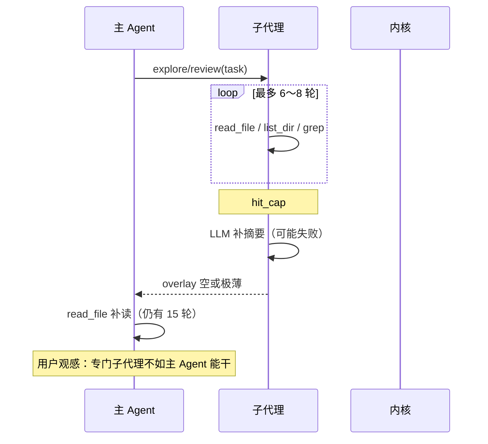

# 子代理预算政策（SUBAGENT-BUDGET）

> 版本 **0.1.1** · 2026-08-06 · **状态：M0 代码 done · S-4910 手工 todo**  
> 触发：huiyi / 普通对话联调——explore **8 轮撞 cap**、摘要为空，主 Agent 仍可用 segment **15 轮** `read_file` 补读；用户结论：**主 Agent 补读合理，子代理在这件事上权利应更大，而非更严**。  
> 关联：[AGENT-PARENT-ORCHESTRATION.md](./AGENT-PARENT-ORCHESTRATION.md)（Phase 48 · **谁下命令**） · [DELIVERABLE-REVIEW.md](./DELIVERABLE-REVIEW.md) · [PLAN-SUBAGENT.md](./PLAN-SUBAGENT.md) · [CHECKER-SUBAGENT.md](./CHECKER-SUBAGENT.md) · [AGENT-HARNESS.md](./AGENT-HARNESS.md) §7 · `agent-core/subagent.py` · Phase 49 T-4900～4910

---

## 0. 一句话

**专事专办的子代理，在「读盘 / 对账 / 查跑」上的工具预算应 ≥ 主 Agent 同场景预算**；子代理轮次**不计入**父 segment。  
主 Agent **可以**在子代理交卷不足时补读——这是合法降级，不是架构违规。  
**Phase 48** 管「谁触发、task 谁写」；**本 Phase** 管「子代理有没有足够轮次把活干完」。

---

## 1. 已决（B 系列）

| ID | 决议 |
|----|------|
| **B0** | **专任务预算 ≥ 父**：explore / review / checker / plan 查跑，默认 tool 预算 **不低于** `parent_execute_segment_max`（项目模式 **15**） |
| **B1** | **子代理轮次不计入父 segment**：`subagent_tool_rounds` 与 `parent_execute_segment_max` **分开记账**（现状已分；文档化 + 测试锁死） |
| **B2** | **撞 cap 必须交卷**：除 LLM 补摘要外，须有 **硬兜底**——从 tool 结果拼「已读路径 + 片段要点」，禁止空 overlay |
| **B3** | **父补读合法**：主 Agent 在 overlay 不足时可 `read_file` / `list_dir` 补读；prompt **不禁止**，仅 **优先委派**子代理 |
| **B4** | **父调可覆盖 `max_rounds`**：`explore` / `deliverable_review` builtin 参数可选 `max_rounds`；默认取 B0 目标值 |
| **B5** | **每轮父调次数**：`EXPLORE_BUILTIN_MAX_PER_TURN` / `DELIVERABLE_REVIEW_MAX_PER_TURN` 默认 **2**（大任务可拆两次子调用）；仍禁止无用户意图的链式自动流水线 |
| **B6** | **plan_partner 查跑对齐**：`PlanAgent.reason_about_intent` 工具 loop 从 **1 轮**扩至 **3～5 轮**（与 `plan_tools`「查跑同权」一致）；每轮仍最多 4 个 tool call |
| **B7** | **摘要下限对齐**：`plan_subagent_summary_max_chars` 默认 **≥ 3500**（与 review 同级）；explore/review/checker 保持或略提，**不因提轮次而砍摘要** |
| **B8** | **自动 spawn 仍受 Phase 48 约束**：提预算 **不**恢复项目模式内核自动 explore；grow 自动 explore 可用 **独立** env 覆盖 |

### 1.1 与 Phase 48 的分工

| 维度 | Phase 48（薄父编排） | Phase 49（本子文档） |
|------|----------------------|----------------------|
| 谁触发 explore/review | 项目模式禁内核自动 spawn；父写 task | 不改 |
| 子代理轮次上限 | 未动（仍 8/6/5/1） | **提高 + 可覆盖** |
| 父 Agent 补读 | 文档曾写「禁止狂 read」 | **改为优先委派 + 允许降级补读** |
| 撞 cap 空摘要 | 依赖 LLM `_CAP_SUMMARY_PROMPT` | **硬兜底交卷** |

### 1.2 明确否决

| 方案 | 为何否决 |
|------|----------|
| 禁止主 Agent 一切 `read_file` | 子代理失败时无退路；与用户预期冲突 |
| 子代理轮次计入父 segment 15 | 委派反而更亏，主 Agent 仍被迫亲自读 |
| 无限子代理 loop | 成本与延迟失控；用 env + `max_rounds` 封顶即可 |
| 为提预算恢复项目模式自动 explore | 与 P0/P1 冲突；scope 错误不能靠加轮次掩盖 |

---

## 2. 现状：预算不对称（代码真源 · 2026-08-06）

### 2.1 对照表

| 子代理 | `SubagentKind` | 默认 tool 轮 | 父调次数/轮 | 摘要上限 | 主 Agent（项目） | 不对称 |
|--------|----------------|-------------|------------|---------|-----------------|--------|
| **explore** | `explore` | **8** | **1** | 4000 | segment **15** | 轮次少 + 每轮只叫 1 次 |
| **deliverable_review** | `review` | **6** | **1** | 3500 | 15 | 同上 |
| **checker** | `checker` | **5** | —（自动一次） | 3000 | 15 | 验收多文件时偏紧 |
| **plan_partner** | `plan` | **≈1**（二次 LLM 后拒继续） | **2** | **2000** | 15 | 政策「查跑同权」、实现 1 轮 |
| **主 Agent** | — | **15**/segment | — | 无硬截断 | 基准 | — |

真源：`agent-core/subagent.py` L51–60、`agent.py` `parent_execute_segment_max`、`plan_agent.py` L1931–1938。

### 2.2 典型失败链路（explore / review）



### 2.3 plan_partner 的特殊形态

`plan_tools.py` 声明 Plan 可调 `read_file` / `run_command` 等与主 Agent 同权，但 `reason_about_intent` 仅：

1. 一次 LLM → 若有 `tool_calls` 则执行（≤4 个）
2. 二次 LLM → 若仍要工具则 **放弃**，返回敷衍句

计划域四件套靠 **整文件注入**，复杂「对照仓库再改 TASKS」时，**1 轮查跑不够**。

### 2.4 checker

- 场景窄：`write_evolve` 后 scaffold 验收、`project_test_fail` 深度解读
- **5 轮**对单工具目录通常够；reference 多文件时与 explore 同类风险
- 工具面无 web（合理）；预算仍应 **≥ 父 segment 的只读子集** 或按 kind 分档

---

## 3. 目标默认值（Phase 49 落地后）

### 3.1 轮次与次数

| 变量 / 常量 | 现状默认 | **目标默认** | 说明 |
|-------------|---------|-------------|------|
| `SUBAGENT_EXPLORE_MAX` | 8 | **16** | ≥ 父项目 segment 15，留 1 轮余量给 cap 摘要 |
| `REVIEW_SUBAGENT_MAX_ROUNDS` | 6 | **16** | 对账类任务与 explore 同级 |
| `SUBAGENT_CHECKER_MAX` | 5 | **10** | scaffold 仍可 env 压低；`project_test_fail` 用满 10 |
| Plan 工具 loop | 1 | **4** | `PLAN_SUBAGENT_TOOL_ROUNDS`（新 env，默认 4） |
| `EXPLORE_BUILTIN_MAX_PER_TURN` | 1 | **2** | 父可拆两次 explore |
| `DELIVERABLE_REVIEW_MAX_PER_TURN` | 1 | **2** | 父可「全量 review + 定点复查」 |
| `PLAN_PARTNER_MAX_PER_TURN` | 2 | **2** | 保持 |

**原则**：目标默认 **≥ `parent_execute_segment_max(active_shell=project)`**（当前 15），专用 env 可覆盖。

### 3.2 摘要

| 变量 | 现状 | 目标 |
|------|------|------|
| `PLAN_SUBAGENT_SUMMARY_MAX_CHARS` | 2000 | **3500** |
| `SUBAGENT_SUMMARY_MAX_CHARS` | 4000 | **4000**（保持） |
| `REVIEW_SUBAGENT_SUMMARY_MAX_CHARS` | 3500 | **4000** |
| `CHECKER_SUMMARY_MAX_CHARS` | 3000 | **3500** |

截断时 overlay 须带 `（摘要已截断）` + `paths_cited` 完整列表（现状部分已有；B2 强化）。

### 3.3 父调 schema 扩展（B4）

`explore` / `deliverable_review` builtin 增加可选参数：

```json
{
  "max_rounds": {
    "type": "integer",
    "description": "子代理 tool 轮上限；省略则用 SUBAGENT_EXPLORE_MAX / REVIEW_SUBAGENT_MAX_ROUNDS"
  }
}
```

父 Agent prompt 软约束：小任务省略；全项目对账可显式 `max_rounds: 20`（硬顶建议 **32**，防 runaway）。

---

## 4. 撞 cap 交卷（B2 规格）

### 4.1 现状

`subagent.run_explore` / `run_deliverable_review` / `run_checker` 在 `hit_cap && !final_text` 时追加 user 消息 `_CAP_SUMMARY_PROMPT`，再调一次 **无工具** LLM。失败 → `（子代理未产出文字摘要）`。

### 4.2 目标：三层交卷

```text
hit_cap 且无 final_text
  1. LLM 补摘要（保留现状）
  2. 若仍空 → synthesize_cap_summary(working)
       · 从 tool role 消息提取 path / 首尾行
       · 固定模板：「已读 N 个路径；要点：…；未读完：…」
  3. 若仍空 → 最小兜底：「已用满 {cap} 轮；已读：{paths_cited}」
```

**落点**：`subagent.py` 新增 `_synthesize_cap_summary(working, *, kind)`；explore / review / checker 共用。

### 4.3 overlay 质量门

| 条件 | 父 Agent 行为（prompt 软约束） |
|------|-------------------------------|
| overlay 含结构化结论 + paths | 综合回答，避免重复读 |
| overlay 仅路径列表 / 撞 cap 标记 | 可补读 **≤3** 个关键文件 |
| overlay 为空（不应再出现） | 视为子代理失败，父可全量补读或重派 `max_rounds` 更大的一次 |

---

## 5. 分角色实施要点

### 5.1 explore

| 项 | 内容 |
|----|------|
| 轮次 | `_DEFAULT_EXPLORE_MAX` 8 → **16** |
| 父调 | `executor._run_explore_builtin` 透传 `max_rounds` |
| 自动 spawn | grow 仍用全局默认；**不**因 B8 改 Phase 48 项目禁 spawn |
| 测试 | IT-4901：mock 17 轮请求 → 实际 cap 16；IT-4902：cap 后 overlay 非空 |

### 5.2 deliverable_review

| 项 | 内容 |
|----|------|
| 轮次 | `_DEFAULT_REVIEW_MAX` 6 → **16** |
| 父调 | `_run_deliverable_review` 透传 `max_rounds` |
| 项目绑定 | 保持 `project_root`（与 explore 父调 task scope 互补） |
| 测试 | IT-4903：review cap 摘要兜底含 `paths_cited` |

### 5.3 checker

| 项 | 内容 |
|----|------|
| 轮次 | `_DEFAULT_CHECKER_MAX` 5 → **10** |
| 分 kind | 可选：`CHECKER_MAX_PROJECT_TEST_FAIL=12`（defer 至 T-4907） |
| 测试 | 扩展 `test_checker_subagent`：cap 兜底非空 |

### 5.4 plan_partner

| 项 | 内容 |
|----|------|
| loop | `reason_about_intent` 改为 `for round in range(plan_subagent_tool_rounds())` |
| 每轮 | 仍 ≤4 tool calls；遇 `operations` 非空则提前结束 |
| 摘要 | `PLAN_SUBAGENT_SUMMARY_MAX_CHARS` 2000 → **3500** |
| 测试 | IT-4904：第二轮 tool_calls 不再直接敷衍拒绝 |

---

## 6. 主 Agent 与薄父（修订 AGENT-PARENT-ORCHESTRATION）

### 6.1 修订后的薄父定义

**薄父 = 优先委派 + 合成**，不是「父 Agent 禁止读盘」。

| 场景 | 优先 | 降级 |
|------|------|------|
| 文档代码脱节 / 验收 | `deliverable_review` | overlay 不足时父补读 |
| 深调研（父已知路径） | `explore({ task, max_rounds? })` | 同上 |
| 改 TASKS/MAP | `plan_partner` | Plan 查跑轮次用尽 → 父读文件后 **再**调 plan |
| 单点确认 | ≤2 次 `read_file` | 无需子代理 |

### 6.2 从 AGENT-PARENT-ORCHESTRATION 迁移的条文

- 删除 / 软化：「不采用：主 Agent 在父工具循环里连读十几个文件做对账」→ 改为「对账类优先 review；父连读 **仅当**子代理已撞 cap 或 overlay 不足」
- §1.1 否决表：「主 Agent 父循环狂 read_file」→ 移至本文 §1.2「无限读」仍否决，**有界补读**允许

---

## 7. Phase 49 任务与测试

### 7.1 DOC-04 准入

- [x] 影响矩阵行：**子代理 / 编排 / Agent Harness 预算**
- [x] 回归：**IT-4901～4905** · **S-490**（手工）· 既有 `test_checker_subagent` / `test_parent_orchestration` 子集

### 7.2 任务表

| ID | 任务 | 交付物 | 依赖 | 验收 | 状态 |
|----|------|--------|------|------|------|
| T-4900 | 子代理预算设计落盘 | 本文 | — | 评审 | **doc** |
| T-4901 | 提高 explore/review/checker 默认 cap | `subagent.py` | T-4900 | IT-4901～4903 | todo |
| T-4902 | `explore`/`deliverable_review` 透传 `max_rounds` | builtin schema · executor | T-4901 | IT-4905 | todo |
| T-4903 | 撞 cap 硬兜底 `_synthesize_cap_summary` | `subagent.py` | T-4901 | IT-4902 | todo |
| T-4904 | plan 工具 loop 扩至 4 轮 + 摘要 3500 | `plan_agent.py` · `subagent.py` | T-4900 | IT-4904 | todo |
| T-4905 | 父调次数默认 2 | `subagent.py` · executor | T-4901 | IT-4906 | todo |
| T-4906 | 修订薄父文档 + DELIVERABLE-REVIEW §3.1 预算列 | `AGENT-PARENT-ORCHESTRATION.md` 等 | T-4900 | 文档评审 | todo |
| T-4907 | checker 按 kind 分档 cap（可选） | `subagent.py` | T-4901 | IT-4903b | defer |
| T-4910 | 手工：大项目对账不撞 8 轮墙 | log | T-4901～4905 | S-490 | todo |

### 7.3 测试矩阵

| ID | 类型 | 断言 |
|----|------|------|
| IT-4901 | 单元 | `subagent_explore_max()` 默认 ≥ 15 |
| IT-4902 | 单元 | mock cap 打满 → overlay 非空且含 `paths_cited` |
| IT-4903 | 单元 | `review_subagent_max_rounds()` 默认 ≥ 15 |
| IT-4904 | 集成 | plan 第二轮 `tool_calls` 仍执行 |
| IT-4905 | 集成 | 父调 `explore({task, max_rounds: 20})` 生效 |
| IT-4906 | 单元 | `explore_builtin_max_per_turn()` 默认 2 |
| S-490 | 手工 | huiyi「文档脱节」review 16 轮内出 verdict 或满 cap 有路径摘要 |

#### S-490 手工步骤

1. 设 `REVIEW_SUBAGENT_MAX_ROUNDS=16`（或合并 T-4901 后默认）
2. 绑定 huiyi · solo · 主聊：「文档和代码可能脱节了，你看看」
3. **通过**：过程卡 `deliverable_review`；满 cap 时 overlay **非空**且列 `workspace/huiyi` 路径；主 Agent **不必**连读 10+ 文件才能完成回答

---

## 8. 环境变量速查（目标态）

| 变量 | 目标默认 | 说明 |
|------|---------|------|
| `SUBAGENT_EXPLORE_MAX` | **16** | explore tool 轮 |
| `REVIEW_SUBAGENT_MAX_ROUNDS` | **16** | deliverable_review tool 轮 |
| `SUBAGENT_CHECKER_MAX` | **10** | checker tool 轮 |
| `PLAN_SUBAGENT_TOOL_ROUNDS` | **4** | Plan 查跑 loop（**新**） |
| `PLAN_SUBAGENT_SUMMARY_MAX_CHARS` | **3500** | plan overlay |
| `EXPLORE_BUILTIN_MAX_PER_TURN` | **2** | 父调 explore 次数 |
| `DELIVERABLE_REVIEW_MAX_PER_TURN` | **2** | 父调 review 次数 |
| `PARENT_EXECUTE_SEGMENT_MAX` | （不变） | 显式设置时覆盖项目 15 |
| `SUBAGENT_HARD_CAP` | **32** | （可选新）单次子代理绝对上限 |

---

## 9. 非目标

- 取消子代理种类或合并 explore/review
- 子代理轮次计入父 segment
- 项目模式恢复内核自动 explore（属 Phase 48）
- 修改 `resolve_read_path` 全局顺序
- 子代理独立用户气泡

---

## 10. 修订记录

| 版本 | 日期 | 说明 |
|------|------|------|
| **0.1.0** | 2026-08-06 | 初稿：B0～B8 · 现状表 · 目标默认 · cap 交卷 · Phase 49 任务矩阵 · 与 Phase 48 分工 |
| **0.1.1** | 2026-08-06 | T-4901～4905 落地：`subagent.py` · `plan_agent.py` · executor schema · IT-4901～4906 |

---

## 11. 作用域分轨（Phase 50 · 见专文）

**普通对话未绑项目**时，用户「代码和文档不符」默认对账 **agent 内核**（`docs/` vs `agent-core/`）——**正确行为**，不是 BUG-027。

| 会话轨 | 默认 scope | 内核 auto explore |
|--------|------------|-------------------|
| general（未绑项目 / grow） | agent 根 | **保留**（产品差异化） |
| project（已绑 id + shell=project） | `workspace/{id}` | **禁止**（Phase 48） |

满 cap / 父补读 = **效率与交卷**议题（S8～S10），见 [EXPLORE-SCOPE-RAILS.md](./EXPLORE-SCOPE-RAILS.md)。**实现 todo**，待评审后编码。
