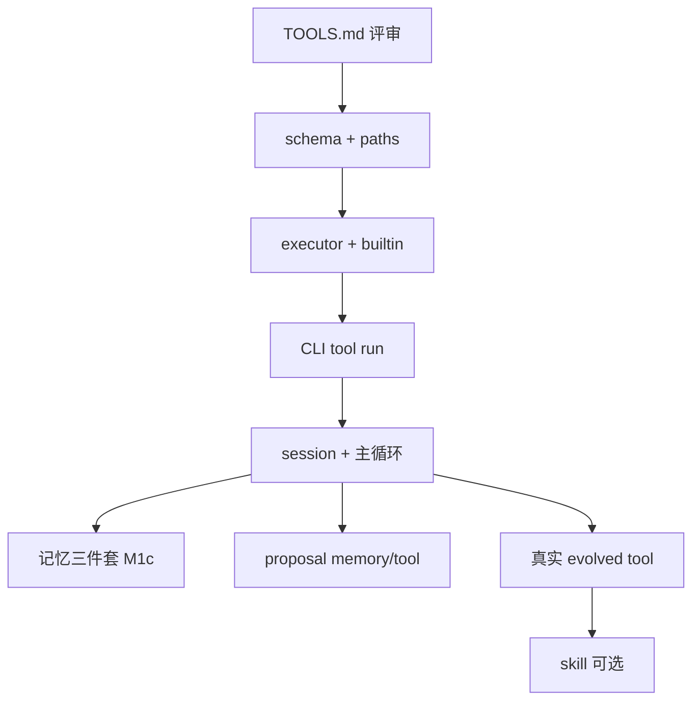

# 任务清单（TASKS）

> 版本 0.1.1 · 2026-08-04 · 细分到每个 task，**先文档评审再动手**  
> **新会话**：先读 [MAP.md](./MAP.md)（**§2.2 废止债**）了解目录与当前进度。  
> **当前焦点**：**Pack 1/2/4/5/6 M0 done** — ROADMAP-PACK-1245 收口；另排 S-441/461/490/500  
> Phase 40/41 **done**（41 仅 P3 defer）· Phase 39 done · [DOC-04](./TASKS.md)  
> 顺序：**工具设计 → 工具实现 → 对话壳 → 进化（memory/tool）→ skill 最后**

**图例**：`状态` = `todo` | `doc` | `done` | `defer` | **`superseded`** | **`cancelled`** | **`wontfix`**  
**依赖**：必须先完成的 task id

## done 定义（DOC-03 · [STABILIZATION.md](./STABILIZATION.md) §9.2）

> **落盘**：T-1800-07 · **DOC-03 核对**：T-1806-doc-03（2026-07-18）— 与 §9.2 四条一致，无需重写。

一项标 **done** 须同时满足四条：

- [ ] 代码合入
- [ ] 相关 IT 绿，或声明「仅手工」并挂 smoke ID
- [ ] `stabilization-log.md` 或等价记录至少 1 次相关路径 pass
- [ ] `BUGS.md` / `CHANGELOG.md` 已更新（若修缺陷）

**禁止**：仅「实现了」+「待桌面验收」长期挂账（Phase 9～17 的教训，E 类根因）。

## 新 Phase 准入（DOC-04 · [STABILIZATION.md](./STABILIZATION.md) §9.3 · 解冻后生效）

> **落盘**：T-1800-08 · **DOC-04 核对**：T-1806-doc-04（2026-07-18）— 与 §9.3 一致（§3 矩阵行 + S/IT id），无需重写。

开新功能 Phase 前，Phase 提案须写明：

- [ ] 影响 [STABILIZATION.md](./STABILIZATION.md) §3 覆盖矩阵的**哪些行**（新增面须补矩阵行 + 档位）
- [ ] 回归哪些 **S-xx smoke / IT-xx 自动化** ID（既有 ID 或新增 ID）

**缺省 = 评审驳回**。Phase 18 **已解冻**（T-1890-10）；新功能 Phase 按上表准入。

---

## 债务瘦身（DOC-05 · 2026-08-04）

> **落盘**：与 [MAP.md](./MAP.md) §2.2 同步。壳合并（[SHELL-CONSOLIDATION.md](./SHELL-CONSOLIDATION.md)）+ Phase 39 单入口后，下列条目**不再作为开放技术债**；勿在新 Phase 提案中重复引用。

| ID / 范围 | 原意 | 新状态 | 说明 |
|-----------|------|--------|------|
| **T-904h** | Shell `govern` | **cancelled** | 治理在聊天流 + `my-agent review`；无独立壳 |
| **T-904i6** | constellation IPC 清理 | **cancelled** | 星图方案已否决；残留 CSS/类名属低优清理，非功能债 |
| **T-901 / T-605 / T-606** | Skill 自动生成 / 加载 / 路由 | **wontfix** | M1 不做 skill（[LAYERS.md](./LAYERS.md)） |
| **T-902 / T-903 / T-906** | 多 LLM / SQLite·向量 / 自动 venv | **wontfix** | Phase 9 远期；单人场景默认不做 |
| **T-602** | suspect 与 executor 深集成 | **superseded** | 由 T-602c `failure_streak` + suspect 落盘覆盖 |
| **Phase 38** 全系 | Plan 双通道 / 自动路由 / 独立气泡 | **superseded** | Phase 39 · [PLAN-SUBAGENT.md](./PLAN-SUBAGENT.md) |
| **`ui.route` / 自动切壳** | activity_router → 桌面切壳 | **superseded** | 前端已移除；`pet-route.ts` stub deprecated |
| **STABILIZATION §3.1** 四壳行 | grow↔daily 隔离 · govern · ui.route | **superseded** | 见 [STABILIZATION.md](./STABILIZATION.md) §3.0 |
| **T-1830-01～08**（部分） | `ui.route` · refresh · 流式序等 | **superseded** | IT-X 中与四壳绑定的用例作废；其余仍 defer 维护 |

**仍算真债（勿误删）**：Phase 24 **T-2408** S-70～74 · WORKBENCH M1/M2 · 后端 `active_shell` 收敛 · Phase 44 **T-4408** S-441 · evolve_log 轮转。

---

## Phase 0 — 文档与基线（当前）

| ID | 任务 | 交付物 | 依赖 | 验收 | 状态 |
|----|------|--------|------|------|------|
| T-001 | 项目总览文档 | `docs/PROJECT.md` v0.2.1 | — | 目标/非目标/里程碑可读 | done |
| T-002 | 四轮评审整合 | `docs/REVIEW-SUMMARY.md` | T-001 | 决议可追溯 | done |
| T-003 | 分层说明（先 tool 后 skill） | `docs/LAYERS.md` | T-001 | 建设顺序无歧义 | done |
| T-004 | 工具系统设计 | `docs/TOOLS.md` | T-003 | §11 检查项可勾选 | done |
| T-005 | 本任务清单 | `docs/TASKS.md` | T-003,T-004 | 每条 task 可独立执行 | done |
| T-005b | 记忆系统设计（三件套 + 主题路由） | `docs/MEMORY.md` | T-003 | §10 检查项可勾选 | done |
| T-005c | 工具系统修订（6 Builtin + 主题 tools + common） | `docs/TOOLS.md` v0.2、`evolve/_index.toml` | T-005b | §14 检查项可勾选 | done |
| T-005d | 对话层设计（RUNTIME） | `docs/RUNTIME.md` | T-005b,T-005c | §11 检查项可勾选 | done |
| T-005e | 进化写入设计（proposal / 防重复） | `docs/EVOLVE.md` | T-005d | §13 检查项可勾选 | done |
| T-006 | Git 首次 push 私有远端 + `requirements.txt` | remote + 首 commit | T-001～T-005e 评审后 | `git push` 成功；`httpx>=0.27` | done |

---

## Phase 1 — M1a：工具层（**最先实现**，无 LLM）

| ID | 任务 | 交付物 | 依赖 | 验收 | 状态 |
|----|------|--------|------|------|------|
| T-101 | 定义统一 result/error JSON | `agent-core/tools/schema.py` | T-004 评审通过 | 单测或手工示例 | done |
| T-102 | 路径解析：agent 根 + workspace 边界 | `agent-core/paths.py` | T-101 | 越界路径拒绝 | done |
| T-103 | Builtin `read_file` | `agent-core/tools/builtin/read_file.py` | T-101,T-102 | 读 workspace 下文本；超大小拒绝 | done |
| T-104 | Builtin `list_dir` | `agent-core/tools/builtin/list_dir.py` | T-102 | 列出一层；recursive 可选 | done |
| T-104a | Builtin `grep` | `agent-core/tools/builtin/grep.py` | T-102 | 本地搜；结果上限 | done |
| T-104b | Builtin `web_search` | `agent-core/tools/builtin/web_search.py` | T-101 | 默认 DeepSeek（`LLM_API_KEY` + Anthropic 子调用）；可选 `brave`；§7.4 schema | done |
| T-104c | Builtin `fetch_url` | `agent-core/tools/builtin/fetch_url.py` | T-101 | `httpx`；HTML→文本；SSRF；32k/2MB 上限；§7.5 | done |
| T-105 | 扫描 `evolve/tools/**/tool.toml` | `agent-core/tools/registry.py` | T-004,T-005c | 含 common/ 与 topic 子目录 | done |
| T-106 | `tool.toml` 解析与校验 | `registry.py` 扩展 | T-105 | 非法 schema 启动失败并提示 | done |
| T-107 | Evolved 执行器 + Builtin `run_evolved` | `agent-core/tools/builtin/run_evolved.py` | T-105,T-106 | stdin/stdout JSON；示例跑通 | done |
| T-108 | ToolExecutor：confirm 交互 | `agent-core/tools/executor.py` | T-103～T-107 | y/n/a；`a` 仅 workspace_only evolved；§6.3 | done |
| T-109 | ToolExecutor：dry_run + 超长结果落盘 | `executor.py` | T-108 | dry_run 不写文件；>8k 落盘 §6.4 | done |
| T-110 | `evolve_log.jsonl` 写入 | `agent-core/tools/logging.py` | T-108 | 每次调用一行 JSON | done |
| T-111 | 种子 `write_text` | `evolve/tools/common/write_text/` | T-107 | active；CLI dry-run 通过 | done |
| T-112 | **CLI** `my-agent tool run ...` | `agent-core/cli_tools.py` | T-108～T-111 | 可调 6 builtin + 任意 evolved | done |

**Phase 1 完成标志**：无 LLM 也能 `tool run grep`、`tool run evolved write_text`，并写 log。

---

## Phase 2 — M1b：对话壳 + LLM（见 [RUNTIME.md](./RUNTIME.md)）

| ID | 任务 | 交付物 | 依赖 | 验收 | 状态 |
|----|------|--------|------|------|------|
| T-201 | LLM 薄封装（DeepSeek / OpenAI 兼容） | `agent-core/llm_client.py` | T-006 | flash/pro 模型；`LLM_TIMEOUT_SEC=120`；context 上限 §6.1；`python llm_client.py` | done |
| T-202 | **6 Builtin** → LLM functions | `agent-core/agent.py` | T-105,T-201 | 无平铺 evolved；`python agent.py` | done |
| T-203 | `session.py` 续接 + 持久化 | `agent-core/session.py` | T-201 | 默认 resume 最近 id；`create_new` 新建；`python session.py` | done |
| T-204 | `loader.py` system 基础 + overlay | `agent-core/loader.py` | T-203 | 含 safety 始终加载；digest 段；`python loader.py` | done |
| T-205 | `router.py` 主题 JSON（新会话/换主题）+ `加主题` 并集 | `agent-core/router.py` | T-204 | topics 替换 vs 追加；快捷 `主题 x`；确认后 `llm_model`；`python router.py` | done |
| T-206 | `agent.py` 主循环 + tool 内循环（≤10） | `agent-core/agent.py` | T-202,T-108 | 锚定块 + messages.jsonl；`python agent.py` | done |
| T-207 | `main.py` REPL + 命令 | `agent-core/main.py` | T-206 | 新会话/换主题/压缩/exit；`--record`；`python main.py --demo` | done |
| T-208 | `context.py` digest 压缩 | `context.py` | T-206 | 85% 自动 + `压缩` 手动；K=8；digest≤8k；messages.jsonl 不截断 | done |
| T-2091 | BUG-023 设计落盘 | `bugs/2026-08-05-compact-turn-llm-timeout.md` · RUNTIME §8.4 · RG G15 | T-208,T-1513 | R1～R7 可读 | **done** |
| T-2092 | compact 摘要 pause wall + 独立超时 + 可 cancel | `context.py` · `agent.py` · `runtime_guards.py` | T-2091 | IT-95 | **done** |
| T-2093 | LLMTimeout 专用 notice + 桌面 timeout 分型 | `agent.py` · `chat-state.ts` · TURN-CONTROL §9.3 | T-2091,T-1519 | IT-96 | **done** |
| T-2094 | 压缩后二级 payload 策略（P1） | `context.py` · `loader.py` | T-2092 | IT-97 · S-75 | **done** |
| T-209 | `agent-core/prompts/core.txt` | `prompts/core.txt` | T-204 | 身份、边界、禁止假装执行 | done |
| T-210 | `start.bat` | 根目录 | T-207 | 双击进 CLI | done |

**Phase 2 完成标志**：续接 thread → 对话调 grep → `run_evolved write_text` 经 confirm；thread 落盘。

**与 Phase 3 衔接**：T-301～T-308 将 loader/router 与 `_index`、evolved 清单对齐（可先 stub topics=[]）。

**Phase 2 完成标志**：对话中说「列出 workspace」「读某文件」，LLM 能正确选 tool 且经过 confirm。

---

## Phase 3 — M1c：记忆三件套（紧随 M1b，不阻塞首版）

> 设计详见 [MEMORY.md](./MEMORY.md)。**已决**：M1a+M1b 先交付可运行 tool 环；本 Phase 完成后才有完整主题路由与记忆索引。

| ID | 任务 | 交付物 | 依赖 | 验收 | 状态 |
|----|------|--------|------|------|------|
| T-301 | 解析 `evolve/_index.toml`，启动注入主题列表 | `agent-core/loader.py` | T-203 | system 含 topic id/name/description/tool_dirs | done |
| T-302 | 扫描 `evolve/memories/**/*.md` frontmatter，注入 id+summary 索引 | `loader.py` | T-301 | archived 不注入；格式见 MEMORY §5 | done |
| T-303 | Session `goal.md` + 对话上下文（`prompt_and_set_goal` 保留；**新会话默认不问**） | `main.py` 或 `session.py` | T-203 | `新会话` 直接 S4；显式 goal API 可写 `goal.md` 并注入 anchor | done |
| T-304 | 主题路由阶段1：LLM 输出 `topics[]` + 用户确认 | `agent-core/router.py` 或 `loader.py` | T-301,T-303 | 用户可改/否决提议主题 | done |
| T-305 | 主题路由阶段2：加载命中主题的 `prompts/<topic>.md` 全文 | `loader.py` | T-304 | 确认后 system 含 coding 等全文 | done |
| T-306 | 启动/主题确认事件写 evolve_log | `loader.py` | T-110,T-305 | log 含 memory_ids、topics_confirmed | done |
| T-307 | 示例：`prompts/coding.md` + `memories/coding/example.md` | `evolve/` 样例 | T-305 | 对话体现主题规则与记忆索引 | done |
| T-308 | 主题确认后注入 evolved 清单（common + 命中 tool_dirs） | `loader.py` | T-305,T-105 | run_evolved 仅允许清单内 name | done |

**Phase 3 完成标志**：主题确认后注入 prompt + memory 索引 + evolved 清单；`read_file evolve/memories/**` 写 L2 `entity_used`。

**T-301 手工验收**（`agent-core/` 下）：

```powershell
cd D:\my-agent\agent-core
python loader.py
```

exit 0；含 `[PASS] T-301: _index.toml → id/name/description/tool_dirs in system`。详见 [MAP.md](./MAP.md) §9.16。

**T-302 手工验收**（`agent-core/` 下）：

```powershell
cd D:\my-agent\agent-core
python loader.py
```

exit 0；含 `[PASS] T-302: scan memories; archived skipped` 与 `[PASS] T-302: memory index in S0`。详见 [MAP.md](./MAP.md) §9.17。

**T-303 手工验收**（`agent-core/` 下）：

```powershell
cd D:\my-agent\agent-core
python session.py
python main.py --demo
```

exit 0；含 T-303 相关 `[PASS]`（goal 问答、`goal.md`、anchor + system 注入、续接不重问）。详见 [MAP.md](./MAP.md) §9.18。

**T-304 手工验收**（`agent-core/` 下）：

```powershell
cd D:\my-agent\agent-core
python router.py
python main.py --demo
```

exit 0；含 T-304 `[PASS]`（accept / reject / override / S3→S4）。详见 [MAP.md](./MAP.md) §9.19。

**T-305 手工验收**（`agent-core/` 下）：

```powershell
cd D:\my-agent\agent-core
python loader.py
```

exit 0；含 `[PASS] T-305: confirmed topics inject full prompt` 与 `[PASS] T-305: real repo coding.md full text in system overlay`。详见 [MAP.md](./MAP.md) §9.20。

**T-306 手工验收**（`agent-core/` 下）：

```powershell
cd D:\my-agent\agent-core
python tools\logging.py
python loader.py
```

exit 0；含 `[PASS] T-306: evolve_log session_start + topics_confirmed`。交互式 REPL 启动或 `新会话` 后可用 `Get-Content ..\data\evolve_log.jsonl -Tail 3` 查看新行。详见 [MAP.md](./MAP.md) §9.21。

**T-307 手工验收**（`agent-core/` 下）：

```powershell
cd D:\my-agent\agent-core
python loader.py
```

exit 0；含 `[PASS] T-307: coding prompt + memory index in system`。确认 coding 主题后 REPL 对话应能遵守 `evolve/prompts/coding.md` 规则，并在 system 看到 `project-my-agent` 记忆索引。详见 [MAP.md](./MAP.md) §9.22。

**T-308 手工验收**（`agent-core/` 下）：

```powershell
cd D:\my-agent\agent-core
python loader.py
python agent.py
```

exit 0；含 `[PASS] T-308: evolved catalog (common+topic) + run_evolved allowlist`。详见 [MAP.md](./MAP.md) §9.23。

**Phase 3（M1c）已全部完成**；**Phase 4（M2）已完成**（`T-401`～`T-407`）。**Phase 5（M3）已完成**（`T-501`～`T-504`）。**Phase 6（M4）已完成**（`T-601`～`T-604`）；**`T-006` 远端 push done**。可选：`T-601b` / `T-605` skill。

**T-401 手工验收**（`agent-core/` 下）：

```powershell
cd D:\my-agent\agent-core
python boundaries.py
python main.py --demo
```

exit 0；含 3 条 `[PASS] T-401:`（exit + session_end、Ctrl+C 阻断检查点）。交互式：`exit` 保存并退出；`Ctrl+C` 不结束 thread。详见 [MAP.md](./MAP.md) §9.24。

**T-402 手工验收**（`agent-core/` 下）：

```powershell
cd D:\my-agent\agent-core
python evolve.py
python main.py --demo
```

exit 0；`evolve.py` 4 条 `[PASS]`；`main.py --demo` 含 `[PASS] T-402:`。REPL 输入 `记住 …` 应写入 `evolve/proposals/*.md`。详见 [MAP.md](./MAP.md) §9.25。

**T-403 手工验收**（`agent-core/` 下）：

```powershell
cd D:\my-agent\agent-core
python boundaries.py
python evolve.py
python loader.py
python main.py --demo
```

exit 0；含 3 条 `[PASS] T-403:`。助手口头问是否写入 evolve 后输入 `好` → `llm_offer` 检查点；无 pending 时 `好` 仅为普通对话。详见 [MAP.md](./MAP.md) §9.26。

**T-404 手工验收**（`agent-core/` 下）：

```powershell
cd D:\my-agent\agent-core
python evolve.py
python main.py --demo
```

exit 0；`evolve.py` 含 8 条 `[PASS] T-404:`；`main.py --demo` 含 4 条 `[PASS] T-404:`。REPL：`proposals` 列 pending；`proposals accept <id>` 路由写入 evolve；`proposals reject <id>` 归档至 `proposals/archive/`；检查点后可输入 `y` 当轮接受。详见 [MAP.md](./MAP.md) §9.27。

**T-405 手工验收**（`agent-core/` 下）：

```powershell
cd D:\my-agent\agent-core
python evolve.py
```

exit 0；含 5 条 `[PASS] T-405:`（corpus 匹配、拒绝自评/改写、≤2 条、digest 来源、`parse_proposal_batch` 校验）。详见 [MAP.md](./MAP.md) §9.28。

**T-407 手工验收**（`agent-core/` 下）：

```powershell
cd D:\my-agent\agent-core
python evolve.py
```

exit 0；含 5 条 `[PASS] T-407:`（accepted evidence_fp 硬拦、pending supersede、memory id / tool 名硬拦、checkpoint `dedup: blocked`）。详见 [MAP.md](./MAP.md) §9.29。

---

## Phase 4 — M2：进化写入（先 memory / tool，**仍不做 skill**）

| ID | 任务 | 交付物 | 依赖 | 验收 | 状态 |
|----|------|--------|------|------|------|
| T-401 | 对话边界：`exit` 结束 session | `main.py` + `boundaries.py` | T-203 | Ctrl+C 不生成 proposal、不触发检查点 | done |
| T-402 | Proposal 生成（L1 prompt/memory / tool 建议） | `agent-core/evolve.py` | T-401,T-201,T-005e | 写入 `evolve/proposals/*.md`；见 EVOLVE §4 | done |
| T-403 | 触发降噪：显式话术 + 升格两跳；≤2/检查点；口头升格 ≤1/会话 | `evolve.py` + `boundaries.py` + `loader.py` | T-402 | 无 exit/任务成功/新会话软问 | done |
| T-404 | 审阅：接受/拒绝/稍后；离线 `proposals` 命令 | `evolve.py` + `main.py` | T-402 | 接受后路由；memory update 追加修订 | done |
| T-405 | evidence 仅存对话原文摘录 | `evolve.py` | T-402 | 每条 proposal ≤2 条 evidence | done |
| T-406 | tool 接受 = spec 归档；不自动生成代码 | `docs/EVOLVE.md` §7 | T-404 | 用户手放 `tools/<topic>/` | done |
| T-407 | 防重复：id / evidence_fingerprint（全局）/ supersede pending | `evolve.py` | T-402 | 见 EVOLVE §6 | done |

**Phase 4 完成标志**：对话中说 `记住` → 产生 1 条 memory proposal → 接受 → 下次启动见索引；重复同句不再生成第二条；**无需 skill**。

---

## Phase 5 — M3：从使用中固化（tool 优先）

| ID | 任务 | 交付物 | 依赖 | 验收 | 状态 |
|----|------|--------|------|------|------|
| T-501 | 选 1 个真实任务 | — | Phase 2 | 你指定场景 | done |
| T-502 | 为该任务写 evolved tool + tool.toml | `evolve/tools/workflow/sort_by_extension/` | T-111,T-501 | Phase 1 CLI 能跑通 | done |
| T-503 | 对话中通过 LLM 调度该 tool 完成 1 次任务 | — | T-205,T-502 | evolve_log 有记录 | done |
| T-504 | 可选：固化 1 条 memory 而非 tool | `evolve/memories/workflow/downloads-sort.md` | T-404 | 二选一即可 | done |
| T-505 | **P1 common** 文件工具：`append_text` / `copy_move` / `move_to_trash` | `evolve/tools/common/*` | T-111 | 各 `main.py demo` exit 0；registry 扫描 5 active | done |
| T-506 | **P2 workflow** 整理工具：`rename_batch` / `flatten_dir` / `dedupe_by_name` / `archive_by_date` | `evolve/tools/workflow/*` | T-502,T-505 | 各 demo exit 0；workflow 主题清单 5 件 | done |
| T-507 | **P3 coding** 工具：`run_demo` / `run_tests` / `git_snapshot` / `patch_file` | `evolve/tools/coding/*` | T-505 | 各 demo exit 0；coding 主题清单 4 件 | done |
| T-508 | **`write_evolve`**：向 `evolve/tools/` 落地新工具文件 | `evolve/tools/common/write_evolve/` | T-505 | 路径沙箱 + demo；`workspace_only=false` | done |

**Phase 5d 完成标志**（T-507）：coding 主题可跑验收脚本、看 git 快照、打补丁；`workspace_only=false`（每次 confirm）。

**T-507 手工验收**（`agent-core/` 下）：

```powershell
cd D:\my-agent\agent-core
python ..\evolve\tools\coding\run_demo\main.py demo
python ..\evolve\tools\coding\run_tests\main.py demo
python ..\evolve\tools\coding\git_snapshot\main.py demo
python ..\evolve\tools\coding\patch_file\main.py demo
python loader.py   # coding session allowlist 含 common + 3 coding 工具
```

详见 [MAP.md](./MAP.md) §9.4d。

**T-508 手工验收**（`agent-core/` 下）：

```powershell
cd D:\my-agent\agent-core
python ..\evolve\tools\common\write_evolve\main.py demo
python tools\registry.py   # 含 write_evolve；live evolved 14 个 active
```

详见 [MAP.md](./MAP.md) §9.4e。

**Phase 5b 完成标志**（T-505）：common 除 `write_text` 外具备追加、复制/移动、软删除；均 `workspace_only` + `dry_run` + confirm。**T-508**：`write_evolve` 可写 `evolve/tools/`（每次 confirm，无 `a`）。

**Phase 5c 完成标志**（T-506）：workflow 主题具备扩展名整理之外的批量重命名、扁平化、查重报告、按日期归档。

**T-506 手工验收**（`agent-core/` 下）：

```powershell
cd D:\my-agent\agent-core
python ..\evolve\tools\workflow\rename_batch\main.py demo
python ..\evolve\tools\workflow\flatten_dir\main.py demo
python ..\evolve\tools\workflow\dedupe_by_name\main.py demo
python ..\evolve\tools\workflow\archive_by_date\main.py demo
python loader.py   # workflow session allowlist 含 5 件主题工具
```

详见 [MAP.md](./MAP.md) §9.4c。

**T-505 手工验收**（`agent-core/` 下）：

```powershell
cd D:\my-agent\agent-core
python ..\evolve\tools\common\append_text\main.py demo
python ..\evolve\tools\common\copy_move\main.py demo
python ..\evolve\tools\common\move_to_trash\main.py demo
python loader.py   # repo catalog 含四件 common
```

详见 [MAP.md](./MAP.md) §9.4b。

**Phase 5 完成标志**（M3 / PROJECT §7.2）：workflow 场景 → `sort_by_extension` tool（T-502）→ 对话/CLI 调度（T-503）→ 久远记忆 `downloads-sort`（T-504，与 tool 配套固化习惯）。

**T-504**：`evolve/memories/workflow/downloads-sort.md` — 启动索引一行 summary；正文按需 `read_file`。

**T-501 场景（已选）**：workflow 主题 — **按扩展名整理 workspace 子目录**（模拟「下载夹分类」）。输入目录路径，将顶层文件移入 `pdf/`、`jpg/`、`_no_ext/` 等子文件夹；支持 `dry_run` 预览。

**M3 验收**：§PROJECT 7.2 之「真实任务更省事」+ log 有 tool 引用；**仍不要求 skill**。

**T-502 手工验收**（仓库根 + `agent-core/`）：

```powershell
cd D:\my-agent\agent-core
python ..\evolve\tools\workflow\sort_by_extension\main.py demo

# PowerShell：外层单引号 + 内层 \" 转义（勿用 "{\"path\":...}"）
python my-agent tool run evolved sort_by_extension --json '{\"path\":\"_sort_cli_test\"}' --dry-run -y
```

exit 0；`main.py demo` 5 条 `[PASS]`；CLI 返回 `moved[]` 且 `dry_run: true`。

**T-503 手工验收**（`agent-core/` 下）：

```powershell
cd D:\my-agent\agent-core
python agent.py
```

exit 0；含 `[PASS] T-503:`；`loader.py` 含 `[PASS] T-502:`。详见 [MAP.md](./MAP.md) §9.30～§9.31。

**交互式**（`LLM_API_KEY`）：`python t503_live.py` → 按屏上提示对话 → `exit` 后检查 `workspace/_downloads_inbox/` 与 `evolve_log.jsonl`。

---

## Phase 6 — M4：治理（skill 此时才可选）

> 设计见 [GOVERNANCE.md](./GOVERNANCE.md)。

| ID | 任务 | 交付物 | 依赖 | 验收 | 状态 |
|----|------|--------|------|------|------|
| T-601 | `ReviewCollector` + `my-agent review` | `agent-core/governance/` | T-110,T-301 | never-used / suspect / soft≥3词；`ReviewReport` v1.0 | done |
| T-601a | `--format cli\|json\|markdown` + `-o` | `ReviewRenderer` | T-601 | JSON 可被 jq 解析 | done |
| T-601b | **可选** evolved `governance_review` tool | `evolve/tools/common/` | T-601,T-502 | `run_evolved` 返回同 schema | defer |
| T-602 | suspect：`feedback_negative` 聚合 + 写 `status` | executor / session | T-203 | 3 次否定 → suspect；tool 拒绝执行；见 RUNTIME §10 | superseded |
| T-602a | M3：`entity_used` + `pending_feedback` | loader / executor | T-305 | L2：仅 `read_file`→`evolve/memories/**`；L3+ 见 GOVERNANCE §3 | done |
| T-602b | M4：exit 问句 + `feedback_*` | `session.py` / `main.py` | T-602a | `MY_AGENT_FEEDBACK_ON_EXIT=1`；y/n/skip | done |
| T-602c | `failure_streak` 聚合 + `marked_suspect` | `governance/suspect.py` | T-602b | 与 GOVERNANCE §6 一致 | done |
| T-603 | `my-agent audit`（LLM 兜底） | `agent-core/governance/audit.py` | T-601 | `llm_findings[]`；不自动改文件 | done |
| T-604 | Git 回滚习惯写入 README | `README.md` + `governance/git_hints.py` | T-006 | accept / review 后提示 commit | done |
| T-605 | **可选** 显式加载 SKILL.md | `loader.py` 扩展 | T-502,T-503 | 用户说「用 xxx skill」才注入 | wontfix |
| T-606 | **可选** 自动 skill 路由 | `router.py` | T-605 | M4+，非 MVP | wontfix |

**T-601 手工验收**（`agent-core/` 下）：

```powershell
cd D:\my-agent\agent-core
python governance\review.py demo
python my-agent review
python my-agent review --topic workflow
```

exit 0；`demo` 含 12 条 `[PASS] T-601:` + 4 条 `[PASS] T-601a:`；CLI 打印 Summary / Never-used / Observation / Suspect / Conflicts / Pending 块。详见 [MAP.md](./MAP.md) §9.33。

**T-601a 手工验收**（`agent-core/` 下）：

```powershell
cd D:\my-agent\agent-core
python governance\review.py demo                    # 含 T-601a [PASS]
python my-agent review --format json | python -c "import json,sys; json.load(sys.stdin)"
python my-agent review --format markdown -o ..\data\reviews\latest.md
python my-agent review --format json -o ..\data\reviews\latest.json
```

`--format json` 输出完整 `ReviewReport` v1.0（可被 `jq` / `json.load` 解析）；`-o` 落盘；默认仍为 `cli` → stdout。

**T-602a 手工验收**（`agent-core/` 下）：

```powershell
cd D:\my-agent\agent-core
python governance\entity_usage.py
python tools\logging.py
python tools\executor.py
```

exit 0；含 `[PASS] T-602a:`（L2 路径判定、`entity_used` log、memory `use_count`/`last_used_at`、`meta.pending_feedback`、非 memory 不触发）。对话或 CLI 执行：

```powershell
python my-agent tool run read_file --json '{\"path\":\"evolve/memories/workflow/downloads-sort.md\"}' -y --session _t602a_test
Get-Content ..\data\evolve_log.jsonl -Tail 3
Get-Content ..\data\sessions\_t602a_test\meta.json
```

末行 `event` 应为 `entity_used`；`meta.json` 含 `pending_feedback` 条目。

**T-602b 手工验收**（`agent-core/` 下）：

```powershell
cd D:\my-agent\agent-core
python governance\feedback.py
python session.py
python main.py --demo    # 含 [PASS] T-602b
```

交互式（需先 `read_file` 某 memory 产生 `pending_feedback`）：

```powershell
$env:MY_AGENT_FEEDBACK_ON_EXIT = "1"
python main.py
# … 对话中 read_file evolve/memories/... 
# exit → 问「这次用得对吗？」→ y / n / 回车跳过
Get-Content ..\data\evolve_log.jsonl -Tail 5   # feedback_positive / feedback_negative
```

默认 **不**问；仅 `exit` 时、且 `pending_feedback` 有 L2+ 实体时触发；每 exit 只问 **一个**（L4>L3>L2，同层 `used_at` 最新）。

**T-602c 手工验收**（`agent-core/` 下）：

```powershell
cd D:\my-agent\agent-core
python governance\suspect.py
python governance\feedback.py    # 含 T-602c integration [PASS]
```

| 场景 | 预期 |
|------|------|
| `compute_failure_streak` | 仅从 `evolve_log` 聚合；`feedback_positive` 归零 |
| 连续 3 次 `feedback_negative` | memory frontmatter / `tool.toml` → `status: suspect` |
| 达阈值 | `evolve_log` 追加 `marked_suspect`（含 `failure_streak`） |
| 已 suspect | 幂等，不重复写 `marked_suspect` |

交互式（需 `MY_AGENT_FEEDBACK_ON_EXIT=1`，同一 entity 跨 3 次 session exit 均答 `n`）：

```powershell
Get-Content ..\data\evolve_log.jsonl -Tail 10   # feedback_negative ×3 + marked_suspect
# 检查 evolve/memories/... 或 evolve/tools/.../tool.toml 的 status: suspect
```

**T-603 手工验收**（`agent-core/` 或仓库根）：

```powershell
cd D:\my-agent\agent-core
python governance\audit.py demo

cd D:\my-agent
python my-agent audit --topic coding
python my-agent audit prompts --topic coding
python my-agent audit --format json -o data\reviews\audit-latest.json
python my-agent audit --only-llm --format cli
```

| 场景 | 预期 |
|------|------|
| 默认 | `ReviewCollector.collect()` + LLM 审阅 prompt + 同 topic active memory |
| `audit prompts` | 仅 prompt 文件进 LLM corpus |
| `--only-llm` | CLI/markdown 只打 `llm_findings` 块 |
| `--format json` | 完整 `ReviewReport` v1.0；`scope.audit_ran=true` |
| 无 API key | `audit.py demo` 用 mock 通过；CLI 需 `LLM_API_KEY` |
| 完成后 | `evolve_log` 追加 `audit_completed`（`findings_count`, `scope`） |

**T-604 手工验收**（仓库根）：

```powershell
cd D:\my-agent
python agent-core\governance\git_hints.py
python my-agent review --topic coding
python my-agent audit --topic coding --only-llm
```

| 场景 | 预期 |
|------|------|
| `README.md` | 「Git 回滚习惯」：何时 commit、`git checkout` 回滚 |
| `git_hints.py` | 2 条 `[PASS] T-604` |
| `my-agent review` / `audit`（cli） | 末段 `== Git ==` |
| `proposals accept` | 消息含 `Git: git commit -m "evolve: accept …"` |

**T-006 手工验收**（仓库根）：

```powershell
cd D:\my-agent
git remote -v
git branch -vv
# 默认分支 main；私有远端 origin → github.com/21136/my-agent
```

| 场景 | 预期 |
|------|------|
| `git push` | 成功；`requirements.txt` 含 `httpx>=0.27` |
| `evolve/proposals/` | 仅 `.gitkeep` + `archive/.gitkeep`（无 demo 垃圾） |
| `evolve/memories/` | 保留 `example.md`、`downloads-sort.md` |

---

## Phase 7 — 对话编排（M5，ORCHESTRATION）

> 设计全文：[ORCHESTRATION.md](./ORCHESTRATION.md) v0.2.0 · **核心：explore 子代理（T-706）+ execute 续跑（T-705）**，不用固定轮次表扛大 task。

| ID | 任务 | 主要文件 | 依赖 | 验收 | 状态 |
|----|------|----------|------|------|------|
| T-701 | **Turn discipline**：`core.txt` + overlay（含子代理摘要） | `prompts/core.txt`, `loader.py` | T-209 | `loader.py` T-701 [PASS] | done |
| T-702 | **Ask/Agent**：`只聊`/`动手`；ask 禁 `run_evolved` | `session.py`, `main.py`, `executor.py` | T-701 | `main.py --demo` T-702 | done |
| T-703 | **轻量分类**：何时自动 spawn explore（无轮次表） | `turn_intent.py`, `agent.py` | T-706 | `turn_intent.py demo` | done |
| T-704 | **可选** qa 短循环软提醒 | `agent.py` | T-703 | `agent.py` T-704 | done |
| T-705 | **execute 多 segment 续跑**（大 task） | `agent.py` | T-706 | `agent.py` T-705 | done |
| T-706 | **explore 子代理**（只读、独立预算、摘要回父会话） | `subagent.py`, `agent.py`, `main.py` | T-202 | `subagent.py demo` + T-706 | done |

**Phase 7 完成标志**：见 [ORCHESTRATION.md](./ORCHESTRATION.md) §12。

**T-704 手工验收**（`agent-core/` 下）：

```powershell
cd D:\my-agent\agent-core
python agent.py          # 含 [PASS] T-704: qa soft reminder
```

| 场景 | 预期 |
|------|------|
| `qa` 连续 tool | 第 `PARENT_SHORT_MAX-1` 轮后注入「请直接回答」内核消息 |
| `plan` / `execute` | 不注入软提醒 |

**T-706 手工验收**（`agent-core/` 下）：

```powershell
cd D:\my-agent\agent-core
python subagent.py demo
python agent.py          # 含 [PASS] T-706
python main.py --demo    # 探索 命令
```

**T-705 手工验收**：

```powershell
python agent.py          # 含 [PASS] T-705: multi-segment execute
```

**T-701 手工验收**（`agent-core/` 下）：

```powershell
cd D:\my-agent\agent-core
python loader.py
```

exit 0；含 3 条 `[PASS] T-701:`（`core.txt` Turn discipline、`subagent: none/used`、turn_discipline overlay）。

**T-702 手工验收**（`agent-core/` 下）：

```powershell
cd D:\my-agent\agent-core
python session.py
python tools\executor.py
python agent.py
python loader.py
python main.py --demo
```

| 场景 | 预期 |
|------|------|
| `只聊` / `ask` | `meta.turn_mode=ask`；LLM 仅 5 个 builtin（无 `run_evolved`） |
| `动手` / `agent` | 恢复 6 个 builtin |
| executor | ask 下 `run_evolved` → `VALIDATION_ERROR` |
| explore | ask 模式仍可用（`探索 …` 只读子代理） |

exit 0 时应含多条 `[PASS] T-702:`。

**T-703 手工验收**（`agent-core/` 下）：

```powershell
cd D:\my-agent\agent-core
python turn_intent.py
python agent.py          # 含 [PASS] T-703
python loader.py         # 含 [PASS] T-703
```

| intent | 自动 explore |
|--------|----------------|
| `qa` / `plan` | 否 |
| `research` / `execute` + 标记/路径 | 是（`MY_AGENT_AUTO_EXPLORE=1`） |

**T-701～T-704**：见 [ORCHESTRATION.md](./ORCHESTRATION.md) 各节。

---

## Phase 8 — 用户扩展层（双索引）

> 设计全文：[EXTENSIONS.md](./EXTENSIONS.md) v0.1.0 · **核心：种子索引与用户索引分离；`注册主题` 代替手改 TOML**。

| ID | 任务 | 交付物 | 依赖 | 验收 | 状态 |
|----|------|--------|------|------|------|
| T-801 | 双索引 + 合并加载 | `_index.core.toml`、`_index.user.toml`、`loader.load_topic_index` | T-301 | 合并正确；id 冲突报错；仅 `_index.toml` 回退兼容 | done |
| T-802 | `write_evolve` scope 读合并索引 | `write_evolve/main.py` | T-801 | 已注册 user 主题可写；未注册拒绝 | done |
| T-803 | REPL `注册主题 <id>` | `router.py`、`main.py`、`loader.py` | T-801 | `y` 后写 user 索引 + prompt/memory/tool 脚手架 | done |
| T-804 | **可选** `MY_AGENT_EXTENSIONS` | `paths.py`、`loader.py` | T-801 | 外挂目录与 user 索引等价加载 | defer |
| T-805 | **示例** `data` + `csv_head` | `tools/data/csv_head/` | T-801～T-803 | `主题 data` 会话可见 `csv_head`；`run_evolved` 跑通 | done |

**Phase 8 完成标志**：用户无需手改 TOML 即可 `注册主题 data` 并落地 `csv_head`；`git diff` 用户扩展集中在 `_index.user.toml` 与 `tools/data/`。**已达成（T-805）**。

**T-801 手工验收**（`agent-core/` 下）：

```powershell
cd D:\my-agent\agent-core
python loader.py
```

| 场景 | 预期 |
|------|------|
| 仅 `_index.toml` | 与迁移前行为一致 |
| core + 空 user | S0 主题列表与现网相同 |
| core + user `data` | 合并列表含 data |
| user `id` 与 core 重复 | 启动失败，明确报错 |

**T-803 手工验收**：

```text
注册主题 data
y
主题 data
→ system 含 topic_prompt:data；evolved 清单含 tools/data/
```

---

## Phase 9 — Electron 桌面壳（**done** · M0–M1）

| ID | 任务 | 交付物 | 依赖 | 验收 | 状态 |
|----|------|--------|------|------|------|
| T-904 | 桌面壳设计 | `docs/DESKTOP.md` | Phase 7 | grow 布局/色系已定 | done |
| T-904a | WS sidecar | `agent-core/server.py` | T-207 | 续接/发消息/事件流 | done |
| T-904b | LLM 流式 + reasoning | `llm_client.py` + grow UI | T-201 | `assistant.delta` / `reasoning.delta` | done |
| T-904c | Electron 脚手架 + grow | `desktop/` | T-904a | `npm run dev` 起壳 | done |
| T-904d | 顶栏 / confirm / A 层过程 | `shells/grow/` | T-904c | 点击 confirm、过程行 | done |
| T-904e | Shell 路由 + R 主题 | `shell-router` + 设置栏 | T-904b,d | 切壳、暗色 | done |
| T-904f | 托盘 / 快捷键 / 切 CLI | `electron/main.ts` + `start-desktop.bat` | T-904e | 托盘常驻、`Ctrl+Shift+M` | done |
| T-904i | 会话锁 | `interface_lock.py` | T-904a | CLI/Electron 互斥 + 接管 | done |
| T-905a | `recall` 意图 + 无 tools 父循环 | `turn_intent.py`, `agent.py` | T-703 | `turn_intent.py` + `agent.py` T-905 demo | done |
| T-905b | `turn.start` / `turn.notice` / `session.memory` | `server.py`, `main.py` | T-905a | WS + CLI `[本轮·…]` | done |
| T-905c | grow 顶栏意图/记忆 + 状态栏分场景 | `shells/grow/`, `api/ws.ts` | T-905b | 无 reasoning 不显示「思考中」 | done |
| T-905d | 续接灌入 `session.history` | `session.py`, `server.py`, grow | T-904a | 重开桌面可见过往 user/assistant | done |
| T-906 | Activity Router + `ui.route` 自动切壳/加主题 | `activity_router.py`, `agent.py`, `server.py`, `desktop/` | T-905d | 规则表 P1；锁定/撤销 | done |
| T-906a | 外壳保活 + `session.refresh` | `desktop/main.ts`, `server.py` | T-906 | 切壳不丢对话 | done |
| T-907 | **模式驱动预算**：`turn_mode=agent` 统一宽预算 + T-705；intent 仅提示 | `agent.py`, `loader.py` | T-705,T-702 | [MODE-BUDGET.md](./MODE-BUDGET.md) §8 | done |
| T-904g | Shell **`daily` · Amp（极致嗨）** | [DAILY-SHELL.md](./DAILY-SHELL.md) | T-904e | M2 全窗 busy 能聊 | **done** |
| T-904g1 | ~~`starfield` canvas~~ | — | T-904g | — | **superseded** |
| T-904g2 | daily 对话层 + composer（无 grow chrome） | `shells/daily/` | T-904g | 无 proposal 顶栏 | **done**（保留） |
| T-904g3 | ~~WS → 星图~~ | — | — | — | **superseded** |
| T-904g4 | ~~recall 镜头 + 灌星~~ | — | — | — | **superseded** |
| T-904g5 | ~~reduced-motion 星图~~ | — | — | — | **superseded** |
| T-904g6 | 抽 `chat-state` 与 grow 共用 | `shells/chat-state.ts` | T-904g2 | 减重复 | **done**（保留） |
| T-904g7 | ~~`constellation.json` 星图落盘~~ | — | — | — | **superseded**（h6 清理） |
| T-904g8 | ~~新星音效~~ | — | — | — | **cancelled** |
| **T-904h1–h3** | ~~咖啡馆视觉~~ | — | — | **superseded**（见 T-904i*） |
| **T-904i1** | Amp token + 亮底 + idle shimmer | T-904g2 | 打开即「冲」 | **done** |
| **T-904i2** | 排版重做（无 · 前缀、无 scrim） | T-904i1 | 字干净可读 | **done** |
| **T-904i3** | 四色 `is-working`（≠ grow） | T-904i2 | 执行时一眼不是 grow | **done** |
| **T-904i4** | recall → 对话轮次聚焦 | T-905,T-904i3 | 回顾可用 | **done** |
| **T-904i5** | reduced-motion + 窗口尺寸验收 | T-904i3 | 非最大化正常 | **done** |
| **T-904i7** | 全窗 `app-frame` + app-chrome busy 染色 | T-904i3 | 顶栏与壳同步 | **done** |
| **T-904i8** | grow 整壳沉浸 busy（玻璃子层） | T-904i7 | 与 daily 机制对齐 | **done** |
| **T-904i9** | Electron 隐藏系统菜单栏 | T-904f | Win/Linux 无 File/Help | **done** |
| T-904i6 | 清理 constellation IPC / 旧文件（可选） | T-904i2 | 减债务 | cancelled |
| T-904h | Shell `govern` | — | review 阶段 | cancelled |

**2026-07-11 联调修复**（无新 task id）：BUG-001～006，见 [`docs/BUGS.md`](./BUGS.md) — confirm WS 解耦、Vite/Electron 生命周期、流式错误解析、`tool_calls` 历史 repair、`_tool_result_summary`、`TURN_LOCK` 死锁。

**2026-07-13**：BUG-007 — 聊天框 `新会话` 后 `emit_session_state` + 前端 `resetTurnActivity`（见 `DESKTOP.md` §5.2.1）。

**2026-07-13**：BUG-008～013 + [CONFIRM-PIPELINE.md](./CONFIRM-PIPELINE.md) — 工具确认管线加固设计（Phase 14 T-1301 doc）。

**2026-07-14**：BUG-015～017，见 [`docs/BUGS.md`](./BUGS.md) — sidecar `AgentPaths` 导入、WS `ConnectionClosed` + 每连接 outbox、guard `log_guard_event` 重复 `guard_type`。

**2026-07-14**：BUG-019 — `project_api.perform_project_switch` 错从 `session` 导入 `session_memory_event`；侧栏 `project.switch` 会话替换时 `ImportError`（见 `PROJECT-MODE.md` §8.4）。

**T-907 手工验收**（实现后，`agent-core/` 下）：

```powershell
python agent.py          # 含 [PASS] T-907:
python turn_intent.py    # 分类用例无回归
```

| 场景 | 期望 |
|------|------|
| `turn_mode=agent` + 分类为 `qa` 的短句（如「推过去」） | 不在 5 轮截断；可走 segment 续跑完成 `write_evolve` |
| `turn_mode=ask` + `qa` | 仍 `PARENT_SHORT_MAX` 短循环 |
| `recall` + `agent` | 仍 0 tools |

设计全文：[MODE-BUDGET.md](./MODE-BUDGET.md)。

**Phase 9 推迟（与桌面无关 · 2026-08-04 复核）**

| ID | 任务 | 状态 | 原因 |
|----|------|------|------|
| T-901 | Skill proposal 自动生成 | **wontfix** | M1 不做 skill |
| T-902 | 多 LLM adapter | **wontfix** | 单人无收益 |
| T-903 | SQLite / 向量检索 | **wontfix** | 文件量级不够 |
| T-905 | 进程沙箱 | defer | 确认流够用 |
| T-906 | 自动安装 Python 依赖 | **wontfix** | 手工 venv 可接受 |

---

## Phase 10 — 主机托管区（**done**）

> 设计：[HOST-SCOPE.md](./HOST-SCOPE.md) v0.2.9（T-1001～T-1008 **done**）。  
> **每个 task 必须先过下方「手工验收」再标 done。**

| ID | 任务 | 交付物 | 依赖 | 状态 |
|----|------|--------|------|------|
| T-1001 | Host scope 设计评审 | `HOST-SCOPE.md` v0.2.1 | Phase 9 | done |
| T-1002 | `host_scope.json` 加载与校验 | `agent-core/host_scope.py` | T-1001 | **done** |
| T-1003 | `resolve_under_host` | `paths.py` 扩展 | T-1002 | **done** |
| T-1004 | CLI 托管目录管理 | `host_scope_cli.py` + `main.py` | T-1002 | **done** |
| T-1005 | host 只读工具 | `host_tools.py` + `evolve/tools/common/host_*` | T-1003 | **done** |
| T-1006 | host 写 + confirm | `host_copy_move` + executor/log | T-1005 | **done** |
| T-1007 | workflow 工具适配 host | `evolve/tools/workflow/*` | T-1006 | **done** |
| T-1008 | 桌面托管区设置 | `desktop/` settings | T-1004 | **done** |

**Phase 10 完成标志**：登记 Downloads（或桌面）托管区 → `host_list` / `host_read` / `host_grep` 可用；未登记路径拒绝；host / workflow 写经 confirm 且不可 `a`；桌面顶栏「托管区」与 CLI `托管目录 列表` 一致。

---

## Phase 11 — 项目模式（**M3 done**）

> 设计：[PROJECT-MODE.md](./PROJECT-MODE.md) v**0.2.1**（**T-1101 done** · T-1113 **done** · 2026-07-12）。

| ID | 任务 | 交付物 | 依赖 | 状态 |
|----|------|--------|------|------|
| T-1101 | 项目模式设计评审 | `PROJECT-MODE.md` 定稿 | Phase 10 | **done** |
| T-1102 | 三件套模板 + project prompt | `workspace/_template/` · `evolve/prompts/project.md` | T-1101 | **done** |
| T-1103 | `meta` 扩展 + CLI `项目 …` | `session.py` · `main.py` · `project_cli.py` | T-1101 | **done** |
| T-1104 | `activity_router` · `ShellId project` | `activity_router.py` | T-1103 | **done** |
| T-1105 | 桌面 M0：project 壳 + 顶栏三态 | `desktop/src/shells/project/` | T-1104 | **done** |
| T-1106 | digest / 续做 overlay | `context.py` · `loader.py` | T-1102 | **done** |
| T-1107 | project 壳工具边界 + 计划门 | `executor.py` · `project_mode.py` | T-1102 | **done** |
| T-1110 | 计划确认：`项目 确认` / plan gate | `project_cli.py` · `executor.py` | T-1103,T-1107 | **done** |
| T-1108 | M1 只读 TASKS 侧栏 | `desktop/src/shells/project/` | T-1105 | **done** |
| T-1109 | WS `project.*` / `plan.*` | `server.py` · `project_api.py` · `ws.ts` | T-1105 | **done** |
| T-1111 | M2 独立视觉 + MAP 预览 | `project.css` · `project/index.ts` | T-1108 | **done** |
| T-1112 | M2 验收一键 `run_python` | `project_mode.py` · `project_api.py` · CLI | T-1107 | **done** |
| T-1113 | M3 项目列表 + 切换续接 | `project_switch.py` · `project_api.py` · `project/index.ts` | T-1109 | **done** |
| T-1114 | Git vendor 设计 | `docs/GIT-VENDOR.md` | T-1107 | workspace + evolve_tools 双落点 | **done** |
| T-1115 | **`git_clone`** common 工具 | `evolve/tools/common/git_clone/` | T-1114 | `main.py demo`；project 边界 | **done** |
| T-1116 | **壳级会话隔离** | `shell_switch.py` · `server.py` · `desktop/` | T-1113 | `shell_switch.py demo`；切壳换会话 | **done** |
| T-1117 | **`project_catalog`** + 跨会话 read confirm | `project_catalog/` · `executor.py` | T-1116 | `main.py demo`；读他会话 messages 须 confirm | **done** |

**Phase 11 M3 完成标志**：侧栏 **我的项目** 列表；`project.switch` 一会话一项目续接；跨项目确认卡；切换后 `session.history` 灌聊天区；助手忙时禁止切换。

**Phase 11 M4 完成标志**（T-1116～T-1117）：`grow` / `daily` / `project` **三线独立会话**（`shell_sessions` + `project_sessions`）；桌面切壳 `shell.switch` 换 backend 会话；隐藏壳不收对话事件；跨壳查项目用 `project_catalog` + `read_file data/sessions/…`（非当前会话须 confirm）。

---

## Phase 12 — 拖拽文件（**M0 实施中**）

> 设计：[FILES-DROP.md](./FILES-DROP.md) v0.1.0 · **project 壳拖代码优先**

| ID | 任务 | 交付物 | 依赖 | 状态 |
|----|------|--------|------|------|
| T-1201 | sidecar 暂存 + `file.stage` | `file_stage.py` · `server.py` | Phase 9 | **done** |
| T-1202 | preload `getPathForFile` + `file-drop.ts` | `preload.ts` · `file-drop.ts` | T-1201 | **done** |
| T-1203 | `user.message` 附件注入 | `server.py` · `file_stage.py` | T-1201 | **done** |
| T-1204 | **project 壳**拖代码 + chip 发送 | `shells/project/index.ts` | T-1202,T-1203 | **done** |
| T-1205 | host 内路径免复制 | `file_stage.py` | T-1201 | done（逻辑已在 T-1201） |
| T-1206 | grow / daily 复用拖放 | `grow/index.ts` · `daily/index.ts` | T-1204 | **done** |
| T-1207 | `session.history` 附件块回放 | `user-message.ts` · 三壳聊天渲染 | T-1203 | **done** |
| T-1208 | pet 壳拖放（同 daily 规则，见 [PET-SHELL.md](./PET-SHELL.md) §3.4 · P8） | `shells/pet/` | T-1206 | **done**（T-pet-i4） |

**Phase 12 M0 完成标志**：project 壳已绑项目 → 拖入区外 `.py` → chip → 发送 → 助手首轮 `read_file` 附件路径成功。

---

## Phase 13 — 伴侶壳 M1（pet）

> 设计：[PET-SHELL.md](./PET-SHELL.md) v0.1.2 · M0 done（2026-07-12）

| ID | 任务 | 交付物 | 依赖 | 状态 |
|----|------|--------|------|------|
| T-pet-i3 | 历史附件回放 | `shells/pet/index.ts` · `user-message.ts` | T-1207 | **done** |
| T-pet-i2 | recall 扩窗 + 高亮 + 状态栏 | `shells/pet/index.ts` | T-905 | **done** |
| T-pet-i1 | ~~`ui.route` A/B 档 + govern→grow 接引~~ | `shells/pet/pet-route.ts` · `pet/index.ts` | T-906 | **superseded**（ui.route 已移除；stub 待删） |
| T-pet-i4 | 展开态拖放（= daily；吸收 T-1208） | `shells/pet/index.ts` | T-1206 | **done** |
| T-pet-i4b | 收起态拖到光球自动展开 | `shells/pet/` · `electron/main.ts` | T-pet-i4 | defer · M2 |
| T-pet-i5 | 光球拖拽 + 位置持久化 | `pet-main.ts` · `data/state.json` | M0 | defer · M2 |
| T-pet-i6 | 工作台往返未读提示 | `shells/pet/` | T-1116 | defer · M2 |
| T-pet-i7 | `prefers-reduced-motion` | `pet.css` · `shells/pet/` | — | defer · M2 |

**M1 done**（2026-07-13）：i1–i4 见 `shells/pet/`。M2：i4b–i7 defer。

---

## Phase 14 — 工具确认管线加固（**done**）

> 设计：[CONFIRM-PIPELINE.md](./CONFIRM-PIPELINE.md) v0.1.0 · 事件 [BUG-008](./bugs/2026-07-13-confirm-pipeline-stuck.md)（2026-07-13 grow · `write_evolve` 二次确认卡死）

| ID | 任务 | 交付物 | 依赖 | 状态 |
|----|------|--------|------|------|
| T-1301 | 确认管线设计评审 | `CONFIRM-PIPELINE.md` 定稿 | BUG-008 | **done** |
| T-1302 | sidecar `confirm_fn` 有界等待 + 超时 `confirm.done` | `server.py` · `test_confirm_pipeline.py` | T-1301 | **done** |
| T-1303 | grow/project 确认卡防重入 + 状态钩子 | `grow/index.ts` · `project/index.ts` · `chat-state.ts` | T-1302 | **done** |
| T-1304 | daily/pet confirm 对齐 C3–C5 | `daily/index.ts` · `pet/index.ts` | T-1303 | **done** |
| T-1305 | executor `tool.end` finally + base64 预检 | `executor.py` | T-1302 | **done** |
| T-1306 | `turn.end` 协议 + 三壳 `resetTurnActivity` | `server.py` · `main.py` · 各壳 | T-1303 | **done** |
| T-1307 | scaffold prompt：`content_workspace_path` 优先 | `core.txt` · `TOOLS.md` · `coding.md` | T-1305 | **done** |
| T-1308 | 集成验收：坏 b64 → 二次 confirm 不卡死 | `test_confirm_pipeline.py` · 手工清单 | T-1303,T-1305 | **done** |

**M0 完成标志**：错 `request_id` 不空转；超时必 `confirm.done`；双 confirm 手工 60s 内结束；`server.py --demo` 含 confirm 管线 PASS。

---

## Phase 15 — 回合控制（Stop + 有界等待）

> 设计：[TURN-CONTROL.md](./TURN-CONTROL.md) v0.2.0 · 事件 [BUG-014](./bugs/2026-07-13-turn-stall-no-stop.md)（2026-07-13 grow ·「思考中」10+ 分钟）

| ID | 任务 | 交付物 | 依赖 | 状态 |
|----|------|--------|------|------|
| T-1401 | 回合控制设计评审 | `TURN-CONTROL.md` 定稿 | BUG-014 | **done** |
| T-1402 | `turn.cancel` WS + `_dispatch_inline` | `server.py` · `ws.ts` | T-1401 | **done** |
| T-1403 | `request_cancel` + `confirm_fn` 90s + `cancelled` | `server.py` | T-1402 | **done** |
| T-1404 | LLM 协作取消（`cancel_event`） | `llm_client.py` · `agent.py` | T-1402 | **done** |
| T-1405 | 四壳 Stop 按钮 + `chat-state` | `grow` · `project` · `daily` · `pet` | T-1402 | **done** |
| T-1406 | 取消传播 + `turn.end` cancelled | `main.py` · `server.py` | T-1403,T-1404 | **done** |
| T-1407 | `test_turn_cancel.py` + demo 条目 | `tests/` · `server.py --demo` | T-1403,T-1404 | **done** |
| T-1408 | 文档同步 | `DESKTOP.md` · `CONFIRM-PIPELINE.md` · `MAP.md` · `BUGS.md` | T-1401 | **done** |

**P1 defer**（**迁入 Phase 16**，见 [RUNTIME-GUARDS.md](./RUNTIME-GUARDS.md)）：T-1410 → T-1510 · T-1411 → T-1511 · T-1412 → T-1512。

**M0 实现完成**：LLM / confirm 等待中点 Stop → **3s 内** `turn.end`（`cancelled`）+ 可输入；confirm 不永久「提交中…」；同步工具子进程即时终止 defer T-1512。桌面重启手工验收待用户执行。

---

## Phase 16 — 运行时行为约束（Runtime Guards）

> 设计：[RUNTIME-GUARDS.md](./RUNTIME-GUARDS.md) v0.2.0 **设计已决** · 动机：grow 沉淀 `mvn_exec` 卡死 / 乱调 `run_python`
> 与 Phase 14（confirm 诚实）、Phase 15（Stop）正交；与 Phase 17（checker）互补：**执法 vs 审计**。

| ID | 任务 | 交付物 | 依赖 | 状态 |
|----|------|--------|------|------|
| T-1501 | 约束设计评审 | `RUNTIME-GUARDS.md` v0.2.0 定稿 | — | **done** |
| T-1510 | stall 看门狗（默认关；opt-in 180s；reasoning 不计进度） | `runtime_guards.py` · `server.py` | T-1501 | **done** |
| T-1511 | `WRITE_INLINE_MAX_CHARS` 硬顶 | `executor.py` | T-1501 | **done** |
| T-1512 | cancel 时 evolved subprocess `terminate`→3s→`kill` | `run_evolved.py` · `executor.py` | T-1501 | **done** |
| T-1513 | `TURN_WALL_SEC=900` 整 turn 墙钟（segment 不重置） | `runtime_guards.py` · `server.py` | T-1501 | **done** |
| T-1514 | 可取消 `run_scaffold_demo`（手动 checker 的硬事实） | `executor.py` · `run_evolved.py` | T-1512 | **done** |
| T-1515 | 同 segment / 同 tool 的 `run_python demo` 窄域拒调 | `executor.py` | T-1514 | **done** |
| T-1516 | guard 事件 `evolve_log` / `notice` | `executor.py` · `logging.py` | T-1510 | **done** |
| T-1517 | 桌面 cancel 45s 看门狗 | `chat-state.ts` | T-1405 | **done**（S-05 / S-28 · T-1808-bug-02） |
| T-1518 | `test_runtime_guards.py` + demo | `tests/` · `runtime_guards.py` | T-1510,T-1512,T-1513,T-1519 | **done** |
| T-1519 | `LLMTimeoutError` → `finish_reason=timeout` 全链路 | `agent.py` · `server.py` · desktop | T-1501 | **done** |
| T-1520 | grow scaffold 写完 `tool.toml` 后自动调用 demo probe | `executor.py` | T-1514 | **done** |

**M0 完成标志**：`STALL_WATCHDOG_SEC=2` 时静默 turn 自动 `timeout`；整 turn 900s 墙钟不随 segment 重置；Stop+长 evolved subprocess 直接终止；LLM timeout 不落 generic error；桌面 `finish_reason=timeout` 显示「已超时」。验收：`python tests/test_runtime_guards.py` · `python runtime_guards.py` · `python tools/builtin/run_evolved.py`。

**M1 完成标志**：grow 写完 `tool.toml` 后自动调用 demo probe；同 segment 对同 tool 重复 `run_python demo` 被拒且不误伤 project；9k 内联写入被拒。验收：`python tests/test_runtime_guards_m1.py` · `python tools/executor.py`（含 T-1511/T-1514/T-1516 PASS）。

---

## Phase 17 — Checker 子代理（监工）

> 设计：[CHECKER-SUBAGENT.md](./CHECKER-SUBAGENT.md) v0.2.0 **设计已决** · 关联 [ORCHESTRATION.md](./ORCHESTRATION.md) §4 · `subagent.py`
> **独立 DeepSeek 上下文**验收；硬事实依赖 Phase 16 `run_scaffold_demo`，M1 可复用自动触发结果。

| ID | 任务 | 交付物 | 依赖 | 状态 |
|----|------|--------|------|------|
| T-1601 | checker 设计评审 | `CHECKER-SUBAGENT.md` v0.2.0 定稿 | — | **done** |
| T-1610 | `run_checker` + `SubagentKind` + cancel 透传 | `subagent.py` | T-1601,T-1514 | **done** |
| T-1611 | `evolve_tool_scaffold` checklist + verdict 归并 | `subagent.py` · prompts | T-1610 | **done** |
| T-1612 | CLI `验收` / `check` 手动命令（只运行 checker） | `main.py` · `router.py` | T-1610 | **done** |
| T-1613 | overlay + `evolve_log` kind=checker | `subagent.py` · `loader.py` | T-1611 | **done** |
| T-1614 | `subagent.py demo` + 单测 | `tests/` | T-1610 | **done** |
| T-1620 | grow scaffold 后自动 spawn checker | `agent.py` · `executor.py` | T-1610,T-1520 | **done** |
| T-1621 | 桌面验收 notice | 各壳 / `chat-state` | T-1620 | **done**（S-36～38 · T-1808-bug-03） |
| T-1622 | 注入 Phase 16 demo 结果到 `CheckerTask` | `subagent.py` | T-1514,T-1610 | **done** |
| T-1623 | 完成声明门：非 PASS 不得标「已验收/沉淀完成」 | `agent.py` | T-1620 | **done** |

**M0 完成标志**：`验收 mvn_exec` → 独立 DeepSeek + PASS/FAIL/WARN 报告；子上下文不落 `messages.jsonl`；Stop 可取消 checker；fail 不自动修复、不锁会话。验收：`python -m unittest tests.test_checker_subagent -v` · `python subagent.py` · `python main.py --demo`（含 T-1612 PASS）。

**M1 完成标志**：grow 沉淀 `tool.toml` 后（`CHECKER_AUTO_ON_SCAFFOLD=1`）自动 checker；注入自动 demo 硬事实；桌面顶栏/notice 显示「验收：通过/失败」；非 PASS 不得宣称「已验收/沉淀完成」，但仍正常 `turn.end`。验收：`python -m unittest tests.test_runtime_guards tests.test_runtime_guards_m1 tests.test_checker_subagent -v`。稳定化 smoke：**S-36～S-38** pass（T-1821-04～06 · T-1808-bug-03）。

---

## Phase 18 — 稳定化专项（**done · 已解冻**）

> 设计：[STABILIZATION.md](./STABILIZATION.md) **v1.1.0 · done · 已解冻**（T-1890-10）  
> **细粒度清单**：[STABILIZATION-TASKS.md](./STABILIZATION-TASKS.md) — M3 全 done；**M2-I**（T-1830）整批 **defer**  
> **解冻**：2026-07-18 用户签字「同意解冻：可恢复 feature Phase」· 见 [MAP.md](./MAP.md) §2.1  
> **准入**：新 Phase 须 [DOC-04](./TASKS.md) / STABILIZATION §9.3

### 粗粒度索引（Epic）

| ID | Epic | 细粒度 task 范围 | 状态 |
|----|------|------------------|------|
| T-1801 | 稳定化设计评审 | T-1800-01～10 | **done** |
| T-1802 | P0 smoke 三轮 + log | T-1801-01～17 · T-1802-01～03 | **done** |
| T-1803 | 模块契约 | T-1800-09 · T-1803-01～07 | **done** |
| T-1804 | IT：project 生命周期 | T-1803-01～03 | **done** |
| T-1805 | IT：project.switch | T-1803-04～05 | **done** |
| T-1806 | IT：confirm 回归 | T-1804-01～03 | **done** |
| T-1807 | 开放项 / Phase 14～17 闭环 | T-1808-bug-01～06 | **done** |
| T-1808 | CLI ↔ 桌面 parity | T-1808-01～05 | **done** |
| T-1809 | BUG P0/P1 清册 | T-1808-bug-04～05 | **done** |
| T-1810 | Gate runner | T-1807-01～04 · T-1806-01～03 | **done** |
| T-1811 | 计划门 UX | T-1801-07 · T-1821-01～02 | **done** |
| T-1812 | **放行评审** | T-1890-01～10 | **done**（T-1890-10 签字解冻） |
| T-1813 | 协议漂移审计 | T-1813-01～04 | **done** |
| T-1814 | daily/pet P0 | T-1801-12～14 | **done** |
| T-1815 | activity_router / ui.route | T-1804-06 · T-1821-13 | **done**（IT-09 扩测 → M2-I defer） |
| T-1816 | done 定义 + Phase 准入 | T-1800-07～08 | **done** |
| T-1817 | host_scope | T-1821-07～08 | **done**（IT-13 扩测 → M2-I defer） |
| T-1818 | grow evolve + checker | T-1820-02 · T-1821-03～06 | **done** |
| T-1819 | guards 纳入 Gate | T-1806-01～04 | **done** |
| T-1820 | 退出/重连/lock | T-1801-15 · T-1820-07 · T-1821-14 | **done**（IT-39 扩测 → M2-I defer） |
| T-1821 | **sidecar 日志落盘（P0）** | T-1805-01～07 | **done** |
| T-1822 | LLM/网络异常 | T-1801-16 · T-1821-15 · T-1806-05 | **done** |
| T-1823 | 数据韧性 | T-1823-01～06 | **done** |
| T-1824 | 平台/编码/隔离 | T-1824-01～06 | **done** |
| T-1825 | 资源与备份 DOC | T-1806-doc-06～07 | **done** |

> **T-1890-08（2026-07-18）**：上表与 [STABILIZATION-TASKS.md](./STABILIZATION-TASKS.md) 对齐；Epic 必做面全 **done**。M2-I（T-1830-01～12）整批 **defer**（见该文件 · backlog 索引戳）。

**执行顺序建议**：`T-1800-*` → `T-1805-*`（日志）→ `T-1803/04/06-*`（Gate 测试）→ `T-1807-*`（runner）→ `T-1801-*`（P0 第 1 轮）→ 修 fail → `T-1802-*`（第 2/3 轮）→ `T-1820/1821-*`（P1）→ `T-1890-*`（放行）。

**M0**：`STABILIZATION.md` v1.0 定稿 + DOC-03/04。  
**M1**：P0 三轮全 pass + Gate 绿 + sidecar 日志。  
**M2**：P1 闭环 + 数据/平台修复 + DOC-01～09。  
**M3**：T-1890-01～10 **全 done** · **已解冻**。

---

## Phase 19 — 上下文换线（Context Switch Gate）

> 设计：[CONTEXT-SWITCH.md](./CONTEXT-SWITCH.md) **v0.1.0**  
> 触发：口语「新项目 …」在旧项目会话写三件套；「项目 确认」确认错项目。  
> 产品选择：**LLM 识别换线意图** + **用户确认/拒绝**；执行走内核 API。

### DOC-04 准入（提案自检）

- [x] 影响矩阵行：见 CONTEXT-SWITCH §7.2（口语新建/拒绝不写盘/跨根写拒绝/元命令 session_replaced/跨壳 M1/soft route 不改 ownership）
- [x] 回归：BUG-020 ownership；project switch / shell switch；confirm 90s；S-08～S-09 类；新增 S-/IT- 于实现任务中编号

| ID | 任务 | 交付物 | 依赖 | 验收 | 状态 |
|----|------|--------|------|------|------|
| T-1901 | 设计落盘 + 关联文档指针 | `CONTEXT-SWITCH.md` · MAP/TASKS/PROJECT-MODE | Phase 18 解冻 | X1～X9 可读；P16 链到本文 | **done** |
| T-1902 | M0：`propose_context_switch` + WS 卡 + apply `project.create/switch` | `agent-core` · `desktop` · prompt | T-1901 | §7.1 M0；拒绝后不写目标目录 | **done** |
| T-1903 | M0：executor 门闩（无提案不得写非当前 project_root 立项路径） | `executor.py` · 测试 | T-1902 | IT 拒绝路径 | **done** |
| T-1904 | M0：`项目 新建` 已绑其他项目时强制 session_replaced | `project_cli` · `project_switch` | T-1901 | 生命周期单测 | **done** |
| T-1905 | M0：可选别名 `新项目 <id>` | `project_cli.parse` | T-1904 | 解析用例 | **done** |
| T-1906 | M1：`shell.switch` 换线确认 | 同 T-1902 扩 action · 全局 overlay | T-1902 | §7.1 M1 | **done** |
| T-1907 | M2：`session.new` 同壳新会话建议 | `context_switch` · prompt · 测试 | T-1906 | 确认后同壳空白会话；跨壳 target 拒绝 | **done** |

**M0 完成标志**：口语新建项目 → 确认卡 → 确认后顶栏/会话为目标项目；拒绝则仍旧项目且目标目录无继续写入。

**M1 完成标志**：口语跨壳（如 project→grow）→ 全局换线卡 → 确认后外壳与会话线切换；拒绝则留在当前壳。

**M2 完成标志**：口语「新话题/清一下」→ `session.new` 卡 → 确认后同壳新会话（project 保留绑定）；跨壳须先 shell.switch。

---

## Phase 20 — 项目 Task 一停门（Task Stop Gate）

> 设计：[TASK-STOP.md](./TASK-STOP.md) **v0.2.0**  
> 触发：project「开始编码」一轮内多 task + 确认/编译，撞 `TURN_WALL_SEC` 墙钟；用户误以为「不适合做大项目」。  
> 产品选择：**每个 `TASKS.md` 条目完成即停**；project 关 T-705 auto-continue；墙钟保留兜底。

### DOC-04 准入（提案自检）

- [x] 影响矩阵行：见 [TASK-STOP.md](./TASK-STOP.md) §6.1（project 执行面 · segment 续跑 · turn.end 文案 · 顶栏/侧栏 · CLI 继续语义）
- [x] 回归：计划门 / project.switch；grow 侧 IT-48 auto-continue **不变**；新增 **S-50/S-51** · **IT-51/IT-52**（见设计 §6.2）

| ID | 任务 | 交付物 | 依赖 | 验收 | 状态 |
|----|------|--------|------|------|------|
| T-2001 | 设计落盘 + 关联文档指针 | `TASK-STOP.md` · MAP/TASKS/PROJECT-MODE/ORCHESTRATION | Phase 19 | S1～S9 可读；P20 链到本文 | **doc** |
| T-2002 | 评审签字（开放问题 Q1～Q4） | `TASK-STOP.md` → v0.2.0 | T-2001 | 已决摘要无「待签字」 | **done** |
| T-2003 | M0：`prompts/project.md` + `_template/TASKS.md` 粒度与一停纪律 | `evolve/prompts` · `workspace/_template` | T-2002 | 文案含「每 task 一停 / 继续」 | **done** |
| T-2004 | M0：project 壳关闭 auto-continue | `agent.py` · 测试 IT-51 | T-2002 | project 不自动下一段；grow 仍可 | **done** |
| T-2005 | M1：标 `[x]` 后同 turn 写下一产物硬拒 | `executor`/`agent` · IT-52 | T-2004 | 拒绝路径单测 | **done** |
| T-2006 | M1：一停文案 + 可选 `finish_reason=task_paused` | `loader` · desktop 状态栏 | T-2005 | S-50；非 timeout 文案 | **done** |
| T-2007 | M1：「继续」语义冒烟 | 桌面/CLI S-51 | T-2006 | 继续后开下一条未勾 | **done** |
| T-2008 | M2（可选）：侧栏/顶栏当前 task 高亮 +「继续下一项」按钮 | desktop project 壳 | T-2007 | 手工；可 defer | defer |

**M0 完成标志**：project 默认不自动续 segment；prompt 要求每 `[x]` 即停并提示「继续」。→ **done**（T-2003～T-2004；`python -m unittest tests.test_task_stop`）

**M1 完成标志**：硬门阻止同 turn 跨 task 写产物；用户「继续」开启下一项；停因可区分于墙钟 timeout。→ **done**（T-2005～T-2007；`python -m unittest tests.test_task_stop`）

**M2 完成标志**（可选）：UI 高亮当前 task + 一键继续。

---

### T-1002 手工验收（`host_sco
## Phase 21 — 项目进度闭环（report_progress 可达）

> 设计：[PROJECT-MODE.md](./PROJECT-MODE.md) **§0e** · [BUG-021](./bugs/2026-07-30-project-progress-deadlock.md)  
> **状态**：实现 **done**（2026-07-31；工作区 TASKS 曾空文件，以设计文档与测试为准）

| ID | 任务 | 状态 |
|----|------|------|
| T-2101～T-2107 | 清单并入 / draft 壳 / 一停武装 / project_id 注入等 | **done** |

---

## Phase 22 — 可见计划搭档

> 设计：[PROJECT-SIDEBAR.md](./PROJECT-SIDEBAR.md) **§15.10**  
> **状态**：**done**（T-2201～T-2207）

---

## Phase 23 — 工具目录 INDEX

> 设计：[TOOL-CATALOG.md](./TOOL-CATALOG.md)  
> **状态**：**done**（M0～M5 · Mp/Mq/Mr）

---

## Phase 24 — 进度硬闸门（Progress Gate）

> 设计：[PROGRESS-GATE.md](./PROGRESS-GATE.md) **v0.3.0**  
> 触发：huiyi T-014 后拒确认仍勾验收、同 turn 连勾、口头旧凭证；**T-017 后证据门拒勾仍口头「继续」收口**；**Phase 7 口语标题 unknown 死锁（2026-08-04 · v0.3.0 修复）**。  
> 产品选择：**无本回合对口工具成功证据不可勾**；人只审规则/身份异常卡；工具失败走找 bug，无强制勾选；**完成通知 Plan = `report_progress` 成功（G8/G9）**。

### DOC-04 准入（提案自检）

- [x] 影响矩阵行：见 [PROGRESS-GATE.md](./PROGRESS-GATE.md) §5.1（执行门 / report_progress / 侧栏异常卡 / overlay；grow 不变）
- [x] 回归 ID：**S-70～S-75** · **IT-70～IT-73**（同文档 §5.2）；既有一停 / armed 身份回归 IT-73

| ID | 任务 | 交付物 | 依赖 | 验收 | 状态 |
|----|------|--------|------|------|------|
| T-2401 | 设计文档 + MAP/TASKS 挂钩 | `PROGRESS-GATE.md` v0.1.0 · 本表 | — | G0～G7 可勾选；DOC-04 齐全 | **done** |
| T-2402 | 本回合证据账本（executor） | `executor.py` turn_evidence | T-2401 | 工具 ok/失败可查询；跨 turn 清空 | **done** |
| T-2403 | 证据类分类纯函数 | `progress_gate.py` + IT-70 | T-2401 | 标题→write/compile/test/build_fe/verify_db/unknown | **done** |
| T-2404 | report_progress 证据门 | `report_progress` + 内核校验 + IT-71 | T-2402,T-2403 | 无对口本回合证据 → 不 toggle | **done** |
| T-2405 | 一停扩展：禁同 turn 再 report | task-stop + IT-72 | T-2404 | 第二次 report_progress 硬拒 | **done** |
| T-2406 | 异常卡（规则/身份）无强勾 | Plan/侧栏 `gate_notice` | T-2404 | 仅规则冲突可人审；失败无强制勾入口 | **done** |
| T-2407 | overlay / project.md 一句对齐 | loader · evolve/prompts | T-2404 | 文案含「无对口证据不可勾」 | **done** |
| T-2408 | Smoke S-70～S-74 + 记录 | stabilization-log 或等价 | T-2405 | 四条场景 pass 留痕 | **done** |
| T-2409 | G8/G9 设计落盘 | `PROGRESS-GATE.md` v0.2.0 · SIDEBAR · 本表 | T-2405 | G8/G9 可读；DOC-04 扩 S-75 | **done** |
| T-2410 | G9 提示词 / 可选 kernel 注记 | `project.md` · overlay ·（可选）拒勾后 notice | T-2409 | 拒勾后禁止「本项已完成·继续」收口 | **done** |
| T-2411 | 口语 write 信号 + `[evidence:…]` 标签 | `progress_gate.py` · IT-70 · `PROGRESS-GATE.md` v0.3.0 | T-2403 | Phase 7 口语标题归 write；标签覆盖启发式；联调测试行仍归 test | **done** |

**完成标志**：G1～G5 硬门单测绿；huiyi 类「拒 mvn 仍勾测试」不可复现；同 turn 双 report 硬拒；口语写码标题不再永久 `unknown`。

---

## Phase 25 — 托管长驻服务（run_service）

> 设计：[RUN-SERVICE.md](./RUN-SERVICE.md) **v0.1.0**  
> 触发：huiyi 助手无法用 `mvn_exec`/`npm_exec` 起 backend/frontend（超时杀进程）。

### DOC-04 准入（提案自检）

- [x] 影响矩阵行：STABILIZATION §3 **evolve 工具执行**面（新增 common 工具 + confirm 动作门）；不改桌面壳 / host / 计划门
- [x] 回归 ID：**IT-75**（生命周期）· **IT-76**（confirm 门）— `tests/test_run_service.py`

| ID | 任务 | 交付物 | 依赖 | 验收 | 状态 |
|----|------|--------|------|------|------|
| T-2501 | 设计文档 + MAP/TASKS | `RUN-SERVICE.md` · 本表 | — | DOC-04 齐全 | **done** |
| T-2502 | `run_service` evolved 工具 | `evolve/tools/common/run_service/` | T-2501 | start/stop/status/logs/wait；状态落 `data/services/` | **done** |
| T-2503 | confirm 动作门 | `executor._needs_confirm` | T-2502 | status/logs/wait/list 不 confirm；start/stop 要 | **done** |
| T-2504 | 目录 INDEX 挂钩 | `tool-catalog/buckets/run.md` | T-2502 | 表中可见 + 勿用 mvn 跑长驻 | **done** |
| T-2505 | IT-75 / IT-76 | `tests/test_run_service.py` | T-2502,T-2503 | 单测绿 | **done** |

**完成标志**：IT-75/76 绿；助手可用 `run_service` 起 spring-boot / npm dev 而不依赖 bat。

---

## Phase 26 — 项目开发工具补齐（HTTP / 启停收敛 / Git 写侧）

> 设计：[PROJECT-DEV-TOOLS.md](./PROJECT-DEV-TOOLS.md) **v0.4.0**  
> 触发：写项目盘点——缺 HTTP 探活、端口治理、受控 commit；`dev_start` 与 `run_service` 重叠。  
> **纪律**：先文档后实现；**D1～D4 已决**；**M0+M1+M2 done**（Phase 26 完成）。

### DOC-04 准入（提案自检）

- [x] 影响矩阵行：见 [PROJECT-DEV-TOOLS.md](./PROJECT-DEV-TOOLS.md) §5.1（evolve 工具 / confirm；可选 Progress Gate；壳/host/计划门无）
- [x] 回归 ID：**IT-80～IT-86** · 可选 **S-80**（同文档 §5.2）

| ID | 任务 | 交付物 | 依赖 | 验收 | 状态 |
|----|------|--------|------|------|------|
| T-2601 | 设计文档 + MAP/TASKS 挂钩 | `PROJECT-DEV-TOOLS.md` · 本表 | — | 缺口表 + D1～D4 + DOC-04 齐全 | **done** |
| T-2602 | 用户确认 D1～D4 | 文档 §2.2 已决 | T-2601 | 默认提案采纳 | **done** |
| T-2603 | M0：`http_request` | `evolve/tools/common/http_request/` + IT-80/81 | T-2602 | 契约符合 §3.1；测绿 | **done** |
| T-2604 | M0：`dev_start` 收敛 | 薄封装调 `run_service` + INDEX | T-2602 | IT-82；清单主路径为 `run_service` | **done** |
| T-2605 | M1：端口治理 | `run_service` · `port_status`/`kill_port` + IT-83 | T-2603 | kill_port confirm | **done** |
| T-2606 | M1：`git_commit` | `evolve/tools/coding/git_commit/` + IT-84 | T-2602 | 禁 force；confirm；dry_run | **done** |
| T-2607 | M0/M1 目录与提示挂钩 | `tool-catalog/buckets/run.md` 等 | T-2603,T-2604 | INDEX 可见、勿双荐 | **done** |
| T-2608 | M2：`db_query` + `pip_install` active | §3.5/§3.6 + IT-85/86 | T-2605,T-2606 | 只读默认；包名校验；测绿 | **done** |

**完成标志**：IT-80～86 绿；写项目主路径（起服 / 探活 / 清端口 / 提交 / SQLite / pip）齐备。

---

## Phase 27 — 执行可观测（聊天过程 + 侧栏服务/进度）

> 设计：[EXEC-OBSERVABILITY.md](./EXEC-OBSERVABILITY.md) **v0.2.0** · **M1 done**  
> 触发：确认工具后只见「已执行」、无启动过程；侧栏看不见服务与本回合证据 → 排障黑盒。  
> 产品选择：**聊天过程与侧栏看板都要**。

### DOC-04 准入（提案自检）

- [x] 影响矩阵行：见 [EXEC-OBSERVABILITY.md](./EXEC-OBSERVABILITY.md) §6.1（桌面聊天 / 项目侧栏 / 可选 WS 事件；工具语义与硬门不变）
- [x] 回归 ID 预留：**IT-90～IT-93** · **S-90**（同文档 §6.2）

| ID | 任务 | 交付物 | 依赖 | 验收 | 状态 |
|----|------|--------|------|------|------|
| T-2701 | 设计文档 + MAP/TASKS | `EXEC-OBSERVABILITY.md` · 本表 | — | 双面目标 + DOC-04 齐全 | **done** |
| T-2702 | 用户确认 D1～D3 | 文档 §5.2 | T-2701 | 默认采纳或改写已决 | **done** |
| T-2703 | M0：聊天 RunningCard | `chat-state` / unified 确认流 | T-2702 | 同意后可见运行中+秒表；end 更新 | **done** |
| T-2704 | M0：确认文案去黑盒 | confirm 标签文案 | T-2703 | 「已同意，执行中…」≠ 单独「已执行」当成功 | **done** |
| T-2705 | M0：侧栏 Services | project-panel + list/刷新 | T-2702 | 可见登记服务 alive/端口 | **done** |
| T-2706 | M1：progress/services 事件 + 证据条 | server WS + 侧栏 Turn | T-2703,T-2705 | IT-91～93 | **done** |
| T-2707 | 提示词/catalog 对齐 | evolve prompts · run.md | T-2703 | 禁 mvn 起长驻；指向可观测 | **done** |
| T-2708 | IT/S 留痕 | 测 + smoke 记录 | T-2705,T-2706 | IT-90～；S-90 | **done**（IT-90～93；S-90 手工） |

**完成标志（M0）**：确认后不再「静音」；侧栏能看见服务；失败有可读原因。 **已达成**。
**完成标志（M1）**：长工具有 progress；`run_service` 后侧栏自动刷新；本回合证据条可见。 **已达成**。

---

## Phase 28 — 通用执行通道（run_command + 归档分域 exec）

> 设计：[SHELL-CHANNEL.md](./SHELL-CHANNEL.md) **v0.3.0** · **状态：M0+M1 done**  
> 触发：Cursor 式少原语 vs 分域 `*_exec` 膨胀；产品定筋——接近真 shell、先归档跑命令类、确认先严后松。  
> **修订**：废止 [PROJECT-DEV-TOOLS.md](./PROJECT-DEV-TOOLS.md)「不做裸 shell」defer（改为有边界的通用通道）。  
> **下一步**：M2 确认放宽（另签）；可选 M1.5 迁 `run_python` guard。

### DOC-04 准入（提案自检）

- [x] 影响矩阵行：见 [SHELL-CHANNEL.md](./SHELL-CHANNEL.md) §6.1（evolve 执行 / confirm 策略 / catalog·提示词 / 可选 Progress Gate；壳/host/计划门无；`run_service` 不破坏）
- [x] 回归 ID 预留：**IT-100～IT-103** · **S-100**（同文档 §6.2）；既有 IT-75/76 · IT-90～93

| ID | 任务 | 交付物 | 依赖 | 验收 | 状态 |
|----|------|--------|------|------|------|
| T-2801 | 设计文档 + MAP/TASKS 挂钩 | `SHELL-CHANNEL.md` · 本表 | — | D1～D4 + DOC-04 齐全 | **done** |
| T-2802 | 开放问题 Q1～Q5 签字 | 文档 §8 → v0.2.0 | T-2801 | 已决无「待签」阻塞 M0 | **done** |
| T-2803 | M0：`run_command` evolved 工具 | `evolve/tools/common/run_command/` | T-2802 | 契约符合 §3；cwd 越界拒 | **done** |
| T-2804 | M0：confirm 硬门（不可 approve_all 跳过） | `executor._needs_confirm` + IT-101 | T-2803 | 全确认 | **done** |
| T-2805 | M0：INDEX / prompts / Gate 映射 | `tool-catalog` · prompts | T-2803 | 主荐 run_command + run_service | **done** |
| T-2806 | M0：IT-100～102 | `tests/test_run_command.py` | T-2803,T-2804 | 测绿 | **done** |
| T-2807 | M1：第一波 `*_exec` archived + IT-103 | tool.toml · INDEX | T-2806 | 旧工具出执行面 | **done** |
| T-2808 | M1：S-100 + 文档 | smoke 清单 · v0.3.0 | T-2807 | 文档已列；手工 | **done** |
| T-2809 | M2：确认策略放宽 | 修订 §3.2 | T-2808 | **并入 Phase 29 / [CURSOR-ALIGN.md](./CURSOR-ALIGN.md) Track A** | **moved** |

**完成标志（M0）**：一条真 shell 通道可用且每条必确认；长驻仍走 `run_service`。  
**完成标志（M1）**：跑命令类分域工具退出默认推荐/执行面。

---

## Phase 29～34 — 对齐 Cursor 剩余面（路线图）

> 总设计：[CURSOR-ALIGN.md](./CURSOR-ALIGN.md) **v0.2.0** · **状态：§6 已签；Phase 29 A+B done**  
> 触发：Phase 28 后盘点——确认摩擦、归档尾巴、编辑收敛、终端升格、Git push、浏览器、工作台 UI。  
> **纪律**：§6 已签；按轨推进。

### DOC-04 准入（提案自检 · 总册）

- [x] 影响矩阵行：见 [CURSOR-ALIGN.md](./CURSOR-ALIGN.md) §5（confirm / evolve / executor·run_service / 桌面入口 / guards / Gate）
- [x] Phase 29 回归：**IT-110**（分层确认）· 扩 IT-103（pip/run_python）· lifecycle / guards

| ID | 任务 | 交付物 | 依赖 | 验收 | 状态 |
|----|------|--------|------|------|------|
| T-2900 | 路线图落盘 + MAP/TASKS | `CURSOR-ALIGN.md` · 本表 | Phase 28 | 7 轨可读 | **done** |
| T-2901 | §6 全轨默认签字 | 文档 → v0.2.0 | T-2900 | 无「待签」阻塞 Phase 29 | **done** |
| T-2902 | Track A：A2 分层确认 | `run_command_policy.py` · executor · IT-110 | T-2901 | 项目内 build/test 可免；install/danger 仍确认 | **done** |
| T-2903 | Track B：归档 pip/run_python + guard 扩 | tool.toml · catalog · project_mode | T-2901 | 非 active 拒调；验收走 run_command | **done** |
| T-30xx | Phase 30：Track C 编辑收敛 | INDEX · `append_text` archived · IT-120 | T-2901 | C1 | **done** |
| T-3101 | Phase 31 D1：background 升格 | `run_command` → `run_service` · IT-130 | T-2901 | dry_run 预览；escalate+stop；永远确认 | **done** |
| T-3201 | Phase 32 E：git_branch + git_push | coding tools · IT-140/141 | T-2901 | list 免确认；create/switch/push 确认；禁 force | **done** |
| T-3301 | Phase 33 F1：browser_open | common tool · IT-150 | T-2901 | loopback 免确认；外网确认；禁非 http(s) | **done** |
| T-34xx | Phase 34：Track G 工作台 | [WORKBENCH-UI.md](./WORKBENCH-UI.md) | T-2901 + Q1～Q4 | M0 done；M1 见下 | **M0 done** |
| T-3410 | 空态「先聊聊」按钮 `#empty-free-chat` | `desktop/src/shells/unified/` | WORKBENCH-UI Q4 | 无项目可见；`新会话` | **done** |
| T-3411 | grow 无绑会话解锁 composer | `updateWorkbenchEmpty` · `allowSend` | T-3410 | IT-341 | **done** |
| T-3412 | 无项目时隐藏顶栏「+ 对话」 | `topbar.ts` | T-3410 | 不与空态抢入口 | **done** |
| T-3413 | 冒烟 S-341 | 手工 / 可选 E2E | T-3411～3412 | WORKBENCH-UI §4 五条 | todo |
| T-3500 | Phase 35：执行可靠性设计 | [EXEC-RELIABILITY.md](./EXEC-RELIABILITY.md) · G14 | — | D0 签字 | **done** |
| T-3501 | M0：后置条件成功声明门 + 熔断 | agent / executor · IT-160/161 | T-3500 | 假「已启动」改写；同指纹×3 熔断 | **done** |
| T-3502 | M1：失败分型 + 剧本 nudge | exec_reliability · IT-162 | T-3501 | A–F 日志；P-npm/P-sql/P-port | **done** |
| T-3503 | M2：侧栏可靠性条 | turn.evidence.reliability · S-160 | T-3502 | 后置条件/熔断/剧本可见 | **done** |
| T-3504 | D1：废止剧本 + 本地执行硬化设计 | [EXEC-RELIABILITY.md](./EXEC-RELIABILITY.md) v0.6+ | T-3503 | 已签字 | **done** |
| T-3505 | M3a：关剧本 nudge + run_command 长超时 | exec_reliability · run_command · IT-163/164 | T-3504 | 无外部 Agent 依赖 | **done** |
| T-3506 | M3b：repair_node_modules 显式工具 | evolve/tools/common/repair_node_modules · IT-165 | T-3505 | 点名调用，非剧本触发 | **done** |

---

## Phase 36 — 项目多会话线（一活线 · 砍线 · 回看）

> 设计：[PROJECT-THREADS.md](./PROJECT-THREADS.md) **v0.1.0** · **状态：M0 设计定稿**  
> 触发：长项目会话上下文污染；用户要「同时一条活线、污染砍线、旧线回看、交接可选可问」。

### DOC-04 准入（提案自检）

- [x] 影响矩阵行：见 [PROJECT-THREADS.md](./PROJECT-THREADS.md) §7.1（S-44 语义扩展 · S-20/S-43 回归 · IT-17 · DOC-05）
- [x] 回归 / 新增：**S-170/S-171** · **IT-170/IT-171**；回归 `test_project_switch` · `test_cross_session_read` · `test_shell_session_ownership` · S-09/S-20/S-44

| ID | 任务 | 交付物 | 依赖 | 验收 | 状态 |
|----|------|--------|------|------|------|
| T-3600 | 设计文档 + MAP/TASKS/P7 挂钩 | `PROJECT-THREADS.md` · PROJECT-MODE · 本表 | thinking T1～T7 | DOC-04 齐全；T1～T7 可读 | **done** |
| T-3601 | M1：`project_thread_archive` + 新开线 apply | `project_switch` / state · IT-170/171 | T-3600 | 砍线空 history；绑定保留；旧 id 入档 | **done** |
| T-3602 | M2：桌面「新开线」+ 历史线回看 | unified UI · S-170/171 | T-3601 | 回看不改活线 | **done** |
| T-3603 | M3：交接引导（跳过优先） | prompt / 可选提示 | T-3602 | 无静默摘要；只读旧线 + 按用户口径生成 | **done** |

---

## Phase 37 — 计划域架构（角色多文件 · 唯一队列 · 注入切片）

> 设计：[PLAN-ARCH.md](./PLAN-ARCH.md) **v0.4.1** · **状态：M1～M3 · M5 · M6 done · M4 defer**  
> 触发：单文件扛全场 / 队列膨胀污染提示词 / 口头完成绕过 Plan；要硬结构而非再加长 prompt。  
> 产品选择：**多文件按角色拆**；**唯一执行队列** `TASKS.md`；归档默认不注入；主 Agent 对队列只走 `report_progress`。  
> **Q1～Q3 已签**：提案不落盘（除勾选）· `TASKS.archive.md` · 关闭理由 `done|wontfix|duplicate|moved`。  
> **A7 / M5 已落地**：侧栏常驻 = 当前任务 + 待拍板提案；完整计划 = 覆盖面板（`plan`）。  
> **A8/A9/Q4 · M6 已落地**：Plan 对 TASKS/MAP/PROJECT/ENV 走 **读写 patch 提案** + 侧栏 **diff 采纳**；废止默认行号 LLM ops。

### DOC-04 准入（提案自检）

- [x] 影响矩阵行：见 [PLAN-ARCH.md](./PLAN-ARCH.md) §8.1（project 计划门 · Plan/侧栏 · Progress Gate；grow/host 无；**M6 扩 Plan 提案形态**）
- [x] 回归 / 新增：**S-180/S-181/S-182** · **IT-180/IT-181**；M6 增 **S-183/S-184 · IT-182/IT-183**；回归 Progress Gate IT-70～73 · S-07/S-08

| ID | 任务 | 交付物 | 依赖 | 验收 | 状态 |
|----|------|--------|------|------|------|
| T-3700 | 设计文档 + MAP/TASKS 挂钩 | `PLAN-ARCH.md` · 本表 | Phase 24 G8/G9 · thinking | A0～A6 可读；DOC-04 齐全 | **done** |
| T-3701 | 开放问题 Q1～Q3 签字 | `PLAN-ARCH.md` → v0.2.0 | T-3700 | 已决无「默认倾向」阻塞 M1 | **done** |
| T-3702 | M1：注入切片（开放项 only） | loader / overlay · IT-180 | T-3701 | 归档不进默认提示词 | **done** |
| T-3703 | M2：增删改落盘门（对齐 Q1） | Plan / add_tasks · IT-181 | T-3701 | 无接受不落盘 | **done** |
| T-3704 | M3：归档搬迁 + 关闭理由 + 指针约定 | archive · 模板/prompt | T-3702 | 勾选进 archive；S-180 | **done** |
| T-3705 | M4：bugs 晋升队列侧栏动作 | → **T-5403**（Pack 4） | T-3704 | S-542 · IT-543 | **done** |
| T-3706 | A7 设计落盘 + M5 侧栏瘦身 | `PLAN-ARCH` v0.3.2 · SIDEBAR 指针 · UI | T-3704 | 侧栏无整份 TASKS；完整计划进覆盖面板；S-182 | **done** |
| T-3707 | M6 设计：读写提案 + diff 采纳卡 | `PLAN-ARCH` v0.4.0 · SIDEBAR 指针 · 本表 | T-3706 · thinking | A8/A9/Q4 可读；S-183/184 · IT-182/183 准入 | **done** |
| T-3708 | M6 代码：patch 提案协议 + 应用 | `plan_patch` / `plan_agent` · IT-182/183 | T-3707 | 无效行号不进卡；采纳前不落盘 | **done** |
| T-3709 | M6 UI：建议卡渲染 diff 片段 | `project-panel` · S-183/184 | T-3708 | patch 卡展示 diff；整文件替换预览禁止 | **done** |
| T-3710 | M6：废止默认行号 LLM ops 路径 | Plan system / `_apply_plan_operations` | T-3708 | 无 `move line N` 可点坏卡 | **done** |

**完成标志（M0）**：架构可读；与 SIDEBAR / Progress Gate / 一停边界清晰。  
**完成标志（M1）**：默认注入不含归档；S-180 / IT-180。  
**完成标志（M2）**：add/改文案须门；无限加项被落盘门拦住。  
**完成标志（M5）**：侧栏主面 = 当前 + 提案；完整计划不挤占常驻栏。  
**完成标志（M6 设计）**：A8/A9/Q4 入 PLAN-ARCH；谈 MAP 不走行号 move 的设计断言可读（T-3707）。  
**完成标志（M6 代码）**：patch 提案 + diff 卡 + 废止默认行号 LLM ops；S-183/184 · IT-182/183。

---

## Phase 38 — Plan 主输入双通道 + 自动路由（**superseded · Phase 39**）

> 设计：[PROJECT-SIDEBAR.md](./PROJECT-SIDEBAR.md) **§15.11 / §15.11.1** · [PLAN-ARCH.md](./PLAN-ARCH.md) **v0.5.1 A10/A11/A12**  
> **状态：T-3800～T-3805 曾 done；整 Phase 由 Phase 39 废止**（勿再排期或回归双通道）  
> 触发：Plan 长文挤侧栏；要主区切换；怕 Plan 灌主聊天乱改计划；**后补**：单一输入 + 自动识别改计划交 Plan。  
> 产品选择：主输入 **自动路由** Plan（可 Alt 强制主 Agent）；Plan 独立气泡；侧栏只留决策面；Plan 线与主线隔离、进项目清空；查跑同权、计划域四件套须门。  
> **修订** Phase 22 **V1/V7**；§15.11 **C1/C8**。

### DOC-04 准入（提案自检）

- [x] 影响矩阵行：见 §15.11 / PLAN-ARCH §8.1（unified 主输入·侧栏·Plan 运行时·主 Agent transcript；grow/host 无）
- [x] 回归 / 新增：**S-190/S-191/S-192/S-193** · **IT-190/IT-191/IT-192** · **IT-71′**；回归 S-182 · IT-71 · Progress Gate

| ID | 任务 | 交付物 | 依赖 | 验收 | 状态 |
|----|------|--------|------|------|------|
| T-3800 | 设计文档 + MAP/TASKS 挂钩 | SIDEBAR §15.11 · PLAN-ARCH v0.5.0→v0.5.1 · 本表 | Phase 37 M6 · 用户决议 | A10/A11/A12 · C1～C9 可读；DOC-04 齐 | **done** |
| T-3801 | M1 UI：Plan 气泡样式 + composer 占位提示 | `unified/index` · css · `plan-intent.ts` | T-3800 | S-190/191 | **done** |
| T-3802 | M1：侧栏 Plan 输入降级/移除 | `project-panel` | T-3801 | 侧栏无长回复堆；采纳卡仍在 | **done** |
| T-3803 | M2：Plan transcript 隔离 + 进项目清空 | plan_agent / session · IT-190 · S-192 | T-3800 | 不灌主 messages；进项目 Plan 线空 | **done** |
| T-3804 | M3：Plan 查跑同权；计划域写须门 | tools / executor · IT-191 | T-3803 | 读跑可用；四件套无采纳不落盘 | **done** |
| T-3805 | M4：主输入 **自动路由** Plan（§15.11.1 C9） | `plan_agent` · `project_api` · `server` · `plan-intent.ts` | T-3801,T-3803 | S-193 · IT-192；Alt 强制主 Agent | **done** |

**完成标志（M0）**：§15.11 + A10/A11 可读；V1/V7 修订可见。  
**完成标志（M1）**：Plan 气泡可辨；S-190/191。  
**完成标志（M2）**：上下文隔离 + 清空；IT-190 · S-192。  
**完成标志（M3）**：查跑同权 + 计划域须门；IT-191。  
**完成标志（M4）**：单一主输入自动分流；S-193 · IT-192。

---

## Phase 39 — Plan 幕后子代理（单入口）

> 设计：[PLAN-SUBAGENT.md](./PLAN-SUBAGENT.md) **v0.1.0 B0～B7** · [PROJECT-SIDEBAR.md](./PROJECT-SIDEBAR.md) **§15.12**  
> **状态：M0～M5 + M6 done**  
> 触发：一周体验——双 Agent 双通道难用；对齐 Cursor/Copilot/Devin「一个聊天 + 幕后规划」。  
> **废止**：Phase 38 双通道 / 关键词 auto-route / Plan 独立气泡（M2 删代码）。

### DOC-04 准入（提案自检）

- [x] 影响矩阵行：见 PLAN-SUBAGENT §7.1（unified 主聊·侧栏·Plan 子代理·executor·WS）
- [x] 回归 / 新增：**S-200/S-201/S-202** · **IT-200/IT-201/IT-202**；回归 S-183/184 · Progress Gate · IT-71

| ID | 任务 | 交付物 | 依赖 | 验收 | 状态 |
|----|------|--------|------|------|------|
| T-3900 | 设计文档 + MAP/TASKS/SIDEBAR §15.12 | `PLAN-SUBAGENT.md` · 本表 | Phase 38 体验反馈 | B0～B7 可读；DOC-04 齐 | **done** |
| T-3901 | M1：`SubagentRunner.run_plan` + `plan_partner` | `subagent.py` · `plan_agent.py` · executor | T-3900 | IT-200；summary + 提案 | **done** |
| T-3902 | M2：删 auto-route / 双气泡 / plan-intent.ts | `server.py` · `project_api` · `unified/index` | T-3901 | IT-201 · S-200 | **done** |
| T-3903 | M3：计划域四件套写拒 + project 提示词 | `executor` · `evolve/prompts/project.md` | T-3901 | IT-202 · S-202 | **done** |
| T-3904 | M4：plan 过程卡 UI + WS 事件 | `unified` · `ws.ts` | T-3902 | S-201 | **done** |
| T-3905 | M5（可选）：内核 LLM 预 spawn | `plan_agent` classify · `agent.py` | T-3901 | 自然语言规划可触发 | **done** |
| T-3906 | M6：测试 + Phase 38 测迁移 | `test_plan_subagent.py` 等 | T-3902～3904 | S-200～202 · IT-200～202 | **done** |

**完成标志（M0）**：PLAN-SUBAGENT + §15.12 可读；Phase 38 标 superseded。  
**完成标志（M1～M4）**：单聊 + `plan_partner` + 采纳卡 + 写拒。  
**完成标志（M6）**：huiyi「补文档/规划」不再走主 Agent 直写 MAP。

---

## Phase 40 — 采纳控件对齐（Affordance）

> 设计：[PLAN-REVIEW-UI.md](./PLAN-REVIEW-UI.md) **§10 v0.2.0** · [PROJECT-SIDEBAR.md](./PROJECT-SIDEBAR.md) **§15.13** · [PLAN-SUBAGENT.md](./PLAN-SUBAGENT.md) **v0.1.1** · [BUG-022](./bugs/2026-08-04-adopt-affordance-mismatch.md)  
> **状态：M0 文档 done · P0/P1 done · P2 defer**  
> 触发：huiyi 截图——主聊「点采纳」，侧栏「已写入…+diff」无按钮。

### DOC-04 准入（提案自检）

- [x] 影响矩阵行：

| 面 | 影响 | 档位 |
|----|------|------|
| unified 侧栏 banner / 短卡 | 待采纳 vs 已写入视觉与按钮 | P0 |
| unified 过程卡 / 主列审阅 | CTA 文案；可选自动打开 | P1/P2 |
| `plan_agent` partner_notices | 采纳后一行、无 diff | P0 |
| `evolve/prompts/project.md` · PLAN-SUBAGENT §3.3 | 禁口述按钮名 | P1 |
| WS 协议 / plan_partner 工具契约 | **不改**（无新消息类型） | — |

- [x] 回归 / 新增：**S-AFF-01/02/03** · **IT-AFF-01**；回归 S-PRU-01/02 · S-201 · S-183/184

| ID | 任务 | 交付物 | 依赖 | 验收 | 状态 |
|----|------|--------|------|------|------|
| T-4000 | 设计文档 + MAP/TASKS/SIDEBAR §15.13 + BUG-022 | PLAN-REVIEW-UI §10 · 本表 | 用户截图反馈 | A1～A6 可读；DOC-04 齐 | **done** |
| T-4001 | P0：已写入 notice 去 diff + 待采纳短卡必露「查看」 | `plan_agent.py` · `project-panel.ts` | T-4000 | S-AFF-01/02 · IT-AFF-01 | **done** |
| T-4002 | P1：提示词 + 过程卡 CTA 文案 | `evolve/prompts/project.md` · chat-state / index | T-4000 | S-AFF-01/03；主聊无「点采纳」口播 | **done** |
| T-4003 | 测试：IT-AFF-01 + 前端/手工清单 | `test_plan_*` 或新测 | T-4001 | IT-AFF-01 绿；S-AFF 可勾 | **done** |
| T-4004 | P2（可选）：自动打开审阅偏好 | `index.ts` · 偏好存储 | T-4001 | 默认关；开则提案到达进 plan_review | defer |

**完成标志（M0）**：§10 / §15.13 / BUG-022 / 本表可读。  
**完成标志（P0+P1）**：截图类死胡同不再复现；S-AFF-01～03 · IT-AFF-01。

---

## Phase 41 — Agent Harness 对齐

> 设计：[AGENT-HARNESS.md](./AGENT-HARNESS.md) v0.1.0  
> **状态：M0 文档 done · P1+P2+P4+P5 done · P3 → Phase 42 J**  
> 触发：同一 API 下失败次数远多于 Cursor；用户要求文档先行、**从低优先级改起**。

### DOC-04 准入（提案自检）

- [x] 影响矩阵行：

| 面 | 影响 | 档位 |
|----|------|------|
| LLM tools 列表 | +3 proxy（`run_command` · `write_text` · `patch_file`） | P1 |
| executor 路由 | proxy → `run_evolved` | P1 |
| agent segment max | project shell 15 | P2 |
| messages.jsonl / tool 回灌 | 失败截断 | P4 |
| execute segment 止损 | 段内失败预算 | P5 |
| confirm / 熔断 | 不变（P1 透传） | — |

- [x] 回归 / 新增：**IT-410** · **IT-411** · **IT-412** · **IT-413** · **S-410**
- [x] 回归 / 新增：**IT-98** · **S-98**（BUG-024 · T-4243）
- [x] 回归 / 新增：**IT-99** · **S-99**（BUG-025 · T-4254）

| ID | 任务 | 交付物 | 依赖 | 验收 | 状态 |
|----|------|--------|------|------|------|
| T-4100 | 设计文档 + MAP/TASKS | `AGENT-HARNESS.md` · 本表 | 用户讨论 | P1～P5 可读；DOC-04 齐 | **done** |
| T-4101 | P1：扁平原语 proxy | `tool_proxies.py` · agent · executor · INDEX/loader | T-4100 | IT-410a/b/c | **done** |
| T-4102 | P2：project segment max 15 | `agent.parent_execute_segment_max` · AGENT-HARNESS §4 | T-4100 | IT-411；**不改** catalog/core | **done** |
| T-4103 | P3：规划/执行模型分拆 | → **Phase 42 J** · [LLM-ROUTING.md](./LLM-ROUTING.md) · T-4201～4203 | T-4100 | T-4202 | **→42-J** |
| T-4104 | P4：失败 tool 结果截断 | `maybe_spill` 扩失败 · agent 写 tool 前 | T-4100 | IT-412 · S-410；**不改** catalog | **done** |
| T-4105 | P5：段内失败预算 + guard notice 收口 | `exec_reliability` · agent · `server` | T-4100 | IT-413；内核注入非 core.txt | **done** |
| T-4241 | BUG-024 设计落盘（inline_write_max 重复≥2 停 tool） | `bugs/2026-08-05-inline-write-repeat-guard-loop.md` · AGENT-HARNESS §7.5 | T-4105 | R1～R4 可读 | **done** |
| T-4242 | inline_write guard streak + 停 tool + staging 内核 | `exec_reliability.py` · `executor.py` · `agent.py` | T-4241 | IT-98a/98b | **done** |
| T-4243 | IT-98 + S-98 留痕 | `tests/test_inline_write_guard_loop.py` | T-4242 | 自动化 pass | **done** |
| T-4251 | BUG-025 设计落盘（patch_file CRLF 增殖 · read/write 放大） | `bugs/2026-08-05-patch-file-crlf-corruption.md` · TOOLS · RUNTIME-GUARDS G17 | T-4243 | R1～R5 可读 | **done** |
| T-4252 | `patch_file` find 写盘 `newline=""` / normalize | `evolve/tools/coding/patch_file/main.py` · `evolve_tool_io.py` | T-4251 | IT-99a | **done** |
| T-4253 | `write_text` 写前换行规范化 | `evolve/tools/common/write_text/main.py` · `evolve_tool_io.py` | T-4251 | IT-99b | **done** |
| T-4254 | IT-99 + S-99 留痕 | `tests/test_patch_file_crlf.py` · `tests/test_evolve_tool_io_newlines.py` | T-4252 · T-4253 | IT-99a/b/c | **done** |
| T-4255 | harness：Vue 大文件 staging · 禁 line_range 多行块（M1） | `core.txt` · `evolve/prompts/coding.md` · `evolve/prompts/project.md` · `tool-catalog/buckets/write.md` | T-4251 | 提示可读 | **done** |

**完成标志（P1）**：IT-410 绿；LLM 可直接调 `run_command` 无 `tool_name` 嵌套。

---

## Phase 42 — Cursor 差距收口（H / I / J）

> 设计：[CURSOR-GAP-NEXT.md](./CURSOR-GAP-NEXT.md) v0.1.0 · [LLM-ROUTING.md](./LLM-ROUTING.md) v0.1.0  
> **状态：doc done · 实现待签「开始吧」**  
> 触发：写码确认摩擦 · 大仓找文件 · Harness P3 模型路由（**不新增 `*_exec`**）。

### DOC-04 准入

- [x] 影响矩阵行（见 CURSOR-GAP-NEXT §5）：

| 面 | 影响 | 档位 |
|----|------|------|
| confirm 管线（写路径） | Track H · `write_policy.py` | P1 |
| builtin / agent tools | Track I · 第 7 builtin `glob_file_search` | P1 |
| LLM 调用 / session meta | Track J · `llm_routing.py` | P1 |
| system overlay / core / INDEX | Track I **必改** · Track H **脚注** · Track J **不动** | P1（I）/ P2（H） |
| Progress Gate / WRITE-SCOPE | H 不绕过；I 只读 | P0 回归 |

- [x] 回归预留：**IT-421～424** · **IT-430～432** · **IT-440～441** · **S-421** · **S-430** · **S-440**

**推荐实现顺序**：**H → J → I(M0)**。

### Track J — 模型路由

| ID | 任务 | 交付物 | 依赖 | 验收 | 状态 |
|----|------|--------|------|------|------|
| T-4201 | J 轨文档 + MAP/TASKS 挂钩 | `LLM-ROUTING.md` · 本表 | 用户选题 | DOC-04 可读 | **doc** |
| T-4202 | M0：`llm_routing.py` + agent/plan 接线 | `resolve_model_for(role)` | T-4201 | IT-440/441 | **done** |
| T-4203 | M1：桌面双模型设置（可选） | meta `execution_model` / `planning_model` | T-4202 | S-440 | defer |

> T-4103（AGENT-HARNESS P3）**迁入本轨**；真源 = [LLM-ROUTING.md](./LLM-ROUTING.md)。

### Track H — 写操作分层确认

| ID | 任务 | 交付物 | 依赖 | 验收 | 状态 |
|----|------|--------|------|------|------|
| T-4210 | H 轨文档 + CONFIRM-PIPELINE 指针 | CURSOR-GAP-NEXT §2 | 用户选题 | 可读 | **doc** |
| T-4211 | `write_policy.py` + 单测 | 纯函数 + IT-421～424 | T-4210 | IT-421～424 | **done** |
| T-4212 | executor + confirm 预览 reason | 对齐 `run_command_policy` | T-4211 | IT-424 | **done** |
| T-4213 | 手工验收 | S-421 | T-4212 | 3 patch 无连点 | **done** |
| T-4214 | M1：project 内新建文件免确认（Pack 2 · =T-5202） | H-Q1 签字后 | T-4213 | IT-4214 · S-421 | **done** |
| T-4215 | H 轨提示词（INDEX 脚注；**core 不动**） | CURSOR-GAP-NEXT §2.11 | T-4212 | grep 无长段免确认教程 | **done** |

### Track I — 代码发现（Glob → 语义）

| ID | 任务 | 交付物 | 依赖 | 验收 | 状态 |
|----|------|--------|------|------|------|
| T-4220 | I 轨文档 + TOOLS §7 草约 | CURSOR-GAP-NEXT §3 | 用户选题 | 可读 | **doc** |
| T-4221 | M0：`glob_file_search` builtin | `builtin/glob_file_search.py` | T-4220 | IT-430/431 | **done** |
| T-4222 | agent 第 7 builtin + loader | `build_llm_tools` | T-4221 | IT-430 | **done** |
| T-4223 | INDEX + loader hints + 可选 `discover.md` | TOOL-CATALOG | T-4222 | E 层可读 | **done** |
| T-4224 | M1：尊重 `.gitignore` | 与 rg 对齐 | T-4221 | IT-432 | **done** |
| T-4225 | M2：语义搜设计签字 | → **T-5500** [CODEBASE-SEARCH.md](./CODEBASE-SEARCH.md) | 用户重开 | Pack 5 | **→55 doc** |
| T-4226 | I 轨 `core.txt`（边界表 · discipline · ask · 7 builtins） | §3.7 | T-4222 | grep 含 `glob_file_search` | **done** |

**完成标志（M0）**：H + J + I(M0) 绿；S-421 / S-440 / S-430 可选手工。

---

## Phase 43 — 项目配方脚手架（PROJECT-RECIPES）

> 设计：[PROJECT-RECIPES.md](./PROJECT-RECIPES.md) v0.1.0  
> **状态：doc done · 实现待签「开始吧」**  
> 触发：从零建项目无配方；`scaffold_demo` 仅为 write_evolve 演示名。

### DOC-04 准入

- [x] 影响矩阵行（见 PROJECT-RECIPES §11）：

| 面 | 影响 | 档位 |
|----|------|------|
| evolved / registry | `scaffold_project` | P1 |
| `create_project` / WS | 可选 `template` | P1 |
| confirm / write_policy | 整次脚手架 confirm；模板批量写 | P0 回归 |
| Progress Gate | 末步 evidence 元数据 | P1 |
| `project_env` | `write_env_md` 步骤 | P2 |

- [x] 回归预留：**IT-431～435** · **S-431**

**推荐顺序**：**43 M0（spring-vue）→ 44 M0 → 43 M1/M2**。

| ID | 任务 | 交付物 | 依赖 | 验收 | 状态 |
|----|------|--------|------|------|------|
| T-4300 | 设计文档 + MAP/TASKS | `PROJECT-RECIPES.md` · 本表 | 用户盘点 | DOC-04 可读 | **doc** |
| T-4301 | `evolve/scaffolds/` 布局 + manifest 解析 | README + `scaffold_recipes.py` | T-4300 | IT-433 | **done** |
| T-4302 | `scaffold_project` evolved 工具 | `evolve/tools/project/scaffold_project/` | T-4301 | IT-431/432/434 | **done** |
| T-4303 | **spring-vue** 配方 + 模板 | `evolve/scaffolds/spring-vue/` | T-4302 | IT-432 · S-431 | **done** |
| T-4304 | `create_project` + `template` 挂钩 | `project_mode` · `context_switch` | T-4303 | IT-435 | **done** |
| T-4305 | **fastapi-vue** 配方 | `evolve/scaffolds/fastapi-vue/` | T-4304 | S-431 | **done** |
| T-4306 | `phase: deploy` 模板（spring-vue） | `deploy/*.tpl` | T-4303 | S-431 | **done** |
| T-4307 | 配方弃用 archived exec（`run_command` only） | manifest · `scaffold_recipes.py` · PROJECT-RECIPES §4.2 | T-4303,T-4305 | IT-436 | **done** |
| T-4308 | `repl` 归档 + 目录/文档对齐 | `repl/tool.toml` · run bucket · SHELL-CHANNEL · PROJECT-MODE E8 | T-4307 | IT-437 | **done** |
| T-4309 | `project_verify` 弃直载 exec + 引用图 | `project_verify.py` · `ARCHIVED-TOOLS.md` · `activity_router` | T-4307 | `test_project_verify` · IT-437 | **done** |
| T-4310 | archived 磁盘瘦身 | 删 `main.py` · README · guard 迁 agent-core | T-4309 | IT-103/437/120/86 · registry load | **done** |
| T-4311 | 文档 + Progress Gate 别名清理 | WRITE-SCOPE · TOOLS · PROGRESS-GATE · `progress_gate.py` | T-4310 | `test_progress_gate` | **done** |

---

## Phase 44 — 项目结构化验证（PROJECT-VERIFY）

> 设计：[PROJECT-VERIFY.md](./PROJECT-VERIFY.md) v0.1.0  
> **状态：M0+M1 done**（T-4400～4407 · T-4408 S-441 todo）  
> 触发：`run_tests` 非用户项目；测试失败缺 file:line 结构；不做黑盒 auto-patch。

### DOC-04 准入

- [x] 影响矩阵行（见 PROJECT-VERIFY §10）：

| 面 | 影响 | 档位 |
|----|------|------|
| evolved | `run_project_tests` | P1 |
| `progress_gate.py` | `_TEST_EVIDENCE_TOOLS` | P0 |
| agent failure spill | 结构化 failures | P1 |
| exec_reliability | 新熔断指纹 | P1 回归 |
| INDEX / project bucket | 与 `run_tests` 区分 | P1 |

- [x] 回归预留：**IT-441～445** · **S-441**

| ID | 任务 | 交付物 | 依赖 | 验收 | 状态 |
|----|------|--------|------|------|------|
| T-4400 | 设计文档 + MAP/TASKS | `PROJECT-VERIFY.md` · 本表 | 用户盘点 | DOC-04 可读 | **doc** |
| T-4401 | `run_project_tests` + pytest 解析 | `project_verify.py` + evolved | T-4400 | IT-441/445 | **done** |
| T-4402 | mvn surefire 解析 | `project_verify.py` | T-4401 | IT-442 | **done** |
| T-4403 | Progress Gate 对口 | `progress_gate.py` | T-4401 | IT-443/444 | **done** |
| T-4404 | failure spill 结构化 | `project_verify.py` · `run_evolved` · `executor` | T-4401 | IT-441 | **done** |
| T-4405 | INDEX + `project.md` 区分文案 | TOOL-CATALOG | T-4401 | grep 无混用 | **done** |
| T-4406 | jest/vitest 解析 | parser | T-4402 | IT-441 | **done** |
| T-4407 | checker `project_test_fail` | `subagent.py` · `main.py` | T-4404 | IT-441 · `test_project_quality` | **done** |
| T-4408 | 手工验收 | S-441 | T-4403,T-4404 | 失败→patch→重测→勾选 | todo |

---

## Phase 45 — 项目质量与数据面（PROJECT-QUALITY）

> 设计：[PROJECT-QUALITY.md](./PROJECT-QUALITY.md) v0.1.0  
> **状态：M0 done**（T-4500～4503 · S-451 手工 todo）  
> 触发：迁移状态 / lint 聚合 / 部署走配方 deploy。

### DOC-04 准入

- [x] 影响矩阵行（见 PROJECT-QUALITY §6）

- [x] 回归预留：**IT-451～452** · **S-451**

| ID | 任务 | 交付物 | 依赖 | 验收 | 状态 |
|----|------|--------|------|------|------|
| T-4500 | 设计文档 + MAP/TASKS | `PROJECT-QUALITY.md` · 本表 | 用户盘点 | DOC-04 可读 | **doc** |
| T-4501 | ENV.md `quality.commands`（E11） | PROJECT-MODE §0f · `project_env.py` | T-4500 | 文档 + 刷新保留 | **done** |
| T-4502 | `db_migrate_status` | evolved 工具 | T-4500 · 43 M0 | IT-451 | **done** |
| T-4503 | `run_quality` + ruff/eslint | evolved 工具 | T-4501 | IT-452 | **done** |

---

## Phase 46 — 工具工坊提示词（TOOL-WORKSHOP-PROMPTS）

> 设计：[TOOL-WORKSHOP-PROMPTS.md](./TOOL-WORKSHOP-PROMPTS.md) v0.3.0  
> **状态：M1 done**（T-4601～4603 · IT-461～463）· T-4604 S-461 todo  
> 触发：造工具质量 · explore/checker prompt 外置 · 非 project 会话注入工坊短块 · defer 四维映射与 status 硬闸。

### DOC-04 准入

- [x] 影响矩阵行（见 TOOL-WORKSHOP-PROMPTS §9.1）

- [x] 回归预留：**IT-461～463** · **S-461** · 复用 S-35 · S-36～38

| ID | 任务 | 交付物 | 依赖 | 验收 | 状态 |
|----|------|--------|------|------|------|
| T-4600 | 设计文档 + MAP/TASKS | `TOOL-WORKSHOP-PROMPTS.md` · 本表 | 用户/DeepSeek 共识 | DOC-04 可读 | **doc** |
| T-4601 | 外置 subagent prompts | `evolve/subagents/*.md` · `subagent.py` | T-4600 | IT-462 | **done** |
| T-4602 | 工坊短块 + loader 注入 | `evolve/prompts/tool_workshop.md` · `loader.py` | T-4600 | IT-461 · IT-463 | **done** |
| T-4603 | topic 裁剪（coding 等） | `evolve/prompts/coding.md` | T-4602 | IT-463 | **done** |
| T-4604 | 手工 smoke | S-461 | T-4601,T-4602 | 先聊聊 → 造工具 → 验收 | todo |

---

## Phase 47 — 交付审查 + delivery profile（DELIVERABLE-REVIEW）

> 设计：[DELIVERABLE-REVIEW.md](./DELIVERABLE-REVIEW.md) v0.3.0 · [LOCAL-DELIVERY-MODEL.md](./LOCAL-DELIVERY-MODEL.md) v0.3.0  
> **状态：代码已落地（未 commit）** · S-470/S-471 手工 todo · **里程碑提醒 T-4714～4719 done** · ritual 闸门 S2+S6 done  
> 触发：huiyi「和 Agent 博弈」— `solo`/`ritual` profile · `deliverable_review` 子代理 · prompt registry 清账。

### DOC-04 准入

- [x] 影响矩阵行（见 DELIVERABLE-REVIEW §11.1）

- [x] 回归预留：**IT-471～475** · **S-470** · **S-471**

| ID | 任务 | 交付物 | 依赖 | 验收 | 状态 |
|----|------|--------|------|------|------|
| T-4700 | 设计 + PROMPT-REGISTRY | docs | — | 评审 | **doc** |
| T-4701～4711 | 见 DELIVERABLE-REVIEW §11.2 | agent-core · evolve · desktop | T-4700 | IT-471～475 | **done**（代码） |
| T-4712 | ritual `fail` 挡 `report_progress` + 侧栏 review 态势 | progress_gate · desktop | T-4705 | IT-472 · S-470 | **done**（代码） |
| T-4713 | 手工 huiyi S-470；ritual S-471 | log | T-4712 | S-470,471 | todo |
| T-4714 | `evaluate_milestone_after_archive` + `phase_open_count_visible` + `archive_done_count_for_phase` | project_mode.py | LOCAL-DELIVERY-MODEL §5.3 | IT-476 | **done** |
| T-4715 | `report_progress` → suggestion + `_save_state` | plan_agent | T-4714 | IT-476 | **done** |
| T-4716 | `state.json` `milestone_review_reminders` + `phase_key` | plan_agent | T-4714 | IT-477 | **done** |
| T-4717 | overlay `milestone_review_suggested` | project_mode | T-4715 | IT-476 | **done** |
| T-4718 | LOCAL-DELIVERY-MODEL 文档 | docs | 评审 | **doc** | **done** |
| T-4719 | `_plan_progress_brief` 用 archive 计完成度（禁 `done_n`） | plan_agent.py | LOCAL-DELIVERY-MODEL §5.1 | test_plan_partner | **done** |
| S-472 | 手工：Phase 勾满 → notice → 口语验收 → review | log | T-4715～4717 | S-472 | **done** |

---

## Phase 48 — 薄父编排 + 计划采纳队列（AGENT-PARENT · PLAN-ADOPT）

> 设计：[AGENT-PARENT-ORCHESTRATION.md](./AGENT-PARENT-ORCHESTRATION.md) v0.1.0 · [bugs/2026-08-06-plan-patch-adopt-base-hash-queue.md](./bugs/2026-08-06-plan-patch-adopt-base-hash-queue.md) · [bugs/2026-08-06-explore-auto-spawn-wrong-scope.md](./bugs/2026-08-06-explore-auto-spawn-wrong-scope.md)  
> **状态：设计已签 · 实现 todo**  
> 触发：BUG-027（自动 explore 误 scope）· BUG-026（同文件多 patch base_hash）。

### DOC-04 准入

- [x] 影响矩阵行（编排 · 计划采纳 · 项目模式口语）

- [x] 回归预留：**IT-4801～4803** · **IT-4810～4811** · **IT-4804** · **IT-4813** · S-480 · S-481（手工）

| ID | 任务 | 交付物 | 依赖 | 验收 | 状态 |
|----|------|--------|------|------|------|
| T-4800 | 薄父编排设计落盘 | `AGENT-PARENT-ORCHESTRATION.md` | — | 评审 | **doc** |
| T-4801 | 项目模式禁 `should_spawn_explore` | `turn_intent.py` · `agent.py` | T-4800 | IT-4801 | **done** |
| T-4802 | `explore` 父调 builtin（对齐 review） | builtin · executor · agent | T-4801 | IT-4802 | **done** |
| T-4803 | project prompt 口语→`deliverable_review` | evolve/prompts | T-4800 | IT-4803 | **done** |
| T-4804 | 手工 huiyi「文档脱节」不读 TOOLS.md | log | T-4801～4803 | S-480 · IT-4804 | **done** |
| T-4810 | 同 path 多 patch 提案时合并为一条 `replacements[]` + 一张侧栏卡 | `plan_agent._apply_plan_operations` | BUG-026 doc §6.1 | IT-4810 | **done** |
| T-4811 | 采纳等 WS 确认；闪绿文案用 `payload.path`；失败不乐观 | `desktop/.../index.ts` `acceptSuggestionById` | BUG-026 doc §5 | IT-4811 | **done** |
| T-4812 | 采纳后 rebase 同 path 其余 pending 的 `base_hash`（可选） | `plan_agent.accept_suggestion` | BUG-026 doc §6.2 | IT-4810 | **done** |
| T-4813 | 手工 5 条含重复 path 全采纳 | log | T-4810,4811 | S-481 · IT-4813 | **done** |

#### T-4804 / T-4813 手工验收（桌面）

**环境**：重启 `start-desktop.bat` · 绑定 **huiyi** · `delivery_profile=solo`。

**S-480**（BUG-027）

1. 主聊：`文档和代码可能脱节了，你看看`
2. **通过**：无回合初「先只读 explore」；过程区**不**读 `docs/TOOLS.md`；主 Agent 宜调 `deliverable_review`（或父写 task 的 `explore` 且路径在 `workspace/huiyi`）

**S-481**（BUG-026）

1. `plan_partner` 一次改 TASKS + MAP 两处 + PROJECT 两处
2. 侧栏应 **3 张卡**（每文件 1 张），非 5 张
3. 逐张采纳：闪绿文案为真实文件名（如 `MAP.md`），**无** `base_hash mismatch` 撤回

---

## Phase 49 — 子代理预算（SUBAGENT-BUDGET）

> 设计：[SUBAGENT-BUDGET.md](./SUBAGENT-BUDGET.md) v0.1.1  
> **状态：M0 代码 done · S-4910 手工 todo**  
> 触发：explore 8 轮 / review 6 轮撞 cap、主 Agent 仍可用 15 轮补读；用户：**子代理读盘权利应 ≥ 父 Agent**。

### DOC-04 准入

- [x] 影响矩阵行（子代理 · Agent Harness 预算 · 编排 overlay）
- [x] 回归预留：**IT-4901～4906** · **S-490**（手工）

| ID | 任务 | 交付物 | 依赖 | 验收 | 状态 |
|----|------|--------|------|------|------|
| T-4900 | 子代理预算设计落盘 | `SUBAGENT-BUDGET.md` | — | 评审 | **doc** |
| T-4901 | 提高 explore/review/checker 默认 cap | `subagent.py` | T-4900 | IT-4901～4903 | **done** |
| T-4902 | `explore`/`deliverable_review` 透传 `max_rounds` | builtin · executor · agent schema | T-4901 | IT-4905 | **done** |
| T-4903 | 撞 cap 硬兜底 `_synthesize_cap_summary` | `subagent.py` | T-4901 | IT-4902 | **done** |
| T-4904 | plan 工具 loop 4 轮 + 摘要 3500 | `plan_agent.py` · `subagent.py` | T-4900 | IT-4904 | **done** |
| T-4905 | 父调 explore/review 每轮默认 2 次 | `subagent.py` · executor | T-4901 | IT-4906 | **done** |
| T-4906 | 修订薄父 / DELIVERABLE-REVIEW 预算列 | 文档 | T-4900 | 评审 | **done** |
| T-4907 | checker 按 kind 分档 cap（可选） | `subagent.py` | T-4901 | IT-4903b | defer |
| T-4910 | 手工 huiyi 对账不撞 8 轮墙 | log | T-4901～4905 | S-490 | todo（手工） |

#### S-490 手工验收

**环境**：`start-desktop.bat` · 绑定 **huiyi** · `delivery_profile=solo` · T-4901 合并后或 `REVIEW_SUBAGENT_MAX_ROUNDS=16`。

1. 主聊：`文档和代码可能脱节了，你看看`
2. **通过**：`deliverable_review` 过程卡；满 cap 时 overlay **非空**且含 `workspace/huiyi` 路径；主 Agent 无需连读 10+ 文件才能作答

---

## Phase 50 — Explore 作用域分轨（EXPLORE-SCOPE-RAILS）

> 设计：[EXPLORE-SCOPE-RAILS.md](./EXPLORE-SCOPE-RAILS.md) v0.1.0  
> **状态：M0 代码 done · S-500/S-501 手工 todo**  
> 触发：明确 general / project 双轨；**保留**普通对话内核 auto explore；BUG-027 仅项目轨。

### DOC-04 准入

- [x] 矩阵行（explore scope · 普通/项目轨 · auto spawn 策略）
- [x] 预留：**IT-5001～5004** · **S-500** · **S-501**

| ID | 任务 | 交付物 | 依赖 | 验收 | 状态 |
|----|------|--------|------|------|------|
| T-5000 | 作用域分轨设计落盘 | `EXPLORE-SCOPE-RAILS.md` | — | 评审 | **doc** |
| T-5001 | auto spawn task 模板（general / grow） | `explore_scope.py` · `agent.py` | T-5000 | IT-5001 | **done** |
| T-5002 | explore 满 cap 续跑（每消息 ≤1 次） | `subagent.py` · `agent.py` · executor | T-5000 | IT-5002 | **done** |
| T-5003 | loader truncated / 满 cap 父补读纪律 | `loader.py` | T-5000 | IT-5003 | **done** |
| T-5004 | 过程卡/notice 文案（满 cap ≠ 失败） | `agent.py` · executor `turn.notice` | T-5002 | S-500 | **done** |
| T-5005 | 同步 AGENT-PARENT / BUG-027 范围 | 文档 | T-5000 | 评审 | **done** |
| T-5010 | 手工 S-500 general + S-501 project | log | T-5001 | S-500 · S-501 | todo（手工） |

#### S-500 / S-501

见 [EXPLORE-SCOPE-RAILS.md](./EXPLORE-SCOPE-RAILS.md) §7。

---

## Phase 51～56 — Pack 1/2/4/5/6 路线图

> 设计：[ROADMAP-PACK-1245.md](./ROADMAP-PACK-1245.md) v0.2.2 · **状态：Fable5 评审已签 · 部分代码已落地**  
> 用户选型：包 **1** 收口 · **2** 日用体感 · **6** 异步编排 · **4** 计划域 · **5** 大仓语义搜（不含 Pack 3 UX）

### DOC-04 准入

- [x] 影响矩阵行见 ROADMAP §8
- [x] 回归 ID：S-472/480/481 · S-70～75 · IT-440/441 · S-421 · **IT-4214** · IT-560/561 · S-560 · IT-540～**543** · IT-550 · **IT-551/551b/552** · IT-553 · S-550

### Phase 51 — Pack 1 · 收口（STABILIZE）

> 子文档：[STABILIZATION-PACK1.md](./STABILIZATION-PACK1.md)

| ID | 任务 | 交付物 | 验收 | 状态 |
|----|------|--------|------|------|
| T-5100 | Pack 1 设计 | STABILIZATION-PACK1.md | 评审 | **doc** |
| S-472 | 里程碑全链 smoke | log | LDM §5 | **done** |
| S-480 | BUG-027 桌面复验 | log | IT-4804 | **done** |
| S-481 | BUG-026 桌面复验 | log | IT-4813 | **done** |
| T-2408 | Progress Gate S-70～75 留痕 | stabilization-log | PROGRESS-GATE §5.2 | **done**（Phase 24 · pytest 自动化） |
| T-2410-kernel | G9 拒勾后 kernel 注记（= Phase 24 T-2410） | progress_gate · agent | S-75 · IT-2410 | **done** |

### Phase 52 — Pack 2 · 日用体感（DAILY）

> 子文档：[LLM-ROUTING.md](./LLM-ROUTING.md) · Track H/J

| ID | 任务 | 交付物 | 验收 | 状态 |
|----|------|--------|------|------|
| T-5200 | Pack 2 评审挂钩 | ROADMAP §4 | doc | **doc** |
| T-5201 | **= T-4202** · `llm_routing` M0 | agent-core | IT-440/441 | **done**（= Phase 42-J T-4202） |
| T-5202 | **= T-4214** · 新建文件免确认 | write_policy | S-421 · **IT-4214** | **done** |
| S-421 | 手工：项目写码新建文件无连点确认 | log | IT-4214 | **done** |
| T-5203 | **= T-4203** · 桌面双模型（可选） | desktop | S-440 | defer |

### Phase 54 — Pack 4 · 计划域（PLAN-DOMAIN）

> 子文档：[MILESTONE-PHASE-KEY.md](./MILESTONE-PHASE-KEY.md)

| ID | 任务 | 交付物 | 验收 | 状态 |
|----|------|--------|------|------|
| T-5400 | phase_key v2 设计签字 | MILESTONE-PHASE-KEY.md | 评审 | **doc** |
| T-5401 | `phase_id` 稳定主键 + archive 字段 | project_mode.py | IT-540 | **done** |
| T-5402 | plan state 兼容迁移 + dismissed 映射 | plan_agent | IT-541 · **IT-542** · IT-476/477 回归 | **done** |
| T-5403 | **= T-3705** · bugs 晋升侧栏 | desktop · plan_agent | S-542 · IT-543 | **done** |

### Phase 55 — Pack 5 · 语义搜（DISCOVER）

> 子文档：[CODEBASE-SEARCH.md](./CODEBASE-SEARCH.md)

| ID | 任务 | 交付物 | 验收 | 状态 |
|----|------|--------|------|------|
| T-5500 | 语义搜设计签字 | CODEBASE-SEARCH.md | 评审 | **doc** |
| T-5501 | M0：deny/gitignore + BM25 index + `codebase_search` | agent-core | IT-550/551/**551b**/552/553 | **done** |
| T-5502 | M1：增量 refresh · embedding A opt-in | codebase_index.py | IT-553 回归 | **done** |
| T-5503 | M2：本地 embedding / BM25-only | config | — | defer |
| S-550 | 手工 huiyi 语义定位 | log | CODEBASE-SEARCH §6 | **done** |

### Phase 56 — Pack 6 · 异步编排续跑（ORCHESTRATE）

> 子文档：[ASYNC-ORCHESTRATION.md](./ASYNC-ORCHESTRATION.md)

| ID | 任务 | 交付物 | 验收 | 状态 |
|----|------|--------|------|------|
| T-5600 | Pack 6 设计 | ASYNC-ORCHESTRATION.md | 评审 | **doc** |
| T-5601 | M0：起服 wait 纪律 · prompt/INDEX | evolve prompts | grep | **done** |
| T-5602 | M0：G13 扩展 · 口头延期 nudge（中英） | agent.py | IT-560 | **done** |
| T-5603 | M0：起服链 vs Task 一停 · segment cap | loader · project_mode | IT-561 | **done** |
| S-560 | M0：多服务起服一轮完成 · 无「继续」 | stabilization-log | ASYNC-ORCH §4.1 | **done** |
| T-5604 | M1：deferred wake 续回合 | server · session | IT-562 | defer |
| T-5605 | M1：桌面 wake notice + Cancel | desktop | S-563 | defer |
| T-5606 | M1：env `MY_AGENT_ORCH_WAKE_*` | config | — | defer |

---

### T-1002 手工验收（`host_scope.json` 加载与校验）

**环境**：`cd D:\my-agent\agent-core`（或你的 agent 根下 `agent-core/`）。

```powershell
python host_scope.py
```

**通过标准**（exit 0，且输出含下列 `[PASS]`）：

| # | 检查项 |
|---|--------|
| 1 | `missing host_scope.json -> empty host_roots` |
| 2 | `workspace under agent root rejected for host registration` |
| 3 | `reject host root inside agent tree` |
| 4 | `deny_glob blocks .ssh/id_rsa under host root` |
| 5 | `ordinary file not denied` |
| 6 | `parse_host_uri host:demoext/notes.txt` |
| 7 | `reject bare absolute path in parse_host_uri` |
| 8 | `save_host_scope + load roundtrip` |
| 9 | `system_deny blocks Windows system path`（非 Windows 可为 `[SKIP]`） |

**可选肉眼检查**：demo 跑完后 `data/host_scope.json` 应不存在（demo 会恢复）；若你手动创建该文件，应在 `.gitignore` 内且 `git status` 不跟踪。

---

### T-1003 手工验收（`resolve_under_host`）

**环境**：`cd D:\my-agent\agent-core`。

```powershell
python paths.py
```

**通过标准**（exit 0，含 `[PASS] T-1003:` 行）：

| # | 检查项 |
|---|--------|
| 1 | 已登记 `host:downloads/...` 可读文件 → resolve 成功 |
| 2 | `host:unknown/foo` → 拒绝（未知 id） |
| 3 | `host:downloads/../../outside` → `PathOutOfBoundsError` |
| 4 | `host:downloads/.ssh/id_rsa` → `HostPathDeniedError` / `path_denied` |
| 5 | 写模式 resolve 时目标 root `write:false` → 拒绝 |

> Demo 使用临时目录模拟 `downloads` root，**不依赖** `data/host_scope.json`。

---

### T-1004 手工验收（CLI 托管目录管理）

**自动化（推荐先跑）**：

```powershell
cd D:\my-agent\agent-core
python host_scope_cli.py
```

**通过标准**：exit 0，含 6 条 `[PASS] T-1004:`。

**交互（可选）**：

```powershell
python main.py
```

```
托管目录 列表
托管目录 添加 downloads <你的 Downloads 绝对路径> 只读
托管目录 列表
```

| # | 检查项 |
|---|--------|
| 1 | `列表` 显示 `downloads`、绝对路径、`只读` |
| 2 | `data/host_scope.json` 落盘 |
| 3 | `托管目录 添加 badid workspace 只读`（agent 内相对路径）→ **拒绝** |
| 4 | 重复 id → 拒绝 |
| 5 | `exit` 后重开，`列表` 仍可读（持久化） |
| 6 | `添加` / `删除` / `写 … 开` 均提示 confirm，`n` 则不改动 |

**命令摘要**：`托管目录 列表` · `托管目录 添加 <id> <路径> [只读\|读写]` · `托管目录 删除 <id>` · `托管目录 写 <id> 开|关`

### T-1005 手工验收（host 只读工具）

**前置**：`data/host_scope.json` 中已有只读托管区（可用 T-1004 添加 `downloads`）。

```powershell
cd D:\my-agent\agent-core
python host_tools.py
```

**通过标准**：exit 0，含 8 条 `[PASS] T-1005:`。

**交互（可选，需 LLM）**：

```powershell
python main.py
```

先 `托管目录 添加 downloads <Downloads路径> 只读`，再对话：

```
列出 host:downloads 里的文件
读取 host:downloads/<某文本文件>
在 host:downloads 搜索 hello
```

| # | 检查项 |
|---|--------|
| 1 | 上述操作 **不** 弹出 confirm |
| 2 | `host:other/foo` → 错误，不读盘 |
| 3 | `host:downloads/.env`（若存在）→ `path_denied` |
| 4 | `run_evolved` → `host_list` / `host_grep` 在 registry 中为 `confirm=false` |

### T-1006 手工验收（host 写 + confirm）

**前置**：`host_scope.json` 含 `downloads`（只读）与 `documents`（读写）；demo 自建临时目录。

```powershell
cd D:\my-agent\agent-core
python host_tools.py
```

**通过标准**：exit 0，含 8 条 `[PASS] T-1006:`（接在 T-1005 之后）。

| # | 检查项 |
|---|--------|
| 1 | 同 root `move` 成功；`host_root_id` 落日志字段 |
| 2 | 跨 root `copy`：`host_src_id` + `host_dst_id` |
| 3 | 写入只读 root → `permission_denied` |
| 4 | `dry_run` 不写盘 |
| 5 | confirm 预览含 `Source:` / `Dest:` 绝对路径；**无** `allow_all` |
| 6 | confirm `y` → `evolve_log` 含 `host_src_id` / `host_dst_id` |
| 7 | confirm `n` → 文件不变；无成功 `tool_call` |

### T-1007 手工验收（workflow 适配 host）

**环境**：T-1006 done；`workflow` 主题已确认。

```powershell
cd D:\my-agent\agent-core
python host_tools.py
```

自动化 demo 通过后，可选对话验收：

```powershell
cd D:\my-agent\agent-core
python main.py
```

在 Downloads 托管区准备若干不同后缀的测试文件，对话：

```
把 host:downloads 按扩展名整理到子文件夹（先 dry_run）
```

**通过标准**：

| # | 检查项 |
|---|--------|
| 1 | `dry_run=true` 返回计划，**不写盘** |
| 2 | 正式执行经 confirm |
| 3 | 整理后目录结构符合 `sort_by_extension` 语义 |
| 4 | `archive_by_date` 或 `rename_batch` 至少一个可在 `host:` 路径跑通 |
| 5 | `python host_tools.py` 含 `[PASS] T-1007:` |

---

### T-1008 手工验收（桌面托管区设置）

**环境**：`npm run dev` 起桌面壳；sidecar 正常。

**自动化（API）**：

```powershell
cd D:\my-agent\agent-core
python host_scope_api.py
```

应含 9 条 `[PASS] T-1008:`（含 `wizard entry write=true`、`host_scope.repath`）。

**桌面手工**：

```powershell
cd D:\my-agent\desktop
npm run dev
```

**通过标准**：

| # | 检查项 |
|---|--------|
| 1 | 顶栏 **托管区** → **添加文件夹…**（picker）→ 列表出现；`data/host_scope.json` 更新 |
| 2 | 添加 / **开启写** / 删除 → UI 内 **须确认**（S11）；关闭写可直接操作 |
| 3 | 首次 **wizard**：可勾选 **下载** + **桌面**；权限 **只读 / 读写**；读写时点「继续」再确认一次 |
| 4 | 已登记项可 **更换文件夹…**（`host_scope.repath`）→ 路径更新 |
| 5 | 只读项显示提示；整理文件前须 **开启写** |
| 6 | 对话「列出 host:downloads」走 T-1005 `host_list`，grow 过程块可见 |
| 7 | 与 CLI `托管目录 列表` 数据一致 |
| 8 | `python host_scope_api.py` exit 0 |

**WS 消息**（见 [HOST-SCOPE.md](./HOST-SCOPE.md) §6.4、[DESKTOP.md](./DESKTOP.md) §5.1）：`host_scope.list` · `.add` · `.remove` · `.write` · `.repath` · `.wizard`。

---

## 依赖总图（简）



---

## 建议你现在审什么

1. **`RUNTIME.md`** — 续接、DeepSeek、digest 是否认可  
2. **`TOOLS.md` v0.2** — 6 Builtin、主题 tools  
3. **Phase 1～2** — task 是否够细  

审完标 T-004、T-005 为 `done`，再动 T-101 写代码。

---

## 与 PROJECT.md 里程碑对照

| PROJECT 里程碑 | 本清单 |
|----------------|--------|
| M1（原：含 skill） | **拆为** M1a Phase1 + M1b Phase2 + M1c Phase3（均无 skill） |
| M2 | Phase 4 |
| M3 | Phase 5 |
| M4 | Phase 6 |

建议在 `PROJECT.md` §7.3 引用本文件为 **实施细表**。
