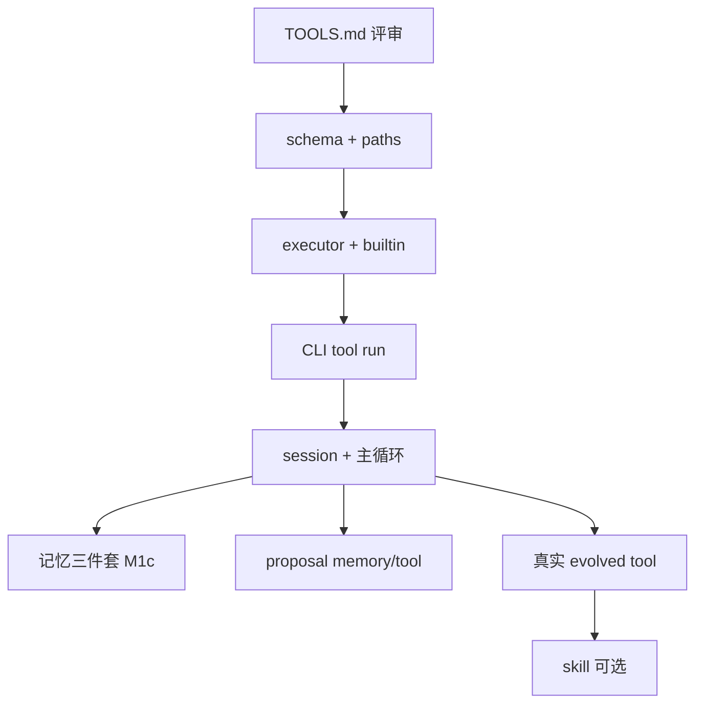

# 任务清单（TASKS）

> 版本 0.1.0 · 2026-07-09 · 细分到每个 task，**先文档评审再动手**  
> **新会话**：先读 [MAP.md](./MAP.md) 了解目录与当前进度。  
> 顺序：**工具设计 → 工具实现 → 对话壳 → 进化（memory/tool）→ skill 最后**

**图例**：`状态` = `todo` | `doc` | `done` | `defer`  
**依赖**：必须先完成的 task id

---

## Phase 0 — 文档与基线（当前）

| ID | 任务 | 交付物 | 依赖 | 验收 | 状态 |
|----|------|--------|------|------|------|
| T-001 | 项目总览文档 | `docs/PROJECT.md` v0.2.1 | — | 目标/非目标/里程碑可读 | done |
| T-002 | 四轮评审整合 | `docs/REVIEW-SUMMARY.md` | T-001 | 决议可追溯 | done |
| T-003 | 分层说明（先 tool 后 skill） | `docs/LAYERS.md` | T-001 | 建设顺序无歧义 | done |
| T-004 | 工具系统设计 | `docs/TOOLS.md` | T-003 | §11 检查项可勾选 | done |
| T-005 | 本任务清单 | `docs/TASKS.md` | T-003,T-004 | 每条 task 可独立执行 | done |
| T-005b | 记忆系统设计（三件套 + 主题路由） | `docs/MEMORY.md` | T-003 | §10 检查项可勾选 | done |
| T-005c | 工具系统修订（6 Builtin + 主题 tools + common） | `docs/TOOLS.md` v0.2、`evolve/_index.toml` | T-005b | §14 检查项可勾选 | done |
| T-005d | 对话层设计（RUNTIME） | `docs/RUNTIME.md` | T-005b,T-005c | §11 检查项可勾选 | done |
| T-005e | 进化写入设计（proposal / 防重复） | `docs/EVOLVE.md` | T-005d | §13 检查项可勾选 | done |
| T-006 | Git 首次 push 私有远端 + `requirements.txt` | remote + 首 commit | T-001～T-005e 评审后 | `git push` 成功；`httpx>=0.27` | todo |

---

## Phase 1 — M1a：工具层（**最先实现**，无 LLM）

| ID | 任务 | 交付物 | 依赖 | 验收 | 状态 |
|----|------|--------|------|------|------|
| T-101 | 定义统一 result/error JSON | `agent-core/tools/schema.py` | T-004 评审通过 | 单测或手工示例 | done |
| T-102 | 路径解析：agent 根 + workspace 边界 | `agent-core/paths.py` | T-101 | 越界路径拒绝 | done |
| T-103 | Builtin `read_file` | `agent-core/tools/builtin/read_file.py` | T-101,T-102 | 读 workspace 下文本；超大小拒绝 | done |
| T-104 | Builtin `list_dir` | `agent-core/tools/builtin/list_dir.py` | T-102 | 列出一层；recursive 可选 | done |
| T-104a | Builtin `grep` | `agent-core/tools/builtin/grep.py` | T-102 | 本地搜；结果上限 | done |
| T-104b | Builtin `web_search` | `agent-core/tools/builtin/web_search.py` | T-101 | 默认 DeepSeek（`LLM_API_KEY` + Anthropic 子调用）；可选 `brave`；§7.4 schema | done |
| T-104c | Builtin `fetch_url` | `agent-core/tools/builtin/fetch_url.py` | T-101 | `httpx`；HTML→文本；SSRF；32k/2MB 上限；§7.5 | done |
| T-105 | 扫描 `evolve/tools/**/tool.toml` | `agent-core/tools/registry.py` | T-004,T-005c | 含 common/ 与 topic 子目录 | done |
| T-106 | `tool.toml` 解析与校验 | `registry.py` 扩展 | T-105 | 非法 schema 启动失败并提示 | done |
| T-107 | Evolved 执行器 + Builtin `run_evolved` | `agent-core/tools/builtin/run_evolved.py` | T-105,T-106 | stdin/stdout JSON；示例跑通 | done |
| T-108 | ToolExecutor：confirm 交互 | `agent-core/tools/executor.py` | T-103～T-107 | y/n/a；`a` 仅 workspace_only evolved；§6.3 | done |
| T-109 | ToolExecutor：dry_run + 超长结果落盘 | `executor.py` | T-108 | dry_run 不写文件；>8k 落盘 §6.4 | done |
| T-110 | `evolve_log.jsonl` 写入 | `agent-core/tools/logging.py` | T-108 | 每次调用一行 JSON | done |
| T-111 | 种子 `write_text` | `evolve/tools/common/write_text/` | T-107 | active；CLI dry-run 通过 | done |
| T-112 | **CLI** `my-agent tool run ...` | `agent-core/cli_tools.py` | T-108～T-111 | 可调 6 builtin + 任意 evolved | done |

**Phase 1 完成标志**：无 LLM 也能 `tool run grep`、`tool run evolved write_text`，并写 log。

---

## Phase 2 — M1b：对话壳 + LLM（见 [RUNTIME.md](./RUNTIME.md)）

| ID | 任务 | 交付物 | 依赖 | 验收 | 状态 |
|----|------|--------|------|------|------|
| T-201 | LLM 薄封装（DeepSeek / OpenAI 兼容） | `agent-core/llm_client.py` | T-006 | flash/pro 模型；`LLM_TIMEOUT_SEC=120`；context 上限 §6.1；`python llm_client.py` | done |
| T-202 | **6 Builtin** → LLM functions | `agent-core/agent.py` | T-105,T-201 | 无平铺 evolved；`python agent.py` | done |
| T-203 | `session.py` 续接 + 持久化 | `agent-core/session.py` | T-201 | 默认 resume 最近 id；`create_new` 新建；`python session.py` | done |
| T-204 | `loader.py` system 基础 + overlay | `agent-core/loader.py` | T-203 | 含 safety 始终加载；digest 段；`python loader.py` | done |
| T-205 | `router.py` 主题 JSON（新会话/换主题）+ `加主题` 并集 | `agent-core/router.py` | T-204 | topics 替换 vs 追加；快捷 `主题 x`；确认后 `llm_model`；`python router.py` | done |
| T-206 | `agent.py` 主循环 + tool 内循环（≤10） | `agent-core/agent.py` | T-202,T-108 | 锚定块 + messages.jsonl；`python agent.py` | done |
| T-207 | `main.py` REPL + 命令 | `agent-core/main.py` | T-206 | 新会话/换主题/压缩/exit；`--record`；`python main.py --demo` | done |
| T-208 | `context.py` digest 压缩 | `context.py` | T-206 | 85% 自动 + `压缩` 手动；K=8；digest≤8k；messages.jsonl 不截断 | done |
| T-209 | `agent-core/prompts/core.txt` | `prompts/core.txt` | T-204 | 身份、边界、禁止假装执行 | done |
| T-210 | `start.bat` | 根目录 | T-207 | 双击进 CLI | done |

**Phase 2 完成标志**：续接 thread → 对话调 grep → `run_evolved write_text` 经 confirm；thread 落盘。

**与 Phase 3 衔接**：T-301～T-308 将 loader/router 与 `_index`、evolved 清单对齐（可先 stub topics=[]）。

**Phase 2 完成标志**：对话中说「列出 workspace」「读某文件」，LLM 能正确选 tool 且经过 confirm。

---

## Phase 3 — M1c：记忆三件套（紧随 M1b，不阻塞首版）

> 设计详见 [MEMORY.md](./MEMORY.md)。**已决**：M1a+M1b 先交付可运行 tool 环；本 Phase 完成后才有完整主题路由与记忆索引。

| ID | 任务 | 交付物 | 依赖 | 验收 | 状态 |
|----|------|--------|------|------|------|
| T-301 | 解析 `evolve/_index.toml`，启动注入主题列表 | `agent-core/loader.py` | T-203 | system 含 topic id/name/description/tool_dirs | done |
| T-302 | 扫描 `evolve/memories/**/*.md` frontmatter，注入 id+summary 索引 | `loader.py` | T-301 | archived 不注入；格式见 MEMORY §5 | done |
| T-303 | Session 目标问答 + `data/sessions/<id>/goal.md` | `main.py` 或 `session.py` | T-203 | 首屏问目标；goal 注入对话上下文 | done |
| T-304 | 主题路由阶段1：LLM 输出 `topics[]` + 用户确认 | `agent-core/router.py` 或 `loader.py` | T-301,T-303 | 用户可改/否决提议主题 | done |
| T-305 | 主题路由阶段2：加载命中主题的 `prompts/<topic>.md` 全文 | `loader.py` | T-304 | 确认后 system 含 coding 等全文 | done |
| T-306 | 启动/主题确认事件写 evolve_log | `loader.py` | T-110,T-305 | log 含 memory_ids、topics_confirmed | done |
| T-307 | 示例：`prompts/coding.md` + `memories/coding/example.md` | `evolve/` 样例 | T-305 | 对话体现主题规则与记忆索引 | done |
| T-308 | 主题确认后注入 evolved 清单（common + 命中 tool_dirs） | `loader.py` | T-305,T-105 | run_evolved 仅允许清单内 name | done |

**Phase 3 完成标志**：主题确认后注入 prompt + memory 索引 + evolved 清单；`read_file evolve/memories/**` 写 L2 `entity_used`。

**T-301 手工验收**（`agent-core/` 下）：

```powershell
cd D:\my-agent\agent-core
python loader.py
```

exit 0；含 `[PASS] T-301: _index.toml → id/name/description/tool_dirs in system`。详见 [MAP.md](./MAP.md) §9.16。

**T-302 手工验收**（`agent-core/` 下）：

```powershell
cd D:\my-agent\agent-core
python loader.py
```

exit 0；含 `[PASS] T-302: scan memories; archived skipped` 与 `[PASS] T-302: memory index in S0`。详见 [MAP.md](./MAP.md) §9.17。

**T-303 手工验收**（`agent-core/` 下）：

```powershell
cd D:\my-agent\agent-core
python session.py
python main.py --demo
```

exit 0；含 T-303 相关 `[PASS]`（goal 问答、`goal.md`、anchor + system 注入、续接不重问）。详见 [MAP.md](./MAP.md) §9.18。

**T-304 手工验收**（`agent-core/` 下）：

```powershell
cd D:\my-agent\agent-core
python router.py
python main.py --demo
```

exit 0；含 T-304 `[PASS]`（accept / reject / override / S3→S4）。详见 [MAP.md](./MAP.md) §9.19。

**T-305 手工验收**（`agent-core/` 下）：

```powershell
cd D:\my-agent\agent-core
python loader.py
```

exit 0；含 `[PASS] T-305: confirmed topics inject full prompt` 与 `[PASS] T-305: real repo coding.md full text in system overlay`。详见 [MAP.md](./MAP.md) §9.20。

**T-306 手工验收**（`agent-core/` 下）：

```powershell
cd D:\my-agent\agent-core
python tools\logging.py
python loader.py
```

exit 0；含 `[PASS] T-306: evolve_log session_start + topics_confirmed`。交互式 REPL 启动或 `新会话` 后可用 `Get-Content ..\data\evolve_log.jsonl -Tail 3` 查看新行。详见 [MAP.md](./MAP.md) §9.21。

**T-307 手工验收**（`agent-core/` 下）：

```powershell
cd D:\my-agent\agent-core
python loader.py
```

exit 0；含 `[PASS] T-307: coding prompt + memory index in system`。确认 coding 主题后 REPL 对话应能遵守 `evolve/prompts/coding.md` 规则，并在 system 看到 `project-my-agent` 记忆索引。详见 [MAP.md](./MAP.md) §9.22。

**T-308 手工验收**（`agent-core/` 下）：

```powershell
cd D:\my-agent\agent-core
python loader.py
python agent.py
```

exit 0；含 `[PASS] T-308: evolved catalog (common+topic) + run_evolved allowlist`。详见 [MAP.md](./MAP.md) §9.23。

**Phase 3（M1c）已全部完成**；**Phase 4（M2）已完成**（`T-401`～`T-407`）。**Phase 5（M3）已完成**（`T-501`～`T-504`）。**Phase 6（M4）进行中**：`T-601`～`T-604` done；下一步 `T-006` 远端 push 或 Phase 6 可选项。

**T-401 手工验收**（`agent-core/` 下）：

```powershell
cd D:\my-agent\agent-core
python boundaries.py
python main.py --demo
```

exit 0；含 3 条 `[PASS] T-401:`（exit + session_end、Ctrl+C 阻断检查点）。交互式：`exit` 保存并退出；`Ctrl+C` 不结束 thread。详见 [MAP.md](./MAP.md) §9.24。

**T-402 手工验收**（`agent-core/` 下）：

```powershell
cd D:\my-agent\agent-core
python evolve.py
python main.py --demo
```

exit 0；`evolve.py` 4 条 `[PASS]`；`main.py --demo` 含 `[PASS] T-402:`。REPL 输入 `记住 …` 应写入 `evolve/proposals/*.md`。详见 [MAP.md](./MAP.md) §9.25。

**T-403 手工验收**（`agent-core/` 下）：

```powershell
cd D:\my-agent\agent-core
python boundaries.py
python evolve.py
python loader.py
python main.py --demo
```

exit 0；含 3 条 `[PASS] T-403:`。助手口头问是否写入 evolve 后输入 `好` → `llm_offer` 检查点；无 pending 时 `好` 仅为普通对话。详见 [MAP.md](./MAP.md) §9.26。

**T-404 手工验收**（`agent-core/` 下）：

```powershell
cd D:\my-agent\agent-core
python evolve.py
python main.py --demo
```

exit 0；`evolve.py` 含 8 条 `[PASS] T-404:`；`main.py --demo` 含 4 条 `[PASS] T-404:`。REPL：`proposals` 列 pending；`proposals accept <id>` 路由写入 evolve；`proposals reject <id>` 归档至 `proposals/archive/`；检查点后可输入 `y` 当轮接受。详见 [MAP.md](./MAP.md) §9.27。

**T-405 手工验收**（`agent-core/` 下）：

```powershell
cd D:\my-agent\agent-core
python evolve.py
```

exit 0；含 5 条 `[PASS] T-405:`（corpus 匹配、拒绝自评/改写、≤2 条、digest 来源、`parse_proposal_batch` 校验）。详见 [MAP.md](./MAP.md) §9.28。

**T-407 手工验收**（`agent-core/` 下）：

```powershell
cd D:\my-agent\agent-core
python evolve.py
```

exit 0；含 5 条 `[PASS] T-407:`（accepted evidence_fp 硬拦、pending supersede、memory id / tool 名硬拦、checkpoint `dedup: blocked`）。详见 [MAP.md](./MAP.md) §9.29。

---

## Phase 4 — M2：进化写入（先 memory / tool，**仍不做 skill**）

| ID | 任务 | 交付物 | 依赖 | 验收 | 状态 |
|----|------|--------|------|------|------|
| T-401 | 对话边界：`exit` 结束 session | `main.py` + `boundaries.py` | T-203 | Ctrl+C 不生成 proposal、不触发检查点 | done |
| T-402 | Proposal 生成（L1 prompt/memory / tool 建议） | `agent-core/evolve.py` | T-401,T-201,T-005e | 写入 `evolve/proposals/*.md`；见 EVOLVE §4 | done |
| T-403 | 触发降噪：显式话术 + 升格两跳；≤2/检查点；口头升格 ≤1/会话 | `evolve.py` + `boundaries.py` + `loader.py` | T-402 | 无 exit/任务成功/新会话软问 | done |
| T-404 | 审阅：接受/拒绝/稍后；离线 `proposals` 命令 | `evolve.py` + `main.py` | T-402 | 接受后路由；memory update 追加修订 | done |
| T-405 | evidence 仅存对话原文摘录 | `evolve.py` | T-402 | 每条 proposal ≤2 条 evidence | done |
| T-406 | tool 接受 = spec 归档；不自动生成代码 | `docs/EVOLVE.md` §7 | T-404 | 用户手放 `tools/<topic>/` | done |
| T-407 | 防重复：id / evidence_fingerprint（全局）/ supersede pending | `evolve.py` | T-402 | 见 EVOLVE §6 | done |

**Phase 4 完成标志**：对话中说 `记住` → 产生 1 条 memory proposal → 接受 → 下次启动见索引；重复同句不再生成第二条；**无需 skill**。

---

## Phase 5 — M3：从使用中固化（tool 优先）

| ID | 任务 | 交付物 | 依赖 | 验收 | 状态 |
|----|------|--------|------|------|------|
| T-501 | 选 1 个真实任务 | — | Phase 2 | 你指定场景 | done |
| T-502 | 为该任务写 evolved tool + tool.toml | `evolve/tools/workflow/sort_by_extension/` | T-111,T-501 | Phase 1 CLI 能跑通 | done |
| T-503 | 对话中通过 LLM 调度该 tool 完成 1 次任务 | — | T-205,T-502 | evolve_log 有记录 | done |
| T-504 | 可选：固化 1 条 memory 而非 tool | `evolve/memories/workflow/downloads-sort.md` | T-404 | 二选一即可 | done |

**Phase 5 完成标志**（M3 / PROJECT §7.2）：workflow 场景 → `sort_by_extension` tool（T-502）→ 对话/CLI 调度（T-503）→ 久远记忆 `downloads-sort`（T-504，与 tool 配套固化习惯）。

**T-504**：`evolve/memories/workflow/downloads-sort.md` — 启动索引一行 summary；正文按需 `read_file`。

**T-501 场景（已选）**：workflow 主题 — **按扩展名整理 workspace 子目录**（模拟「下载夹分类」）。输入目录路径，将顶层文件移入 `pdf/`、`jpg/`、`_no_ext/` 等子文件夹；支持 `dry_run` 预览。

**M3 验收**：§PROJECT 7.2 之「真实任务更省事」+ log 有 tool 引用；**仍不要求 skill**。

**T-502 手工验收**（仓库根 + `agent-core/`）：

```powershell
cd D:\my-agent\agent-core
python ..\evolve\tools\workflow\sort_by_extension\main.py demo

# PowerShell：外层单引号 + 内层 \" 转义（勿用 "{\"path\":...}"）
python my-agent tool run evolved sort_by_extension --json '{\"path\":\"_sort_cli_test\"}' --dry-run -y
```

exit 0；`main.py demo` 5 条 `[PASS]`；CLI 返回 `moved[]` 且 `dry_run: true`。

**T-503 手工验收**（`agent-core/` 下）：

```powershell
cd D:\my-agent\agent-core
python agent.py
```

exit 0；含 `[PASS] T-503:`；`loader.py` 含 `[PASS] T-502:`。详见 [MAP.md](./MAP.md) §9.30～§9.31。

**交互式**（`LLM_API_KEY`）：`python t503_live.py` → 按屏上提示对话 → `exit` 后检查 `workspace/_downloads_inbox/` 与 `evolve_log.jsonl`。

---

## Phase 6 — M4：治理（skill 此时才可选）

> 设计见 [GOVERNANCE.md](./GOVERNANCE.md)。

| ID | 任务 | 交付物 | 依赖 | 验收 | 状态 |
|----|------|--------|------|------|------|
| T-601 | `ReviewCollector` + `my-agent review` | `agent-core/governance/` | T-110,T-301 | never-used / suspect / soft≥3词；`ReviewReport` v1.0 | done |
| T-601a | `--format cli\|json\|markdown` + `-o` | `ReviewRenderer` | T-601 | JSON 可被 jq 解析 | done |
| T-601b | **可选** evolved `governance_review` tool | `evolve/tools/common/` | T-601,T-502 | `run_evolved` 返回同 schema | defer |
| T-602 | suspect：`feedback_negative` 聚合 + 写 `status` | executor / session | T-203 | 3 次否定 → suspect；tool 拒绝执行；见 RUNTIME §10 | defer |
| T-602a | M3：`entity_used` + `pending_feedback` | loader / executor | T-305 | L2：仅 `read_file`→`evolve/memories/**`；L3+ 见 GOVERNANCE §3 | done |
| T-602b | M4：exit 问句 + `feedback_*` | `session.py` / `main.py` | T-602a | `MY_AGENT_FEEDBACK_ON_EXIT=1`；y/n/skip | done |
| T-602c | `failure_streak` 聚合 + `marked_suspect` | `governance/suspect.py` | T-602b | 与 GOVERNANCE §6 一致 | done |
| T-603 | `my-agent audit`（LLM 兜底） | `agent-core/governance/audit.py` | T-601 | `llm_findings[]`；不自动改文件 | done |
| T-604 | Git 回滚习惯写入 README | `README.md` + `governance/git_hints.py` | T-006 | accept / review 后提示 commit | done |
| T-605 | **可选** 显式加载 SKILL.md | `loader.py` 扩展 | T-502,T-503 | 用户说「用 xxx skill」才注入 | defer |
| T-606 | **可选** 自动 skill 路由 | `router.py` | T-605 | M4+，非 MVP | defer |

**T-601 手工验收**（`agent-core/` 下）：

```powershell
cd D:\my-agent\agent-core
python governance\review.py demo
python my-agent review
python my-agent review --topic workflow
```

exit 0；`demo` 含 12 条 `[PASS] T-601:` + 4 条 `[PASS] T-601a:`；CLI 打印 Summary / Never-used / Observation / Suspect / Conflicts / Pending 块。详见 [MAP.md](./MAP.md) §9.33。

**T-601a 手工验收**（`agent-core/` 下）：

```powershell
cd D:\my-agent\agent-core
python governance\review.py demo                    # 含 T-601a [PASS]
python my-agent review --format json | python -c "import json,sys; json.load(sys.stdin)"
python my-agent review --format markdown -o ..\data\reviews\latest.md
python my-agent review --format json -o ..\data\reviews\latest.json
```

`--format json` 输出完整 `ReviewReport` v1.0（可被 `jq` / `json.load` 解析）；`-o` 落盘；默认仍为 `cli` → stdout。

**T-602a 手工验收**（`agent-core/` 下）：

```powershell
cd D:\my-agent\agent-core
python governance\entity_usage.py
python tools\logging.py
python tools\executor.py
```

exit 0；含 `[PASS] T-602a:`（L2 路径判定、`entity_used` log、memory `use_count`/`last_used_at`、`meta.pending_feedback`、非 memory 不触发）。对话或 CLI 执行：

```powershell
python my-agent tool run read_file --json '{\"path\":\"evolve/memories/workflow/downloads-sort.md\"}' -y --session _t602a_test
Get-Content ..\data\evolve_log.jsonl -Tail 3
Get-Content ..\data\sessions\_t602a_test\meta.json
```

末行 `event` 应为 `entity_used`；`meta.json` 含 `pending_feedback` 条目。

**T-602b 手工验收**（`agent-core/` 下）：

```powershell
cd D:\my-agent\agent-core
python governance\feedback.py
python session.py
python main.py --demo    # 含 [PASS] T-602b
```

交互式（需先 `read_file` 某 memory 产生 `pending_feedback`）：

```powershell
$env:MY_AGENT_FEEDBACK_ON_EXIT = "1"
python main.py
# … 对话中 read_file evolve/memories/... 
# exit → 问「这次用得对吗？」→ y / n / 回车跳过
Get-Content ..\data\evolve_log.jsonl -Tail 5   # feedback_positive / feedback_negative
```

默认 **不**问；仅 `exit` 时、且 `pending_feedback` 有 L2+ 实体时触发；每 exit 只问 **一个**（L4>L3>L2，同层 `used_at` 最新）。

**T-602c 手工验收**（`agent-core/` 下）：

```powershell
cd D:\my-agent\agent-core
python governance\suspect.py
python governance\feedback.py    # 含 T-602c integration [PASS]
```

| 场景 | 预期 |
|------|------|
| `compute_failure_streak` | 仅从 `evolve_log` 聚合；`feedback_positive` 归零 |
| 连续 3 次 `feedback_negative` | memory frontmatter / `tool.toml` → `status: suspect` |
| 达阈值 | `evolve_log` 追加 `marked_suspect`（含 `failure_streak`） |
| 已 suspect | 幂等，不重复写 `marked_suspect` |

交互式（需 `MY_AGENT_FEEDBACK_ON_EXIT=1`，同一 entity 跨 3 次 session exit 均答 `n`）：

```powershell
Get-Content ..\data\evolve_log.jsonl -Tail 10   # feedback_negative ×3 + marked_suspect
# 检查 evolve/memories/... 或 evolve/tools/.../tool.toml 的 status: suspect
```

**T-603 手工验收**（`agent-core/` 或仓库根）：

```powershell
cd D:\my-agent\agent-core
python governance\audit.py demo

cd D:\my-agent
python my-agent audit --topic coding
python my-agent audit prompts --topic coding
python my-agent audit --format json -o data\reviews\audit-latest.json
python my-agent audit --only-llm --format cli
```

| 场景 | 预期 |
|------|------|
| 默认 | `ReviewCollector.collect()` + LLM 审阅 prompt + 同 topic active memory |
| `audit prompts` | 仅 prompt 文件进 LLM corpus |
| `--only-llm` | CLI/markdown 只打 `llm_findings` 块 |
| `--format json` | 完整 `ReviewReport` v1.0；`scope.audit_ran=true` |
| 无 API key | `audit.py demo` 用 mock 通过；CLI 需 `LLM_API_KEY` |
| 完成后 | `evolve_log` 追加 `audit_completed`（`findings_count`, `scope`） |

**T-604 手工验收**（仓库根）：

```powershell
cd D:\my-agent
python agent-core\governance\git_hints.py
python my-agent review --topic coding
python my-agent audit --topic coding --only-llm
```

| 场景 | 预期 |
|------|------|
| `README.md` | 「Git 回滚习惯」：何时 commit、`git checkout` 回滚 |
| `git_hints.py` | 2 条 `[PASS] T-604` |
| `my-agent review` / `audit`（cli） | 末段 `== Git ==` |
| `proposals accept` | 消息含 `Git: git commit -m "evolve: accept …"` |

---

## Phase 7 — 明确推迟（defer）

| ID | 任务 | 原因 |
|----|------|------|
| T-901 | Skill proposal 自动生成 | 等 tool 稳定后再说 |
| T-902 | 多 LLM adapter | 单人无收益 |
| T-903 | SQLite / 向量检索 | 文件量级不够 |
| T-904 | Web / TUI | CLI 未验证前不做 |
| T-905 | 进程沙箱 | 确认流够用 |
| T-906 | 自动安装 Python 依赖 | 你手工 venv |

---

## 依赖总图（简）



---

## 建议你现在审什么

1. **`RUNTIME.md`** — 续接、DeepSeek、digest 是否认可  
2. **`TOOLS.md` v0.2** — 6 Builtin、主题 tools  
3. **Phase 1～2** — task 是否够细  

审完标 T-004、T-005 为 `done`，再动 T-101 写代码。

---

## 与 PROJECT.md 里程碑对照

| PROJECT 里程碑 | 本清单 |
|----------------|--------|
| M1（原：含 skill） | **拆为** M1a Phase1 + M1b Phase2 + M1c Phase3（均无 skill） |
| M2 | Phase 4 |
| M3 | Phase 5 |
| M4 | Phase 6 |

建议在 `PROJECT.md` §7.3 引用本文件为 **实施细表**。
