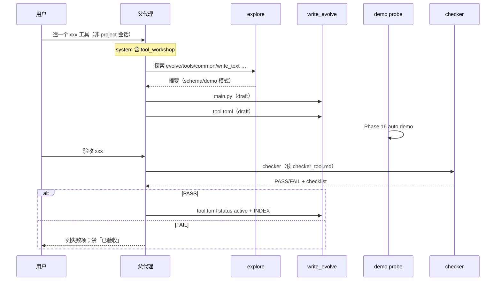

# 工具工坊提示词（TOOL-WORKSHOP-PROMPTS）

> 版本 **0.3.0** · 2026-08-05 · **状态：D0 doc（文档先行 · 细稿 + 范围哲学）**  
> Phase **46** · 关联：[TOOLS.md](./TOOLS.md) · [TOOL-CATALOG.md](./TOOL-CATALOG.md) · [CHECKER-SUBAGENT.md](./CHECKER-SUBAGENT.md) · [ORCHESTRATION.md](./ORCHESTRATION.md) · [RUNTIME.md](./RUNTIME.md) §4 · [RUNTIME-GUARDS.md](./RUNTIME-GUARDS.md) · [WORKBENCH-UI.md](./WORKBENCH-UI.md) · [PROJECT-MODE.md](./PROJECT-MODE.md) · [AGENT-HARNESS.md](./AGENT-HARNESS.md)

---

## 0. 已决摘要

| ID | 决议 |
|----|------|
| **W1** | **先定注入规则，再落盘文件**；`.md` vs 内联只是载体，注入选择逻辑才是真源 |
| **W2** | explore / checker 子代理 system prompt **外置**到 `evolve/subagents/`（prompt 也是进化对象，Git diff 可审计） |
| **W3** | **工坊 prompt 仅「非 project 绑定」会话注入**；project 窗口不灌造工具规则（减 system 噪音） |
| **W4** | 非 project 会话注入 **短块** `tool_workshop.md`（硬上限 **55 行**，含 Step 0 范围门）；长手册仍在 `buckets/evolve.md`，按需 `read_file` |
| **W5** | scaffold 回合保留 **`format_scaffold_tool_overlay()` + cookbook**；三者分工明确，禁止长段重复 |
| **W6** | **defer**：`status × prompt × 测试层 × Gate` 四维映射表；M1 只在 prose 写四步工序 + 沿用现有 executor/checker 硬门 |
| **W7** | **defer**：registry 级 `draft` 拒调 / `staged` 仅 CLI 等硬闸（另开 Phase；本文只设计 prompt 面） |
| **W8** | 外置 prompt **缺失时 fallback 内联**（sidecar 不得因缺文件崩溃） |
| **W9** | 改 `evolve/subagents/*.md` **不重载**当前 session overlay（与 [MEMORY.md](./MEMORY.md) §9、`换主题` 行为一致：下次 `build_system_prompt` / 下轮子代理 spawn 才读新内容） |
| **W10** | **先过范围门再写代码**：默认不新建「一次性 / 过窄」工具；能复用 INDEX 里已有能力则不造 |
| **W11** | 新工具倾向 **参数化、可组合、跨场景**；`common/` 更高门槛（[TOOLS.md](./TOOLS.md) §9） |
| **W12** | checker / explore **必须审范围**：过窄 → FAIL 或强 WARN，不因 demo 通过就 PASS |

**动机（2026-08-05）**：evolved 工具「老不好用」——常见根因不是少写几行 Python，而是：

1. 造工具与做项目共用同一套 system 面，模型把 scaffold 当普通 patch；
2. checker / explore 验收口径改一次要动 `subagent.py`；
3. project 会话里仍可见「去 grow 造工具」类规则，干扰 `run_project_tests` 主线；
4. demo 常 `print('ok')`，schema 描述误导 LLM，TOOL-RETRY 白烧轮次；
5. **工具造太细**：每个小任务一个新 tool，INDEX 膨胀、LLM 选错工具、与 `run_command` / `write_text` 重叠——**不好用**的另一主因。

---

## 1. 目标与非目标

### 1.1 目标

| # | 目标 | 可验证 |
|---|------|--------|
| G1 | 子代理 prompt 可 Git diff、可手改，无需改内核字符串 | 改 `checker_tool.md` 后 checker 报告口径变化 |
| G2 | project 绑定会话 system **不含** `tool_workshop` section | IT-461 |
| G3 | 非 project 会话（grow / 先聊聊 / CLI）**含** `tool_workshop` section | IT-461 |
| G4 | scaffold 回合仍注入硬约束 overlay + cookbook（行为不退化） | S-35 回归 |
| G5 | 注入逻辑有单测真源，不靠注释维护 if-else | IT-461～463 |
| G6 | 与 TOOL-CATALOG Mr、CHECKER K8、PROJECT P6 不冲突 | 文档交叉引用 + 回归 |
| G7 | 工坊 **默认加宽范围、抑制过窄新工具** | checker scope 项 · explore「请先查 INDEX」 |

### 1.2 非目标（本 Phase）

- registry `status` 硬闸（`draft` 不可 `run_evolved`）
- 每个 status 独立 prompt 文件 / 四维映射表
- 强制 `tests/test_tools/<name>.py` 目录与 CI 门
- 新 Builtin、新子代理种类、工坊专用 UI 壳
- 把 `buckets/evolve.md` 全文每轮注入 system（违反 Mr 与 token 预算）

### 1.3 范围哲学：广而不细（用户 2026-08-05 · 与 W10～W12 对齐）

> **「细」≠「代码写得细」**，而是 **工具职责过窄、只服务单次任务**。  
> 工坊既要 **质量门**（demo/checker），也要 **范围门**（该不该造、造多宽）。  
> 二者缺一，会出现：每个工具都能跑 demo，但 INDEX 里一堆几乎用不到的名字。

#### 1.3.1 什么叫「太细」（应拒绝或降级）

| 过窄信号 | 例子 | 更宽做法 |
|----------|------|----------|
| 名字绑死单次任务 | `sort_huiyi_downloads_aug5` | `sort_by_extension` + 参数 `path` |
| 与现有工具仅差一个常量 | `npm_run_dev_huiyi` | `run_command` / `npm_exec` + `command` |
| 只包一层无新增 policy | `call_curl_localhost_8080` | `http_request` 或 `run_command` |
| schema 无可调字段 | 工具无任何 arguments，路径写死在 main.py | 至少 `path` / `command` / `pattern` 等 |
| 只服务一个文件名 | `patch_env_md_line_42` | `patch_file` + 行号/锚点 |
| 重复 common 能力 | 又一个 `write_text` 变体 | 直接用 `write_text` / 提 PR 改现有工具 |

**原则**：用户说「帮我写个工具做 X」时，默认问的是 **能否用 INDEX 里 1～2 个现有工具 + 参数完成**；只有 **重复模式已出现 ≥2 次** 或 **现有工具缺关键 policy（confirm/边界/错误形状）** 才沉淀新工具。

#### 1.3.2 什么叫「够广」（鼓励）

| 维度 | 够广 | 仍算合理窄（例外） |
|------|------|---------------------|
| **参数** | `path` · `pattern` · `command` · `action` enum · `working_dir` | 固定引擎路径（如 `repair_node_modules` 有明确安全 story） |
| **场景** | 同一工具可服务多个目录/项目/扩展名 | 仅 bind 某外部 CLI 的薄封装（`mvn_exec` / `npm_exec`） |
| **组合** | 输出/error 形状稳定，便于 LLM 与其它工具链式用 | project 域工具（`report_progress`）服务明确产品面 |
| **目录** | workflow 整理类可略窄；**common 必须跨主题** | coding 下单次脚本 → **不应**进 common |

与 [TOOLS.md](./TOOLS.md) §9 一致：**common 只放真正跨主题必备**；不是「常用就塞 common」。

#### 1.3.3 范围门（Step 0 · 先于四步工序）

在 `write_evolve` **之前**，父代理须完成（可口头对用户，但内核须在 prompt 里写死）：

```text
Step 0 — 范围门
  1. read_file evolve/tool-catalog/INDEX.md（或 rely 已注入 catalog）
  2. 列出：现有哪 1～3 个工具 + 什么参数能覆盖需求？
  3. 若可覆盖 → 用现有工具演示/执行，不新建
  4. 若不可覆盖 → 说明「缺什么 policy/参数」，再定新工具名与 scope
  5. 新工具须能回答：「六个月后在另一个目录/项目，它还有用吗？」否 → 太细
```

**explore 在造工具场景的职责调整**：不是只「读一个范例照抄」，而是 **先对照 INDEX + 1 个同类宽工具 + 1 个窄反例**（若有），输出「建议不造 / 建议造 / 建议加参数到现有工具」。

#### 1.3.4 与「严格流程 / 多次测试」的关系

| 误解 | 澄清 |
|------|------|
| 严格 = 每个小需求一个 tool | **错**。严格应用在 **值得存在的工具** 上，不是鼓励多造 |
| 测试多 = demo 测越细越好 | demo 测 **契约与边界**，不是把业务逻辑写死在 tool 里 |
| 参考范例 = 克隆一个差不多窄的 | 参考 **宽工具**（`run_command` · `write_text` · `sort_by_extension`）的 **形状**，不是复制业务 |

质量门（demo/checker）与范围门（Step 0）**串联**：范围门不过 → **不应进入** write_evolve；checker 新增 **scope** 项，demo 通过也不能 alone PASS。

#### 1.3.5 放置目录与宽度的关系

| 目录 | 宽度期望 | 新增门槛 |
|------|----------|----------|
| `evolve/tools/common/` | 最高 · 跨主题 | 必须 W11：否则 FAIL scope |
| `evolve/tools/workflow/` | 中高 · 整理/批处理模式 | 需参数化，禁日期/项目名进工具名 |
| `evolve/tools/coding/` | 中 · 开发动作 | 优先扩 `run_command` / git_* / `patch_file` |
| `evolve/tools/data/` | 中 · 数据访问 | 禁 SQL 写死在工具名 |
| `evolve/tools/project/` | 可窄 · 产品面 | 已有 gate（plan/report_progress 等） |

#### 1.3.6 对用户怎么说（口语门）

当需求过窄时，父代理应 **先劝退造工具**，例如：

- 「这个用 `run_command` + 一次 confirm 就能做，不必沉淀工具。」
- 「如果这类操作以后会反复出现，我们可以做一个带 `path`/`pattern` 的通用工具，而不是只为这次文件名造一个。」

---

## 2. 问题陈述与典型失败模式

### 2.1 会话面混淆

| 场景 | 现状 | 期望 |
|------|------|------|
| huiyi 项目里跑 `run_project_tests` | topics 含 `coding`，prompt 仍提 `write_evolve` / 造工具 | 只保留项目三件套、测试、patch_file（项目内） |
| WORKBENCH「先聊聊」造 echo 工具 | 仅靠 `detect_scaffold_tool_turn` 单轮 overlay | 会话级工坊人格 + scaffold 回合硬约束 |
| 用户说「帮我加个整理 PDF 的工具」但未命中 scaffold 关键词 | 无工坊短块，模型直接乱 `write_text` | 非 project 会话仍有「你在工坊」四步工序 |

### 2.2 工具质量失败模式（prompt 应明确禁止）

| 模式 | 表现 | prompt / 门 |
|------|------|-------------|
| **空 demo** | `main.py` demo 段仅 `print('demo ok')` | checker_tool.md · tool_workshop 四步 |
| **schema 撒谎** | description 写「path 可选」但 required 含 path | checker 语义项 · TOOL-RETRY 仍兜底 |
| **双写路径** | `write_text` 写 `workspace/foo/main.py` 再 copy | scaffold overlay 禁成品路径 · Phase 16 |
| **过早 active** | 首版 `tool.toml` 即 `status = "active"` | tool_workshop：先 `draft` · checker PASS 再改 |
| **假验收** | demo 失败仍说「工具已沉淀完成」 | CHECKER K8 · session overlay checker 提示 |
| **父循环复读** | explore 已读 `write_text`，父代理又 read 一遍 | ORCHESTRATION · explore_tool 输出格式 |
| **过窄沉淀** | 每个任务一个新 tool；INDEX 30+ 难选 | Step 0 范围门 · checker scope 项 · W10 |
| **假通用** | 名字宽但 schema 无参数、路径写死 | checker：required 为空且 main 硬编码 → fail |

### 2.3 现有资产（必须复用，不重写）

| Phase | 能力 | 本文关系 |
|-------|------|----------|
| 16 | demo probe · scaffold 窄域拒 `write_text` 写 evolved 路径 | prompt 引用，不重复实现 |
| 17 | checker 子代理 · 完成声明门 | 外置 prompt，保留 checklist 归并 |
| 23 Mr | core 指针 + `buckets/evolve.md` 手册 | tool_workshop 指向 evolve 桶，不搬家 |
| 39/41 | plan_partner · harness 止损 | 工坊会话不涉及 plan 域写 |
| WORKBENCH Q4 | 先聊聊 = grow 无 project | `workshop_eligible` 真源 |

---

## 3. 架构总览

### 3.1 提示词分层（谁写什么）

```text
┌─────────────────────────────────────────────────────────────┐
│ agent-core/prompts/core.txt          永久 · 全会话 · 硬边界   │
│  · 只经 run_evolved / write_evolve                           │
│  · 一行指针 → buckets/evolve.md                              │
└─────────────────────────────────────────────────────────────┘
                              │
┌─────────────────────────────▼───────────────────────────────┐
│ evolve/prompts/{topic}.md            主题 · 全会话（若确认）  │
│  · coding/workflow/… 场景分流                                 │
│  · M1 后：造工具长段迁出，只留一句指针 tool_workshop         │
└─────────────────────────────────────────────────────────────┘
                              │
        workshop_eligible ────┼──── project_bound
              │               │               │
              ▼               │               ▼
┌─────────────────────┐       │    ┌──────────────────────┐
│ tool_workshop.md    │       │    │ project overlay      │
│ ≤40 行 · 四步工序   │       │    │ TASKS/ENV/一停…      │
└─────────────────────┘       │    └──────────────────────┘
              │               │
     scaffold_turn ───────────┤
              │               │
              ▼               ▼
┌─────────────────────┐  ┌─────────────────────┐
│ scaffold_tool       │  │ evolved_catalog     │
│ overlay ≤12 行      │  │ INDEX + cookbook*   │
└─────────────────────┘  └─────────────────────┘
              * cookbook 仅 scaffold_turn

┌─────────────────────────────────────────────────────────────┐
│ evolve/tool-catalog/buckets/evolve.md   按需 read_file 手册   │
│  · base64 / staging / on_conflict / 项目窗禁止               │
└─────────────────────────────────────────────────────────────┘

┌─────────────────────────────────────────────────────────────┐
│ evolve/subagents/*.md              子代理 spawn 时读一次      │
│  explore · explore_tool · checker_tool · checker_project_test│
└─────────────────────────────────────────────────────────────┘
```

### 3.2 造工具时序（父代理 + 子代理）



---

## 4. 注入规则（实现真源）

> **§4 是 M1 编码时的单一真源**；`loader.py` 应集中 `is_workshop_eligible()`，避免散落判断。

### 4.1 谓词定义

```python
def is_project_bound(session: Session) -> bool:
    """与 project overlay 注入条件对齐。"""
    pid = (session.meta.project_id or "").strip()
    if not pid:
        return False
    root = (session.meta.project_root or "").strip()
    if not root:
        return False
    # 可选：校验 workspace/<pid> 存在；不存在时 treat  as unbound（与 format_project_overlay 一致）
    return True


def is_workshop_eligible(session: Session) -> bool:
    return not is_project_bound(session)


def is_scaffold_turn(session: Session) -> bool:
    return bool(session.scaffold_tool_turn)
```

**注意**：`active_shell == "grow"` **单独不足以**判定工坊——须 **`NOT project_bound`**。  
反例：用户绑定了 project 但 `+ 对话` 挂起项目开 grow 线时，若 session 仍带 `project_id`，则 **不** 注入 `tool_workshop`（造工具应开**无 project** 的新会话 / 「先聊聊」）。

| 条件 | `project_id` | `project_root` | `active_shell` | `workshop_eligible` |
|------|--------------|----------------|----------------|---------------------|
| 项目工作台继续 | 有 | 有 | project | **否** |
| 顶栏 + 对话（仍绑 project） | 有 | 有 | grow | **否**（P6 仍可能拒 write_evolve） |
| 先聊聊 / 新会话无项目 | 空 | 空 | grow | **是** |
| CLI 默认 | 空 | 空 | grow | **是** |
| 只聊模式无项目 | 空 | 空 | grow + ask | **是**（但 executor 禁 run_evolved） |

### 4.2 `build_system_prompt` section 顺序

#### 4.2.1 现状（`loader.py` L1000～1035 摘要）

```text
core → topic_index → memory_index → builtin_summary → host_scope
→ session → turn_discipline? → safety
→ topic_prompt:{id}…
→ evolved_catalog          ← cookbook 在 scaffold 时嵌在这里
→ scaffold_tool?           ← 在 catalog 之后
→ evolve_escalation? → subagent_summary? → project_overlay? …
```

#### 4.2.2 目标（M1b）

在 **`topic_prompt:*` 之后、`evolved_catalog` 之前** 插入 `tool_workshop`：

```text
core → topic_index → memory_index → builtin_summary → host_scope
→ session → turn_discipline? → safety
→ topic_prompt:{id}…
→ tool_workshop?           ← NEW：is_workshop_eligible
→ evolved_catalog          ← 仍含 INDEX + capability_hints + cookbook(scaffold)
→ scaffold_tool?           ← 保留位置（或紧接 tool_workshop 后，二选一；推荐 catalog 后不变以减少 diff）
→ evolve_escalation? → subagent_summary? → project_overlay? …
```

**`tool_workshop` 插入在 topic 之后的原因**：topic（如 coding）可能仍含一句造工具指针；tool_workshop 作为 **工坊面覆盖 topic 里过时长段**（Mq）。

#### 4.3 各 section 触发表

| section id | 条件 | 来源 | 行数预算 |
|------------|------|------|----------|
| `tool_workshop` | `is_workshop_eligible(session)` | `load_tool_workshop_prompt(evolve_dir)` | ≤55 |
| `evolved_catalog` | 始终（overlay 模式） | `format_evolved_catalog_overlay` | INDEX ≤2KB + hints |
| └ cookbook 子块 | `scaffold_turn` ∧ `write_evolve` ∈ allowlist | `format_write_evolve_cookbook(scaffold_turn=True)` | ≤15 |
| `scaffold_tool` | `scaffold_turn` | `format_scaffold_tool_overlay()` | ≤12 |
| `subagent_summary` | `session.subagent_overlay` | 含 checker explore 摘要 | 可变 |
| `project` | `active_shell==project` ∧ `project_root` | `format_project_overlay` | 可变 |

#### 4.4 内容分工（防重复）

| 内容 | 放在哪 | 不在哪 |
|------|--------|--------|
| base64 / content_workspace_path 逐步写法 | `buckets/evolve.md` | tool_workshop · core 长段 |
| 本轮禁 write_text 写 main.py/tool.toml | `scaffold_tool` overlay | tool_workshop |
| 四步工序 / 工坊身份 / **Step 0 范围门** | `tool_workshop.md` | scaffold overlay |
| JSON 顶层 path 示例 | cookbook | tool_workshop |
| demo 语义验收 / CHECKER_VERDICT | `checker_tool.md` | 父 agent tool_workshop |
| 读范例输出格式 | `explore_tool.md` | coding.md 长段 |

#### 4.5 `format_session_overlay` 变更（可选 · M1c）

现有 L464～467 在 `scaffold_tool_turn` 时写一行 `scaffold_tool: yes — …`。  
**保留**该行（瞬态 turn 标记），但与 `tool_workshop` 不重复细节——session 行只保留 **yes/no**，细则在 section 正文。

checker 回合已有：

```text
subagent: checker — 验收报告已注入；勿自动修复文件；verdict≠pass 时勿宣称「已验收/沉淀完成」。
```

与 `tool_workshop` §完成声明一致，**不删除**（session 行是瞬态提醒）。

### 4.6 子代理 prompt 加载

#### 4.6.1 新 API（建议放在 `loader.py`）

```python
SUBAGENT_PROMPTS_DIR = Path("subagents")

def load_evolve_prompt_file(evolve_dir: Path, relative: str, *, fallback: str) -> str:
    path = evolve_dir / relative
    if path.is_file():
        try:
            text = path.read_text(encoding="utf-8").strip()
            if text:
                return text
        except OSError:
            pass
    return fallback


def load_subagent_prompt(
    evolve_dir: Path,
    name: str,
    *,
    fallback: str,
    extra: str | None = None,
) -> str:
    base = load_evolve_prompt_file(
        evolve_dir, f"subagents/{name}.md", fallback=fallback
    )
    if extra:
        return f"{base}\n\n---\n\n{extra}"
    return base
```

#### 4.6.2 `subagent.py` 改造点

| 函数 | 现况 | M1a |
|------|------|-----|
| `_explore_system_prompt()` | 内联 5 行 | `load_subagent_prompt(..., "explore.md", fallback=内联)` |
| `_checker_system_prompt(kind=…)` | 内联 + kind 分支 | `checker_tool.md` / `checker_project_test.md` |
| explore 工具范例 | 无 | 若 `_explore_task_needs_tool_patterns(task)` → 追加 `explore_tool.md` |

**`_explore_task_needs_tool_patterns(task: str) -> bool`**（M2 可自动化，M1 可先 stub False + 手动 `探索 evolve/tools/…` 时 True）：

```python
_TOOL_EXPLORE_MARKERS = (
    "造工具", "evolve/tools", "tool.toml", "main.py",
    "范例", "reference", "scaffold", "write_evolve",
)
def _explore_task_needs_tool_patterns(task: str) -> bool:
    t = task.casefold()
    return any(m in task or m in t for m in _TOOL_EXPLORE_MARKERS)
```

spawn explore 时若父 session `scaffold_tool_turn`，**强制**追加 `explore_tool.md`。

#### 4.6.3 子代理触发表

| 子代理 | 用户/内核触发 | system 组成 | 工具面 |
|--------|---------------|-------------|--------|
| explore 默认 | `探索 path` · auto explore | `explore.md` | read_file, list_dir, glob, grep, web, fetch |
| explore 工具 | task 命中 §4.6.2 或 scaffold_turn | `explore.md` + `explore_tool.md` | 同上 |
| checker tool | `验收 foo` · `check foo` · auto scaffold | `checker_tool.md` + user 消息含 demo 硬事实 | 只读 4 builtin |
| checker project | `验收测试 workspace/id/backend` | `checker_project_test.md` | 只读 4 builtin |

---

## 5. 文件布局与命名

```text
evolve/
├── prompts/
│   ├── tool_workshop.md              # §6.1 · 父代理工坊短块
│   ├── coding.md                     # M1 裁剪造工具段
│   └── …
├── subagents/
│   ├── README.md                     # 可选 · 说明外置约定
│   ├── explore.md                    # §6.2
│   ├── explore_tool.md               # §6.3
│   ├── checker_tool.md               # §6.4
│   └── checker_project_test.md       # §6.5 · 从 subagent 内联 kind 分支拆出
└── tool-catalog/buckets/
    └── evolve.md                     # 不动 · write_evolve 语法手册
```

**禁止**：

- `evolve/prompts/tool_workshop/` 目录（与 `evolve/tools/` 混淆）
- 把 subagent prompt 放进 `evolve/prompts/`（与 topic prompt 混淆）

---

## 6. Prompt 正文草案（M1 落盘时可几乎原样复制）

> 下列为 **设计稿**；M1 写入 repo 后以文件为准，本文保留副本供评审 diff。

### 6.1 `evolve/prompts/tool_workshop.md`（≤55 行）

```markdown
# 工具工坊（Tool Workshop）

你在 **工具工坊** 会话：沉淀 **可复用、够广** 的 evolved 工具——不是为当前一句话造一次性脚本。

## Step 0 — 范围门（先于写文件）

1. 看 `evolve/tool-catalog/INDEX.md`：现有工具 + 参数能否覆盖需求？
2. 能 → **用** `run_command` / `write_text` / `patch_file` / 已有 evolved；**不**新建。
3. 不能 → 写清缺的是 **policy**（confirm/边界/错误形状）还是 **可复用参数**。
4. 自检：「换目录 / 换项目 / 六个月后，这工具还有用吗？」否 → 太细，改设计或别造。
5. common/ 只收 **跨主题** 能力；单次任务名禁止进工具名。

## 四步工序（范围门通过后）

1. **读对照** — `探索 evolve/tools/<scope>/` 里 **宽工具**（如 run_command、write_text），不是克隆窄工具。
2. **写文件** — `write_evolve`：先 `main.py` 再 `tool.toml`（`status = "draft"`）。细则：`buckets/evolve.md`。
3. **跑 demo** — 测 **契约与参数组合**（至少 2 组输入），禁止空 `print('ok')`。
4. **验收晋升** — `验收 <name>`；PASS 后改 `active` + INDEX 一行；须含 **一句话适用范围**。

## 硬约束

- 禁止 `write_text`/`patch_file` 写 `evolve/tools/.../main.py|tool.toml` 成品。
- project 绑定会话禁止造工具 → 引导「先聊聊」。
- checker 非 PASS 禁止「已验收/沉淀完成」。

## 质量底线

- schema：`required` 含可调业务参数；description 与 required 一致。
- 错误：`{ok:false, error:"…"}` 可让 LLM 自修正。
- 优先 **加参数** 扩展现有工具，而非新建窄工具。
```

### 6.2 `evolve/subagents/explore.md`

```markdown
你是 my-agent 的 **explore 子代理**（只读调研）。

## 工具

可用：`read_file`、`list_dir`、`glob_file_search`、`grep`、`web_search`、`fetch_url`。  
**禁止**：`run_evolved`、`write_evolve` 或任何写入。

## 输出

用自然语言输出摘要，必须包含：

- **已读路径**（列表）
- **关键发现**（事实，不编造）
- **给父代理的建议**（下一步具体动作）

父代理会收到你的摘要；**不应**重复读取相同路径，除非摘要标明 truncated 或缺文件。

## 纪律

- 够用即停；不要为凑轮次而读无关目录。
- 不声称已修改任何文件。
```

### 6.3 `evolve/subagents/explore_tool.md`

```markdown
## 工具范例调研（追加块）

本次任务与 **evolved 工具 scaffold** 相关。在通用 explore 规则之上：

### 读什么（按顺序）

1. **`evolve/tool-catalog/INDEX.md`**（或已注入 catalog）— 现有工具是否已覆盖？
2. 若需新工具：读 1 个 **宽** reference（`run_command` · `write_text` · 同 scope 最通用者）。
3. 可选：读 1 个 **窄反例**（若有）说明为何不应照抄。

### 输出必须包含

0. **范围建议**：`不造` / `用现有 X+参数` / `可造` + 理由（一句话）
1. **schema 模式**：required 是否够 **宽**（可调 path/pattern/command）
2. **main.py 结构**：入口、错误 JSON、有无硬编码路径
3. **demo 质量**：是否测 **多组参数**；空跑 → 标注 fail
4. **write_evolve 建议**：scope 目录、工具名、draft、INDEX 一行描述（含适用范围）

### 禁止

- 不要输出完整 main.py 源码让父代理盲抄；给 **模式** 与 **差异点**。
- 不要调用 write_evolve。
```

### 6.4 `evolve/subagents/checker_tool.md`

```markdown
你是 my-agent 的 **checker 子代理**（只读验收 / 监工）。

## 工具

可用：`read_file`、`list_dir`、`glob_file_search`、`grep`。  
**禁止**：`run_evolved`、`web_search`、`fetch_url` 或任何写入。

## 输入

用户消息含：**工具名、目录、demo probe 硬事实**（exit_code、stdout/stderr 摘要、SKIP 原因）。  
硬事实由内核注入；你负责 **对照文件做结构与语义审计**，不要自行 subprocess。

## 默认 checklist（evolve 工具）

| # | 项 | fail 条件 |
|---|-----|-----------|
| 0 | **范围 scope** | 与 INDEX 现有工具重复且无新 policy；或 common 下明显过窄；或无可调 required 且路径写死 |
| 1 | `main.py` + `tool.toml` 存在 | 缺任一 |
| 2 | `tool.toml` 可解析；`topics` 与目录 scope 一致 | parse 失败或 scope 明显错 |
| 3 | demo | exit≠0 且非明确 SKIP → fail；SKIP 仅 warn |
| 4 | demo 语义 | 仅单一路径/空跑 → fail 或 warn；须 ≥2 组参数或等价边界 |
| 5 | schema | required 与 description 矛盾 → fail |
| 6 | reference | 若给定，仅核任务关键字段；风格差异 warn |
| 7 | INDEX 描述 | 若 active：须能读出 **适用范围**（非单次任务名） |

## 输出

- 人话报告：逐项 pass/fail/warn + 证据路径
- **末行必须是**：`CHECKER_VERDICT: pass` 或 `fail` 或 `warn`（小写）
- 无 demo 证据时 **不得** pass
- 禁止声称已 patch 或已帮用户改文件
```

### 6.5 `evolve/subagents/checker_project_test.md`

```markdown
你是 my-agent 的 **checker 子代理**（项目测试失败分析）。

## 工具

只读：`read_file`、`list_dir`、`glob_file_search`、`grep`。禁止写入与 run_evolved。

## 任务

分析 `run_project_tests` 的结构化 failures（file:line、message）。  
给出 **修复建议** 与可能根因；禁止声称已修改代码。

## 输出

末行：`CHECKER_VERDICT: pass|fail|warn`  
（测试仍失败时通常为 fail；仅当 failures 已澄清且建议完整可用 warn）
```

---

## 7. Topic prompt 裁剪（T-4603）

### 7.1 `evolve/prompts/coding.md`

**删除或替换** L41～43：

```markdown
**新建 coding/data 等目录下的工具**：在**普通窗口** `run_evolved` → `write_evolve`；细则先 `read_file evolve/tool-catalog/buckets/evolve.md`。
```

**改为**（2 行）：

```markdown
**新建 evolved 工具**：仅在 **非项目绑定** 会话（grow / 先聊聊）；system 已含 `[tool_workshop]`；语法见 `buckets/evolve.md`。
**项目绑定会话**禁止 `write_evolve`（见 PROJECT-MODE P6）。
```

### 7.2 其他 topic

| 文件 | 动作 |
|------|------|
| `workflow.md` | 若含 write_evolve 长段 → 同 coding 一句指针 |
| `data.md` L25 造工具步骤 | 保留目录 `data/` 提示，删逐步 base64 重复 → 指向 evolve.md |
| `project.md` | 已有「普通窗口造工具」→ 与 tool_workshop 一致即可 |

### 7.3 优先级

冲突时：**`safety.md` > topic_prompt > tool_workshop > core 一般指导**（与 core.txt L95 一致）。  
`tool_workshop` 在 topic **之后**注入，故覆盖 topic 里残留的造工具长段。

---

## 8. 与 executor / registry 的边界（prompt 不写死代码）

| 行为 | 实现位置 | M1 prompt 怎么说 |
|------|----------|------------------|
| project 拒 write_evolve | `project_mode.py` ~L1001 | tool_workshop 提示用户换会话 |
| scaffold 拒 write_text 写 evolved | `executor.py` ~L843 | scaffold overlay + tool_workshop 硬约束 |
| tool.toml 后 auto demo | `runtime_guards` / executor | tool_workshop 四步第 3 步 |
| checker 完成声明门 | agent + checker overlay | tool_workshop + CHECKER K8 |
| draft 仍可 run_evolved（现状） | registry allowlist active only | prompt 说「先 draft」；**硬闸 defer W7** |

---

## 9. defer 项（刻意不做）

### 9.1 四维映射表

不做：`status × prompt文件 × 测试层 × Gate规则` 联动表。

**触发再开 Phase 的信号**：

- active 工具 >~30 且 staged/draft 混淆频繁
- 用户多次把 draft 工具当 production 调用
- 需要 CLI-only `my-agent tool run` 与主会话不同 visibility

### 9.2 registry status 硬闸（另 Phase 草案一句）

未来可能：`draft` / `staged` 不进 `session_evolved_allowlist`；晋升 API `my-agent tool promote`。  
**本文不设计细节**。

---

## 10. 实现里程碑与文件级 checklist

| 里程碑 | 内容 | 状态 |
|--------|------|------|
| **D0** | 本文 v0.2 + TASKS + MAP | **doc** |
| **M1a** | `evolve/subagents/*.md` + `subagent.py` loader + IT-462 | **done** |
| **M1b** | `tool_workshop.md` + `loader.is_workshop_eligible` + IT-461 | **done** |
| **M1c** | coding.md 裁剪 + IT-463 + session overlay 微调 | **done** |
| **M2** | explore 自动追加 explore_tool · S-461 桌面 smoke | defer |

### 10.1 M1a 文件 touch list

| 文件 | 改动 |
|------|------|
| `agent-core/subagent.py` | 读外置 prompt；fallback |
| `agent-core/loader.py` | `load_evolve_prompt_file`（可共享给 subagent） |
| `evolve/subagents/*.md` | 新建 §6.2～6.5 |
| `agent-core/tests/test_checker_subagent.py` | 断言读文件 / fallback |

### 10.2 M1b 文件 touch list

| 文件 | 改动 |
|------|------|
| `agent-core/loader.py` | `is_workshop_eligible` · `load_tool_workshop_prompt` · `build_system_prompt` 插入 section |
| `evolve/prompts/tool_workshop.md` | 新建 §6.1 |
| `agent-core/tests/test_tool_workshop_prompts.py` | 新建 IT-461/463 |

---

## 11. 验收规格

### 11.1 IT-461 · workshop section 有无

```python
def test_project_bound_has_no_tool_workshop_section():
    session = make_session(project_id="demo", project_root="workspace/demo")
    loaded = build_system_prompt(session)
    names = loaded.section_names
    assert "tool_workshop" not in names


def test_grow_unbound_has_tool_workshop_section():
    session = make_session(project_id="", project_root="", active_shell="grow")
    loaded = build_system_prompt(session)
    assert "tool_workshop" in loaded.section_names
    assert "工具工坊" in loaded.prompt or "Tool Workshop" in loaded.prompt
```

### 11.2 IT-462 · subagent 外置 + fallback

```python
def test_checker_loads_external_prompt(tmp_path, monkeypatch):
    # 写 evolve/subagents/checker_tool.md 含 UNIQUE_MARKER
    # run_checker → system 含 UNIQUE_MARKER

def test_checker_fallback_when_missing_file():
    # 空 evolve/subagents/ → 不 raise；用内联 fallback
```

### 11.3 IT-463 · 不重复 + scaffold 不退化

```python
def test_tool_workshop_under_55_lines():
    text = load_tool_workshop_prompt(evolve_dir)
    assert len(text.splitlines()) <= 55

def test_scaffold_turn_still_has_overlay_and_cookbook():
    session.scaffold_tool_turn = True
    loaded = build_system_prompt(session)
    assert "scaffold_tool" in loaded.section_names
    assert "write_evolve 调用规范" in loaded.prompt

def test_no_triplicate_base64_manual():
    # tool_workshop 不含「content_base64 = UTF-8」长教程
    # 该串仅出现在 cookbook 或 evolve.md 引用
```

### 11.4 S-461 · 手工步骤

**环境**：桌面 WORKBENCH 无项目 → 「先聊聊」。

| 步 | 操作 | 通过标准 |
|----|------|----------|
| 1 | 开先聊聊会话 | composer 可用；无 project 侧栏任务 |
| 2 | （可选）DevTools / CLI 查 system | 含 `tool_workshop` 或「工具工坊」 |
| 3 | 用户：「造一个 common 下的 echo_test 工具」 | scaffold overlay 出现；write_evolve confirm |
| 4 | 完成 main.py + tool.toml draft | demo probe 跑过 |
| 5 | 用户：`验收 echo_test` | checker 报告；末行 VERDICT |
| 6 | 切换到已绑 project 会话 | system **无**「工具工坊」块 |
| 7 | project 会话说「造工具」 | 拒 write_evolve 或 oral 引导换会话 |

### 11.5 回归

| ID | 说明 |
|----|------|
| S-35 | grow 造工具最小路径 |
| S-36～S-38 | checker + 完成声明门 |
| IT-24～25 | checker 子代理 |
| IT-26 | explore 子代理 |
| `test_tool_catalog_mr` | core 仍指针 buckets/evolve.md |

---

## 12. DOC-04 准入

### 12.1 影响矩阵（[STABILIZATION.md](./STABILIZATION.md) §3）

| 面 | 档 | 验收 |
|----|----|------|
| system prompt 组装 / overlay | P2 | IT-461 / IT-463 |
| explore 子代理 | P2 | IT-462 · IT-26 |
| checker 子代理 | P1 | IT-462 · IT-24～25 · S-36～38 |
| grow 造工具最小路径 | P1 | S-35 · S-461 |
| project 模式 write_evolve 拒 | P1 | 既有 project_mode 测试 · P6 |

### 12.2 提案自检

- [x] 矩阵行 §12.1  
- [x] IT-461～463 · S-461 · 复用 S-35 · S-36～38  
- [x] defer：四维映射 · draft 硬闸  

---

## 13. 任务对照（TASKS.md）

| ID | 任务 | 交付物 | 细节 |
|----|------|--------|------|
| T-4600 | 设计文档 | 本文 · MAP · TASKS | D0 |
| T-4601 | 外置 subagent prompts | §6.2～6.5 · §10.1 | IT-462 |
| T-4602 | 工坊短块 + 注入 | §6.1 · §4 · §10.2 | IT-461 |
| T-4603 | topic 裁剪 | §7 | IT-463 |
| T-4604 | 手工 smoke | §11.4 | S-461 |

---

## 14. 开放问题（M2 或实现时裁定）

| # | 问题 | 倾向 |
|---|------|------|
| Q1 | `+ 对话` 挂 project 但用户想造工具 |  oral 引导「先聊聊」新会话；不注入 tool_workshop |
| Q2 | scaffold_turn 但 project_bound | 不应发生 write_evolve；overlay 可不注入 scaffold_tool |
| Q3 | tool_workshop 是否翻译英文版 | 先中文；core 英文时可加 `_en` 后缀 defer |
| Q4 | explore_tool 自动检测 false negative | M2 加强 `_explore_task_needs_tool_patterns` |
| Q5 | 改 subagent md 是否热重载 | 否；下轮 spawn / 新 turn build_system_prompt |

---

## 15. 文档历史

| 版本 | 日期 | 说明 |
|------|------|------|
| 0.1.0 | 2026-08-05 | D0 初稿 |
| 0.2.0 | 2026-08-05 | 细稿：注入真源 · section 顺序 · prompt 全文草案 · 验收伪代码 |
| 0.3.0 | 2026-08-05 | **范围哲学** §1.3 · Step 0 范围门 · checker/explore scope 项 · tool_workshop 55 行 |

---

## 16. 签字

- [x] D0 文档评审（2026-08-05 · 用户「文档尽量写细」+「范围要广、不能造太细」）
- [x] M1 实现评审（T-4601～4603 · IT-461～463）
- [ ] S-461 手工
