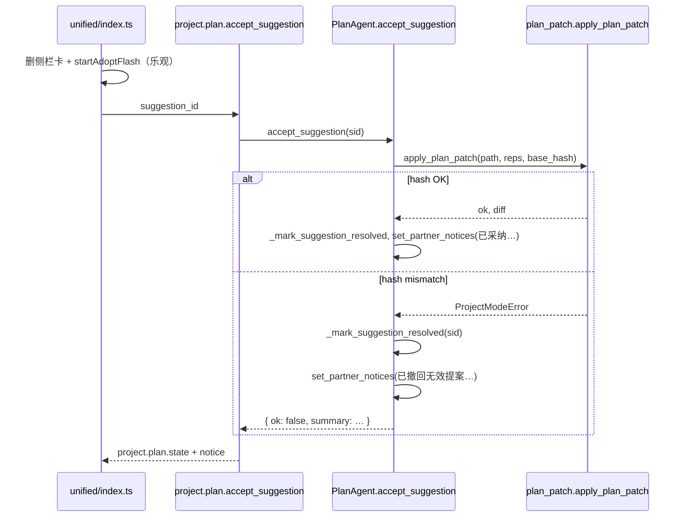

# BUG-026：同文件多条 patch 采纳第二条起 base_hash mismatch

> **状态**：**fixed**（T-4810 · T-4811 · IT-4813 · **S-481 pass** 2026-08-07）  
> **严重度**：P1（计划域采纳流不可用/误导）  
> **设计**：[PLAN-REVIEW-UI.md](../PLAN-REVIEW-UI.md) §11 · [PLAN-ARCH.md](../PLAN-ARCH.md) M6 · A8/A9  
> **关联 Phase**：48 · T-4810～T-4813  
> **已有测试**：`tests/test_plan_arch_patch.py` **IT-182**（stale hash 拒绝写盘）— 测的是**单次**错误 hash，未覆盖**同轮多卡队列**

---

## 1. 复现步骤（huiyi · 5 条提案）

**前置**

1. 绑定项目 `huiyi`，`plan_partner` 已产出侧栏待采纳队列。  
2. LLM 一次 `reason_about_intent` 返回 **5 个** `kind: patch` 操作（常见：TASKS 1 + MAP 2 + PROJECT 2）。

**操作**

按侧栏顺序逐条点 **采纳**（或主列审阅面采纳）。

**实际**

| 次序 | 卡片 | 用户看到 | 服务端 |
|------|------|----------|--------|
| 1 | Patch TASKS.md | 闪绿「已采纳写入 **TASKS.md**」（文案对） | `apply_plan_patch` 成功 |
| 2 | Patch MAP.md (1) | 闪绿 + notice「已采纳写入 MAP.md」 | 成功，磁盘 MAP 已变 |
| 3 | Patch MAP.md (2) | **先**闪绿 → **后** notice「已撤回无效提案：patch base_hash mismatch…」 | `accept_suggestion` 返回 `ok: false` |
| 4–5 | PROJECT (1)(2) | 同 MAP (2) | 同左 |

用户感知：**按钮坏了 / 采纳了又被撤回**。

---

## 2. 数据模型

### 2.1 `PlanSuggestion`（`project.plan.state` → 前端）

```typescript
// desktop/src/api/ws.ts
export type PlanSuggestion = {
  id: string;           // 例: sug-file_patch-patch-MAP.md-a1b2c3d
  kind: string;         // file_patch
  title: string;        // 改 MAP.md（待采纳）
  body: string;
  risk: "gate" | ...;
  action?: "apply_patch" | ...;
  payload?: {
    path: string;           // MAP.md
    base_hash: string;      // 提案时刻 sha256[:16]
    replacements: Array<{ old: string; new: string }>;
    diff: string;
    source?: "plan_llm";
  };
};
```

### 2.2 提案 ID 生成（`plan_agent._apply_plan_operations`）

```python
key = f"patch-{preview['path']}-{abs(hash(preview['diff'])) % 10_000_000:x}"
sug = self._suggestion(..., key=key, ...)
# id = f"sug-{kind}-{key}"  →  sug-file_patch-patch-MAP.md-xxxx
```

**同文件两条 patch**：path 相同但 **diff 不同** → **不同 id** → 侧栏 **两张卡**。

### 2.3 `base_hash` 语义（`plan_patch.py`）

```python
def content_hash(text: str) -> str:
    return hashlib.sha256(text.encode("utf-8")).hexdigest()[:16]

def build_patch_preview(..., base_hash: str | None = None):
    current_hash = content_hash(current)
    if base_hash and base_hash != current_hash:
        raise ProjectModeError(
            f"patch base_hash mismatch for {name} (file changed; re-propose)"
        )
    ...
    return {"path": name, "base_hash": current_hash, ...}
```

- **提案时**：`base_hash` = 当时磁盘内容的 hash，存入 `payload`。  
- **采纳时**：`apply_plan_patch` 再次 `build_patch_preview(..., base_hash=payload.base_hash)` — 磁盘须与提案时一致。

**设计意图**（IT-182）：防止用户/外部在提案后改文件，采纳覆盖丢改动。

**未覆盖场景**：**同一文件、同轮、顺序采纳多张卡** — 第一张采纳 **故意** 改盘，第二张的 `base_hash` 必然过期。

---

## 3. 时序：两条 MAP patch 的 hash 变化

设提案时刻 `MAP.md` 内容为 `C0`，`hash(C0)=H0`。

```text
plan_partner 一轮
├─ build_patch_preview(MAP, reps₁) → base_hash=H0  → 卡 A (id …-aaaa)
└─ build_patch_preview(MAP, reps₂) → base_hash=H0  → 卡 B (id …-bbbb)
   （两次预览都读同一 C0，故 H0 相同）

用户采纳 A
├─ apply_plan_patch(MAP, reps₁, base_hash=H0) → 磁盘 C1, hash(C1)=H1
└─ 卡 A 从 _pending_gated 移除

用户采纳 B
├─ apply_plan_patch(MAP, reps₂, base_hash=H0)  # payload 仍是 H0
├─ build_patch_preview: current_hash=H1 ≠ H0
└─ ProjectModeError → accept_suggestion 捕获 → partner_notices 撤回文案
```

**关键**：`reps₂` 的 `old` 字符串通常针对 **C0** 设计；即便去掉 hash 校验，**直接对 C1 应用 reps₂** 也可能 `old not found`（第二条设计假设第一条未应用）。

---

## 4. 后端采纳路径（完整）



### 4.1 `accept_suggestion` 失败分支（`plan_agent.py` L1012–1018）

```python
except ProjectModeError as exc:
    self._mark_suggestion_resolved(sid)   # 提案从队列消失
    self.set_partner_notices(f"已撤回无效提案：{exc}")
    return {"ok": False, "summary": f"已撤回无效提案：{exc}", ...}
```

**注意**：失败也 `_mark_suggestion_resolved` — 卡不会留在侧栏让用户重试；只能重跑 `plan_partner`。

### 4.2 WS 响应（`project_api.py` L635–654）

成功时 `notice` 插在最前；`ok: false` 时 **仍** 发 `project.plan.state`，但前端 **已乐观删卡**。

---

## 5. 前端乐观 UI（次因 · 可独立修）

`desktop/src/shells/unified/index.ts` `acceptSuggestionById`：

```typescript
function acceptSuggestionById(sid: string): void {
  if (projectState.suggestionAdoptFlash) return;
  const remaining = projectState.suggestions.filter((s) => s.id !== sid);
  projectState.suggestions = remaining;        // ① 先删卡
  ...
  client.acceptPlanSuggestion(sid);            // ② 异步 WS
  startAdoptFlash("已采纳写入 TASKS.md", ...); // ③ 文件名写死 TASKS.md
}
```

| 问题 | 说明 |
|------|------|
| 顺序 | 成功闪绿 **先于** 服务端确认 |
| 文案 | 恒为 `TASKS.md`，采纳 MAP/PROJECT 也显示 TASKS |
| 失败 | `ok: false` 时卡已删，仅靠 `notice` 报撤回 |
| 防连点 | `suggestionAdoptFlash` 期间拒新采纳，但不等 WS |

**目标（T-4811）**：

1. `acceptPlanSuggestion` 返回 / `project.plan.state` 或 `notice` 到达后再 `startAdoptFlash`。  
2. 文案：`已采纳写入 ${payload.path}`。  
3. `ok: false`：toast 错误 + 可选恢复卡（或强制重提案）。

---

## 6. 已决修复方向

### 6.1 A1 — 提案时合并（P0 · T-4810）

**落点**：`plan_agent._apply_plan_operations`，处理 `kind=="patch"` 时：

```python
# 伪代码
pending_by_path: dict[str, list[dict]] = {}
for op in patch_ops:
    pending_by_path.setdefault(op["path"], []).extend(op["replacements"])

for path, all_reps in pending_by_path.items():
    preview = build_patch_preview(..., replacements=all_reps)
    # 一张卡，一个 base_hash
    park_gated_suggestion(...)
```

**效果**：同轮同文件 **一张侧栏卡**；`replacements` 顺序应用（`apply_replacements` 已支持链式）。

**边界**：

- 若 reps 链中前序 `old` 依赖中间态，合并后仍须对 **当前磁盘 C0** 一次预览成功。  
- LLM 若产出互相矛盾的 patch，合并预览应 `ProjectModeError` → `applied.append("跳过无效 patch")`。

### 6.2 A2 — 采纳后 rebase（P1 · T-4812 defer）

采纳 `path=P` 成功后，对 `_pending_gated` 中 **同 path** 其余 suggestion：

```python
new_preview = build_patch_preview(..., relpath=P, replacements=remaining_reps, base_hash=None)
sug["payload"]["base_hash"] = new_preview["base_hash"]
# 若 remaining reps 的 old 针对旧内容，预览失败 → 自动撤回该卡
```

复杂度高；**优先 A1**。

### 6.3 A3 — 「采纳本文件全部」（可选 UX）

侧栏按 `payload.path` 分组；一键采纳组内所有 `replacements`（等价 A1 的 UI 层）。

### 6.4 B1/B2 — 前端（P0 · T-4811）

见 §5。

---

## 7. 与 PLAN-ARCH / 现有测试的关系

| 文档/测试 | 关系 |
|-----------|------|
| PLAN-ARCH M6 A8 | patch + base_hash 防冲突 — **单提案** 语义 |
| IT-182 `test_it182_stale_base_hash_rejects` | 故意错 hash → 拒绝写盘 ✓ |
| IT-181/183 | gated until accept；legacy move 拒绝 |
| **缺口** | 无「同轮两 patch 同 path 顺序采纳」回归 |

**建议新增 IT-4810**：

```python
def test_it4810_same_path_patches_merged_or_sequential_ok():
    # plan_partner 返回 MAP 两条 patch
    # 采纳后：要么仅 1 张卡，要么两张均 ok
```

---

## 8. 临时绕行

1. **每文件只采纳第一条**；(2) 点忽略或不管。  
2. 一批采纳后：**「请根据当前磁盘重新 propose MAP.md 和 PROJECT.md 的修改」**。  
3. 采纳过程中 **勿** 手改三件套 / 外部编辑器保存。  
4. 若只要改一处：让 `plan_partner` **单文件单 patch**（prompt 约束）。

---

## 9. 代码索引

| 文件 | 符号/行 |
|------|---------|
| `agent-core/plan_patch.py` | `content_hash`, `build_patch_preview`, `apply_plan_patch`, `apply_replacements` |
| `agent-core/plan_agent.py` | `_apply_plan_operations` L1641+, `accept_suggestion` L979+, `_suggestion` L911+, `park_gated_suggestion` |
| `agent-core/project_api.py` | `project.plan.accept_suggestion` L635+ |
| `desktop/src/shells/unified/index.ts` | `acceptSuggestionById` L1209+ |
| `desktop/src/shells/unified/plan-review.ts` | `actionableSuggestions`, `acceptLabel` |
| `desktop/src/api/ws.ts` | `PlanSuggestion`, `acceptPlanSuggestion` |

---

## 10. 验收

| ID | 步骤 | 预期 |
|----|------|------|
| **IT-4810** | 同轮 2× MAP `patch` ops | 侧栏 **1** 张 MAP 卡；采纳成功；或 2 张均可顺序成功 |
| **IT-4811** | mock `accept_suggestion` → `ok:false` | UI **不**先闪绿；展示 mismatch |
| **S-481** | huiyi 实机 5 条含重复 path | 用户可全部采纳，无撤回 notice |

---

## 11. 修订记录

| 日期 | 说明 |
|------|------|
| 2026-08-06 | 初稿 |
| 2026-08-06 | v2：数据模型 · hash 时序图 · WS 序列 · 合并/rebase 伪代码 · IT-182 关系 · 代码行号 |
| 2026-08-07 | S-481 桌面复验 pass → **fixed** |
