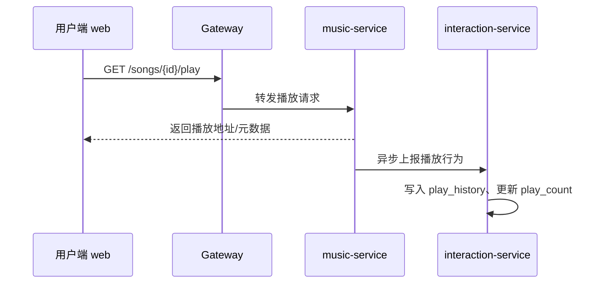
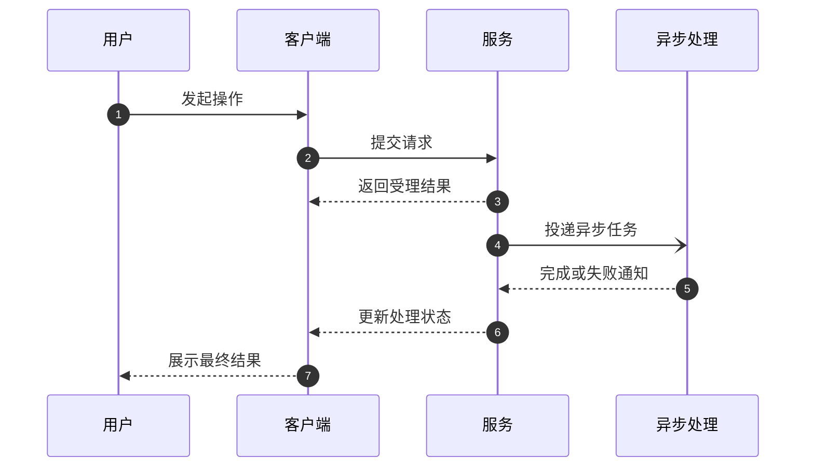

# Music Dreamer 悦享音乐 · UX 设计

## UX-001 用户端主流程
- 未登录可浏览推荐，但播放/收藏/歌单/历史提示登录；登录后：首页推荐 → 播放页/底部播放条 → 收藏/加入歌单。
- 播放失败展示重试；推荐为空展示空态；通知未读红点。

## UX-002 创作者上传发布流程
- 创作者中心：申请歌手 → 上传作品（音频、封面、歌词）→ 提交审核 → 查看审核状态。
- 上传中断可重传，格式/大小不合规给明确提示，审核驳回可修改后重提。

## UX-003 后台管理流程
- 登录后台 → 用户/歌手/歌曲列表 → 检索与筛选 → 审核/封禁/下架操作，关键操作二次确认。
- 无权限提示；操作失败 toast；列表分页加载失败重试。

## UX-004 角色边界与鉴权体验
- 用户端仅展示已发布歌曲；创作者未通过审核时禁止上传发布；后台仅管理员可见。

## UX-005 关键异步时序

## SEQ-001 · 异步操作时序

- SEQ-001 覆盖用户发起、同步受理、异步处理和结果回传。
