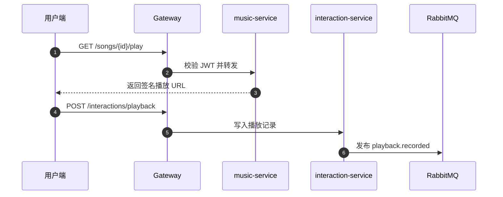
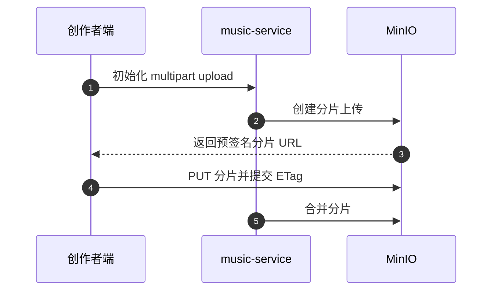
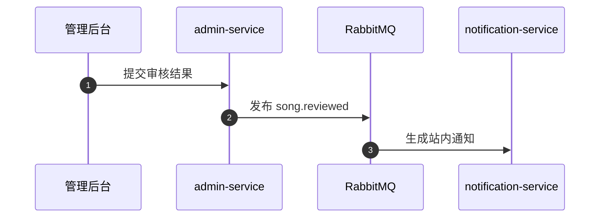

# Music Dreamer 悦享音乐 · 技术设计

## TD-001 架构与模块边界
- 前端：Vue 3 + Vite + Pinia + Vue Router + Element Plus，按角色拆分用户端、创作者中心、后台。
- 后端：gateway、user、music、interaction、notification、admin 六个 Spring Boot 微服务，Nacos 注册配置，Gateway 统一 JWT 校验。
- 数据：MySQL 8（独立 schema）、Redis（缓存/未读计数）、MinIO（音频与封面）、RabbitMQ（审核和互动异步事件）。

## TD-002 数据模型
- user_account、artist、song、favorite、playlist、playlist_item、play_history、notification、event_inbox。
- `event_id + consumer` 唯一，消费者先写 event_inbox 再提交业务事务，重复事件直接成功。

## TD-003 关键 API
- POST /auth/login、POST /auth/register、GET /recommend/songs、GET /songs/{id}/play。
- POST /interactions/favorite、GET /interactions/history、POST /creator/songs、GET /admin/users。

## TD-004 依赖与技术风险
- 依赖 Nacos、Gateway、OpenFeign、MyBatis-Plus、JWT、Spring Security、MinIO SDK、Vue 3。
- 大文件上传需分片断点续传；鉴权上下文统一透传；消费者最多重试 3 次后进入 dead-letter queue。

## TD-005 数据、对象存储与权限审核
- MinIO 保存音频、封面、歌词，数据库仅保存 object URL；上传采用分片，失败可续传。
- 歌手申请和歌曲审核留痕，未审核歌曲不可搜索发布；所有 API 至少对应 VERIFY.md 一条 V 记录。

## TD-006 异步事件契约
- `playback.recorded`、`song.upload.completed`、`song.reviewed`、`notification.created` 均携带 `event_id` 和 `schema_version`。
- 生产者发布确认并指数退避；消费者失败最多重试 3 次，之后告警。

## TD-007 播放行为与历史上报

## TD-008 MinIO 分片上传

## TD-009 歌曲审核结果通知

